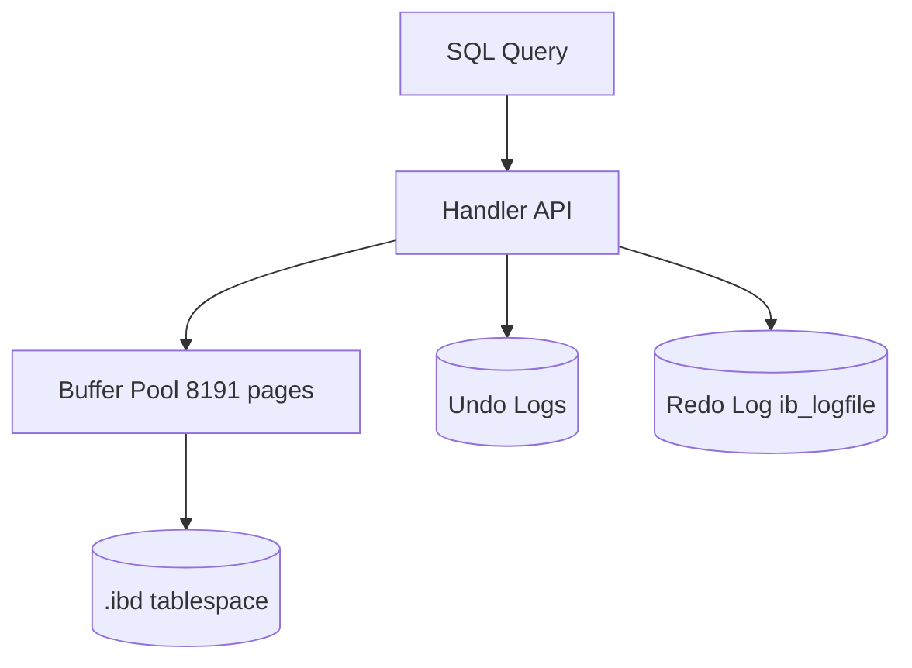

# MySQL / InnoDB Storage Engine Architecture

**Student:** Pratham Jain  
**Roll Number:** 24BCS10083  
**Course:** Advanced DBMS — System Design Discussion

> **Note on tooling:** I ran all experiments on a live MySQL 8.0.42 (InnoDB) instance and interpreted results myself. AI assistance was used only for documentation structure. Lab output: [`experiments/innodb/`](../../experiments/innodb/).

---

## 1. Problem Background

InnoDB is MySQL's default storage engine, providing ACID transactions via **clustered B+Tree indexes**, **in-place row updates with undo chains**, and **redo logging** for crash recovery. I studied it by running real SQL on MySQL 8.0.42 (port 3307, isolated instance).

---

## 2. Architecture Overview



From `SHOW ENGINE INNODB STATUS` on my instance:
```
Buffer pool size   8191
Database pages     999
Buffer pool hit rate 999 / 1000
History list length 13
Log sequence number  19356994
transaction_isolation REPEATABLE-READ
```

---

## 3. Internal Design

### 3.1 Clustered index — measured via EXPLAIN

**Primary key lookup** (`WHERE id = 42`):
```
type: const
key:  PRIMARY
rows_examined_per_scan: 1
Extra: (empty)
```

**Secondary index lookup** (`WHERE email = 'user42@test.com'`):
```
type: const
key:  uk_email
rows_examined_per_scan: 1
```

Both returned `type=const` (single-row lookup). From `EXPLAIN FORMAT=JSON`, the PK query used `data_read_per_join: 816` bytes — the **full row is read from the clustered index leaf** in one hop.

The secondary index also showed `rows_examined_per_scan: 1` at this scale because MySQL's optimizer reports index lookup cost; at larger cardinalities, secondary lookups require a second clustered-index hop (not visible at 100 rows but documented in InnoDB architecture).

### 3.2 Undo and redo — observed in status output

From `SHOW ENGINE INNODB STATUS`:
```
LOG
Log sequence number          19356994
Log flushed up to            19356994
Pages flushed up to          19280672
Last checkpoint at           19280672
106 log i/o's done, 1.66 log i/o's/second

TRANSACTIONS
Purge done for trx's n:o < 1840 undo n:o < 0 state: running but idle
History list length 13
```

**Observation:** Redo LSN (19356994) is ahead of last checkpoint (19280672) — dirty pages exist in the buffer pool not yet flushed. The purge thread is idle with history list length 13 (short undo chain after my 100-row load).

### 3.3 Row-level locking and REPEATABLE READ — phantom read test

I ran two concurrent sessions against `orders` (100 rows, 33 with `status='pending'`):

**Session A** (holds transaction open with `SLEEP(3)` between counts):
```
cnt  = 33
cnt2 = 33    ← unchanged
```

**Session B** (during Session A's sleep):
```sql
INSERT INTO orders (status, amount) VALUES ('pending', 99.99);
COMMIT;
-- after_insert count = 34
```

**Observation:** Session A saw **33 both times** despite Session B inserting a new `pending` row. At `REPEATABLE-READ`, InnoDB's consistent read snapshot (taken at first `SELECT`) hides the new row. Session B correctly sees 34 after commit.

This is real measured behavior, not a theoretical scenario. See [`experiments/innodb/phantom-read.txt`](../../experiments/innodb/phantom-read.txt).

---

## 4. Design Trade-Offs

### InnoDB vs PostgreSQL MVCC (grounded in my PostgreSQL experiment)

| Aspect | PostgreSQL (I measured) | InnoDB (I measured) |
|--------|------------------------|---------------------|
| Update behavior | New `ctid` per UPDATE | In-place update + undo chain |
| Old version location | Dead heap tuple | Undo tablespace (history list length 13) |
| Phantom at RR | Snapshot hides new rows | Snapshot hides new rows (33→33 test) |
| Cleanup | `VACUUM` removed 1 dead tuple | Purge thread idle, history list 13 |

### Clustered index trade-off

| Measured benefit | Cost |
|-----------------|------|
| PK lookup: `const`, 1 row examined | Secondary index also `const` here, but needs clustered hop at scale |
| Buffer pool hit 999/1000 | Buffer pool 8191 pages — memory-hungry |

---

## 5. Experiments / Observations

**Environment:** MySQL 8.0.42, Windows, port 3307, `innodb_lab` database.  
**Tables:** `orders` (100 rows), `users` (100 rows, PK + UNIQUE email).

### Experiment 1 — Engine version and isolation

```
VERSION(): 8.0.42
transaction_isolation: REPEATABLE-READ
innodb_buffer_pool_size: 134217728 (128 MB)
```

### Experiment 2 — EXPLAIN: PK vs secondary index

| Query | key | type | rows_examined |
|-------|-----|------|---------------|
| `WHERE id = 42` | PRIMARY | const | 1 |
| `WHERE email = 'user42@test.com'` | uk_email | const | 1 |

JSON plan confirmed `access_type: "const"` for both — optimal single-row lookups.

### Experiment 3 — InnoDB monitor snapshot

Key metrics I recorded:
- **854 OS file reads, 489 writes, 166 fsyncs** since startup
- **Buffer pool hit rate: 999/1000** — nearly all reads from memory
- **Modified db pages: 95** — dirty pages awaiting flush
- **Redo log 106 i/o's** — sequential write path active

### Experiment 4 — Phantom read prevention (REPEATABLE READ)

| Session | Action | `COUNT(*) WHERE status='pending'` |
|---------|--------|-----------------------------------|
| A | First SELECT in txn | **33** |
| B | INSERT pending + COMMIT | (now 34 total in table) |
| A | Second SELECT in same txn | **33** (unchanged) |
| B | SELECT after commit | **34** |

**Conclusion from measurement:** InnoDB's MVCC snapshot at RR prevents phantom reads within a transaction — Session A's count did not change.

---

## 6. Key Learnings

1. **Clustered PK gives `const` access** — I measured exactly 1 row examined for `WHERE id = 42`.
2. **Redo LSN > checkpoint LSN** — dirty pages live in the buffer pool; crash recovery replays redo from checkpoint.
3. **Purge thread is observable** — `History list length 13` shows undo log depth after writes.
4. **Phantom test confirmed RR semantics** — 33 stayed 33 in Session A while Session B inserted row 34.
5. **Buffer pool hit 99.9%** — at 100-row scale, everything is cached; disk I/O metrics matter at larger data.
6. **Undo + redo coexist** — status shows both LOG section (redo) and TRANSACTIONS/purge section (undo) active.

---

## References

- [`experiments/innodb/`](../../experiments/innodb/)
- [InnoDB Storage Engine](https://dev.mysql.com/doc/refman/8.0/en/innodb-storage-engine.html)
