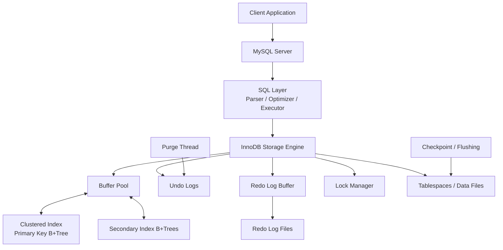
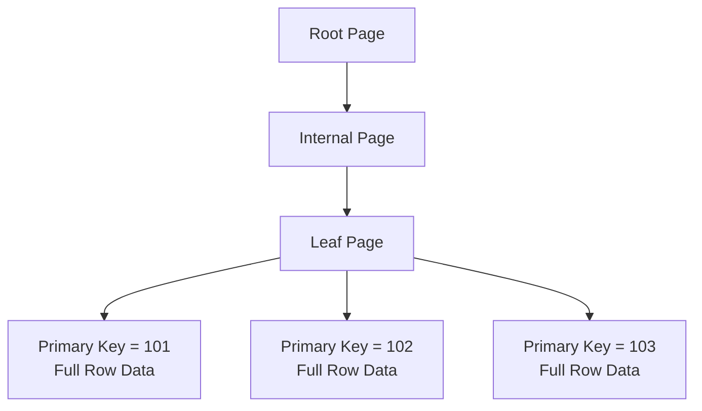
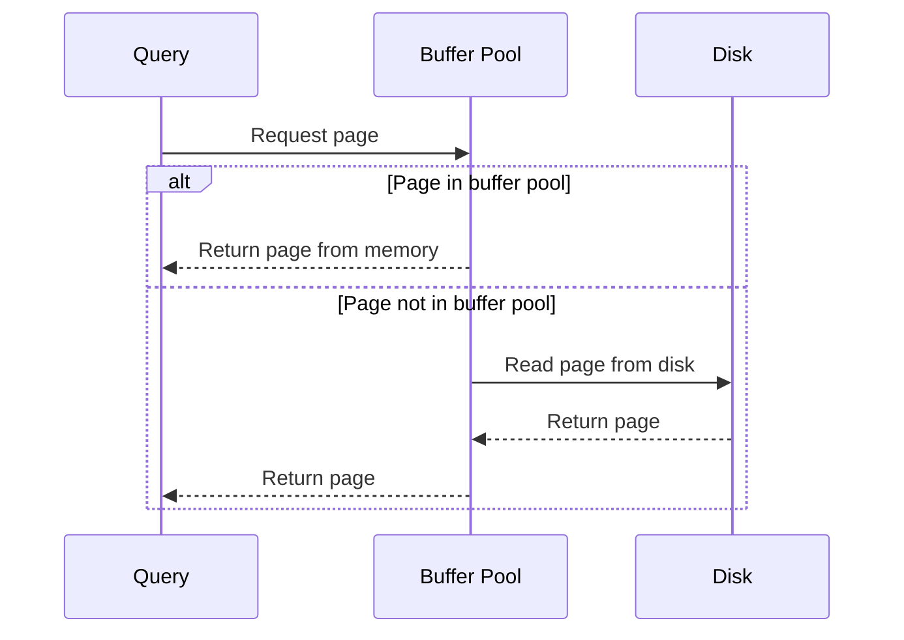

# MySQL InnoDB Storage Engine Architecture

**Name:** Aparna Singha  
**Roll Number:** 24BCS10353  

---

## 1. Problem Background

MySQL supports multiple storage engines, but InnoDB is the default transactional storage engine used in modern MySQL systems. InnoDB provides ACID transactions, crash recovery, row-level locking, MVCC, indexes, buffer pool management, undo logs, redo logs, and foreign key support.

The need for InnoDB comes from real production requirements. Applications need data to remain correct even if many users access it at the same time. They also need committed data to survive crashes. Simple file-based storage is not enough for this.

InnoDB acts as the storage and transaction layer underneath the MySQL SQL layer. The SQL layer handles parsing and optimization, while InnoDB manages how rows, indexes, locks, logs, and pages are actually stored and recovered.

This README focuses on InnoDB internals and compares important design choices with PostgreSQL.

---

## 2. Architecture Overview

MySQL has a layered architecture. The upper SQL layer handles query parsing, optimization, and execution coordination. The InnoDB storage engine handles physical storage, indexing, locking, transactions, buffer pool caching, undo logs, redo logs, and crash recovery.



The most important InnoDB design idea is that the table is organized around the primary key. InnoDB stores table rows inside the clustered primary key B+Tree.

---

## 3. Internal Design

## 3.1 Clustered Indexes

InnoDB uses a clustered index for table storage. The clustered index is usually the primary key index, and its leaf pages contain the full row data.

This means the primary key is not just a logical constraint. It directly affects physical organization and lookup performance.



### Why Clustered Indexes Improve Lookup Performance

For a primary key lookup, InnoDB can traverse the primary key B+Tree and reach the full row directly. There is no separate heap table lookup.

Example:

```sql
SELECT * FROM students WHERE id = 101;
```

If `id` is the primary key, the B+Tree search directly reaches the row.

### Clustered Index Trade-off

| Benefit | Cost |
|---|---|
| Fast primary key lookup | Primary key choice becomes very important |
| Efficient primary key range scans | Random primary keys may cause page splits |
| Full row available at leaf page | Secondary indexes become larger |
| Good locality for nearby primary keys | Updating primary key is expensive |

---

## 3.2 Primary Key Storage

InnoDB chooses the clustered index using this order:

1. Use the primary key if defined.
2. Otherwise use a suitable unique non-null index.
3. Otherwise create a hidden internal row ID.

A good InnoDB primary key should usually be:

- Small
- Unique
- Stable
- Not frequently updated
- Suitable for range or lookup access

Large primary keys can make secondary indexes larger because secondary indexes store primary key values in their leaf entries.

---

## 3.3 Secondary Indexes

InnoDB secondary indexes are also B+Trees, but their leaf pages do not store direct physical row addresses. Instead, they store the secondary key and the primary key value.

A secondary index lookup may require two searches:

1. Search the secondary index.
2. Use the primary key from the secondary index to search the clustered index.


### Why This Design is Used

If InnoDB stored physical row addresses in secondary indexes, those addresses could become invalid when pages split or rows move. Storing primary keys makes secondary indexes stable, but it can add extra lookup cost.

---

## 3.4 Buffer Pool

The buffer pool is InnoDB's main memory area. It caches data pages and index pages.

When a query needs a page:

1. InnoDB checks the buffer pool.
2. If the page is present, it is read from memory.
3. If the page is missing, it is read from disk.
4. If a page is modified, it becomes dirty.
5. Dirty pages are flushed later.



### Why Buffer Pool Matters

Disk access is much slower than memory access. A well-sized buffer pool can greatly improve performance by keeping frequently accessed pages in memory.

---

## 3.5 Undo Logs

Undo logs store previous versions of modified rows.

They are used for:

- Rolling back transactions.
- Providing consistent reads.
- Supporting MVCC.
- Maintaining isolation between transactions.

Example:

If a transaction updates a student's CGPA from `8.5` to `9.0`, the undo log stores enough information to reconstruct the older value if the transaction rolls back or if another transaction needs to read the old version.

### Purpose of Undo Logging

Undo logs answer:

> How can the database restore the old row version if needed?

Undo is mainly related to transaction correctness and MVCC visibility.

---

## 3.6 Redo Logs

Redo logs store information required to replay committed changes after a crash.

Dirty pages are not always written immediately to disk. If MySQL crashes after commit but before the dirty page reaches disk, redo logs allow InnoDB to recover the committed change.


### Purpose of Redo Logging

Redo logs answer:

> How can committed changes be restored after a crash?

Redo is mainly related to durability and crash recovery.

---

## 3.7 Why InnoDB Needs Both Undo and Redo

Undo and redo solve different problems.

| Log Type | Question Answered | Used For |
|---|---|---|
| Undo log | How to go back to old value? | Rollback and MVCC |
| Redo log | How to replay committed change? | Crash recovery |

Undo protects transaction isolation and rollback behavior. Redo protects committed data from being lost after a crash.

A transactional database needs both because rollback and crash recovery are different requirements.

---

## 3.8 Row-Level Locking

InnoDB supports row-level locking. This allows transactions to lock only the rows they modify instead of locking the whole table.

Example:

- Transaction 1 updates student `id = 101`.
- Transaction 2 updates student `id = 102`.

These can proceed concurrently because they affect different rows.

If both transactions update the same row, one transaction must wait.

### Benefit

Row-level locking improves concurrency for transactional applications where many users update different records.

---

## 3.9 Gap Locks and Next-Key Locks

A gap lock locks the space between index records. InnoDB uses gap locks and next-key locks in some cases to prevent phantom rows.

Example:

```sql
SELECT * FROM students
WHERE id BETWEEN 100 AND 110
FOR UPDATE;
```

If another transaction inserts `id = 105`, it may create a phantom row. Gap locks help prevent such phantoms under certain isolation behavior.

### Trade-off

Gap locks improve correctness, but they can reduce concurrency because they lock ranges, not only existing rows.

---

## 3.10 Isolation Levels

InnoDB supports standard isolation levels.

| Isolation Level | Meaning |
|---|---|
| READ UNCOMMITTED | Transactions may read uncommitted changes |
| READ COMMITTED | Only committed data is read |
| REPEATABLE READ | Transaction sees a consistent snapshot |
| SERIALIZABLE | Strongest isolation with more locking |

InnoDB commonly uses `REPEATABLE READ` by default. MVCC helps provide consistent reads, while locks are used for writes and some range operations.

---

## 3.11 Comparison with PostgreSQL

PostgreSQL and InnoDB both support transactions and MVCC, but their internal implementation is different.

| Area | PostgreSQL | InnoDB |
|---|---|---|
| Table storage | Heap table | Clustered primary key B+Tree |
| Primary key | Separate index pointing to heap tuple | Table organized by primary key |
| Update approach | New tuple version in heap | In-place style with undo history |
| Old version storage | Old heap tuples | Undo logs |
| Cleanup | VACUUM | Purge process |
| Secondary index reference | Heap tuple identifier | Primary key value |
| Main read benefit | Flexible heap/index model | Fast primary key lookup |
| Main maintenance cost | Dead tuples and VACUUM | Undo history and purge |

### Why PostgreSQL Chose a Different MVCC Model

PostgreSQL stores row versions directly in the heap. This makes version visibility straightforward using tuple metadata such as `xmin` and `xmax`. The trade-off is that dead tuples accumulate and require VACUUM.

InnoDB uses undo logs to reconstruct older versions. This keeps the clustered index model but requires undo log management and purge activity.

---

## 4. Design Trade-Offs

| Design Choice | Benefit | Trade-off |
|---|---|---|
| Clustered index | Fast primary key access | Primary key design is critical |
| Secondary indexes store primary key | Stable references | Extra lookup through clustered index |
| Buffer pool | Reduces disk I/O | Requires memory tuning |
| Undo logs | Rollback and MVCC | Undo history must be purged |
| Redo logs | Crash recovery | Extra write overhead |
| Row-level locking | Higher concurrency than table locks | Lock conflicts still occur |
| Gap locks | Prevent phantom rows | Can reduce concurrency |
| MVCC | Consistent reads | Internal version maintenance |
| Purge process | Cleans old undo versions | Background maintenance cost |

InnoDB is optimized for transactional workloads where primary key lookup, durability, and row-level concurrency are important.

---

## 5. Experiments / Observations

These are practical observations that can be performed in MySQL. No fake measured results are included.

### 5.1 Observe InnoDB Status

```sql
SHOW ENGINE INNODB STATUS;
```

Expected observation:

This displays information about transactions, locks, buffer pool activity, deadlocks, and internal InnoDB state.

### 5.2 Observe Primary Key Lookup

```sql
EXPLAIN
SELECT *
FROM students
WHERE id = 101;
```

Expected observation:

If `id` is the primary key, InnoDB can use the clustered index for efficient lookup.

### 5.3 Observe Secondary Index Lookup

```sql
CREATE INDEX idx_students_city ON students(city);

EXPLAIN
SELECT *
FROM students
WHERE city = 'Bengaluru';
```

Expected observation:

MySQL may use the secondary index on `city`. InnoDB then uses primary key values from the secondary index to fetch rows from the clustered index.

### 5.4 Observe Row Locking

Session 1:

```sql
START TRANSACTION;
UPDATE students
SET cgpa = 9.1
WHERE id = 101;
```

Session 2:

```sql
START TRANSACTION;
UPDATE students
SET cgpa = 9.2
WHERE id = 101;
```

Expected observation:

Session 2 may wait because Session 1 holds a lock on the same row.

### 5.5 Observe Different Row Updates

Session 1:

```sql
START TRANSACTION;
UPDATE students
SET cgpa = 9.1
WHERE id = 101;
```

Session 2:

```sql
START TRANSACTION;
UPDATE students
SET cgpa = 9.2
WHERE id = 102;
```

Expected observation:

These updates can proceed more independently because they affect different rows.

### 5.6 Observe Isolation Level

```sql
SET TRANSACTION ISOLATION LEVEL REPEATABLE READ;
START TRANSACTION;
SELECT * FROM students WHERE id BETWEEN 100 AND 110;
```

Expected observation:

The selected isolation level affects snapshot visibility and locking behavior.

---

## 6. Key Learnings

InnoDB shows how storage engine design affects database performance and correctness.

The clustered index design makes primary key access efficient because rows are stored directly in the primary key B+Tree. However, this also makes primary key choice very important. Secondary indexes store primary keys, which keeps references stable but may require extra lookups.

Undo logs and redo logs are both required because they solve different problems. Undo supports rollback and consistent reads. Redo supports crash recovery and durability.

Compared to PostgreSQL, InnoDB makes a different MVCC trade-off. PostgreSQL stores old versions in the heap and cleans them with VACUUM. InnoDB uses undo logs and purge activity. Both approaches are valid, but they optimize different internal designs.

The main takeaway is that InnoDB is a complete transactional storage engine, not just a disk file format.

---

## 7. References

1. MySQL InnoDB Storage Engine: https://dev.mysql.com/doc/refman/8.0/en/innodb-storage-engine.html
2. InnoDB Index Types: https://dev.mysql.com/doc/refman/8.0/en/innodb-index-types.html
3. InnoDB Buffer Pool: https://dev.mysql.com/doc/refman/8.0/en/innodb-buffer-pool.html
4. InnoDB Transaction Model: https://dev.mysql.com/doc/refman/8.0/en/innodb-transaction-model.html
5. InnoDB Locking: https://dev.mysql.com/doc/refman/8.0/en/innodb-locking.html
6. InnoDB Isolation Levels: https://dev.mysql.com/doc/refman/8.0/en/innodb-transaction-isolation-levels.html
7. MySQL EXPLAIN Output: https://dev.mysql.com/doc/refman/8.0/en/explain-output.html