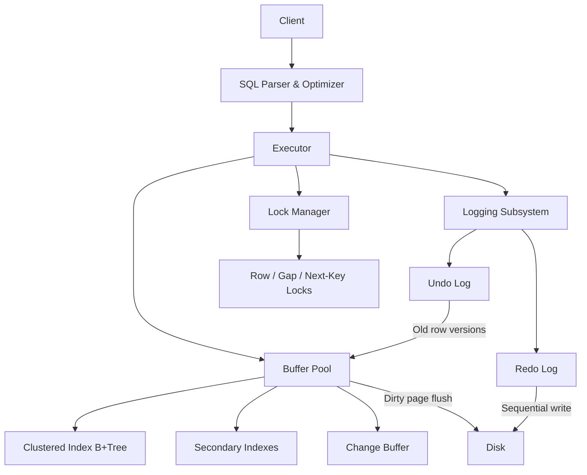

# MySQL / InnoDB Storage Engine — System Design Document

## 1. InnoDB 

The core problem InnoDB solves is the tension between **performance** and **correctness**:

- **ACID compliance** — Atomicity, Consistency, Isolation, and Durability for every transaction
- **Crash safety** — The database can recover to a consistent state after an unexpected shutdown
- **Concurrent access** — Multiple users can read and write simultaneously without blocking each other unnecessarily
- **Efficient storage** — Data and its primary index are physically co-located, minimizing I/O for primary key lookups

---

## 2. Architecture Overview



### Data Flow for an UPDATE

1. Executor asks the **buffer pool** to pin the relevant 16 KB page.
2. If not cached, InnoDB reads it from disk into the buffer pool.
3. The **old row image** is written to the **undo log** (for rollback and MVCC).
4. The row is modified **in-place** on the buffered page.
5. A **redo log record** is written and flushed to disk at commit.
6. The dirty page is flushed to the data file asynchronously by background threads.

---

## 3. Internal Design

### Clustered Index Storage

Every InnoDB table is physically organized as a B+Tree keyed by the primary key. Row data lives in the leaf nodes — a primary key lookup is a single tree traversal with no separate heap fetch.

- If no PK is defined, InnoDB uses the first `UNIQUE NOT NULL` index; failing that, it generates a hidden 6-byte row ID.
- Pages are 16 KB by default, containing a page header, page directory, and row records linked in PK order.

### Secondary Indexes

Secondary index leaf nodes store the primary key value (not a physical pointer). A secondary index lookup therefore requires a double lookup: secondary B+Tree → PK value → clustered index traversal.

This means page splits in the clustered index never invalidate secondary indexes (the PK value is logical, not physical). The trade-off is the extra clustered index probe on every secondary lookup — unless the query can be satisfied by a covering index.

### Buffer Pool

The buffer pool is InnoDB's primary memory cache for 16 KB pages (data, index, undo, change buffer pages). All I/O goes through it.

Dirty pages are flushed by the page cleaner thread pool. Flush rate adapts to redo log fill level and dirty page percentage. For high concurrency, the pool can be partitioned into multiple instances to reduce mutex contention.

### Undo Logs

Undo logs serve two purposes: **rollback** and **MVCC consistent reads**.

- On every row modification, the old version is written to the undo log before the in-place update.
- Each clustered index row has a hidden roll pointer chaining to its undo

- Rollback: Walk the chain, restore previous values.
- MVCC read: Follow the chain until a version committed before the reader's snapshot is found.
- Purge: A background purge thread reclaims undo records no longer needed by any active snapshot — InnoDB's equivalent of PostgreSQL's VACUUM, but operating on a separate undo tablespace rather than the main data pages.

### Redo Logs

Redo logs implement Write-Ahead Logging (WAL): the log record must be durable before the dirty page is considered committed.

- Records are written sequentially to circular log files
- At commit, the redo buffer is flushed 
- Dirty data pages are written later by background threads.
- Checkpoints record the LSN up to which all dirty pages have been flushed, limiting recovery replay scope.

### Locking Mechanisms

InnoDB locks index records, not physical rows. Lock behavior depends on the index used.

| Lock Type | What It Locks | Purpose |
|-----------|--------------|---------|
| Record Lock | Single index record | Exact-match protection |
| Gap Lock | Gap between two records | Prevents inserts into a range |
| Next-Key Lock | Record + gap before it | Default at REPEATABLE READ; prevents phantoms |
| Insert Intention Lock | Gap (compatible with other insert intentions) | Allows concurrent non-conflicting inserts |

**Example:** With index values `{10, 20, 30}`, a `SELECT ... WHERE id BETWEEN 15 AND 25 FOR UPDATE` acquires gap locks on `(10,20)` and `(20,30)` plus a record lock on `20` — no other transaction can insert `id=17`, preventing phantom reads.

### Isolation Levels

| Level | Phantoms? | Mechanism |
|-------|----------|-----------|
| READ UNCOMMITTED | Yes | No snapshot |
| READ COMMITTED | Yes | Fresh snapshot per statement; no gap locks |
| REPEATABLE READ (default) | No | Snapshot at first read; next-key locks |
| SERIALIZABLE | No | All reads become `SELECT ... FOR SHARE` |

InnoDB's `REPEATABLE READ` is **stronger than SQL standard** — it prevents phantoms via next-key locking, which the standard only requires at `SERIALIZABLE`.

---

## 4. Design Trade-Offs

### In-Place Updates (InnoDB) vs. Append-Only (PostgreSQL)

| Aspect | InnoDB | PostgreSQL |
|--------|--------|------------|
| Update mechanism | Overwrite row; store old version in undo log | Append new tuple; old remains until VACUUM |
| Data page cleanliness | Always current version only | Accumulates dead tuples (bloat) |
| Garbage collection | Purge thread on undo tablespace (non-invasive) | VACUUM scans and rewrites heap pages |
| Rollback cost | Must actively undo via undo log | Cheap — mark TX aborted in clog |

InnoDB keeps data pages compact and avoids VACUUM-like heap maintenance. The cost is undo tablespace management and potential purge lag under long-running transactions.

### Clustered vs. Heap Storage

| Aspect | InnoDB (Clustered) | PostgreSQL (Heap) |
|--------|--------------------|--------------------|
| PK lookup | Single B+Tree traversal | Index → CTID → heap fetch |
| Secondary index lookup | Double lookup (via PK) | Single indirection (via CTID) |
| PK range scans | Rows physically adjacent | Potentially scattered |
| Non-sequential PKs (UUIDs) | Expensive page splits | No impact on heap |

Clustered storage wins for PK-dominant OLTP workloads. PostgreSQL's heap is better when queries rarely use the PK or the table has many secondary indexes.

### Locking Strategy

InnoDB uses gap locks for phantom prevention at `REPEATABLE READ`; PostgreSQL relies on snapshot isolation (SSI at `SERIALIZABLE`). InnoDB gives stronger default guarantees but can cause unexpected lock waits on range operations.

---

## 5. Experiments / Observations

### Setup

```sql
CREATE TABLE customers (
    id INT AUTO_INCREMENT PRIMARY KEY, city VARCHAR(50) NOT NULL
) ENGINE=InnoDB;

CREATE TABLE products (
    id INT AUTO_INCREMENT PRIMARY KEY, category VARCHAR(50) NOT NULL
) ENGINE=InnoDB;

CREATE TABLE orders (
    id INT AUTO_INCREMENT PRIMARY KEY,
    customer_id INT NOT NULL, product_id INT NOT NULL,
    amount DECIMAL(10,2) NOT NULL,
    FOREIGN KEY (customer_id) REFERENCES customers(id),
    FOREIGN KEY (product_id) REFERENCES products(id)
) ENGINE=InnoDB;

CREATE INDEX idx_orders_customer ON orders(customer_id);
CREATE INDEX idx_orders_product ON orders(product_id);

INSERT INTO customers (city) VALUES ('New York'),('London'),('Tokyo'),('Paris'),('Berlin');
INSERT INTO products (category) VALUES ('books'),('electronics'),('furniture'),('clothing'),('books'),('books');
INSERT INTO orders (customer_id, product_id, amount) VALUES
  (1,1,29.99),(2,1,19.99),(1,2,99.99),(3,3,149.99),(4,4,59.99),(5,1,24.99),
  (1,5,34.99),(2,2,89.99),(3,1,19.99),(4,5,39.99),(5,3,129.99),(1,4,49.99);
ANALYZE TABLE customers, products, orders;
```

### Query Plan Analysis

```sql
EXPLAIN FORMAT=JSON
SELECT c.city, p.category, COUNT(*), SUM(o.amount)
FROM orders o
JOIN customers c ON c.id = o.customer_id
JOIN products p ON p.id = o.product_id
WHERE p.category = 'books'
GROUP BY c.city, p.category;
```

**Key observations:**
- Joins to `customers` and `products` on their PKs use **clustered index lookups** — no heap fetch needed (unlike PostgreSQL).
- With small tables, the optimizer chooses nested loop joins. `ANALYZE TABLE` statistics drive join order selection.
- Without a secondary index on `products.category`, MySQL full-scans `products` (cheap at 6 rows).

### Actual Experiment Results

Running `EXPLAIN FORMAT=JSON` on the multi-table join reveals InnoDB's execution strategy:


**Key Observation:** All joins to `customers` and `products` PKs use clustered index lookups. The secondary index `idx_orders_product` stores the PK value, which allows MySQL to directly jump to the clustered index leaf node without an extra heap access. This is InnoDB's advantage over PostgreSQL's non-clustered heap storage.

---
