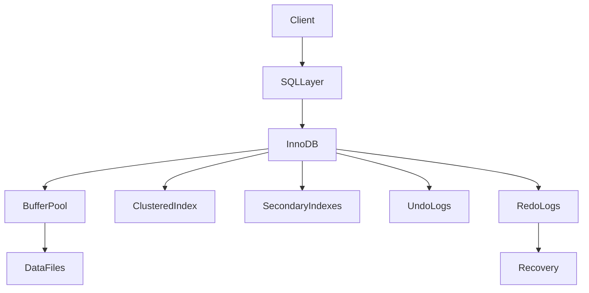
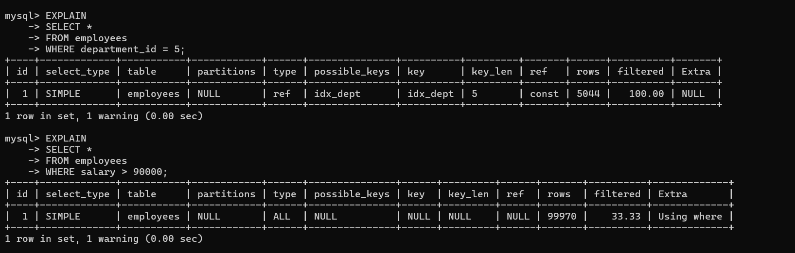
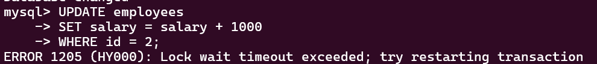
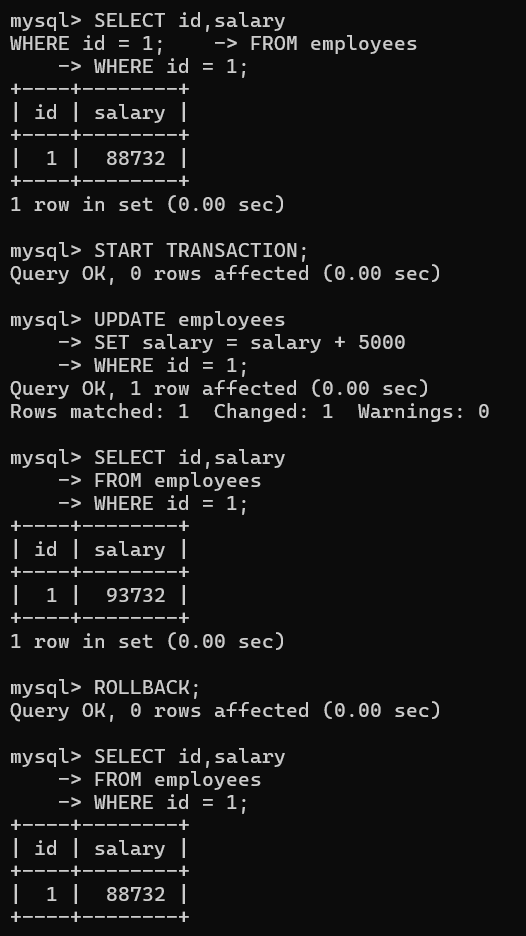

# MySQL InnoDB Storage Engine

## 1. Problem Background

InnoDB is the default storage engine used by MySQL. It was designed to provide ACID-compliant transactions, crash recovery, row-level locking, and high concurrency for OLTP workloads.

Unlike PostgreSQL, which stores table rows in a heap structure and implements MVCC using tuple versioning, InnoDB uses clustered storage and maintains old row versions through undo logs.

The objective of this study was to understand how InnoDB manages storage, indexing, concurrency, transaction processing, and recovery, and to compare these design decisions with PostgreSQL.

---

# 2. Architecture Overview

## High-Level Architecture



### Major Components

| Component           | Responsibility                |
| ------------------- | ----------------------------- |
| Buffer Pool         | Caches data and index pages   |
| Clustered Index     | Primary storage structure     |
| Secondary Index     | Additional lookup structures  |
| Undo Logs           | Support MVCC and rollback     |
| Redo Logs           | Crash recovery and durability |
| Lock Manager        | Row and gap locking           |
| Transaction Manager | ACID transactions             |

---

# 3. Internal Design

## 3.1 Clustered Index

One of the most important differences between InnoDB and PostgreSQL is how rows are stored.

In PostgreSQL:

```text
Heap Table
    +
Index
```

In InnoDB:

```text
Primary Key B-Tree
      =
Table Storage
```

The table itself is organized as a B-Tree based on the primary key.

### Observation

```sql
SHOW INDEX FROM employees;
```

Output:

```text
PRIMARY
Column: id
Type: BTREE
```

This means rows are physically stored according to the primary key.

### Why Clustered Storage?

Advantages:

* Fast primary key lookups
* Better locality of reference
* Fewer page reads

Trade-offs:

* Primary key updates are expensive
* Larger primary keys increase storage cost

---

## 3.2 Secondary Indexes

The employees table contained:

```text
idx_dept
Column: department_id
```

Unlike PostgreSQL, a secondary index in InnoDB does not directly point to the row location.

Instead:

```text
Secondary Index
      |
Primary Key
      |
Row
```

The secondary index stores the primary key value and performs an additional lookup.

### Why?

Because rows are stored inside the clustered index.

Trade-off:

* Extra lookup cost
* Simpler storage organization

---

## 3.3 Query Planning and Index Usage

After loading approximately 100,000 rows:

```sql
ANALYZE TABLE employees;
```

was executed.

---

### Query Using Indexed Column

```sql
EXPLAIN
SELECT *
FROM employees
WHERE department_id = 5;
```

Output:

```text
key = idx_dept
rows = 5044
type = ref
```

### Observation

InnoDB correctly used the secondary index because the filter condition matched the indexed column.

---

### Query Using Non-Indexed Column

```sql
EXPLAIN
SELECT *
FROM employees
WHERE salary > 90000;
```

Output:

```text
type = ALL
rows = 99970
```

### Observation

A full table scan was performed.

This demonstrates that indexes are only useful when predicates match indexed columns.

---

## 3.4 Buffer Pool

The Buffer Pool is InnoDB's main memory structure.

It caches:

* Data pages
* Index pages
* Frequently accessed information

### Observation

```sql
SHOW VARIABLES LIKE 'innodb_buffer_pool_size';
```

Output:

```text
134217728
```

Approximately:

```text
128 MB
```

### Why Is It Important?

Without the buffer pool, every query would require disk access.

The buffer pool reduces latency and improves throughput.

---

## 3.5 Undo Logs

Undo logs store older versions of rows.

They are used for:

* Rollback
* MVCC
* Consistent reads

### Experiment

Initial salary:

```text
88732
```

Update:

```sql
UPDATE employees
SET salary = salary + 5000
WHERE id = 1;
```

Salary became:

```text
93732
```

After:

```sql
ROLLBACK;
```

Salary returned to:

```text
88732
```

### Observation

The rollback successfully restored the previous value.

This demonstrates the purpose of undo logs.

### Comparison With PostgreSQL

PostgreSQL creates a new tuple version for updates.

InnoDB stores previous row versions inside undo segments.

---

## 3.6 Redo Logs

Redo logs guarantee durability.

Before data pages are written to disk, changes are recorded in the redo log.

### Observation

```sql
SHOW VARIABLES LIKE '%redo%';
```

Output:

```text
innodb_redo_log_capacity = 104857600
```

Approximately:

```text
100 MB
```

### Why Redo Logs?

Advantages:

* Crash recovery
* Durability
* Faster commit operations

Trade-off:

* Additional write activity

---

## 3.7 Row-Level Locking

InnoDB supports row-level locks.

### Experiment

Transaction A:

```sql
START TRANSACTION;

UPDATE employees
SET salary = salary + 1000
WHERE id = 2;
```

Transaction B attempted:

```sql
UPDATE employees
SET salary = salary + 1000
WHERE id = 2;
```

Result:

```text
ERROR 1205 (HY000)
Lock wait timeout exceeded
```

### Observation

The second transaction could not obtain the lock because the row was already locked by another transaction.

This demonstrates row-level locking behavior.

---

## 3.8 Gap Locks

Gap locks are an InnoDB feature used to prevent phantom reads.

### Experiment

Transaction A:

```sql
START TRANSACTION;

SELECT *
FROM employees
WHERE id BETWEEN 200000 AND 200100
FOR UPDATE;
```

Transaction B:

```sql
INSERT INTO employees
VALUES (
    200050,
    'Gap Test',
    50000,
    1
);
```

### Observation

The insert operation waited until the transaction holding the range lock was completed.

This demonstrates a gap lock.

### Why Gap Locks Exist

Without gap locks:

```text
Transaction A sees 0 rows

Transaction B inserts new row

Transaction A sees 1 row
```

This is known as a phantom read.

Gap locks prevent this behavior.

---

# 4. PostgreSQL vs InnoDB

| Feature                | PostgreSQL            | InnoDB           |
| ---------------------- | --------------------- | ---------------- |
| Storage Layout         | Heap Table            | Clustered Index  |
| Update Strategy        | New Tuple Version     | Undo Log         |
| MVCC                   | Tuple Versioning      | Undo Segments    |
| Cleanup                | VACUUM                | Automatic Purge  |
| Primary Key Lookup     | Index → Heap          | Direct           |
| Secondary Index Lookup | Index → Heap          | Index → PK → Row |
| Concurrency            | MVCC                  | MVCC + Locks     |
| Phantom Prevention     | Predicate Locks (SSI) | Gap Locks        |

---

# 5. Design Trade-Offs

## Clustered Index

Advantages:

* Fast primary key access
* Better locality

Disadvantages:

* Expensive PK updates
* Storage overhead for large keys

---

## Undo Logging

Advantages:

* Rollback support
* Consistent reads

Disadvantages:

* Additional storage usage

---

## Row-Level Locks

Advantages:

* High concurrency
* Precise locking

Disadvantages:

* Lock contention still possible

---

## Gap Locks

Advantages:

* Prevent phantom reads

Disadvantages:

* Reduced concurrency
* Possible lock waits

---

## Redo Logs

Advantages:

* Durability
* Crash recovery

Disadvantages:

* Additional write overhead

---

# 6. Key Learnings

1. InnoDB stores rows inside the primary key B-Tree using clustered storage.

2. Secondary indexes contain primary key references rather than direct row pointers.

3. Undo logs are responsible for rollback operations and MVCC visibility.

4. Redo logs provide durability and crash recovery guarantees.

5. Row-level locking allows concurrent transactions while protecting data consistency.

6. Gap locks prevent phantom reads by locking ranges rather than individual rows.

7. The major architectural difference between PostgreSQL and InnoDB is how MVCC is implemented. PostgreSQL creates multiple tuple versions inside heap tables, while InnoDB uses undo logs to reconstruct older versions.

8. InnoDB's design favors efficient primary-key access and strong transactional guarantees, while accepting additional complexity in locking and logging mechanisms.

---

# References

1. MySQL 8.0 Documentation - InnoDB Architecture

2. MySQL 8.0 Documentation - Clustered and Secondary Indexes

3. MySQL 8.0 Documentation - InnoDB Locking

4. MySQL 8.0 Documentation - Undo Logs

5. MySQL 8.0 Documentation - Redo Logs

# Screenshots


