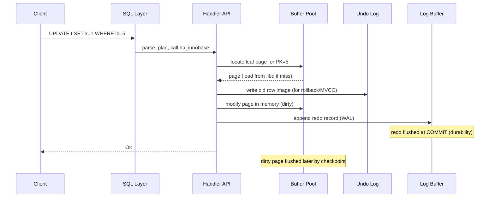

# MySQL / InnoDB Storage Engine — A System Design Study

*Advanced DBMS Assignment — Storage engine internals, MVCC, and a comparison with PostgreSQL.*

---

## 1. Problem Background

MySQL began life as a fast, lightweight relational database whose original default engine, **MyISAM**, traded correctness for speed. MyISAM offered no transactions, no crash recovery, and only **table-level locking** — fine for read-mostly workloads, disastrous for concurrent writers or anything needing the **ACID** guarantees a serious application demands.

**InnoDB** was created to fill exactly that gap. It was developed by **Innobase Oy**, a Finnish company founded by Heikki Tuuri, and first bundled with MySQL around 2000–2001. **Oracle acquired Innobase in 2005**, and InnoDB later became the **default storage engine in MySQL 5.5 (2010)**. (Oracle subsequently acquired MySQL itself via Sun in 2010, consolidating ownership of both.)

InnoDB exists to solve the problems MyISAM could not:

| Problem | MyISAM | InnoDB |
|---|---|---|
| Atomicity / rollback | None | Full transactions (undo logs) |
| Durability on crash | Index/table corruption | Write-ahead redo log + recovery |
| Concurrency | Table locks | **Row-level locking** + MVCC |
| Referential integrity | No FKs | Foreign keys enforced |
| Consistent reads | Readers blocked by writers | Non-blocking **snapshot reads** |

In short, InnoDB turned MySQL from a fast key-value-ish store into a **general-purpose transactional RDBMS** capable of OLTP workloads under heavy concurrency.

---

## 2. Architecture Overview

MySQL has a famously **layered** architecture. The SQL processing layer is shared across engines; the storage engine is pluggable beneath a thin C++ API called the **handler interface**.

```
        ┌──────────────────────────────────────────────┐
 Client │  Connection / Auth / Thread management        │
   ─────┤──────────────────────────────────────────────┤
        │  SQL Layer:  Parser → Optimizer → Executor    │
        │  (query cache*, privileges, plan generation)  │
        ├──────────────────────────────────────────────┤
        │  Handler API  (ha_innobase::*)  ← pluggable   │
        ├──────────────────────────────────────────────┤
        │              InnoDB Storage Engine            │
        │  ┌────────────┐  ┌───────────┐  ┌──────────┐  │
        │  │ Buffer Pool│  │Change Buf.│  │Adaptive  │  │
        │  │ (pages,LRU)│  │           │  │Hash Index│  │
        │  └─────┬──────┘  └─────┬─────┘  └──────────┘  │
        │  ┌─────┴──────┐  ┌─────┴─────┐  ┌──────────┐  │
        │  │ Log Buffer │  │ Lock Sys  │  │ MVCC /   │  │
        │  │  (redo)    │  │(row locks)│  │Read Views│  │
        │  └─────┬──────┘  └───────────┘  └──────────┘  │
        └────────┼───────────────────────────────────────┘
                 │ flush
        ┌────────┴───────────────────────────────────────┐
 Disk   │ .ibd tablespaces (clustered B+trees)            │
        │ ib_logfile / redo log   |   undo tablespaces    │
        │ doublewrite buffer                              │
        └────────────────────────────────────────────────┘
```

**Data flow (a simple `UPDATE`):**



The key insight: **the data page is modified in place in memory, the redo log makes that change durable, and the undo log preserves the pre-image** for rollback and for other transactions' snapshots.

---

## 3. Internal Design

### 3.1 Clustered Indexes & Primary Key Storage

In InnoDB, **the table *is* a B+tree clustered on the primary key**. There is no separate heap. Leaf pages of this B+tree store the **full rows**, physically ordered by PK.

```
        Clustered Index (PRIMARY)
                 [ internal: PK ranges → child pages ]
                /            |             \
         leaf:           leaf:           leaf:
       (PK=1 |full row) (PK=50|full row) (PK=99|full row)
       (PK=2 |full row) (PK=51|full row) ...
```

If no PK is declared, InnoDB uses the first non-null UNIQUE key; failing that it synthesizes a hidden 6-byte `DB_ROW_ID`. Each clustered row also carries hidden columns **`DB_TRX_ID`** (creating transaction) and **`DB_ROLL_PTR`** (pointer into undo logs) — the backbone of MVCC.

Consequence: a PK lookup is a single B+tree descent that lands directly on the row. Range scans on the PK are sequential I/O.

### 3.2 Secondary Indexes & Bookmark Lookups

A secondary index is a separate B+tree keyed by the indexed column(s). Its leaf entries **do not contain a row pointer (no physical RID) — they contain the PK value**.

```
  Secondary index on (email):
     leaf: (email='a@x' | PK=51)
           (email='b@y' | PK=2 )
                    │
                    └── must re-descend the CLUSTERED tree by PK
                         to fetch the rest of the row  ← "bookmark lookup"
```

So a query like `SELECT * FROM users WHERE email = ?` performs **two B+tree traversals**: one in the secondary index to get the PK, one in the clustered index to get the row. A **covering index** (where the index contains every column the query needs) avoids the second traversal entirely — `EXPLAIN` reports `Using index`.

Why store PK instead of a physical pointer? Because rows move within pages (page splits, in-place updates) — a PK is a **stable logical address** that never needs index maintenance when the row's physical location shifts.

### 3.3 Buffer Pool

The buffer pool caches data and index pages (default 16 KB) in RAM. It is managed by a **modified LRU** to resist cache pollution from full scans:

```
  ┌──────────── LRU list ────────────┐
  │  young (hot) sublist ~5/8 │ old sublist ~3/8 │
  │  [MRU ............ midpoint .......... LRU]   │
  └──────────────────────────────────────────────┘
  New page → inserted at the MIDPOINT (head of old list),
  NOT the MRU head. It is only promoted to young if accessed
  again after a short delay → a single big table scan can't
  evict the genuinely hot working set.
```

Related structures:
- **Dirty pages** are tracked on a *flush list*; background threads flush them to disk to advance checkpoints.
- **Change buffer**: for *non-unique secondary index* writes whose target page isn't in memory, InnoDB buffers the modification and merges it lazily — turning random index I/O into sequential merges.
- **Doublewrite buffer**: pages are written first to a sequential scratch area, then to their real location, protecting against torn (partial) page writes.

### 3.4 Undo Logs (MVCC, Rollback, Purge)

Before modifying a row, InnoDB writes the **old version** into an undo log and links the row's `DB_ROLL_PTR` to it. Undo logs serve three jobs:

1. **Rollback** — replay undo records to restore pre-transaction state.
2. **MVCC consistent reads** — a reader that shouldn't see a newer version follows `DB_ROLL_PTR` backwards, reconstructing the row **as of its snapshot**.
3. **Purge** — once no active read view can still need an old version, the **purge thread** discards stale undo records and removes index entries for deleted rows.

A **read view** captures the set of transaction IDs active at snapshot time. For a given row, InnoDB compares the row's `DB_TRX_ID` against the read view to decide: is this version visible, or must I walk the undo chain to an older one?

### 3.5 Redo Logs (WAL, Recovery, Checkpoints, LSN)

InnoDB uses **Write-Ahead Logging**: a change is durable once its **redo record** is on disk, *even if the dirty data page is not*. This decouples commit latency from random page writes.

- Redo records accumulate in the in-memory **log buffer**, flushed to the redo log files on `COMMIT` (governed by `innodb_flush_log_at_trx_commit`).
- The **LSN (Log Sequence Number)** is a monotonically increasing byte offset stamped on every change and on every page. It orders all modifications globally.
- A **checkpoint** records the LSN up to which all dirty pages have been flushed; redo before that point can be reclaimed.
- **Crash recovery**: on restart InnoDB *redoes* committed-but-unflushed changes from the redo log (roll forward), then *undoes* uncommitted transactions using the undo logs (roll back).

### 3.6 Locking: Row, Gap, and Next-Key

InnoDB locks **index records**, not rows in a heap:

| Lock type | Locks | Purpose |
|---|---|---|
| Record lock | A single index record | Protect a specific row |
| Gap lock | The *open interval* between index records | Block inserts into a range |
| Next-key lock | Record + the gap before it | Default under REPEATABLE READ |

**Next-key locking is how InnoDB prevents phantoms** without full serialization. Consider `SELECT ... WHERE id BETWEEN 10 AND 20 FOR UPDATE`: InnoDB locks the matching records *and the gaps around them*, so a concurrent `INSERT id=15` blocks. Thus a re-run of the range query cannot suddenly see new "phantom" rows.

### 3.7 Transaction Processing & Isolation Levels

| Isolation level | Dirty read | Non-repeatable read | Phantom |
|---|---|---|---|
| READ UNCOMMITTED | possible | possible | possible |
| READ COMMITTED | no | possible | possible |
| **REPEATABLE READ (default)** | no | no | **prevented (next-key locks)** |
| SERIALIZABLE | no | no | no (reads take shared locks) |

InnoDB's default is **REPEATABLE READ**. Under it, a **consistent (snapshot) read** establishes one read view at the first read and reuses it for the whole transaction, so plain `SELECT`s see a stable point-in-time view with **no locks at all**. **Locking reads** (`SELECT ... FOR UPDATE/SHARE`, and all writes) instead read the *latest* committed version and take next-key locks. Under READ COMMITTED, a fresh read view is taken per statement and gap locking is largely disabled.

---

## 4. Design Trade-Offs

### 4.1 Advantages of Clustered Storage
- **Fast PK point and range queries** — data is found at the index leaf; no extra heap fetch.
- **Locality** — rows with nearby PKs sit on the same page, ideal for sequential PK scans.
- **No separate row-identity maintenance** — secondary indexes reference the stable PK.

Costs: **secondary lookups are double traversals**; a *random* (e.g. UUID) PK causes page splits and poor insert locality; the PK is duplicated inside every secondary index, inflating their size; updating a PK is expensive (effectively delete + reinsert).

### 4.2 Why Both Undo *and* Redo Logs?

**They answer opposite questions, so neither replaces the other.**

```
 REDO  → "What changes were made?"   (roll FORWARD lost-but-committed work)
 UNDO  → "What was the old value?"   (roll BACK uncommitted work + serve MVCC)
```

- **Redo = durability.** It lets InnoDB acknowledge a commit before the dirty data page reaches disk, then reconstruct those changes after a crash.
- **Undo = atomicity + isolation.** It lets a transaction be rolled back, and lets concurrent readers reconstruct older row versions for snapshot reads.

A crash that occurs mid-transaction needs *both*: redo to re-apply changes that were committed but not yet flushed, and undo to reverse changes from transactions that never committed.

### 4.3 Locking & Isolation Trade-Offs
- Row + next-key locking gives high concurrency *and* phantom protection, but gap locks can cause surprising blocking and deadlocks on range operations.
- REPEATABLE READ via a single read view is cheap for readers (no locks) but holds undo history longer (more purge pressure on long transactions).
- SERIALIZABLE is correct but reads now block writers, reducing throughput.

### 4.4 Comparison with PostgreSQL

This is the central architectural contrast. **Both use MVCC, but implement it in fundamentally different places.**

```
 InnoDB                              PostgreSQL
 ───────                            ───────────
 Update row in PLACE in clustered    Insert a NEW tuple version into
 B+tree; push OLD image to UNDO.     the HEAP; mark old tuple expired.
 Old versions live OUTSIDE the       Old + new versions live TOGETHER
 table (undo tablespace).            inside the heap pages.
 Reader walks undo chain backwards.  Reader checks xmin/xmax visibility
                                     of tuples already in the heap.
 Cleanup: PURGE thread drops undo.   Cleanup: VACUUM reclaims dead tuples.
 Secondary index → PK (logical).     Every index → physical CTID (heap loc).
```

| Dimension | InnoDB | PostgreSQL |
|---|---|---|
| Storage | Clustered B+tree (table = PK index) | Append-style **heap** + separate indexes |
| Update model | In-place; old version to **undo log** | New tuple version written into heap |
| Version location | Outside the table (undo) | Inside the table (multiple tuples) |
| MVCC style | Oracle-style undo reconstruction | Tuple visibility via `xmin`/`xmax` |
| Garbage collection | **Purge** (drops undo) | **VACUUM** (reclaims dead tuples) |
| Secondary index target | **Primary key value** | **CTID** (physical heap location) |
| Index update on row change | Only if indexed cols change | Risk of updating *all* indexes (mitigated by **HOT**) |

**Why did PostgreSQL choose a different MVCC model?** PostgreSQL keeps **all row versions directly in the heap** and decides visibility from each tuple's `xmin`/`xmax` transaction stamps, rather than reconstructing old versions from a separate undo store. Reasons and consequences:

- **Simpler, very fast rollback.** Aborting a transaction in PG is nearly free — its tuples are simply marked invisible; there is no undo to replay. InnoDB must actively apply undo to roll back.
- **No undo-chain traversal for reads** of current data, but **dead tuples bloat the heap** and must be reclaimed by VACUUM. InnoDB instead pays during reads (walking undo) but keeps the table compact.
- **Index amplification.** Because PG indexes point to the physical CTID, a non-HOT update that moves a tuple historically required updating *every* index. PG's **HOT (Heap-Only Tuple)** optimization mitigates this when no indexed column changes and the new version fits on the same page. InnoDB sidesteps the problem: secondary indexes reference the stable PK, so they need no update unless the indexed column itself changes.
- **Long-running transactions hurt both, differently:** they block VACUUM in PG (causing bloat) and block purge in InnoDB (causing undo growth).

Neither is strictly "better" — InnoDB optimizes for **compact in-place storage and clustered locality** at the cost of read-time version reconstruction; PostgreSQL optimizes for **cheap rollback and simple concurrency** at the cost of bloat and the VACUUM maintenance burden.

---

## 5. Experiments / Observations

> All snippets below are **illustrative** — representative of real MySQL 8.0 output, lightly trimmed for clarity.

### 5.1 EXPLAIN: clustered vs secondary vs covering

```sql
-- Primary key access: single clustered B+tree descent
EXPLAIN SELECT * FROM users WHERE id = 42;
-- type: const   key: PRIMARY   rows: 1

-- Secondary index + bookmark lookup into the clustered index
EXPLAIN SELECT * FROM users WHERE email = 'a@x.com';
-- type: ref     key: idx_email rows: 1   Extra: (none → fetches row by PK)

-- Covering index: query satisfied entirely from idx_email
EXPLAIN SELECT id, email FROM users WHERE email = 'a@x.com';
-- type: ref     key: idx_email rows: 1   Extra: Using index   ← no PK lookup
```

The `Using index` note is the visible signature of a covering index avoiding the second traversal described in §3.2.

### 5.2 SHOW ENGINE INNODB STATUS (excerpts)

```
------------
TRANSACTIONS
------------
---TRANSACTION 4211, ACTIVE 6 sec
3 lock struct(s), heap size 1136, 2 row lock(s)
MySQL thread id 51 ... UPDATE orders SET status='paid' WHERE id BETWEEN 10 AND 20

----------------------
BUFFER POOL AND MEMORY
----------------------
Buffer pool size   8192
Database pages     7100
Pages read 120340, created 540, written 22110
Buffer pool hit rate 998 / 1000   ← ~99.8% hit ratio

LOG
---
Log sequence number   90234112
Log flushed up to     90234112
Pages flushed up to   90201700   ← checkpoint lag = LSN gap
```

The **buffer pool hit rate (998/1000)** indicates an in-memory working set; the gap between *Log sequence number* and *Pages flushed up to* is the checkpoint lag (dirty pages still owed to disk).

### 5.3 Gap locks under concurrent inserts

```sql
-- Session A (REPEATABLE READ)
START TRANSACTION;
SELECT * FROM orders WHERE id BETWEEN 10 AND 20 FOR UPDATE;
-- locks records 10..20 AND the gaps between/around them

-- Session B
INSERT INTO orders (id) VALUES (15);
-- ⏳ BLOCKS — id=15 falls inside a gap locked by Session A
-- (this is exactly how phantoms are prevented; see §3.6)
```

If Session A had used READ COMMITTED, gap locking would be disabled and Session B's insert would proceed — at the cost of possible phantom rows on re-query.

### 5.4 Observing a deadlock from gap locks

```
LATEST DETECTED DEADLOCK
------------------------
*** (1) HOLDS LOCK(S): X, gap before rec ...
*** (1) WAITING FOR: X, gap before rec ...
*** (2) HOLDS LOCK(S): X, gap before rec ...
*** WE ROLL BACK TRANSACTION (2)
```

Two sessions inserting into overlapping gaps in interleaved order can deadlock — a practical cost of next-key locking.

---

## 6. Key Learnings

1. **Clustered indexes make the table its own primary-key B+tree.** PK point lookups and range scans are extremely fast because the row lives at the index leaf — no separate heap fetch. The trade-off is double traversals for secondary lookups (unless covering) and sensitivity to random PKs.

2. **Undo and redo are complementary, not redundant.** *Redo* provides **durability** (roll forward committed-but-unflushed work after a crash); *undo* provides **atomicity and isolation** (roll back uncommitted work and reconstruct old versions for MVCC). A crash recovery needs both: redo to re-apply, then undo to reverse.

3. **MVCC + next-key locking deliver concurrency with correctness.** Plain reads under REPEATABLE READ take *no locks* yet see a stable snapshot via read views; writes and locking reads use record/gap/next-key locks to prevent phantoms.

4. **Isolation is a dial, not a switch.** REPEATABLE READ (default) balances consistency and throughput; READ COMMITTED trades phantom protection for less locking; SERIALIZABLE maximizes correctness by making reads block writers.

5. **InnoDB vs PostgreSQL is a study in *where* you pay the MVCC cost.** InnoDB keeps old versions in **undo logs outside a compact, in-place, clustered table** — paying at read time (undo traversal) and via the purge thread. PostgreSQL keeps **all versions in the heap**, giving near-free rollback and simple visibility checks, but paying with **bloat and VACUUM** and historically heavier index maintenance (mitigated by HOT). InnoDB secondary indexes point to the **stable PK**; PG indexes point to the **physical CTID**.

**The three required answers, distilled:**
- **Why both undo and redo?** Redo = durability (replay committed changes after crash); undo = atomicity + MVCC (rollback and snapshot reconstruction). They solve forward-recovery and backward-recovery respectively.
- **What do clustered indexes give?** Rows stored at the PK index leaf → single-descent PK lookups, sequential PK range scans, stable logical addressing for secondary indexes, and locality — at the cost of secondary bookmark lookups and random-PK insert overhead.
- **Why PostgreSQL's different MVCC?** PG stores versions in-heap with `xmin`/`xmax` visibility, choosing **cheap rollback and simple concurrency** over compact storage; the consequence is heap bloat requiring VACUUM and CTID-based indexes, whereas InnoDB chose in-place updates with undo logs, paying at read/purge time but keeping clustered storage compact.
