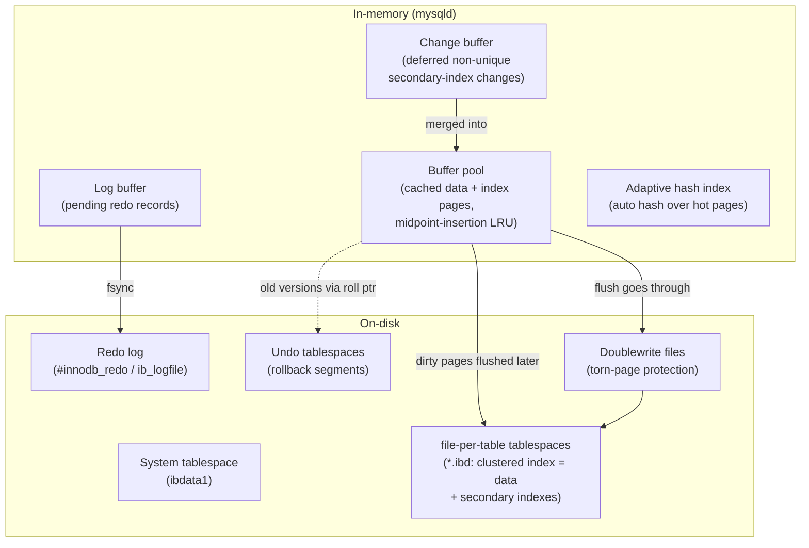
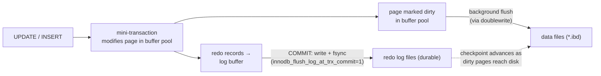

# MySQL / InnoDB Storage Engine — Internals & Design

> InnoDB is MySQL's default storage engine: a **transactional, crash-safe, high-concurrency** engine in which the **table itself is a primary-key B+-tree** (a clustered index), durability rests on a **redo log (WAL)**, and concurrency rests on **MVCC built from undo logs** plus **index-record locking**. Almost every behavior below — fast PK lookups, the secondary-index "double lookup," non-blocking reads, gap locks — follows from those few decisions.

**TL;DR**

| Dimension | InnoDB design | Why it matters |
|---|---|---|
| Role | MySQL's default, pluggable storage engine (replaced MyISAM as default in 5.5) | ACID + crash recovery + row-level concurrency for OLTP |
| Table storage | **Clustered index**: the table *is* a B+-tree keyed by the PK; leaf = full row | PK lookups & PK range scans are fast and local |
| If no PK | First `UNIQUE NOT NULL` index, else a hidden 6-byte `DB_ROW_ID` (`GEN_CLUST_INDEX`) | Every table always has a clustered index |
| Secondary index leaf | Indexed columns **+ the PK value** (not a physical row pointer) | Non-covered queries do a **second lookup** into the clustered index |
| MVCC | **In-place** update + old versions rebuilt from **undo logs** via `DB_TRX_ID`/`DB_ROLL_PTR` | No table bloat; old-version reads cost an undo walk |
| Durability | **Redo log** (`#innodb_redo` / `ib_logfile`), a physiological WAL | Lazy dirty-page flushing; crash recovery replays committed changes |
| Default isolation | **REPEATABLE READ** | Snapshot reads for plain `SELECT`; next-key locks for locking reads |
| Row locks | Locks on **index records**; **gap** + **next-key** locks prevent phantoms | Phantom-safe `REPEATABLE READ` without table locks |
| Cache | Buffer pool: **midpoint-insertion LRU** + change buffer + adaptive hash + doublewrite | Scan-resistant cache, deferred index I/O, torn-page protection |

---

## 1. Problem Background

**Why a pluggable storage engine at all?** MySQL splits the system into an upper *SQL layer* (parser, optimizer, connection handling) and a lower *storage-engine layer* behind a common handler API. Different engines can plug into the same SQL frontend. Historically MySQL's default was **MyISAM**: compact, fast for read-mostly workloads, but with **table-level locking** and **no crash recovery** — a crash could leave a table corrupt, and a single writer froze the whole table. That is fine for a read-heavy catalog and fatal for transactional OLTP.

**InnoDB is the answer to the OLTP problem.** It became MySQL's default engine in 5.5 and is what people mean today by "a MySQL database." Its job is to provide, on commodity hardware, the four things MyISAM lacked:

- **ACID transactions** — atomic multi-row changes that either fully commit or fully roll back.
- **Crash safety** — after an unexpected shutdown, the database comes back to a consistent committed state automatically.
- **High concurrency** — many transactions reading and writing at once, with **row-level** locking instead of table-level, and readers that don't block writers.
- **Durability without paying for it on every page write** — commits are made durable by a small sequential log, while the (larger, random) data-page writes are deferred and batched.

> The headline contrast with MyISAM: MyISAM asks *"how do I serve reads as fast and small as possible?"* InnoDB asks *"how do I let many transactions safely read and write shared rows, durably, and recover cleanly from a crash?"* Every InnoDB structure below — clustered index, redo log, undo log, buffer pool, lock manager — exists to answer that second question.

---

## 2. Architecture Overview

InnoDB is organized as a set of **in-memory** structures (in the `mysqld` process) backed by **on-disk** structures. The in-memory side is a cache and a staging area; the on-disk side is the source of truth.

### 2.1 In-memory and on-disk structures



### 2.2 The write path (commit data-flow)

A change never edits a data file directly on the commit path. It is recorded in the redo log first (write-ahead logging), applied to the in-memory page, and only *later* written back to the data files by background flushing. A single logical change is wrapped in a **mini-transaction (mtr)** that produces the redo records atomically.



Key point: **commit durability = the redo `fsync`, not the data write.** Once the redo record for a committed transaction is on disk, the change survives a crash even if its data page is still only in memory — recovery will replay it. This decoupling is what lets InnoDB flush large, randomly-located data pages **lazily and in batches** instead of synchronously on every commit. The **checkpoint** is the LSN up to which all changes are guaranteed in the data files; redo before it can be reused.

---

## 3. Internal Design

### 3.1 Clustered index & primary-key storage

In InnoDB the **table is its primary-key B+-tree**. There is no separate "heap." Leaf pages of this clustered index hold the **complete rows**, ordered by primary key; non-leaf (internal) pages hold only `(min-key-of-child, child-page-number)` routing entries. As Jeremy Cole puts it, *"Leaf pages contain actual row data. Non-leaf pages contain only pointers to other non-leaf pages, or to leaf pages."* Pages at the same level form a doubly-linked list (via the FIL header), so an index range scan is a left-to-right walk of leaf pages. ([jcole — B+Tree structures](https://blog.jcole.us/2013/01/10/btree-index-structures-in-innodb/))

Because *the data is the index*, **a primary-key lookup is a single B+-tree descent that lands directly on the row** — the docs note *"accessing a row through the clustered index is fast because the index search leads directly to the page that contains the row data."* And since rows are physically ordered by PK, a **PK range scan is sequential**.

Every InnoDB table has exactly one clustered index, chosen by this hierarchy ([InnoDB index types](https://dev.mysql.com/doc/refman/8.0/en/innodb-index-types.html)):

1. the declared **`PRIMARY KEY`**, else
2. the first **`UNIQUE`** index with **all columns `NOT NULL`**, else
3. a hidden **`GEN_CLUST_INDEX`** on a synthetic **6-byte `DB_ROW_ID`** that increases monotonically with inserts.

> Design consequence: the PK is not just a constraint — it *is the physical organization of the table*. Choosing it well (short, monotonic) or badly (wide, random) changes storage size, insert cost, and the size of every secondary index. See §4.

### 3.2 Secondary indexes & the "double lookup"

A secondary index is a separate B+-tree whose leaf records store **the indexed columns plus the primary-key value of the row** — *not* a physical pointer or page address. The docs are explicit: *"each record in a secondary index contains the primary key columns for the row, as well as the columns specified for the secondary index. InnoDB uses this primary key value to search for the row in the clustered index."*

So a query served by a secondary index that needs columns the index doesn't contain performs **two B+-tree descents**:


This is the **double lookup** (a.k.a. bookmark lookup). It is avoided only when the index is **covering** — i.e. it already contains every column the query touches — in which case the clustered-index trip is skipped.

Two practical consequences:
- **PK choice ripples everywhere.** Because every secondary-index entry embeds the PK, a long PK makes *every* secondary index bigger and slower. The manual's own advice: *"If the primary key is long, the secondary indexes use more space, so it is advantageous to have a short primary key."*
- **Covering indexes are a real optimization**, because they cut the query from two descents to one.

### 3.3 Buffer pool (midpoint-insertion LRU, change buffer, AHI)

The **buffer pool** caches data and index pages in main memory; it is *"a linked list of pages; data that is rarely used is aged out of the cache using a variation of the least recently used (LRU) algorithm."* ([buffer pool](https://dev.mysql.com/doc/refman/8.0/en/innodb-buffer-pool.html))

**Midpoint-insertion LRU.** Naïve LRU inserts new pages at the head (most-recently-used). That is catastrophic for a one-off full-table scan: it floods the cache and evicts the genuinely hot working set even though the scanned pages will never be touched again. InnoDB defends against this by splitting the list into a **young (new) sublist** at the head and an **old sublist** at the tail, with the **old sublist = the bottom 3/8** of the pool (`innodb_old_blocks_pct = 37`). A newly read page is **not** put at the head — it is inserted at the **midpoint, i.e. the head of the old sublist** (so, roughly 5/8 of the way down from the head). It is promoted into the young sublist only on a *subsequent* access. (3/8 and 5/8 describe the same boundary from opposite ends: the old region is the tail 3/8; the insertion point sits at 5/8 from the head.)

> Why this works: a scan touches each page once. Such a page enters at the midpoint and **ages out of the old sublist before ever being promoted**, so it never pollutes the hot young region. A page that is genuinely useful gets re-accessed while still in the old sublist and *then* earns its place in the young sublist. Read-ahead prefetched pages are protected the same way.

**Change buffer.** Inserts into a **non-unique secondary index** arrive in essentially random key order, so the target leaf page is often not in the buffer pool — reading it in just to add one entry is a random I/O. The change buffer *"caches changes to secondary index pages when those pages are not in the buffer pool,"* and *"merges them later when the pages are loaded into the buffer pool by other read operations,"* which *"avoids substantial random access I/O."* ([change buffer](https://dev.mysql.com/doc/refman/8.0/en/innodb-change-buffer.html)) It applies only to **non-unique** secondary indexes — a unique index can't defer, because the uniqueness check requires reading the page in *now*.

**Adaptive hash index (AHI).** InnoDB watches access patterns and, for index pages searched often, *"builds a hash index … using a prefix of the index key"* automatically, *turning the index value into a sort of pointer.* This lets a hot working set behave *"more like an in-memory database"* by replacing repeated B+-tree descents with a direct hash lookup. It is transparent and controlled by `innodb_adaptive_hash_index`. ([adaptive hash index](https://dev.mysql.com/doc/refman/8.0/en/innodb-adaptive-hash.html))

**Doublewrite buffer.** InnoDB pages (default **16 KB**) are larger than a typical filesystem/device sector, so a crash mid-write can leave a **torn (partially written) page** that redo alone cannot fix. The **doublewrite buffer** is *"a storage area where InnoDB writes pages flushed from the buffer pool before writing the pages to their proper positions in the data files."* If a write is interrupted, recovery *"can find a good copy of the page from the doublewrite buffer."* The doublewrite write is one large sequential chunk with a single `fsync`, so it is far cheaper than its name suggests. ([doublewrite](https://dev.mysql.com/doc/refman/8.0/en/innodb-doublewrite-buffer.html))

### 3.4 Redo log (durability + crash recovery)

The redo log is *"a disk-based data structure used during crash recovery to correct data written by incomplete transactions"*; *"modifications that did not finish updating data files before an unexpected shutdown are replayed automatically during initialization."* ([redo log](https://dev.mysql.com/doc/refman/8.0/en/innodb-redo-log.html)) It is **physiological WAL**: each record encodes a *physical* change to a *logical* page (e.g. "at page P, offset O, write these bytes"), appended in **LSN (Log Sequence Number)** order.

Mechanics:
- On the commit path, redo records flow through the **log buffer** to the redo files and are **`fsync`'d** — `innodb_flush_log_at_trx_commit = 1` makes the commit durable per the SQL standard (other values trade durability for throughput by flushing once per second).
- Files are `#ib_redo_N` in the `#innodb_redo/` directory (MySQL 8.0.30+) or `ib_logfile0`/`ib_logfile1` before that.
- The redo log is a **ring**: as the **checkpoint** advances (dirty pages reach the data files), old redo is truncated and the space reused.

> The redo log is what makes lazy data-page flushing *safe*: a committed change can live only in memory + redo and still survive a crash, because recovery replays it from the redo log forward from the last checkpoint.

### 3.5 Undo log + MVCC

InnoDB does **not** keep multiple physical copies of a row in the table. It **updates the row in place** in the clustered index and stamps it with two of its hidden system columns; the *previous* version is reconstructed on demand by walking undo records. The three hidden columns (on **clustered-index** rows) are ([multi-versioning](https://dev.mysql.com/doc/refman/8.0/en/innodb-multi-versioning.html)):

| Hidden column | Size | Purpose |
|---|---|---|
| `DB_TRX_ID` | **6 bytes** | ID of the last transaction to insert/update the row (delete = update + a deleted-bit) |
| `DB_ROLL_PTR` | **7 bytes** | "roll pointer" → the undo log record holding the info to rebuild the *prior* version |
| `DB_ROW_ID` | **6 bytes** | monotonic row ID, used only when InnoDB had to generate the clustered index |

**Read views / consistent reads.** A transaction's **read view** is a snapshot of which transactions were committed at the moment it started reading. To serve a plain `SELECT`, InnoDB takes the current clustered-index row; if that row's `DB_TRX_ID` is *too new* to be visible to the read view, it follows `DB_ROLL_PTR` back through the **undo chain**, rebuilding older versions until it reaches one visible to the snapshot. *"If another transaction needs to see the original data as part of a consistent read operation, the unmodified data is retrieved from undo log records."* ([undo logs](https://dev.mysql.com/doc/refman/8.0/en/innodb-undo-logs.html))

> Precision point: the version chain hangs off the **clustered-index** row's `DB_TRX_ID`/`DB_ROLL_PTR`. **Secondary-index records do not carry per-row `DB_TRX_ID`/`DB_ROLL_PTR`.** Secondary-index visibility is first checked against the page's max transaction id; if that's ambiguous, InnoDB falls back to a clustered-index lookup to find the visible version.

**Undo has two jobs.** (1) **Rollback** — undo a transaction's changes if it aborts. (2) **MVCC** — supply old row versions to consistent reads. Accordingly, **insert undo** can be discarded right after commit (no one needs the pre-insert "nothing"), but **update undo** *"can be discarded only after there is no transaction present for which InnoDB has assigned a snapshot."*

**Purge.** Old update-undo (and the physical removal of delete-marked rows) is reclaimed by background **purge** threads once **no read view still needs it**. This is InnoDB's analogue of PostgreSQL's VACUUM — but it cleans the **undo logs** (the old versions), not the table, because the table was never bloated with dead tuples in the first place.

### 3.6 Locking (record, gap, next-key)

InnoDB's row locks are **locks on index records**, not on physical row slots: *"Record locks always lock index records, even if a table is defined with no indexes"* — in which case the hidden clustered index is used. *"Thus, the row-level locks are actually index-record locks."* ([InnoDB locking](https://dev.mysql.com/doc/refman/8.0/en/innodb-locking.html))

| Lock | Definition | Prevents |
|---|---|---|
| **Record lock** (S/X) | A lock on a single index record | Concurrent read (X) / write of that row |
| **Gap lock** | A lock on the *gap between* index records (or before first / after last) | **Inserts** into that gap |
| **Next-key lock** | A **record lock on the index record + a gap lock on the gap *before* it** | The row *and* inserts just before it → phantoms |
| **Insert intention** | A gap lock signalling intent to insert | Lets non-conflicting inserts into the same gap proceed without waiting on each other |

A crucial subtlety: **gap locks are "purely inhibitive."** *"Gap locks can co-exist. A gap lock taken by one transaction does not prevent another transaction from taking a gap lock on the same gap. There is no difference between shared and exclusive gap locks. They do not conflict with each other."* Their *only* purpose is to block inserts into the gap. So two transactions can both gap-lock the same range; they only conflict when one tries to **insert** there.

### 3.7 Transaction processing & isolation levels

InnoDB's default isolation level is **`REPEATABLE READ`** (not `READ COMMITTED`). ([isolation levels](https://dev.mysql.com/doc/refman/8.0/en/innodb-transaction-isolation-levels.html))

| Level | Plain `SELECT` (consistent read) | Locking reads / gaps |
|---|---|---|
| `READ UNCOMMITTED` | May read an uncommitted ("dirty") version | — |
| `READ COMMITTED` | **Fresh snapshot per statement** | Locks only index records, **no gap locks** (except FK/dup checks) → phantoms possible |
| **`REPEATABLE READ`** (default) | **Snapshot from the *first* read**, stable for the whole txn | **Next-key locks** on range scans → **no phantoms** |
| `SERIALIZABLE` | Like RR, but plain `SELECT` is promoted to `SELECT … FOR SHARE` | Locks every read row |

Two mechanisms cooperate under `REPEATABLE READ`:
- **Plain (non-locking) `SELECT`** uses the MVCC snapshot — *"consistent reads within the same transaction read the snapshot established by the first read"* — so it never blocks and never takes locks.
- **Locking reads** (`SELECT … FOR UPDATE/SHARE`, and `UPDATE`/`DELETE`) use **next-key locking** over the scanned range: *"InnoDB locks the index range scanned, using gap locks or next-key locks to block insertions by other sessions into the gaps."* This is what makes `REPEATABLE READ` **phantom-safe** — a competing `INSERT` into a locked gap waits. (For a unique index hit on a unique value, InnoDB locks only the record, not the gap — there's nothing to phantom.) ([next-key locking](https://dev.mysql.com/doc/refman/8.0/en/innodb-next-key-locking.html))

---

## 4. Design Trade-Offs

### 4.1 The clustered index: what you buy and what you pay

| | Benefit | Cost |
|---|---|---|
| PK point lookup | One B+-tree descent lands on the full row | — |
| PK range scan | Rows physically ordered by PK → sequential leaf walk | — |
| Locality | Related-by-PK rows sit together on the same pages | Only locality *by PK*; other orderings get no locality |
| Secondary indexes | — | Pay a **double lookup** for non-covered columns; each entry embeds the PK |
| Insert pattern | **Monotonic** PK (e.g. `AUTO_INCREMENT`) → append to the rightmost page | **Random/large** PK (e.g. a UUID) → inserts scattered across the tree → **page splits**, fragmentation, bloat |

The deepest trade-off is **PK choice**. A short, monotonic PK keeps the tree dense and inserts cheap, and keeps every secondary index small. A random 128-bit UUID PK does the opposite: it scatters inserts (splitting pages and lowering fill factor) *and* fattens every secondary index (each entry carries that 16-byte PK). The clustered index makes PK choice a first-order physical-design decision, not a cosmetic one.

### 4.2 Undo-based, in-place MVCC

InnoDB's MVCC updates rows **in place** and keeps old versions in **undo**. The trade:
- **Wins:** reading *current* data is cheap (the live version is right there in the clustered index); the **table never bloats** with dead tuples; indexes don't accumulate dead pointers.
- **Pays:** reading *old* versions costs an **undo walk** per superseded version; and a **long-running transaction** holds an old read view open, which **blocks purge** — undo can't be reclaimed while any snapshot might still need it. Undo then grows and the **history list length** climbs. This is the cost mirror-image of PostgreSQL's bloat: InnoDB's "garbage" is old undo, cleaned by purge, rather than dead heap tuples cleaned by VACUUM.

### 4.3 Why two logs — and the three guiding questions

**Why does InnoDB need both undo and redo logs?**
Because they solve **orthogonal** problems and run in **opposite directions**:
- **Redo = durability/atomicity going *forward*.** It records *physical* changes so that after a crash, committed changes that hadn't reached the data files can be **re-applied**. Without redo, lazy dirty-page flushing would lose committed work on a crash.
- **Undo = atomicity *backward* + MVCC.** It records how to **reverse** a change, so an aborted transaction can roll back, *and* so consistent reads can reconstruct **prior versions**. Without undo there is no rollback and no snapshot isolation.
One log says "how to redo committed work after a crash"; the other says "how to undo a change and what the row looked like before." You need both because durability and multi-versioning/rollback are different guarantees. (Recovery itself uses both: redo brings the data files up to the crash point, then undo rolls back transactions that were in-flight and uncommitted.)

**What advantages do clustered indexes provide?**
The table *is* the PK B+-tree, so (1) **PK lookups land directly on the row** in one descent — no separate heap visit; (2) **PK range scans are sequential** because rows are stored in PK order with leaf pages linked; (3) **PK-adjacent rows have physical locality**, improving cache and I/O efficiency for PK-ordered access. The accepted cost is that secondary indexes don't get a direct row pointer — they store the PK and pay a **double lookup** — and that a poor PK (random/large) degrades insert locality and inflates every secondary index. InnoDB bets that PK access is the common, hot path and optimizes the physical layout for it.

**Why did PostgreSQL choose a different MVCC model?**
PostgreSQL uses **append-only tuple versioning + VACUUM** rather than in-place + undo. An `UPDATE` writes a **new tuple version** in the heap and marks the old one dead (`xmin`/`xmax`); superseded versions are later reclaimed by **VACUUM**. Compared with InnoDB:

| | InnoDB (in-place + undo) | PostgreSQL (append-only + VACUUM) |
|---|---|---|
| Where old versions live | In the **undo log** | As **dead tuples in the heap** |
| Current-row read | Cheap — live version is in place | Cheap — but must skip dead tuples / check visibility |
| Old-version read | Walk the **undo chain** | Just read the older heap tuple (no chain walk) |
| Garbage collector | **Purge** threads (clean undo) | **VACUUM/autovacuum** (clean the heap) |
| Table bloat | Low (table not multi-versioned) | Higher (dead tuples until vacuumed) |
| Index on `UPDATE` | Secondary indexes often untouched if key unchanged | Historically every index gets a new pointer (mitigated by HOT) |
| Long txn hurts | **Purge stalls**, undo/history grows | **VACUUM stalls**, dead tuples accumulate |

Each pays *somewhere*, just at a different place. PostgreSQL chose append-only because it fits its **separate heap + secondary-everything** storage model (there's no single clustered tree to update in place), gives **branch-free, chain-free reads of any version**, and keeps writes simple; the price is heap bloat and a vigorous VACUUM. InnoDB chose in-place + undo because its **clustered index** wants the live row to stay put (so PK access stays a single descent and the table doesn't bloat); the price is undo growth and purge pressure under long transactions. Same goal (non-blocking multi-version reads); opposite bookkeeping.

---

## 5. Experiments / Observations

> The recipes below are **reproducible**: each lists the exact SQL/commands and the **expected/documented behavior**. Any output shown is **(illustrative; reproduce with the command above)** — grounded in the cited documentation, not a measured benchmark run. No timings are reported as if observed.

### 5.1 Inspect engine internals — `SHOW ENGINE INNODB STATUS`

```sql
SHOW ENGINE INNODB STATUS\G
```

This dumps several sections. The ones relevant here:

```
-- (illustrative; reproduce with the command above)
------------
TRANSACTIONS
------------
Trx id counter 0x...                 -- global txn id
Purge done for trx's n:o < 0x...     -- purge progress
History list length 23               -- # of undo records awaiting purge
---TRANSACTION 421..., ACTIVE 412 sec   -- a long-running txn (a purge blocker!)
---
LOG
---
Log sequence number   0x...          -- current LSN (redo write position)
Log flushed up to     0x...
Pages flushed up to   0x...          -- checkpoint position
Last checkpoint at    0x...
----------------------
BUFFER POOL AND MEMORY
----------------------
Buffer pool size   8192
Database pages     7950              -- young + old sublists
Old database pages 2925              -- ~3/8 of pages = the old sublist
Pages read ..., created ..., written ...
```

**What to look for / documented meaning:**
- **History list length** = the count of undo log records not yet purged. A *steadily climbing* value signals a **long-running transaction holding an old read view and blocking purge** — the practical symptom of the §4.2 trade-off. The fix is to commit transactions promptly. ([multi-versioning](https://dev.mysql.com/doc/refman/8.0/en/innodb-multi-versioning.html))
- The **LOG** section's LSN vs **checkpoint** gap shows how far the redo write position is ahead of the data files.
- **Old database pages ≈ 3/8** of buffer-pool pages confirms the midpoint-insertion split (`innodb_old_blocks_pct = 37`). ([buffer pool](https://dev.mysql.com/doc/refman/8.0/en/innodb-buffer-pool.html))

### 5.2 Covering secondary index vs. one that needs a clustered-index lookup

```sql
CREATE TABLE users (
  id    BIGINT PRIMARY KEY AUTO_INCREMENT,
  email VARCHAR(255),
  name  VARCHAR(255),
  KEY idx_email (email)
);

-- (A) NON-covered: idx_email finds the row, but `name` forces a clustered-index lookup
EXPLAIN SELECT name FROM users WHERE email = 'a@b.com';

-- (B) COVERED: only PK + email are needed, both already in idx_email → no double lookup
EXPLAIN SELECT id FROM users WHERE email = 'a@b.com';
```

**Expected/documented behavior.** Query (A) uses `idx_email` but must fetch `name` from the clustered index — the **double lookup** of §3.2. Query (B) is satisfied entirely from the secondary index; the optimizer reports it as a **covering index**:

```
-- (illustrative; reproduce with EXPLAIN above)
-- (A)  key: idx_email   Extra: (none)                       -> secondary then clustered lookup
-- (B)  key: idx_email   Extra: Using index                  -> covering; no clustered-index trip
```

`Extra: Using index` is the documented marker that the query was answered from the index alone (no row fetch). This is the observable difference between paying the double lookup and avoiding it.

### 5.3 Seeing record / gap / next-key locks — `performance_schema.data_locks`

```sql
-- Session 1
SET SESSION TRANSACTION ISOLATION LEVEL REPEATABLE READ;
START TRANSACTION;
SELECT * FROM t WHERE id BETWEEN 10 AND 20 FOR UPDATE;  -- range → next-key locks

-- Session 2 (observer)
SELECT ENGINE_TRANSACTION_ID, LOCK_TYPE, LOCK_MODE, LOCK_DATA
FROM performance_schema.data_locks
WHERE OBJECT_NAME = 't';
```

**Expected/documented behavior.** Because this is a **range** locking read under `REPEATABLE READ`, InnoDB takes **next-key locks** over the scanned range (and a gap lock after the last record). `LOCK_MODE` distinguishes them:

```
-- (illustrative; reproduce with the query above)
LOCK_TYPE  LOCK_MODE                LOCK_DATA
RECORD     X                        12        -- record lock on an index record
RECORD     X,GAP                    25        -- pure GAP lock (gap before 25)
RECORD     X                        supremum pseudo-record   -- gap after the last record
```

`X` = next-key/record lock on the index record; `X,GAP` = a **gap-only** lock; the **`supremum` pseudo-record** is how InnoDB locks "the gap after the last row" to stop appends into the range. ([locking](https://dev.mysql.com/doc/refman/8.0/en/innodb-locking.html), [next-key locking](https://dev.mysql.com/doc/refman/8.0/en/innodb-next-key-locking.html))

### 5.4 A gap lock blocking a phantom `INSERT` under `REPEATABLE READ`

```sql
-- Setup: rows with id = 5 and id = 15 exist (so 6..14 is an open gap)

-- Session 1
SET SESSION TRANSACTION ISOLATION LEVEL REPEATABLE READ;
START TRANSACTION;
SELECT * FROM t WHERE id BETWEEN 6 AND 14 FOR UPDATE;   -- locks the gap 6..14
-- (does NOT commit yet)

-- Session 2
START TRANSACTION;
INSERT INTO t (id) VALUES (10);   -- tries to insert INTO the locked gap
-- ⇒ BLOCKS, waiting on Session 1's gap lock (would otherwise be a phantom)
```

**Expected/documented behavior.** Under `REPEATABLE READ`, the range locking read sets **next-key/gap locks** over `6..14`. Session 2's `INSERT` of `id = 10` requests an **insert-intention lock** in that gap and must **wait** until Session 1 commits or rolls back — exactly the mechanism that prevents a phantom row from appearing in Session 1's range. Under `READ COMMITTED`, where InnoDB does **not** take gap locks, the same `INSERT` would proceed immediately and phantoms become possible. ([next-key locking](https://dev.mysql.com/doc/refman/8.0/en/innodb-next-key-locking.html), [isolation levels](https://dev.mysql.com/doc/refman/8.0/en/innodb-transaction-isolation-levels.html))

You can confirm the wait directly:

```sql
SELECT * FROM performance_schema.data_lock_waits;   -- shows blocking vs. waiting lock
SELECT trx_id, trx_state, trx_query FROM information_schema.INNODB_TRX;  -- the waiting INSERT
```

---

## 6. Key Learnings

1. **The table *is* an index.** InnoDB's clustered index means the PK defines the physical layout. PK lookups and PK range scans are fast and local — but that makes **PK choice a physical-design decision**: short and monotonic is dense and cheap; wide and random (UUID) causes page splits and inflates every secondary index.
2. **Secondary indexes store the PK, not a pointer — hence the double lookup.** Any non-covered query pays a second B+-tree descent into the clustered index. **Covering indexes** are the targeted cure, and a small PK keeps all secondary indexes small.
3. **Two logs, two directions.** **Redo** replays committed changes *forward* after a crash (durability + lazy flushing); **undo** reverses changes *backward* (rollback) **and** rebuilds old versions for MVCC. They are not redundant — they guarantee different things.
4. **MVCC without table bloat — but at the cost of purge pressure.** In-place updates + undo keep the table compact and current reads cheap, but old-version reads walk undo, and **long transactions block purge** (watch *history list length*). This is the mirror image of PostgreSQL's dead-tuples-and-VACUUM model: same goal, opposite garbage.
5. **`REPEATABLE READ` is phantom-safe by design.** Plain `SELECT` rides the MVCC snapshot (never blocks); locking reads take **next-key locks** (record + preceding gap), so a competing `INSERT` into a locked gap waits. Locks are on **index records**, and **gap locks are purely inhibitive** — they only block inserts and freely co-exist.
6. **The buffer pool is engineered against its own worst case.** **Midpoint-insertion LRU** stops one-off scans from evicting the hot set; the **change buffer** defers random non-unique secondary-index I/O; the **adaptive hash index** turns hot pages into in-memory hash lookups; the **doublewrite buffer** guards against torn pages. Each is a targeted answer to a specific I/O pathology.

---

## References

- MySQL 8.0 Reference Manual — *Clustered and Secondary Indexes*: https://dev.mysql.com/doc/refman/8.0/en/innodb-index-types.html
- MySQL 8.0 Reference Manual — *InnoDB Multi-Versioning*: https://dev.mysql.com/doc/refman/8.0/en/innodb-multi-versioning.html
- MySQL 8.0 Reference Manual — *InnoDB Undo Logs*: https://dev.mysql.com/doc/refman/8.0/en/innodb-undo-logs.html
- MySQL 8.0 Reference Manual — *The InnoDB Buffer Pool*: https://dev.mysql.com/doc/refman/8.0/en/innodb-buffer-pool.html
- MySQL 8.0 Reference Manual — *Change Buffer*: https://dev.mysql.com/doc/refman/8.0/en/innodb-change-buffer.html
- MySQL 8.0 Reference Manual — *Adaptive Hash Index*: https://dev.mysql.com/doc/refman/8.0/en/innodb-adaptive-hash.html
- MySQL 8.0 Reference Manual — *Doublewrite Buffer*: https://dev.mysql.com/doc/refman/8.0/en/innodb-doublewrite-buffer.html
- MySQL 8.0 Reference Manual — *Redo Log*: https://dev.mysql.com/doc/refman/8.0/en/innodb-redo-log.html
- MySQL 8.0 Reference Manual — *InnoDB Locking*: https://dev.mysql.com/doc/refman/8.0/en/innodb-locking.html
- MySQL 8.0 Reference Manual — *Transaction Isolation Levels*: https://dev.mysql.com/doc/refman/8.0/en/innodb-transaction-isolation-levels.html
- MySQL 8.0 Reference Manual — *Phantom Rows / Next-Key Locking*: https://dev.mysql.com/doc/refman/8.0/en/innodb-next-key-locking.html
- Jeremy Cole — *B+Tree index structures in InnoDB*: https://blog.jcole.us/2013/01/10/btree-index-structures-in-innodb/
- Jeremy Cole — *The physical structure of InnoDB index pages*: https://blog.jcole.us/2013/01/07/the-physical-structure-of-innodb-index-pages/

*All analysis above is original synthesis written in my own words from the cited primary documentation and Jeremy Cole's InnoDB-internals series; quoted phrases are explicitly marked and attributed to their source.*
