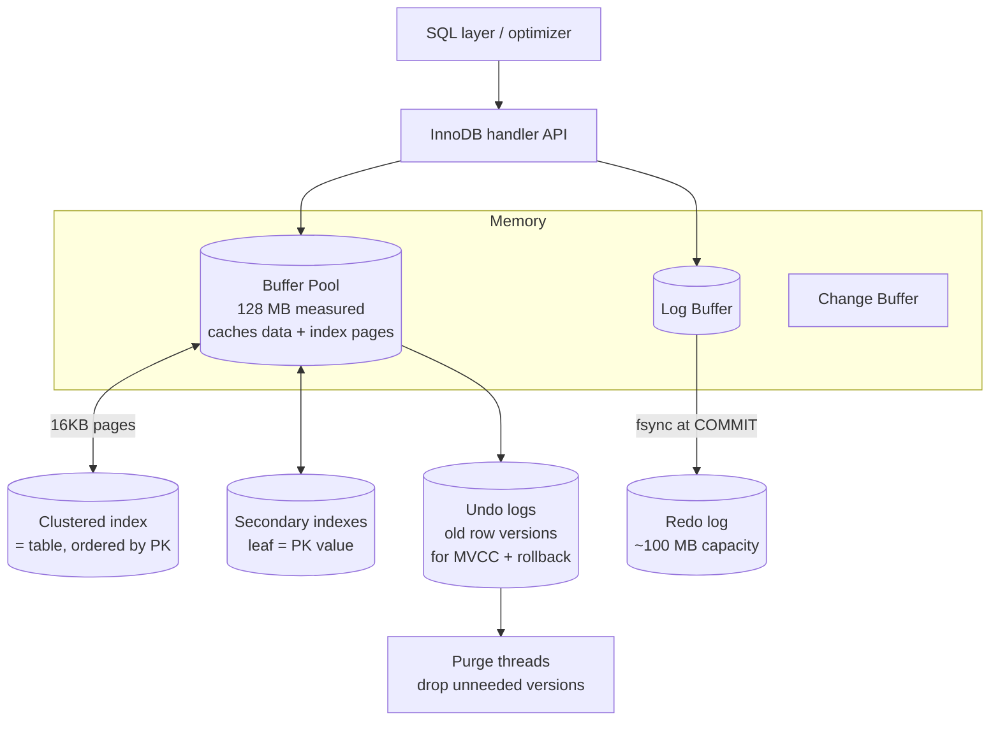

# MySQL / InnoDB Storage Engine

> InnoDB is MySQL's default transactional storage engine. Its design rests on three pillars: **clustered (index-organized) storage**, **in-place updates backed by undo logs** (Oracle-style MVCC), and a **redo log** for durability. All experiments below ran live against **MySQL 8.4.10 / InnoDB** (Docker `mysql:8.4`) on 50k customers and 200k orders.

---

## 1. Problem Background

MySQL began (1995) with simple, fast, non-transactional storage (MyISAM). As MySQL moved into OLTP and e-commerce, it needed **ACID transactions, crash recovery, and row-level concurrency**, capabilities MyISAM lacked. InnoDB (Innobase Oy, later acquired by Oracle) was built to provide exactly that and became the default engine in MySQL 5.5.

InnoDB's architecture is a direct response to OLTP requirements:
- Many short transactions updating individual rows → **row-level locking** (not table locks).
- Point lookups and range scans by primary key → **clustered storage** so the row travels with the key.
- Crash safety without flushing every dirty page → a **redo log**.
- Rollback and consistent reads → **undo logs** holding prior row versions.

---

## 2. Architecture Overview



**Write path:** a transaction modifies a page **in the buffer pool**, writes the *before-image* to an **undo log** (for rollback/MVCC) and the *change* to the **redo log buffer**. At `COMMIT`, the redo record is flushed (`fsync`) to disk; the dirty data page is written back later. This is write-ahead logging, like PostgreSQL, but InnoDB updates rows **in place** and keeps old versions in a *separate* undo area, where PostgreSQL keeps old versions *in the table itself*.

---

## 3. Internal Design

### 3.1 Clustered index = the table

In InnoDB a table **is** its primary-key B+-tree. Leaf nodes store the *full rows*, physically ordered by primary key. There is no separate heap. Consequences:
- A primary-key lookup is a single B-tree descent that lands directly on the row.
- Rows physically adjacent in PK order → range scans by PK are sequential and cache-friendly.
- If you don't declare a PK, InnoDB invents a hidden 6-byte `ROW_ID` to cluster on.

**Experiment: PK lookup is a `const` access on the clustered index:**
```text
mysql> EXPLAIN SELECT * FROM orders WHERE id=12345 \G
        type: const
         key: PRIMARY        <- the clustered index IS the table
        rows: 1
```

### 3.2 Secondary indexes store the PK, not a row pointer

A secondary index's leaf entries contain the indexed column(s) **plus the primary key value** (not a physical pointer). So a secondary-index lookup is *two* B-tree descents: find the PK in the secondary index, then look up the row in the clustered index ("bookmark lookup").

**Experiment: secondary lookup vs covering index:**
```text
-- needs the row → secondary index, then clustered lookup
mysql> EXPLAIN SELECT * FROM orders WHERE status='paid' \G
        type: ref
         key: idx_status
        rows: 87992
       Extra: NULL              <- must visit clustered index for each row

-- needs only the indexed column → covered entirely by the secondary index
mysql> EXPLAIN SELECT customer_id FROM orders WHERE customer_id=42 \G
        type: ref
         key: idx_customer
       Extra: Using index       <- no clustered-index lookup needed
```
Because secondary leaves carry the PK, an index on `customer_id` already contains everything `SELECT customer_id` needs → `Using index` (a covering index). This PK-in-secondary-index design is also why a **large primary key bloats every secondary index**, a key InnoDB schema-design rule.

### 3.3 Buffer pool

InnoDB caches 16 KB data and index pages in the **buffer pool** (measured: 128 MB) using a midpoint-insertion **LRU** (a young/old sublist that resists flooding the cache with a single big scan). Dirty pages are flushed asynchronously by background threads, not at commit. A **change buffer** defers secondary-index maintenance for pages not in memory, turning random index writes into sequential ones.

### 3.4 Undo logs → in-place updates + MVCC

InnoDB updates rows **in place** and writes the previous version to an **undo log**. Each row carries hidden `DB_TRX_ID` (last writer) and `DB_ROLL_PTR` (pointer to its undo record). A consistent read reconstructs the version visible to its snapshot by walking the undo chain backward, this is **Oracle-style MVCC**: one current row in the table plus old versions off to the side.

**Experiment: undo log powers ROLLBACK:**
```text
START TRANSACTION;
UPDATE acct SET bal=999 WHERE id=1;
SELECT bal FROM acct WHERE id=1;   -> 999   (in-place change, visible in txn)
ROLLBACK;
SELECT bal FROM acct WHERE id=1;   -> 100   (undo log restored the old image)
```
The row was changed in place to 999, then `ROLLBACK` used the undo record to restore 100. Old undo versions are reclaimed later by **purge threads** once no transaction can still see them (`History list length` tracks the backlog, measured 0 when idle).

### 3.5 Redo log → durability

The **redo log** (a fixed-capacity circular log, measured 100 MB) records page changes so committed work survives a crash even if dirty data pages never reached disk. With `innodb_flush_log_at_trx_commit=1` (the default, confirmed), the redo log is `fsync`'d at every commit.

**Experiment: writes generate redo:**
```text
Innodb_os_log_written before bulk UPDATE : 33,519,104 bytes
UPDATE orders SET total_cents=total_cents+1 WHERE status='paid';   (~50k rows)
Innodb_os_log_written after             : 38,209,024 bytes
                                          ──────────
redo written by the update              ≈ 4.69 MB
```
The ~50k-row update appended ~4.7 MB of redo. On restart, InnoDB replays redo from the last checkpoint (REDO) and rolls back uncommitted transactions using undo (UNDO), the classic two-phase recovery.

### 3.6 Locking: row locks and gap locks

InnoDB locks **index records**, not rows directly, which is why locking behaviour depends on indexes. In **REPEATABLE READ** (MySQL's default isolation, confirmed below) it also takes **gap locks** and **next-key locks** to prevent *phantom rows*, inserts into a range another transaction is scanning.

**Experiment: a gap lock blocks an INSERT into the gap:**
```text
table gaps has ids {10, 20, 30}

[A] SET TRANSACTION ISOLATION LEVEL REPEATABLE READ; START TRANSACTION;
[A] SELECT * FROM gaps WHERE id BETWEEN 11 AND 19 FOR UPDATE;   -- locks the gap

[B] INSERT INTO gaps VALUES (15);   -- into the locked gap (11..19)
    -> ERROR 1205: Lock wait timeout exceeded        (BLOCKED)

[B] INSERT INTO gaps VALUES (25);   -- different, unlocked gap
    -> [B] insert 25 OK                              (SUCCEEDS immediately)
```
The gap lock on (11..19) blocked `INSERT 15` (phantom prevention) but left `INSERT 25` free. This is how InnoDB delivers REPEATABLE READ without locking the whole table.

### 3.7 Isolation levels
```text
@@transaction_isolation = REPEATABLE-READ      (InnoDB default)
@@innodb_flush_log_at_trx_commit = 1           (durable commits)
```
InnoDB supports all four SQL isolation levels. Its **REPEATABLE READ** default uses MVCC snapshots for reads plus next-key locks for locking reads/writes, stricter than PostgreSQL's default of READ COMMITTED.

---

## 4. Design Trade-Offs

| Aspect | InnoDB approach | Benefit | Cost |
|---|---|---|---|
| **Storage** | Clustered (table = PK B-tree) | Fast PK lookups & PK range scans; no heap | Secondary indexes need a second lookup; big PK bloats all indexes |
| **Updates** | In-place + undo log | Table stays compact; no append bloat | Undo management & purge; long transactions hold history |
| **MVCC** | One current row + undo chain | Compact storage; fast reads of current data | Reconstructing old versions walks undo (cost grows with version depth) |
| **Redo log** | Fixed circular WAL | Cheap durable commits; bounded disk | Checkpoint pressure if redo too small; double write of log+data |
| **Locking** | Index-record + gap/next-key locks | Phantom-free REPEATABLE READ; high row concurrency | Gap locks can block inserts unexpectedly; deadlocks possible |

### Why InnoDB needs **both** undo and redo logs
They solve opposite problems and run in opposite directions:
- **Redo** is for **durability / roll-forward**: replay committed changes lost from the buffer pool after a crash.
- **Undo** is for **atomicity + isolation / roll-back**: undo uncommitted changes and reconstruct old row versions for MVCC reads.
A committed transaction needs redo; an aborted one (and every consistent read) needs undo. Neither can do the other's job.

### Why PostgreSQL chose a different MVCC model
PostgreSQL keeps *all* row versions in the table heap (no undo segment) and cleans them with VACUUM. InnoDB keeps one current row in place and old versions in undo.
- **InnoDB wins** on steady-state table size (no bloat from updates) and fast reads of *current* rows.
- **PostgreSQL wins** on update/rollback simplicity (no undo to manage) but pays with table bloat and mandatory VACUUM (demonstrated in the *PostgreSQL Internals* document, where 3 updates doubled a table's size).

---

## 5. Experiments / Observations

| # | Experiment | Key result |
|---|---|---|
| 1 | PK lookup plan | `type=const`, `key=PRIMARY`, clustered index *is* the table |
| 2 | Secondary vs covering index | `status` lookup → `ref` (then clustered lookup); `customer_id` → `Using index` (covered, no clustered lookup) |
| 3 | Gap lock (REPEATABLE READ) | INSERT 15 into locked gap (11..19) **timed out**; INSERT 25 (other gap) **succeeded** |
| 4 | Redo log | bulk 50k-row update wrote **≈4.7 MB** of redo (`Innodb_os_log_written` 33.5 MB → 38.2 MB) |
| 5 | Undo log | in-place UPDATE to 999, then `ROLLBACK` restored **100** via undo |

Config observed: buffer pool **128 MB**, default isolation **REPEATABLE READ**, redo capacity **100 MB**, `flush_log_at_trx_commit=1`.

---

## 6. Key Learnings

- **Clustering shapes everything.** Because the table *is* the PK B-tree and secondary indexes store the PK, the choice of primary key drives lookup cost, scan locality, and the size of every secondary index. A fat PK silently bloats the whole schema.
- **Two logs, two jobs.** Watching redo grow on an UPDATE and watching ROLLBACK restore an old value made the redo/undo division concrete: roll-forward for durability, roll-back for atomicity and MVCC.
- **InnoDB's MVCC is the mirror image of PostgreSQL's.** Same goal (lock-free reads), opposite mechanics: undo-chain reconstruction vs in-heap versions + VACUUM. InnoDB trades update bloat for undo/purge complexity.
- **Locking is index-driven, and gap locks surprise people.** The phantom-preventing gap lock blocked a perfectly innocent INSERT, a frequent source of production "deadlock"/timeout confusion, and a direct consequence of the REPEATABLE READ default.
- **Surprising observation:** InnoDB defaults to the *stricter* REPEATABLE READ while PostgreSQL defaults to READ COMMITTED, so identical application code can see different concurrency behaviour across the two databases out of the box.

---

### Reproducing
```bash
docker run -d --name mysql -e MYSQL_ROOT_PASSWORD=root -e MYSQL_DATABASE=labdb -p 3310:3306 mysql:8.4
# load schema + data, then run the EXPLAIN / locking / log queries shown above
```
*Engine: MySQL 8.4.10 with InnoDB (Docker). Concurrency tests used overlapping `mysql` client sessions with `SELECT SLEEP()` to hold transactions open. Sources: MySQL 8.4 Reference Manual (InnoDB Storage Engine, Locking, Redo/Undo Logs) and the InnoDB architecture documentation.*
