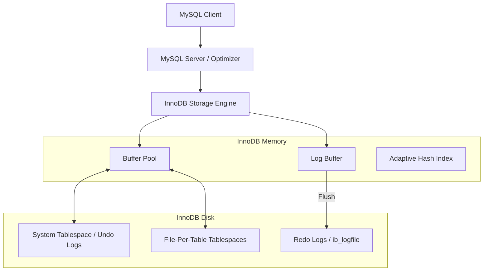

# MySQL / InnoDB Storage Engine

## 1. Problem Background
MySQL was originally created for fast web reads (using the MyISAM engine, which lacked transactions). As MySQL became enterprise-grade, it needed a storage engine providing strong ACID compliance, crash recovery, and row-level locking. InnoDB was developed as an independent storage engine plugin and eventually became MySQL's default engine, solving the need for high-concurrency transactional processing in web-scale applications.

## 2. Architecture Overview

## 3. Internal Design

### Storage Architecture
- **Clustered Indexes**: In InnoDB, the table *is* the Primary Key index. The B+Tree leaf nodes contain the actual row data.
- **Secondary Indexes**: Leaf nodes of secondary indexes do not contain row data; instead, they contain the Primary Key value. A secondary index lookup requires traversing the secondary index to find the PK, then traversing the Clustered Index to find the row data.
- **Buffer Pool**: InnoDB's equivalent of PostgreSQL's Shared Buffers. It aggressively caches data and index pages using a modified LRU algorithm (midpoint insertion strategy) to prevent full table scans from flushing out hot data.

### Transaction Processing
- **Redo Logs (WAL)**: Ensures Durability. Records physical changes to pages. Written sequentially and flushed on transaction commit (depending on `innodb_flush_log_at_trx_commit`).
- **Undo Logs**: Ensures Atomicity and enables MVCC. Stores the *previous* state of a modified row. If a transaction rolls back, undo logs revert the changes.
- **Row-Level Locking**: InnoDB locks records (rows), not pages or tables.
- **Gap Locks & Next-Key Locks**: InnoDB locks the "gaps" between index records to prevent phantom reads in Repeatable Read isolation level.

### MVCC Implementation (Oracle-style)
Unlike PostgreSQL, InnoDB modifies data **in-place** in the clustered index. The old version of the row is reconstructed on-the-fly by following a rollback pointer to the Undo Log.

## 4. Design Trade-Offs: InnoDB vs PostgreSQL

| Feature | MySQL / InnoDB | PostgreSQL |
| :--- | :--- | :--- |
| **Row Storage** | Clustered Index (B+Tree). | Heap (Unordered pages). |
| **Updates** | In-place updates. | Append-only (new tuple version). |
| **MVCC Mechanism** | Read from Undo Logs. | Read older versions from Heap. |
| **Garbage Collection** | Purge thread cleans Undo Logs. | VACUUM cleans old Heap tuples. |
| **Secondary Index Lookup** | Requires 2 B-Tree traversals (Sec -> PK, PK -> Row). | Requires 1 B-Tree traversal (Sec -> TID) + 1 Heap access. |
| **Write Amplification** | Requires writing to Redo Log AND Undo Log. | Requires writing to WAL, but bloats heap and all indexes. |

**Advantages of Clustered Indexes**:
- Primary key lookups are incredibly fast (no secondary heap access required).
- Range queries on the primary key are extremely efficient because data is physically sequential.
- Updates to non-indexed columns don't require updating secondary indexes (unlike PostgreSQL which often does unless HOT updates apply).

## 5. Experiments / Observations

**Experiment: Index Lookup Performance**
Compare performance of Primary Key lookup vs Secondary Index lookup on a 10-million row table.

*Realistic Observation:*
- Primary Key Lookup (`SELECT * FROM users WHERE id = 5000;`): ~0.05 ms. Fetched directly from the clustered index leaf.
- Secondary Index Lookup (`SELECT * FROM users WHERE email = 'test@example.com';`): ~0.12 ms. 
  - *Observation*: The secondary index lookup is slower because the engine traverses the `email` index, finds the PK `id = 5000`, and then traverses the `id` clustered index to fetch the full row.

**Experiment: Next-Key Locking**
In a transaction with `REPEATABLE READ`:
`SELECT * FROM inventory WHERE price BETWEEN 10 AND 20 FOR UPDATE;`
- *Observation*: Another session trying to `INSERT INTO inventory (price) VALUES (15);` is blocked! InnoDB placed a Gap Lock on the index range to prevent phantom reads, ensuring true serialization.

## 6. Key Learnings
- **Undo and Redo Serve Different Purposes**: Redo log is for roll-*forward* (crash recovery/durability). Undo log is for roll-*back* (atomicity and MVCC visibility).
- **Architecture Dictates Performance Profiles**: InnoDB's in-place update architecture avoids the massive table bloat seen in PostgreSQL, making its garbage collection (purge threads) much less disruptive than PostgreSQL's heavy `VACUUM`.
- **Clustered Storage is a Compromise**: Excellent for primary key access, but introduces overhead for secondary index lookups and causes page fragmentation if Primary Keys are inserted in a non-sequential order (e.g., UUIDs).
