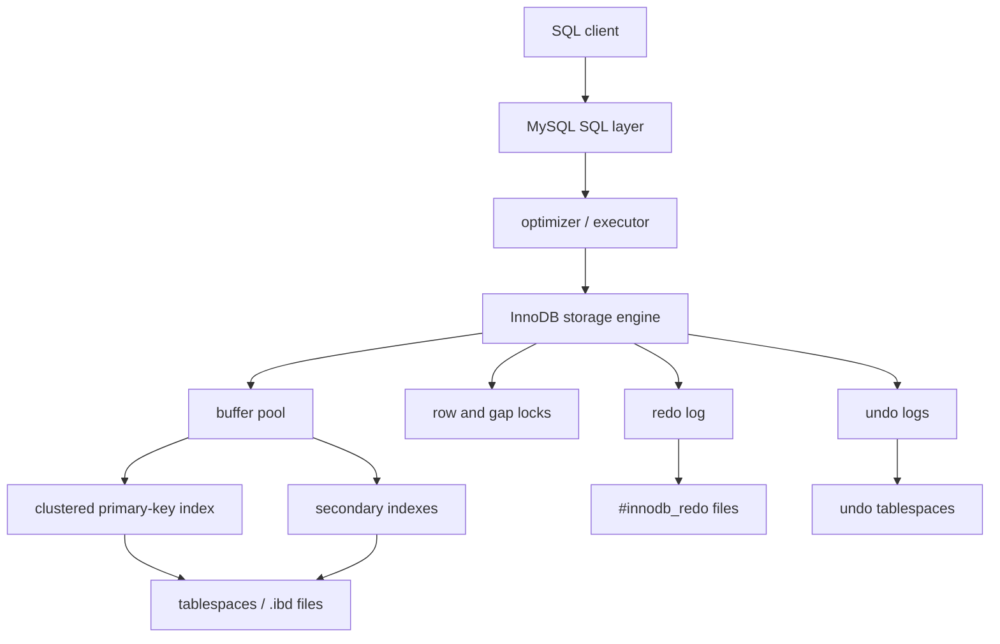

# MySQL / InnoDB Storage Engine

## 1. Problem Background

MySQL is a database server with pluggable storage engines. InnoDB is the default transactional engine because it provides ACID transactions, row-level locking, MVCC, crash recovery, foreign keys, and high-performance indexed access.

The key architectural choice in InnoDB is clustered storage. A table is organized around its primary key. The primary-key B+Tree stores the full row, while secondary indexes store secondary-key values plus the primary-key value needed to find the row in the clustered index.

This is a different philosophy from PostgreSQL. PostgreSQL keeps rows in a heap and stores index entries separately as pointers to heap tuples. InnoDB makes the primary key the physical organization of the table.

## 2. Architecture Overview



| Component | Role |
| --- | --- |
| Buffer pool | Caches data and index pages |
| Clustered index | Primary-key B+Tree containing full row data |
| Secondary indexes | B+Trees whose leaf records include primary-key values |
| Undo logs | Store previous row versions for rollback and consistent reads |
| Redo log | Replays changes after crash before accepting connections |
| Lock manager | Implements record, gap, next-key, and insert-intention locks |
| Doublewrite buffer | Protects against torn page writes |

## 3. Internal Design

### Clustered Indexes

Every InnoDB table has a clustered index. If a primary key exists, it is used as the clustered index. If no primary key exists, InnoDB chooses a suitable unique non-null index or creates a hidden row ID.

The clustered index stores the row data. A lookup by primary key can navigate directly to the leaf page that contains the row. This is why primary-key lookup is extremely efficient.

The cost appears in secondary indexes. A secondary index entry stores the secondary key plus the primary-key columns. If a query needs columns not present in the secondary index, InnoDB uses the primary key from the secondary leaf record to fetch the full row from the clustered index. Long primary keys therefore make every secondary index larger.

### Buffer Pool

InnoDB pages are cached in the buffer pool. The local experiment used a MySQL 9.5.0 server with `innodb_page_size = 16384`, so table and index pages were 16 KB. The buffer pool caches both clustered and secondary index pages because InnoDB indexes are the table structure.

The experiment observed:

```text
Innodb_buffer_pool_reads         905
Innodb_buffer_pool_read_requests 544297
```

Most logical reads were served from memory, which is exactly the point of the buffer pool.

### Undo Logs and MVCC

InnoDB performs MVCC differently from PostgreSQL. Instead of keeping every row version directly as separate heap tuples, InnoDB stores old versions in undo logs. Rows contain transaction metadata, and consistent reads reconstruct older versions when necessary by following undo records.

Undo has two jobs:

1. Roll back a transaction if it aborts.
2. Provide older row versions to transactions that need a consistent snapshot.

This design lets InnoDB update clustered records in place while still supporting MVCC semantics.

### Redo Logs and Crash Recovery

Redo logs describe physical changes needed to recover dirty pages after a crash. In the local experiment, `SHOW ENGINE INNODB STATUS` showed the log sequence number increasing after an update:

```text
before update: Log sequence number 28969273
after update:  Log sequence number 28991177
```

That movement shows the update produced redo information. The buffer pool can delay writing dirty pages because redo can replay the changes during recovery.

### Row-Level Locking and Gap Locks

InnoDB row locks are index-record locks. Even when thinking in rows, the engine is usually locking index entries. At the default `REPEATABLE-READ` isolation level, InnoDB also uses next-key locks in many range operations: a next-key lock is a record lock plus a lock on the gap before it.

Gap locks prevent phantoms by blocking inserts into a locked range. The trade-off is reduced concurrency for range predicates. The local experiment's locking read:

```sql
SELECT *
FROM customers
WHERE customer_id BETWEEN 100 AND 200
FOR UPDATE;
```

used an index range scan on the primary key. Under `REPEATABLE-READ`, this is the kind of access path where next-key locking matters.

## 4. Design Trade-Offs

| Design Choice | Advantage | Limitation |
| --- | --- | --- |
| Clustered primary key | Fast primary-key lookups and locality for nearby keys | Secondary indexes include primary key, so large keys increase storage |
| In-place update with undo | Avoids PostgreSQL-style heap version chains | Undo retention and purge become important |
| Redo logging | Durable commits and crash recovery | Redo capacity and flushing policy affect performance |
| Row and gap locks | Strong isolation and phantom prevention | Range locking can block inserts |
| Buffer pool | Efficient reuse of hot pages | Needs memory sizing and warmup |

### Compared With PostgreSQL

PostgreSQL updates create new heap tuples and later VACUUM removes old versions. InnoDB updates clustered records and uses undo to reconstruct old versions. PostgreSQL secondary indexes point to heap tuple IDs; InnoDB secondary indexes point to primary keys. PostgreSQL avoids making table storage depend on the primary key; InnoDB gains primary-key locality but makes primary-key design more important.

## 5. Experiments / Observations

Run from the repository root:

```bash
./System_Design_Docs/MySQL_InnoDB/experiments/run_experiments.sh
```

The script initializes a temporary MySQL data directory under `.local/mysql-innodb`, starts MySQL on a private Unix socket, loads InnoDB tables, captures metadata/plans/status, writes [EXPERIMENT_RESULTS.md](./EXPERIMENT_RESULTS.md), and shuts the server down.

Key observations:

- MySQL version: `9.5.0`; default engine: `InnoDB`; isolation: `REPEATABLE-READ`.
- InnoDB page size was `16384` bytes.
- `customers` used `PRIMARY (customer_id)`, a unique email index, and two secondary composite indexes.
- The customer table occupied about `1,589,248` bytes of data and `868,352` bytes of indexes.
- The join plan used a nested loop: covering lookup on `idx_city_created`, then lookup on `orders(customer_id, order_date)`.
- The redo log sequence number increased after a small transaction, while checkpoint position stayed behind.

The join plan is especially useful:

```text
Covering index lookup on customers using idx_city_created
Index lookup on orders using idx_orders_customer_date
```

That is InnoDB's clustered-index world in action. The secondary index narrows the search, and primary-key values connect secondary lookups back to clustered records when needed.

## 6. Key Learnings

1. InnoDB table design starts with the primary key because the primary key is the table layout.
2. Secondary indexes are not independent pointers to heap rows; they carry primary-key values.
3. Undo and redo solve different problems: undo supports rollback/snapshots, redo supports crash recovery.
4. Gap and next-key locks protect isolation but can surprise applications that expect range queries not to block inserts.
5. PostgreSQL and InnoDB both implement MVCC, but their physical storage choices lead to different maintenance costs.

## References

- MySQL documentation: [InnoDB Architecture](https://dev.mysql.com/doc/refman/8.4/en/innodb-architecture.html), [Clustered and Secondary Indexes](https://dev.mysql.com/doc/refman/8.4/en/innodb-index-types.html), [InnoDB Multi-Versioning](https://dev.mysql.com/doc/refman/8.4/en/innodb-multi-versioning.html), [Redo Log](https://dev.mysql.com/doc/refman/8.4/en/innodb-redo-log.html), [Undo Logs](https://dev.mysql.com/doc/refman/8.4/en/innodb-undo-logs.html), [InnoDB Locking](https://dev.mysql.com/doc/refman/8.4/en/innodb-locking.html)
