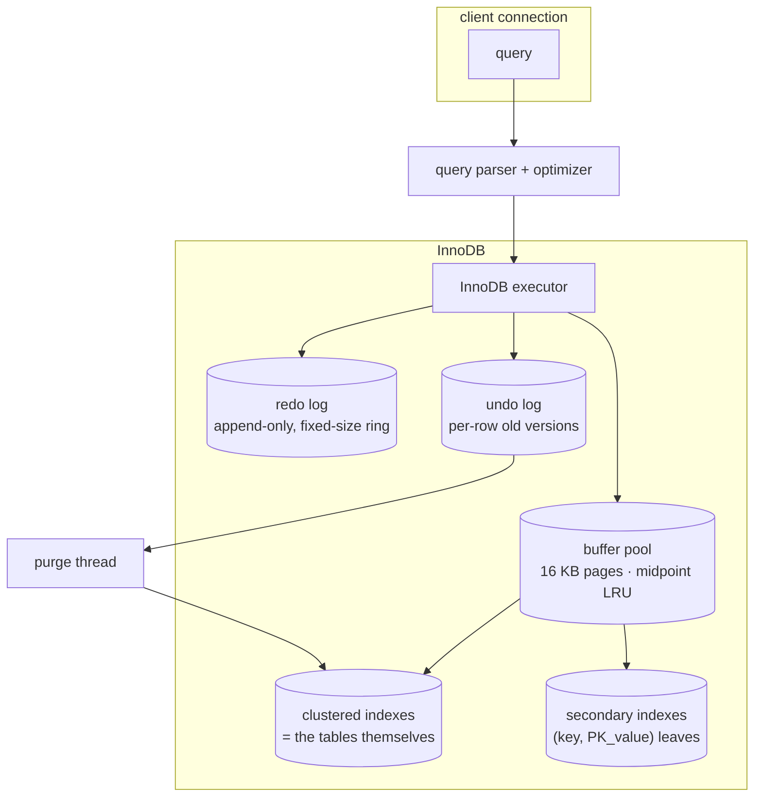

# MySQL / InnoDB

> A clustered-index storage engine — the table IS a B-tree on the primary key. That single decision changes how PK lookups, secondary indexes, undo logs, and gap locking all work. Everything below comes from a fresh `mysql:8` container with the schema in [`setup.sql`](./setup.sql); raw output in [`results.txt`](./results.txt).

## 1. Problem background

InnoDB has to be three things at once:

- **The default storage engine for MySQL** — meaning it's the engine
  most ORMs and web apps assume. Whatever it does is the default
  behaviour millions of services depend on.
- **ACID compliant under high concurrency** — many sessions reading and
  writing the same rows.
- **Predictable for OLTP** — small, point queries, single-row updates,
  and short transactions are the workload it's tuned for.

The clustering choice is the lever it pulls to get all three: PK lookup
is one tree walk, secondary indexes don't need expensive page splits to
maintain row positions, and the same B-tree is the locking unit.

## 2. Architecture overview



| Piece | Job |
|---|---|
| **Buffer pool** | 16 KB page cache. 128 MB default. LRU with a midpoint insert so a one-off seq scan can't trash the cache. |
| **Clustered index** | The table. Leaves contain entire rows. Lookup by PK is a tree walk, no extra hop. |
| **Secondary indexes** | Leaves contain `(secondary_key, primary_key_value)`. To get a non-indexed column you have to "back-reference" into the clustered tree. |
| **Redo log** | Crash-safety. Every page change is logged here before the page is allowed to be flushed. Fixed-size ring; circles back over old (already-checkpointed) records. |
| **Undo log** | MVCC + rollback. The old version of a row lives in undo so any in-progress reader can still see the previous value. |

## 3. Internal design

### 3.1 Clustered index — the table is a B-tree

For our `orders(id INT PK, user_id, product_id, qty, ordered_at)`:

```
                  internal nodes (just keys + child pointers)
                     /       |        \
   leaf:  id=1 …    leaf:  id=K …    leaf:  id=2K …
          row data       row data         row data
```

Every leaf page is a sorted contiguous slab of full row tuples, ordered
by `id`. Walking the tree to `id = 50000` lands directly on the data.
No back-reference, no extra fetch.

In Q1 we ran:

```sql
EXPLAIN FORMAT=TREE SELECT * FROM orders WHERE id = 50000;
```

```
-> Rows fetched before execution  (cost=0..0 rows=1)
```

Cost 0. The optimizer recognises this as a trivial PK lookup and
doesn't even build a real plan.

### 3.2 Secondary index — back-reference, not row pointer

`idx_user (user_id)` is a separate B-tree whose leaves store
`(user_id, id)` pairs. To find all orders for `user_id = 12345`:

1. Walk `idx_user` to the leaf range for `user_id = 12345`.
2. For each `(12345, id)` pair, walk the *clustered* tree to fetch the
   row.

```
-> Index lookup on orders using idx_user (user_id=12345)  (cost=3.5 rows=10)
```

Cost 3.5 — not free, because there's an extra clustered-index probe
per matched row. This is the InnoDB tax compared to a heap-organized
engine like Postgres, where a B-tree leaf already has the heap pointer
in it.

### 3.3 Covering index — skip the clustered tree entirely

If the query only needs columns that are already in the secondary index
(or the PK, which is always there), the engine can serve everything
from the secondary tree. We added an extra `idx_user_qty (user_id, qty)`
for exactly this:

```sql
SELECT user_id, qty FROM orders WHERE user_id = 12345;
```

```
-> Covering index lookup on orders using idx_user_qty (user_id=12345)  (cost=1.25 rows=10)
```

Cost **1.25** — about a third of the cost of Q2 because the back-
reference disappeared.

### 3.4 When the optimizer refuses the index

```sql
EXPLAIN FORMAT=TREE SELECT COUNT(*) FROM orders WHERE qty = 3;
```

```
-> Aggregate: count(0)  (cost=22144 rows=1)
    -> Filter: (orders.qty = 3)  (cost=20143 rows=20007)
        -> Index scan on orders using idx_user_qty  (cost=20143 rows=200070)
```

The optimizer thinks ~20% of rows match (its histogram is a little off
— actual is ~43%). Either way the predicate is way too wide, so it
walks `idx_user_qty` end-to-end (which is *physically the whole table
in user_id order*) and filters. Reading **all** 200,070 estimated rows.
A seek-then-scan over a secondary index would be slower than this scan
plus filter.

### 3.5 Index sizes

From `mysql.innodb_index_stats`:

| Index | Leaf pages × 16 KB |
|---|---|
| `PRIMARY` (the table itself) | **7.7 MB** |
| `idx_user`        | **4.0 MB** |
| `idx_user_qty`    | **4.0 MB** |

The two secondary indexes are about half the size of the clustered
tree, which is expected — secondary leaves carry only the index key
plus the PK value, not the full row.

### 3.6 MVCC via undo logs

InnoDB *does* update in place — but it threads the old version onto an
**undo log** before doing so. Each row's hidden columns are:

```
DB_TRX_ID  — txn id of the last writer
DB_ROLL_PTR — pointer to the prior version in the undo log
```

A reader at snapshot `S` walking the chain says "if `DB_TRX_ID >
S.snapshot_high`, follow `DB_ROLL_PTR` and try again". That's MVCC.

The **purge thread** sweeps undo entries that no live snapshot needs
anymore. While transactions stay open for a long time, undo can't be
purged and grows — `SHOW ENGINE INNODB STATUS` reports it as **History
list length**:

```
TRANSACTIONS
Trx id counter 1870
Purge done for trx's n:o < 1870 undo n:o < 0 state: running but idle
History list length 22
```

Our 22 is tiny. A long-running reporting query left open all night is
how this number hits the millions and the DBA gets paged.

### 3.7 Gap locks — the real shape of REPEATABLE READ

This is the part of InnoDB people get wrong most often. Under
`REPEATABLE READ`, a `SELECT … FOR UPDATE` over a range takes **next-
key locks**: lock the matched row *and* the gap immediately to its
left. Together those tile the entire interval so a concurrent
`INSERT` can't land a phantom row inside it.

We took:

```sql
SELECT id FROM orders WHERE id BETWEEN 100 AND 110 FOR UPDATE;
```

And `performance_schema.data_locks` reported:

```
trx   lock_type  lock_mode      lock_data  index_name
1870  TABLE      IX             NULL       NULL
1870  RECORD     X,REC_NOT_GAP  100        PRIMARY
1870  RECORD     X              101        PRIMARY
1870  RECORD     X              102        PRIMARY
...
1870  RECORD     X              110        PRIMARY
```

Reading this:

- **IX** — table-level intention-exclusive. Blocks `LOCK TABLES … WRITE`.
- **X,REC_NOT_GAP on id=100** — because the predicate **starts at**
  100 inclusive, the gap left-of-100 doesn't matter and InnoDB drops
  it. The lock is record-only.
- **X on id=101..110** — these are **next-key**: the record itself
  *plus* the gap to its left. So `lock_data=101` covers row 101 and
  the gap (100, 101); `lock_data=110` covers row 110 and the gap
  (109, 110). Together they tile the half-open intervals (100,101],
  (101,102], …, (109,110].

Proof: in a second session, `INSERT INTO orders VALUES (105_5, …)`
blocks immediately and times out at `innodb_lock_wait_timeout`
(default 50 s). The same INSERT under `READ COMMITTED` would succeed,
because RC drops the gap halves of the locks — and that's exactly the
phantom-read failure mode RR is designed to block. Full demo in
[`locks.txt`](./locks.txt).

## 4. Trade-offs

| Choice | Cost | Benefit |
|---|---|---|
| Clustered index = table | Secondary lookups pay a back-reference; PK changes are expensive (whole row moves) | PK lookup is free; range scans on PK are sequential I/O |
| Update in place + undo log | Long-running transactions hold history; purge has to keep up | Smaller live dataset; no `VACUUM` needed; tight space amp |
| Next-key locks on RR | "phantom" semantics extend to gaps → unintuitive INSERT failures | Real serializable-ish behaviour without a SERIALIZABLE-level cost |
| Fixed-size redo log ring | Crash recovery is bounded; can't grow unbounded | One more knob (`innodb_log_file_size`) to size correctly |
| 16 KB pages | Larger than Postgres → more wasted on small rows, but fewer pages | Better for SSD page IO; bigger fanout on B-tree |

## 5. Experiments / observations

Query plans, cost estimates, and timings from running
[`queries.sql`](./queries.sql) against the populated DB.

| Query | Plan | Cost | Why |
|---|---|---|---|
| PK lookup `id = 50000` | trivial — single B-tree walk | **0** | clustered index |
| Secondary `user_id = 12345` | `idx_user` then back-reference | **3.5** | 10 matched rows, 10 clustered probes |
| Covering `user_id=…, qty=…` | `idx_user_qty` only | **1.25** | no clustered fetch |
| Wide predicate `qty = 3` | full index scan + filter | **22,144** | optimizer chose secondary scan because it's narrower per page |
| 3-way join (IN-country) | nested loop, country covering idx outer | **28,475** | 4,000 IN users × 10 orders each × 1 product lookup |

| Bookkeeping | Value |
|---|---|
| Buffer pool pages (`pool_size`) | 8,191 (~128 MB) |
| Database pages in use | 2,489 |
| Free buffers | 5,613 |
| PRIMARY (clustered) size | ~7.7 MB |
| Secondary indexes | ~4.0 MB each |
| History list length (idle) | 22 |

## 6. Key learnings

- **Clustered index is a fork in the road.** Postgres heap-organized
  vs InnoDB clustered isn't a small difference — it changes which
  operations are cheap (PK lookup vs heap insert), and forces secondary
  indexes to carry the PK value as the back-reference. Once you see
  this, you stop arguing about which one is "faster" and start
  arguing about which trade-off fits your workload.
- **Covering indexes are real, not a buzzword.** The 3.5 → 1.25 cost
  drop on the same query just by adding (user_id, qty) is exactly the
  back-reference disappearing.
- **The optimizer reads statistics, not rows.** It thought `qty = 3`
  was 20% selective when actually it's 43%. Either way it correctly
  refused the index — but the lesson is that out-of-date `ANALYZE`
  stats can flip a plan in production.
- **Gap locks are the silent killer.** "Why does this INSERT block on
  a row that doesn't exist yet?" → because someone two desks over has
  an open `SELECT … FOR UPDATE` on a range that includes the gap.
  Visible in `performance_schema.data_locks`, invisible in `SHOW
  PROCESSLIST`.
- **History list length is the canary.** A growing HLL means undo is
  not being purged, which means at least one transaction has been open
  too long. Worth a Grafana panel.
