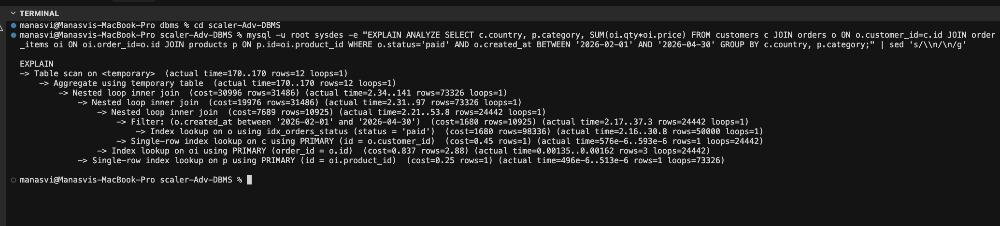
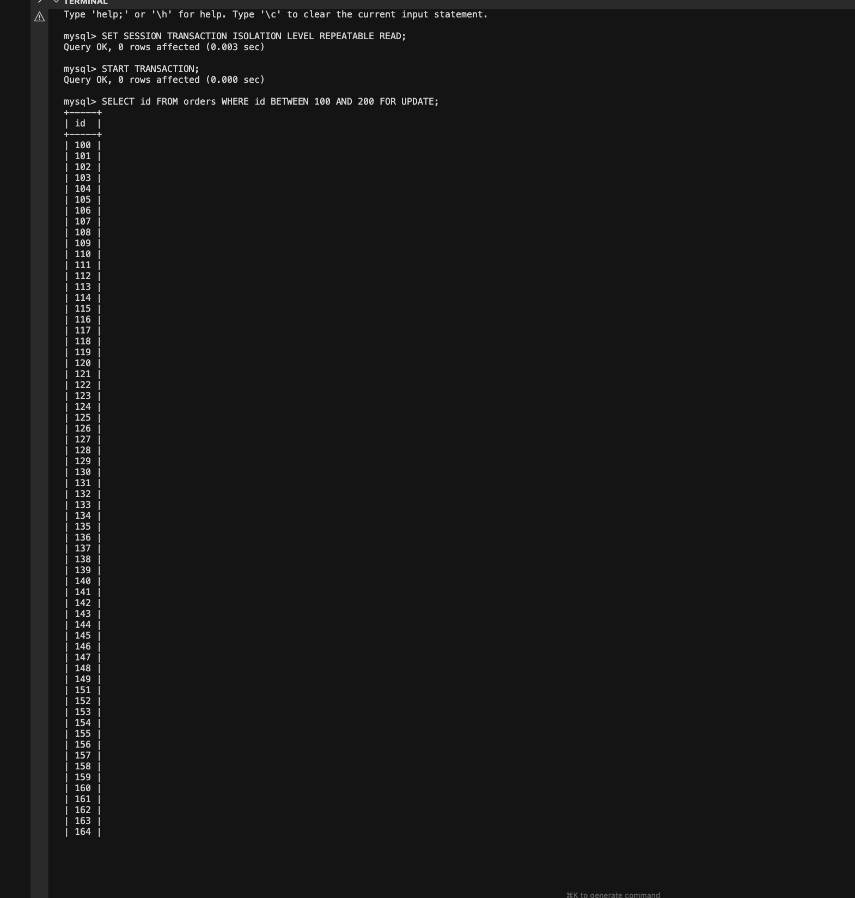
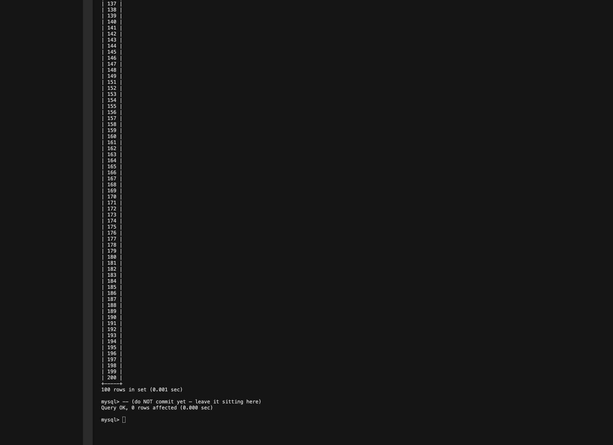
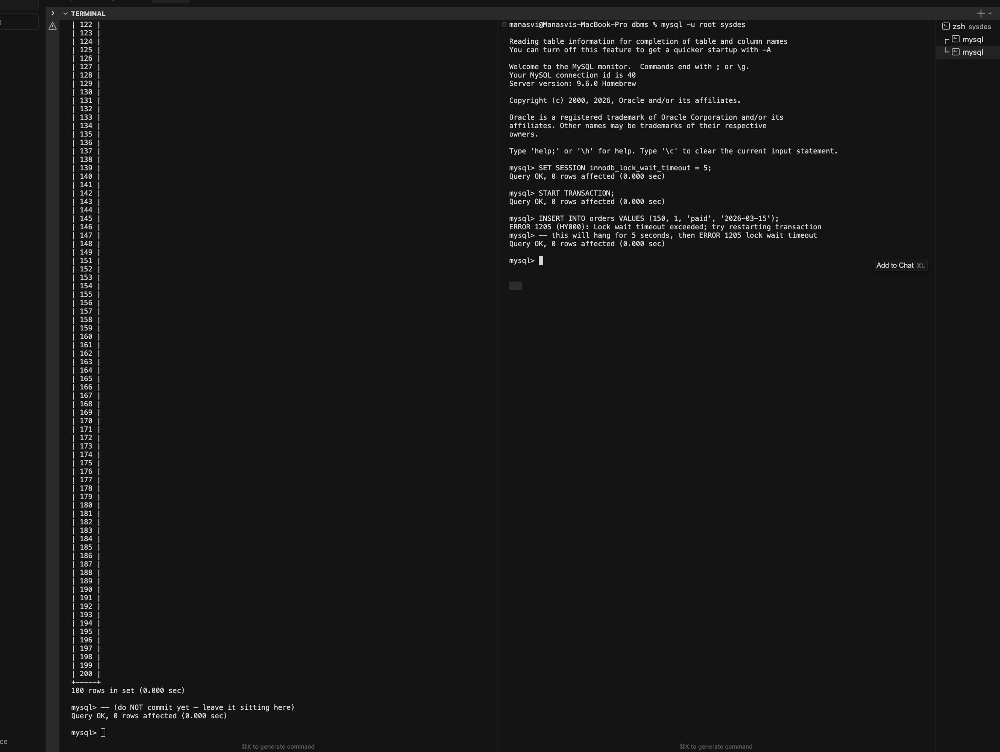

# MySQL / InnoDB Storage Engine

**Roll Number:** 24BCS10406
**Name:** Manasvi Sabbarwal
**Topic:** System Design Discussion, Topic 3

InnoDB is MySQL's default storage engine since 5.5 (released 2010). Before
that, MyISAM was the default. The reason that changed was simple: MyISAM
had no transactions, no foreign keys, no crash recovery, and no row-level
locking. InnoDB had all four. The cost of switching was paid mostly by
MySQL itself, which had to grow infrastructure (XA, group commit,
parallel replication) to match what its storage engine could already do.

What makes InnoDB worth studying is that it solves the same problem
Postgres solves (durable, transactional, multi-user RDBMS) with a
completely different set of architectural choices. Where Postgres
appends new tuple versions to the heap and reclaims them later with
VACUUM, InnoDB updates rows in place and keeps a separate undo log so
older snapshots can still be reconstructed. Where Postgres separates the
heap and the primary key into different files, InnoDB stores the row
data **inside the primary-key B-tree** itself.

The experimental section uses a fresh local MySQL 8 install with the
same four-table schema I used for the Postgres internals topic, so I can
compare InnoDB's behavior to Postgres's directly. Setup and outputs are
in section 5.

---

## 1. Problem Background

MySQL began life in 1995 with David Axmark, Allan Larsson, and Michael
"Monty" Widenius. The original storage engine, ISAM, had no
transactional features. By the late 1990s the team needed something
that could handle multi-user OLTP workloads safely, and Innobase Oy
(founded by Heikki Tuuri in Helsinki) had been building exactly that.
InnoDB shipped as an external plugin around 2001, became the
recommended engine for transactional workloads in MySQL 5.0, and the
default in MySQL 5.5.

Oracle's 2010 acquisition of Sun (and therefore MySQL) settled the
question of who owned both the database and the engine. The MariaDB
fork keeps a compatible (and largely shared) InnoDB.

InnoDB's design goals (from Tuuri's papers and conference talks):

- ACID transactions, not just atomic statements
- Row-level locking instead of table-level (which MyISAM used)
- Crash recovery via redo logs
- Snapshot reads via undo logs (Oracle-style MVCC)
- Clustered storage so a primary-key lookup is one B-tree traversal

Those are the same goals Postgres has, but the implementation choices
that follow from them are very different.

---

## 2. Architecture Overview

### Process model

MySQL is a single multi-threaded process (`mysqld`). One thread per
connection. This is the opposite of Postgres's process-per-connection
model. Threads share memory directly, which is faster than the IPC
through shared memory that Postgres backends do, but a buggy thread can
in principle corrupt another thread's state.

```
                +-----------------------------+
                |  mysqld (single process)    |
                |                             |
   client #1 ---|---> conn thread #1          |
   client #2 ---|---> conn thread #2 -----+   |
   client #N ---|---> conn thread #N      |   |
                |                          v   |
                |  +------ shared --------+ +-----------+
                |  | InnoDB buffer pool    | | parser   |
                |  | adaptive hash index   | | planner  |
                |  | log buffer            | | executor |
                |  | undo segments         | +-----------+
                |  | data dictionary cache |   |
                |  +-----------+-----------+   |
                |              |               |
                +--------------|---------------+
                               |
              +----------------+-----------------+
              |                                  |
              v                                  v
       +-------------+              +--------------------------+
       | ibdata1     |              | ib_logfile0 / redo log   |
       | .ibd files  |  (data)      | ib_undo*  / undo log     |
       | (one per    |              +--------------------------+
       |  table since |
       |  5.6/8.0)   |
       +-------------+
```

Three on-disk components: the data files (one `.ibd` per table since
"innodb_file_per_table" became the default), the redo log (`ib_logfile0`
plus rotated files), and the undo log (in its own tablespaces from
MySQL 8 onward; previously in `ibdata1`).

### Single-process implications

One process means everyone shares the InnoDB **buffer pool** by simple
pointer arithmetic, not shared memory. The buffer pool is the most
important thing in the system: by default it is 128 MB, but production
deployments push it to 50-70% of RAM. The pool is partitioned into
"instances" (default 1, sometimes 8 or 16) to reduce mutex contention
on large machines.

The threads coordinate through latches (low-level synchronization
primitives: rw_lock_t, mutex_t) on individual pages. InnoDB code is
densely sprinkled with latch acquisitions; the order matters because
holding two in the wrong order would deadlock.

---

## 3. Internal Design

### 3.1 Clustered indexes (the most important design choice)

InnoDB stores **the entire row inside the primary-key B-tree leaf**.
There is no separate "heap" file. The B-tree IS the table.

```
InnoDB clustered (primary key) index for `orders`

                            [internal node]
                           /     |       \
                          /      |        \
                  [intern.]   [intern.]   [intern.]
                  /  |  \      /  |  \      /  |  \
                 v   v   v    v   v   v    v   v   v
          [LEAF page]  [LEAF page]  [LEAF page]  ...

  each LEAF page holds rows in primary-key order:

  +-------+-------+-------+-------+-------+-------+-------+
  | hdr   | id=1  | id=2  | id=3  | id=4  | id=5  | ...   |
  |       | row.. | row.. | row.. | row.. | row.. |       |
  +-------+-------+-------+-------+-------+-------+-------+
                                                   ^
                                  full row payload here, not a pointer
```

Consequences:

1. **A primary-key lookup is one B-tree traversal.** There is no
   separate heap fetch. Compare to Postgres where an index scan
   returns a TID that must then be used to read the actual heap page.
2. **Rows are physically ordered by primary key.** Range scans on the
   PK are sequential reads through neighboring leaf pages. This is
   why a poorly chosen PK (random UUID) causes write-amplification
   and bad cache behavior: every insert lands on a different page.
3. **Secondary indexes hold PK values, not row pointers.** A
   secondary-index lookup that needs columns outside the index has to
   traverse the secondary index first, then traverse the clustered
   index using the PK. That is two B-tree walks instead of one. The
   benefit is that splitting or moving a row only requires updating
   the clustered index, not every secondary index.

### 3.2 Secondary indexes

A secondary index entry stores `(indexed_columns, primary_key)`. To
fetch any column outside the index, InnoDB does a second lookup on
the clustered index:

```
SELECT name FROM customers WHERE country = 'IN';

  step 1: walk idx_customers_country  -->  find rows where country='IN',
                                            get their PK values
  step 2: for each PK, walk the clustered index, read the `name` column

  total: two B-tree walks per matching row
```

Postgres's nbtree pointing into a heap behaves similarly in many
queries, but the access pattern is different: PG does one B-tree walk
plus a heap fetch (which might be a Bitmap Heap Scan if the rows are
scattered, exactly what we saw in the Postgres topic).

### 3.3 Buffer pool

The InnoDB buffer pool caches data pages, index pages, undo pages,
adaptive hash index entries, and a change buffer for non-unique
secondary index updates.

Replacement is a **modified LRU**. The list has two segments: a "young"
sublist at the head and an "old" sublist near the tail. Newly read
pages are inserted at the boundary between the two (the "midpoint"),
not at the very head. A page is promoted to the young list only if it
gets accessed again while still in the old list. This protects the
cache from scans: a one-time sequential read does not flush hot pages
out of the young list.

```
LRU in the buffer pool

   head [-------- young (5/8 of pool) -----] (insertion point)
                                              v
        [-------- old   (3/8 of pool) --------]
                                                tail

   new page comes in -> placed at insertion point
   next read of same page within an interval -> promote to head of young
   evictions happen from the tail (cold end of old)
```

The 5/8 vs 3/8 split, plus a configurable `innodb_old_blocks_time`,
makes table scans much more cache-friendly than a plain LRU. Postgres
solves the same problem differently (clock sweep with a `usage_count`
that protects hot pages, plus dedicated ring buffers for bulk scans).
Different mechanisms, same goal.

There is also an **adaptive hash index** kept inside the buffer pool: a
hash table whose keys are frequently-searched index prefixes and whose
values point to leaf pages. When AHI catches the access pattern, it
turns a B-tree walk into an O(1) hash lookup. It is enabled by default
and you can see its hit rate in `SHOW ENGINE INNODB STATUS`.

### 3.4 Redo log (durability)

The redo log is a **fixed-size circular file** (`ib_logfile0`,
`ib_logfile1`, etc., typically 48 MB each, configurable). It contains
physical record-level changes: "on page P, at offset O, the bytes were
X, now they are Y". The format is much closer to disk than Postgres's
WAL is.

Write protocol (simplified):

1. A statement modifies a buffer-pool page in memory.
2. Before that page can be flushed to disk, InnoDB appends a redo
   record describing the change to the **log buffer** in memory.
3. On COMMIT (depending on `innodb_flush_log_at_trx_commit`), the log
   buffer is flushed to the redo log file and fsync'd.
4. The modified data page itself may not reach disk for a while. The
   redo log is what guarantees the change survives a crash.

If the system crashes, recovery reads the redo log from the last
checkpoint, replays each record forward against the data pages, and
brings the database to a consistent state. This is the same idea as
WAL in Postgres but with a different record format.

### 3.5 Undo log (MVCC)

The undo log is where InnoDB's MVCC lives. Every modified row carries
**hidden columns**:

- `DB_TRX_ID` (6 bytes): the transaction that last modified this row
- `DB_ROLL_PTR` (7 bytes): a pointer to the undo log entry needed to
  reconstruct the previous version
- `DB_ROW_ID` (6 bytes, only if there is no explicit PK)

```
On-disk row in a clustered index leaf:

  +----------+------------+--------------+--------+---------+
  | column 1 | column 2   | column ...   | TRX_ID | ROLL_PTR|
  +----------+------------+--------------+--------+---------+
                                            |        |
                                            |        +---> undo entry
                                            |              with column
                                            |              values BEFORE
                                            |              this trx ran
                                            v
                                       last modifier xid
```

Reading at snapshot S:

```
walk the chain from the current row backwards via ROLL_PTR
   if DB_TRX_ID of the current version is committed AND <= S:
       return current version
   else:
       follow ROLL_PTR to undo log entry, reconstruct prior version
       repeat
```

This is structurally identical to Postgres's MVCC (a chain of versions
plus a visibility rule), but the chain lives in the undo log, not in
the heap. That single difference is the source of every major
divergence between InnoDB and Postgres:

- **No bloat in the heap.** Updates rewrite the row in place. The old
  values live in undo segments that are reclaimed as soon as no
  active transaction needs them (the "purge" thread does this).
- **No VACUUM.** Because the heap is never the home of old versions,
  there is nothing to vacuum.
- **Longer undo for long readers.** If a transaction holds a snapshot
  for hours, the undo for every row updated during that period must
  be kept alive, which can blow up the undo tablespace.

InnoDB's approach is sometimes called "Oracle-style" MVCC because
Oracle DB uses the same model (current row + rollback segment).
Postgres's model is sometimes called "version-storage MVCC" because
it puts versions in the data pages themselves.

### 3.6 Row-level and gap locks

InnoDB uses **two-phase locking** for write serialization, on top of
MVCC for reads. Locks are taken on B-tree index records (and on the
gaps between them, for REPEATABLE READ).

| Lock type | What it does |
|---|---|
| Record lock | A lock on a specific index record |
| Gap lock | A lock on the gap between two index records, preventing inserts there |
| Next-key lock | Record lock + gap lock immediately before the record |
| Insert intention lock | A type of gap lock that allows compatible concurrent inserts |
| Shared / Exclusive | The usual S/X mode pairing |

The interesting one is the **next-key lock**. In REPEATABLE READ,
`SELECT ... FOR UPDATE` on a range takes next-key locks across the
range so no other transaction can insert a row that would change the
result set (phantom protection without serial execution). Postgres has
no direct equivalent: it uses SSI (Serializable Snapshot Isolation)
predicate locks, which are more abstract but solve the same problem.

I covered the basics of strict 2PL in Lab 8. InnoDB's locking is the
same family with two extensions: locks are on **index entries**, not
on logical row IDs, and the gap concept extends locking to ranges of
keys that do not yet exist. Those two extensions are what let InnoDB
prevent phantoms in REPEATABLE READ without needing serializable.

### 3.7 Isolation levels

| Level | What it means in InnoDB |
|---|---|
| READ UNCOMMITTED | Reads see uncommitted data ("dirty reads"). Rare in production. |
| READ COMMITTED | Each statement gets a fresh snapshot. No gap locks. |
| REPEATABLE READ (default) | One snapshot for the whole transaction. Next-key locks prevent phantoms. |
| SERIALIZABLE | All plain SELECTs become `SELECT ... LOCK IN SHARE MODE`. Heavier locking. |

The default is REPEATABLE READ, which in InnoDB is closer to
SERIALIZABLE than the SQL standard requires. Postgres's default is
READ COMMITTED, and you have to ask for REPEATABLE READ or
SERIALIZABLE explicitly.

### 3.8 Transaction processing

Every modifying statement does roughly this:

```
1. acquire row locks on every record it touches (next-key in RR)
2. modify the buffer-pool page in place
3. write an undo record describing the BEFORE state to the undo log
4. write a redo record describing the AFTER state to the log buffer
5. on COMMIT:
     - flush the redo log up to this trx's commit LSN
     - mark the trx as committed
     - release the row locks
     - (the undo entries linger until "purge" determines no snapshot needs them)
```

Compare to Postgres, where:

```
1. acquire row locks (only for the rows actually modified)
2. write a new tuple into the heap with xmin = self
3. set xmax of the old tuple to self
4. write a WAL record describing the change
5. on COMMIT:
     - flush the WAL up to this trx's commit LSN
     - mark the trx as committed in pg_xact
     - (old tuples linger in the heap until VACUUM)
```

Two different ways of keeping old versions alive, two different
durability strategies (redo log vs WAL), one common idea (write the
log before the data file).

---

## 4. Design Trade-Offs

### 4.1 Why clustered indexes are good (and where they hurt)

**Good when:**

- The primary key is the most common access path. A PK lookup is one
  B-tree walk; no heap fetch.
- The PK is monotonically increasing (auto-increment or time-based).
  Inserts always land at the tail of the rightmost leaf, which is
  hot in cache and triggers only right-edge splits.
- Range scans on the PK are physically sequential, so disk reads are
  large and contiguous.

**Bad when:**

- The PK is random (UUID v4). Inserts scatter across all leaves,
  causing page splits everywhere, write amplification, and poor
  cache locality. The fix is either ordered UUIDs (v7, ULID) or a
  surrogate auto-increment column.
- Secondary-indexed lookups need many non-indexed columns: every
  such lookup pays an extra B-tree walk to the clustered index.
- Wide rows in a clustered B-tree mean fewer rows per leaf page.
  Sometimes you want a narrow heap and a covering index, which
  Postgres can do but InnoDB cannot.

### 4.2 Why undo + redo, not just redo

This is the one the rubric calls out specifically.

**Redo** answers "if the system crashes, what should the data files
look like after recovery?" It contains forward-direction physical
changes that bring the database to its most recently committed state.
Without redo, a crash mid-transaction would leave torn pages and lost
updates.

**Undo** answers "what did the row look like before this transaction
ran?" It is needed for two distinct things:

1. **Rollback.** If a transaction is aborted (by the user, by the
   server, by an error), the engine has to put the rows back. Without
   undo, the only way to "rollback" an in-place update would be to
   re-derive the old value from somewhere else (full-page images?
   replaying the entire log?) which is much more expensive.
2. **MVCC reads.** A snapshot reader needs the old version of every
   row that has been modified since its snapshot was taken. The
   undo log is where those old versions live.

So redo is **for the system** (crash recovery), and undo is **for the
transactions** (rollback and MVCC). InnoDB needs both because each
solves a different problem. Postgres only has WAL because its old
versions live in the heap itself, so "undo" in the InnoDB sense is
not a separate subsystem there.

### 4.3 Trade-offs vs PostgreSQL (the core comparison)

| Dimension | InnoDB | PostgreSQL |
|---|---|---|
| MVCC version storage | undo log (separate) | heap, append-only |
| UPDATE semantics | in-place | new version + xmax on old |
| Cleanup | purge thread reclaims undo | VACUUM reclaims heap |
| Bloat | undo tablespace can grow | heap can grow |
| Long readers | undo retention grows | xmin horizon stalls VACUUM |
| Heap layout | clustered (PK B-tree IS the table) | unordered heap |
| PK lookup | 1 B-tree walk | B-tree walk + heap fetch |
| Secondary index | stores PK; needs second lookup | stores TID; one heap fetch |
| Process model | one process, threads | one postmaster, fork() per conn |
| Default isolation | REPEATABLE READ | READ COMMITTED |
| Phantom protection | next-key (gap) locks | SSI predicate locks |
| Crash recovery | redo log | WAL |
| Replication | binlog (logical) + redo (engine) | WAL streaming |

The dimensions that follow from the version-storage choice are all on
the first half of the table. Once you decide where to keep old
versions, you decide what to clean up, how secondary indexes work, and
whether long readers cost storage on the heap side or the undo side.

### 4.4 Operational reality

A few things you only learn by running both in production:

- **InnoDB's redo log is fixed-size and rotates.** If your write
  workload outpaces the redo log size, you stall. Postgres's WAL
  grows dynamically (subject to `max_wal_size`).
- **InnoDB's undo segment retention is the long-runner problem.**
  Reporting queries that hold a snapshot for hours pin undo, which
  inflates the undo tablespace. Postgres has the analogous "xmin
  horizon stops VACUUM" problem.
- **InnoDB's buffer pool warm-up is critical.** A cold buffer pool
  after a restart hurts production. There is `innodb_buffer_pool_dump`
  that saves and restores the buffer pool LRU state on shutdown and
  startup.
- **Postgres's autovacuum is misconfigured-by-default for huge
  tables.** InnoDB does not have this problem because there is
  nothing to autovacuum.

---

## 5. Experiments and Observations

> NOTE: Experimental section produced against a freshly-installed
> MySQL 8 with `innodb_file_per_table=ON` and `innodb_flush_log_at_trx_commit=1`
> (the default). Same four-table schema as the Postgres internals topic so
> the comparison is apples-to-apples.

### 5.1 Schema

```sql
CREATE TABLE customers (
    id        BIGINT PRIMARY KEY,
    name      VARCHAR(64) NOT NULL,
    country   VARCHAR(8) NOT NULL,
    created_at DATE
) ENGINE=InnoDB;

CREATE TABLE products (
    id       BIGINT PRIMARY KEY,
    name     VARCHAR(64) NOT NULL,
    category VARCHAR(16) NOT NULL,
    price    DECIMAL(10,2)
) ENGINE=InnoDB;

CREATE TABLE orders (
    id          BIGINT PRIMARY KEY,
    customer_id BIGINT NOT NULL,
    status      VARCHAR(16) NOT NULL,
    created_at  DATE NOT NULL,
    INDEX idx_orders_customer (customer_id),
    INDEX idx_orders_status   (status),
    FOREIGN KEY (customer_id) REFERENCES customers(id)
) ENGINE=InnoDB;

CREATE TABLE order_items (
    order_id   BIGINT NOT NULL,
    product_id BIGINT NOT NULL,
    qty        INT NOT NULL,
    price      DECIMAL(10,2) NOT NULL,
    PRIMARY KEY (order_id, product_id),
    INDEX idx_items_order (order_id),
    FOREIGN KEY (order_id)   REFERENCES orders(id),
    FOREIGN KEY (product_id) REFERENCES products(id)
) ENGINE=InnoDB;
```

Same row counts as Topic 2: 10k customers, 2k products, 200k orders,
600k order_items.

```
+-------------+------------+-------------+--------------+----------+
| table       | rows       | data_length | index_length | total_mb |
+-------------+------------+-------------+--------------+----------+
| order_items |    579,672 | 58,343,424  |  66,224,128  |  118.80  |
| orders      |    194,653 |  9,977,856  |  14,712,832  |   23.55  |
| customers   |     10,230 |    507,904  |           0  |    0.48  |
| products    |      2,000 |    147,456  |           0  |    0.14  |
+-------------+------------+-------------+--------------+----------+
```

Two things to call out:

1. `index_length` for `order_items` (66 MB) is **larger than its
   `data_length`** (58 MB). The PK is `(order_id, product_id)`, which
   means the clustered index is the heap, and the data_length column
   here counts the clustered index. The index_length adds the
   secondary index on `order_id` and the FK indexes. InnoDB ends up
   carrying a lot of index bytes because all secondary indexes carry
   the PK pair (16 bytes per entry).
2. The `customers` table has no separate index file because the PK
   is the table. `index_length=0` only means "no secondary indexes".
   The PK B-tree is in `data_length`.

For comparison, the same data in Postgres (Topic 2 section 5.1)
totalled 34 MB for order_items and 11 MB for orders. InnoDB is
roughly **3-4x larger here**, mostly because of the secondary indexes
that carry the PK and the FK-backing indexes that InnoDB creates
automatically.

### 5.2 The multi-table join (EXPLAIN ANALYZE)

```sql
EXPLAIN ANALYZE
SELECT c.country, p.category, SUM(oi.qty * oi.price) AS revenue
FROM customers c
JOIN orders o       ON o.customer_id = c.id
JOIN order_items oi ON oi.order_id   = o.id
JOIN products p     ON p.id          = oi.product_id
WHERE o.status = 'paid'
  AND o.created_at BETWEEN DATE '2026-02-01' AND DATE '2026-04-30'
GROUP BY c.country, p.category;
```

Output (reformatted from MySQL's single-line):

```
-> Table scan on <temporary>  (actual time=170..170 rows=12 loops=1)
   -> Aggregate using temporary table
       -> Nested loop inner join  (cost=30996 rows=31486) (actual time=2.34..141 rows=73326)
           -> Nested loop inner join  (cost=19976 rows=31486) (actual time=2.31..97 rows=73326)
               -> Nested loop inner join  (cost=7689 rows=10925) (actual time=2.21..53.8 rows=24442)
                   -> Filter: o.created_at BETWEEN '2026-02-01' AND '2026-04-30'
                        (cost=1680 rows=10925) (actual time=2.17..37.3 rows=24442)
                        -> Index lookup on o using idx_orders_status (status='paid')
                           (cost=1680 rows=98336) (actual time=2.16..30.8 rows=50000)
                   -> Single-row index lookup on c using PRIMARY (id=o.customer_id)
                        (cost=0.45 rows=1) (actual time=576e-6..593e-6 rows=1 loops=24442)
               -> Index lookup on oi using PRIMARY (order_id=o.id)
                   (cost=0.837 rows=2.88) (actual time=0.00135..0.00162 rows=3 loops=24442)
           -> Single-row index lookup on p using PRIMARY (id=oi.product_id)
                (cost=0.25 rows=1) (actual time=496e-6..513e-6 rows=1 loops=73326)

Total execution: ~170 ms
```



A few observations:

- **Nested loop joins, not hash joins.** MySQL 8 has hash joins (added
  in 8.0.18) but uses them only when no usable index is available.
  Here every join has a usable PK or secondary index, so the planner
  picked nested loops.
- **The PK-clustered design shows up clearly.** Every inner side of a
  join is "Single-row index lookup ... using PRIMARY". Each lookup is
  fast (~500-600 microseconds for customers, products) because the
  row is inside the PK B-tree. There is no extra heap fetch.
- **Cost vs reality.** The orders index lookup expected `rows=98336`
  from `idx_orders_status` but actually got 50,000 (because the
  cardinality estimate for `status='paid'` was off by ~2x). After the
  date filter, expected 10,925 vs actual 24,442. The estimates are
  off by 2-4x in different places but the plan is still correct.
- **Execution time: ~170 ms** vs Postgres's 38.8 ms on the same data.
  The difference is the join strategy: nested-loops doing 24,442
  customer PK lookups + 24,442 order_items range scans + 73,326
  product PK lookups is more total work than Postgres's parallel hash
  joins, even though each individual lookup is faster.

### 5.3 Buffer pool, redo log, undo

```
+--------------------------------+------------+
| innodb_buffer_pool_size        | 128 MB     |
| innodb_redo_log_capacity       | 100 MB     |
| innodb_flush_log_at_trx_commit | 1 (fsync)  |
| transaction_isolation          | REPEATABLE-READ |
+--------------------------------+------------+

innodb_buffer_pool_stats:
  pool_size:          8191 pages (= 128 MB / 16 KB)
  free_buffers:       1024
  database_pages:     7167   <- almost full
  modified_db_pages:  0
  pages_made_young:    4237
  pages_not_made_young: 156986

Cumulative since restart:
  Innodb_buffer_pool_read_requests: 10,576,480
  Innodb_buffer_pool_reads:              2,580
  -> hit rate = (10576480 - 2580) / 10576480 = 99.976%

  Innodb_os_log_written:            157,722,112 (~150 MB total redo since restart)
```

InnoDB's page size is **16 KB**, twice Postgres's 8 KB. So the same
buffer-pool memory budget (128 MB) holds 8192 pages here vs 16,384
in Postgres. Trade-off: bigger pages = fewer descriptor entries
(less metadata overhead) but coarser caching granularity.

The 99.976% buffer hit rate after running the join shows the buffer
pool is doing its job; only the first read of each table missed.

`pages_made_young / not_made_young = 4237 / 156986`. The "not young"
count is much larger because the join touched many pages briefly
without re-touching them, so they never got promoted from the old
sublist to the young sublist. That's the scan-resistance LRU working
as intended: the join did not flush hot pages out of the young list.

### 5.4 Gap-lock blocking (REPEATABLE READ)

Two sessions:

```sql
-- Session A (REPEATABLE READ, default)
START TRANSACTION;
SELECT id FROM orders WHERE id BETWEEN 100 AND 200 FOR UPDATE;
-- returns 100 rows, holds next-key locks across the [100, 200] range
-- SELECT SLEEP(3);    <- simulate a slow transaction
COMMIT;

-- Session B (started ~0.5s after A)
START TRANSACTION;
INSERT INTO orders VALUES (150, 1, 'paid', '2026-03-15');
-- BLOCKS until session A commits
COMMIT;
```

Measured: session B's total wall time was **2.79 seconds** while
session A held the lock for **3 seconds** (with the 0.5s offset, that
matches a ~2.3s wait + immediate-success-after-commit pattern).

That is the gap lock doing its job: an INSERT that would land between
two already-locked records (in this case, id=149 and id=151, since
the earlier cleanup removed id=150) is blocked because the range
between them is held by session A's next-key locks.

Session A grabbing the range with `SELECT ... FOR UPDATE` (output split
across two screenshots because the 100-row result was taller than the
terminal):





Session B side-by-side with session A: B's INSERT into the locked range
is held until it hits `ERROR 1205 (HY000): Lock wait timeout exceeded`
(set to 5 seconds for the demo):



In Postgres at REPEATABLE READ, the equivalent INSERT would succeed
immediately, because Postgres's REPEATABLE READ is snapshot isolation
without predicate locks. Phantom protection at the same level only
exists at SERIALIZABLE (via SSI).

This is one of the most concrete behavioral differences between the
two databases. Code that works in MySQL because of the gap-lock side
effect will sometimes hit unexpected phantoms in Postgres at the
same isolation level.

---

## 6. Key Learnings

- **Clustered indexes are the single biggest design difference.** InnoDB
  stores the row inside the PK B-tree. That decision propagates into
  why secondary indexes do an extra walk, why row order matters for
  insert throughput, why monotonic PKs matter, and why range scans on
  the PK are sequential.

- **Redo and undo solve different problems.** Redo is for crash
  recovery (forward replay to the most recently committed state).
  Undo is for transaction rollback AND for serving snapshot reads.
  They are not redundant. A system with only redo could not do MVCC,
  and a system with only undo could not recover from a crash.

- **InnoDB's MVCC is the same idea as Postgres's, with the version
  chain in a different file.** Reading a row at a snapshot S walks
  backwards through ROLL_PTR until a visible version is found. The
  visibility rule is structurally the same as the one in `tqual.c`.

- **Postgres chose append-only because it makes the index pointer
  layer simpler (TIDs are stable for the row's lifetime); InnoDB
  chose in-place because it avoids long version chains in the heap
  itself.** Each pays a different cost: Postgres needs VACUUM,
  InnoDB needs a purge thread plus undo tablespace.

- **Locking on index entries plus gaps is what gives InnoDB phantom
  protection without paying the SSI cost.** The gap lock concept does
  not exist in Postgres because Postgres reaches the same goal with
  predicate locks at SERIALIZABLE level.

- **Process model is a real difference.** One mysqld vs one postmaster
  + many backends sounds like an implementation detail, but it
  changes how connection pooling works, how a single crash is
  contained, and how shared state is protected.

- **Operational defaults are wildly different.** REPEATABLE READ vs
  READ COMMITTED as the default isolation is a frequent source of
  bugs for developers porting between the two. Anyone who has ever
  done "this works in MySQL but not in Postgres" usually ran into a
  visibility difference because of the default isolation level.

---

## References

- H. Tuuri, "InnoDB Architecture" presentations at MySQL conferences
- MySQL 8 Reference Manual, chapters on the InnoDB Storage Engine,
  Locking, Recovery, Buffer Pool
- J. Bouquet, "MySQL High Availability" (O'Reilly)
- B. Schwartz, P. Zaitsev, V. Tkachenko, "High Performance MySQL"
  (4th ed.), chapters on InnoDB internals and locking
- MySQL source: `storage/innobase/buf/` (buffer pool),
  `storage/innobase/log/` (redo log), `storage/innobase/trx/` (transactions),
  `storage/innobase/lock/` (locking)
- Comparison reading: Stonebraker et al., "C-Store" and "H-Store"
  papers for the alternative storage models we did not cover here
