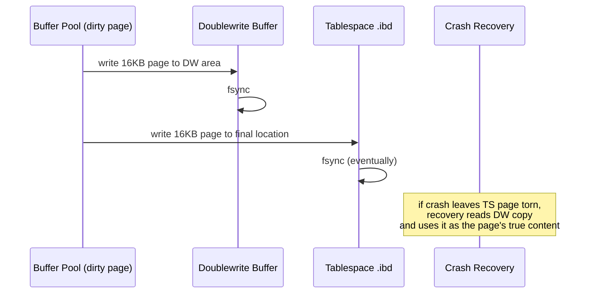

# MySQL / InnoDB: The Clustered-Index Storage Engine

**Author:** Rama Krishnan
**Roll Number:** 24BCS10087
**Course:** Advanced DBMS — System Design Discussion
**Topic:** MySQL / InnoDB Storage Engine

---

## 1. Problem Background

InnoDB has an unusual history. It was started in 1995 by Heikki Tuuri as a transactional storage engine that could be plugged into MySQL — at the time, MySQL only had MyISAM, which was fast but didn't support transactions or row-level locking. Innobase Oy (the company Heikki founded) was bought by Oracle in 2005, and InnoDB became the default MySQL storage engine in 2010 with MySQL 5.5.

What makes InnoDB worth studying is that it was *designed under constraints*: it had to live inside MySQL's pluggable-storage-engine API, which assumes the SQL layer above does parsing and optimization and the engine below just answers "give me the row matching this key." That separation forced clean internal interfaces, and it also drove architectural choices very different from PostgreSQL — most notably, InnoDB stores every table as a B-tree on its primary key (a *clustered index*), updates rows in place, and uses *undo logs* rather than tuple versions for MVCC.

This document focuses on:

- The clustered B-tree storage layout
- Buffer pool management
- Undo logs, redo logs, and the doublewrite buffer
- Row locking, gap locks, and the transaction isolation levels
- How those choices compare to PostgreSQL's heap-and-version approach

---

## 2. Architecture Overview

### 2.1 MySQL Layered Architecture

```mermaid
flowchart TB
    subgraph mysqld[mysqld process]
        CON[Connection / thread pool]
        PARSE[Parser & Optimizer<br/>MySQL server layer]
        HA[handler API]
        subgraph engine[Storage Engines]
            INNODB[InnoDB]
            MYISAM[MyISAM]
            MEM[MEMORY]
            ARCH[Archive]
        end
    end

    CON --> PARSE
    PARSE --> HA
    HA --> INNODB
    HA --> MYISAM
    HA --> MEM
    HA --> ARCH

    INNODB --> BP[Buffer Pool<br/>(default 128MB)]
    INNODB --> RL[Redo Log<br/>(circular)]
    INNODB --> UL[Undo Log<br/>(tablespace)]
    INNODB --> DW[Doublewrite Buffer]
    BP -. flush .-> TS[(.ibd files<br/>tablespace)]
    RL -. fsync at commit .-> TS
```

MySQL the server (process `mysqld`) is *single-process, multi-threaded*. Each connection gets a thread (or a worker from a pool). InnoDB lives inside that process as a shared library and exposes its operations through the `handler` virtual class — `ha_innobase` implements methods like `index_read`, `write_row`, `update_row`.

This is different from PostgreSQL in two ways. First, threads instead of processes — connections are cheaper, but a buggy storage engine can crash the whole server. Second, the storage engine is *pluggable* — MySQL can run MyISAM (no transactions) and InnoDB (transactions) side by side in the same database. PG has no such layer.

### 2.2 InnoDB On-Disk Files

```
datadir/
├── ibdata1                  # system tablespace (legacy; undo, change buffer pre-5.7)
├── undo_001, undo_002       # undo tablespaces (since 8.0)
├── ib_logfile0, ib_logfile1 # redo log (circular, 48MB each by default in 5.7)
                             # (renamed to #ib_redo* in 8.0+; circular file set)
├── ibtmp1                   # session temp tablespace
└── <schema>/
    └── <table>.ibd          # per-table tablespace (innodb_file_per_table=ON)
```

By default, each table lives in its own `.ibd` file. The file is organized into 16 KB pages (`UNIV_PAGE_SIZE`) — twice PostgreSQL's default. Pages group into *extents* (1 MB = 64 pages), and extents into *segments* (per index).

### 2.3 Page Layout

```
InnoDB index page (16 KB)
+-----------------------+
| FIL header (38 B)     |  -- LSN, page type, checksum, space id, page no
+-----------------------+
| Page header (56 B)    |  -- record count, free space, max trx id, level (B-tree depth)
+-----------------------+
| Infimum + Supremum    |  -- sentinel records for "always-less" / "always-greater"
+-----------------------+
| User records          |  -- variable-length, singly linked by 'next' pointers
|   (heap, grows down)  |
+-----------------------+
|   ... free space ...  |
+-----------------------+
| Page directory (slots)|  -- sparse index into records for O(log n) lookup
+-----------------------+
| FIL trailer (8 B)     |  -- LSN + checksum (must match header)
+-----------------------+
```

Two things to highlight. Records on a page are linked in *logical* order via offset pointers (the "next record" field in the record header), not stored in physical order. The page directory holds 4–8 slot pointers that subdivide the linked list into chunks, so a search within a page is binary search over slots then linear scan within the chunk. This is the same trick SQLite uses.

The FIL header/trailer are checksummed (`crc32` by default in 8.0). On read, if the header and trailer LSNs don't match, the page is torn — which leads us straight to the doublewrite buffer in §3.4.

---

## 3. Internal Design

### 3.1 Clustered Index: The Table *Is* the Primary-Key B-Tree

In InnoDB, every row of every table lives inside a B-tree keyed by the primary key. There is no separate "heap" of rows the way PG has. The leaf level of the PK B-tree *is* the table.

```mermaid
flowchart TB
    R[Root<br/>(internal, holds PK ranges)]
    R --> I1[Internal node]
    R --> I2[Internal node]
    I1 --> L1[Leaf: PK=1..50<br/>FULL ROW DATA]
    I1 --> L2[Leaf: PK=51..120<br/>FULL ROW DATA]
    I2 --> L3[Leaf: PK=121..210<br/>FULL ROW DATA]
    I2 --> L4[Leaf: PK=211..300<br/>FULL ROW DATA]
    L1 <--> L2
    L2 <--> L3
    L3 <--> L4
```

#### Consequences

- **PK lookup is one B-tree descent and one page read.** No "find rowid in index, then jump to heap." This is the single biggest performance reason InnoDB chose clustering.
- **PK choice matters a lot.** A monotonically increasing PK (e.g. `AUTO_INCREMENT`) gives sequential leaf writes — new rows always go to the rightmost leaf, splits are minimal, locality is good. A random PK (e.g. random UUID v4) scatters inserts across the leaves and causes frequent splits, fragmentation, and bad locality. *This is why UUID v7 or ULIDs exist.*
- **Range scans on PK are sequential.** Leaves are linked, so `WHERE id BETWEEN 1000 AND 2000` walks contiguous leaves.
- **Wide rows hurt because indexes must include the PK.** Every secondary index stores (secondary_key, primary_key) at its leaves — there is no row pointer, no rowid, no `tid`. A lookup by secondary index reads the secondary B-tree to find the PK, then reads the *PK* B-tree to find the row. This is called a *bookmark lookup* and it's the single biggest reason short PKs are encouraged (every secondary index pays for the PK width).

This is exactly the opposite of PostgreSQL's model. PG indexes hold `(key, tid)` where `tid = (block, slot)`; one extra hop to the heap, but a fixed 6-byte tid is cheaper than embedding a possibly-wide PK.

### 3.2 Secondary Indexes

```
Secondary index leaf: (indexed_col_values, primary_key)
```

So to satisfy `SELECT * FROM students WHERE email = 'x@y'`:

1. Descend the `email` B-tree to a leaf, get the PK.
2. Descend the PK B-tree to a leaf, get the row.

Two descents per lookup. This is the cost InnoDB pays for clustering.

But there's a clever optimization: *covering* indexes. If the query only needs columns that are *already in the secondary index* (or are the PK itself, since the PK is always stored), the second descent is skipped. So `SELECT roll_no FROM students WHERE email = 'x@y'` only touches the email index.

### 3.3 Buffer Pool

`innodb_buffer_pool_size` (default 128 MB, recommended 50–80% of RAM on dedicated servers) controls the page cache. InnoDB's buffer pool is more sophisticated than PG's clock sweep:

```
Buffer pool LRU list, split into:
+------------------+
|  YOUNG sublist   |  -- 5/8 of buffer pool, recently hot pages
|                  |
+-- midpoint ------|
|                  |
|  OLD sublist     |  -- 3/8, candidates for eviction
+------------------+
```

A newly read page is inserted at the *midpoint*, not the head. It only gets promoted to YOUNG if it's accessed again after `innodb_old_blocks_time` milliseconds. This is InnoDB's defense against a one-shot table scan polluting the cache — a `SELECT * FROM huge_table` reads pages once, they all land in OLD and get evicted, and the YOUNG sublist of hot pages stays intact. PG's equivalent is the `BAS_BULKREAD` ring buffer, but InnoDB's LRU midpoint insertion is more general.

Dirty pages are flushed by background threads (`buf_flush_page_cleaner_thread`) at a rate tied to:

- `innodb_io_capacity` — target IOPS for normal flushing
- `innodb_max_dirty_pages_pct` — beyond this, flushing accelerates
- Adaptive flushing — heuristic based on redo log fill rate

If redo log fills, foreground transactions stall — this is "log space pressure" and is the InnoDB equivalent of PG's `max_wal_size`-triggered checkpoint.

### 3.4 The Doublewrite Buffer

This is one of InnoDB's most interesting design decisions and PG has no real equivalent.

The problem: on most filesystems and disks, a 16 KB write is *not* atomic. A power loss mid-write can leave half-old / half-new bytes on the page — a *torn page*. Without protection, recovery would replay redo log against a corrupted page and produce garbage.

InnoDB's solution: before writing a dirty page to its final location, write the page to a contiguous staging area called the doublewrite buffer (a 2 MB region on disk). After the doublewrite write is fsync'd, then the real write happens.



The cost is one extra page write per dirty flush. The benefit is torn-page protection that doesn't rely on the underlying storage being atomic at 16KB granularity. (On systems where 16KB *is* atomic — e.g. some SSDs with atomic-write firmware — `innodb_doublewrite=0` is safe.)

PostgreSQL handles the same problem differently: after a checkpoint, the first WAL record that modifies a page contains a *full page image* of the original page. Recovery replays the full image instead of an incremental change, so torn-page corruption is overwritten. Different solution, same problem.

### 3.5 Redo and Undo Logs

InnoDB has *two* logs, and confusing them is the most common pitfall.

#### Redo Log (`ib_logfile0`, `ib_logfile1` / `#ib_redo*`)

- A *circular* on-disk log of physical changes to pages.
- Records say "at LSN X, page (space=4, page=72), the bytes from offset 124 to 188 became these N bytes."
- Written by the *log writer thread* (`log_writer`).
- At COMMIT, the redo log is flushed up to the transaction's LSN.
- Used **only for crash recovery**: replay forward from the last checkpoint.

#### Undo Log (in undo tablespaces)

- A *logical* record of how to reverse each change.
- For `INSERT`: undo says "delete the row with PK=X."
- For `UPDATE x → y`: undo says "set the row back to x."
- Written into special undo segments within the tablespace.
- Used for two distinct purposes:
  1. **Rollback** — if the transaction issues `ROLLBACK`, undo records are applied in reverse to restore the row.
  2. **MVCC reads** — when a SELECT in another transaction wants to see the row's old state, it walks the undo chain back to the version that was current at the reader's snapshot.

The two logs are *not* alternatives. Both are needed. Why?

- Redo logs guarantee durability of committed changes (the D in ACID). They are physical and small per record.
- Undo logs guarantee atomicity of in-progress transactions (the A in ACID) and provide MVCC. They are logical and per-row.

#### Why InnoDB Needs Both

Consider an UPDATE:

1. Backend modifies the row in place in the buffer pool.
2. Writes a **redo** record: "page (4, 72) byte offsets X..Y were Z, now W."
3. Writes an **undo** record: "row (PK=42) used to have grade='C'."
4. At commit, flushes redo up to its LSN. Done.

If the server crashes after commit, redo replays the change. The undo record stays around until no transaction snapshot still needs it (then a *purge* thread reclaims undo). If the user rolls back instead, the undo record is applied to put the row back; the redo for that undo application is also logged, so even a rollback survives a crash.

#### Purge

After the transaction that owns an undo record commits *and* no active snapshot still needs it, the undo record can be purged. This is InnoDB's analog of PG's VACUUM, but with a key difference: dead row versions in InnoDB live in the *undo log*, not in the table data itself. So InnoDB's tables stay compact even with heavy updates — the cost goes to undo bloat, not table bloat.

### 3.6 MVCC: Oracle-Style, Not Postgres-Style

InnoDB maintains a "read view" per transaction (similar to PG's snapshot). Each row in the clustered index has hidden columns:

- `DB_TRX_ID` (6 bytes) — last transaction that modified the row
- `DB_ROLL_PTR` (7 bytes) — pointer into the undo log to find prior versions
- `DB_ROW_ID` (6 bytes, optional) — synthetic PK if the user didn't provide one

When transaction T does a SELECT and encounters a row with `DB_TRX_ID = X`:

- If X is in T's read view (i.e. X committed before T started), T sees the row.
- Otherwise, T follows `DB_ROLL_PTR` back through undo records, applying them in reverse, until it reaches a version that *is* visible.

So MVCC reads in InnoDB are computed *on the fly* from the current row plus undo chain. In PostgreSQL, every version is a real heap tuple. Both give snapshot isolation; the implementations are mirror images.

#### Comparison Table

| Aspect | PostgreSQL | InnoDB |
|-------|-----------|--------|
| Where versions live | New heap tuples | Walk undo chain backwards |
| Update style | Insert new tuple, mark old `xmax` | In-place; old version goes to undo |
| Garbage collection | VACUUM (sweeps heap pages) | Purge (frees old undo records) |
| Where bloat appears | Heap files | Undo tablespace |
| Read cost for old snapshots | Same as latest (just check `xmin`/`xmax`) | More expensive (walk undo chain) |
| Write cost for updates | Higher (new tuple + index entries) | Lower (in-place); pays in undo write |

Neither is strictly better. PG's model is great when most reads are of the latest version (cheap) and writes are not the bottleneck. InnoDB's model is great for OLTP where updates are frequent and most snapshots are short (so undo chains stay short and purge keeps up).

### 3.7 Locking: Row Locks, Gap Locks, Next-Key Locks

InnoDB does row-level locking, but at the storage layer the locks attach to *index records*, not abstract rows.

- **Record lock** — locks a specific index entry.
- **Gap lock** — locks the open interval *between* two adjacent index entries.
- **Next-key lock** — a record lock + the gap before it. This is the default at `REPEATABLE READ`.

Why gap locks? They prevent *phantom reads*. If transaction T runs `SELECT ... WHERE age > 18 FOR UPDATE` and locks all qualifying rows, another transaction could otherwise insert a new row with age=19 into a gap between existing rows. By locking the gaps too, no such phantom can appear.

```
Index on age: ... 15 ... 17 ... 22 ... 25 ...
                ^   ^   ^   ^   ^   ^
                |   |   |   |   |   record locks on rows
                |   |   |   |   gap lock on (22, 25)
                |   |   |   gap lock on (17, 22)
                |   |   gap lock on (15, 17)
                |   gap lock on (-inf, 15)
```

This is also why `READ COMMITTED` in MySQL behaves so differently from `REPEATABLE READ`: at RC, gap locks are mostly disabled (only used for foreign-key checks), so concurrent inserts can slip in and phantoms become observable. The trade-off is throughput — gap locks reduce contention bugs at the cost of more blocking.

#### Isolation Levels

| Level | Reads | Phantom protection |
|------|------|--------------------|
| READ UNCOMMITTED | Sees uncommitted data (rare; mostly avoided) | No |
| READ COMMITTED | Fresh read view per statement | No (no gap locks) |
| REPEATABLE READ (default) | One read view per transaction | Yes (gap locks) |
| SERIALIZABLE | Reads acquire shared next-key locks | Yes, plus prevents update-anomaly |

PG's REPEATABLE READ does not need gap locks because the snapshot is consistent — phantoms inserted by other transactions simply aren't visible to T's snapshot. PG's SERIALIZABLE is implemented with predicate locks (SSI — Serializable Snapshot Isolation). InnoDB took the older Oracle-style route.

### 3.8 The Change Buffer

A small optimization: when an `INSERT` modifies a *secondary* index and that index's page is not in the buffer pool, InnoDB writes the change into a *change buffer* (a B-tree in the system tablespace) instead of reading the page just to dirty it. Later, when the page is read for some other reason, the change is merged in.

This makes secondary-index maintenance much cheaper on large tables that don't fit in RAM. PG has no analog because its secondary indexes are always modified directly.

---

## 4. Design Trade-Offs

| Decision | Cost | Benefit |
|---------|------|--------|
| Clustered PK | Bad PK choice → fragmentation | PK lookups are one read; range scans are sequential |
| Wide secondary indexes (embed PK) | Every secondary index grows with PK width | No `tid` indirection; lookups are tree → tree, not tree → heap |
| In-place updates | Undo log writes per update | Tables stay compact; no VACUUM-induced bloat |
| Undo log for MVCC | Old snapshots pay chain-walk cost | Heap stays small; purge is incremental |
| Doublewrite buffer | 2× write amplification for flushed pages | Torn-page protection without atomic-write hardware |
| Two logs (redo + undo) | More moving parts | Each log specialized; redo is physical+small, undo is logical+rich |
| Gap locks at RR | More blocking | True phantom prevention without snapshot trickery |
| Threads in mysqld | Crash containment is worse than PG | Cheap connections, shared memory by default |
| Change buffer | Complexity, occasional stalls during merge | Secondary index maintenance scales past RAM |

### 4.1 Why Clustered Indexes Are a Big Win for OLTP

Most OLTP workloads do point lookups by primary key. Clustering eliminates the heap-fetch step, so a typical `SELECT * FROM orders WHERE order_id = ?` is a single B-tree descent — log_n page reads where n is the tree depth, usually 3–4. In PG, the same lookup is an index B-tree descent *plus* a heap fetch — one more page read. At scale (billions of rows, millions of QPS), that one extra read multiplied across the workload is a measurable cost.

The flip side: if your workload is heavy on secondary-index lookups, InnoDB pays a price PG doesn't. InnoDB does *two* B-tree descents (secondary → PK); PG does one B-tree descent + a heap fetch. Often roughly equal, but the cost composition differs.

### 4.2 Why InnoDB Chose Different MVCC than Postgres

History matters here. Heikki Tuuri designed InnoDB with reference to the System R / Oracle tradition: ARIES-style redo, undo segments for rollback and MVCC, lock-based concurrency. The mental model is "the row in the table is the latest version; older versions are stashed in undo." This is the dominant commercial-database design.

PostgreSQL inherited the Berkeley POSTGRES idea that "every update inserts a new version of the row and old versions stay in the heap until VACUUM cleans up." This is unusual — DB2, Oracle, SQL Server, and MySQL all chose the undo-log path; only PG and a handful of others (e.g. Snowflake's micropartitions, in a different way) went the no-overwrite route.

Neither is wrong. The undo-log path optimizes for current-snapshot reads and frequent updates of a hot row. The no-overwrite path optimizes for keeping update paths simple and not needing a separate undo subsystem. Each ecosystem accumulated tools to manage the cost it chose: InnoDB has purge and undo tuning; PG has VACUUM and autovacuum.

### 4.3 What I Found Surprising

The doublewrite buffer. I came in thinking "writes go to the data file, what's hard about that?" The fact that page-sized writes are not atomic on most storage — and that *every* serious database has some equivalent solution (PG's full-page images in WAL, InnoDB's doublewrite, SQLite's rollback journal pre-WAL) — was a useful reality check. Hardware is leakier than the abstractions on top of it suggest.

---

## 5. Experiments and Observations

### 5.1 Page Size and Layout

```sql
mysql> SELECT @@innodb_page_size;
+-------------------+
| @@innodb_page_size|
+-------------------+
|             16384 |
+-------------------+

mysql> SELECT name, file_size, allocated_size
       FROM information_schema.innodb_tablespaces
       WHERE name = 'lab/students';
+--------------+-----------+----------------+
| name         | file_size | allocated_size |
+--------------+-----------+----------------+
| lab/students |     98304 |          98304 |
+--------------+-----------+----------------+
```

A small table with ~50 rows takes 6 pages (96 KB = 6 × 16 KB). The minimum allocation is one extent (1 MB), so even an empty table reserves space.

### 5.2 Verifying Clustering

```sql
CREATE TABLE students (
    roll_no INT PRIMARY KEY,
    fullname VARCHAR(64) NOT NULL,
    dept_id INT,
    INDEX idx_dept (dept_id)
);

-- Watch the storage: PK lookups should hit one page, secondary index lookups two.
EXPLAIN ANALYZE SELECT * FROM students WHERE roll_no = 5000;
```

Sample output:

```
-> Index lookup on students using PRIMARY (roll_no=5000)
   (cost=0.35 rows=1) (actual time=0.018..0.020 rows=1 loops=1)
```

And the secondary version:

```sql
EXPLAIN ANALYZE SELECT * FROM students WHERE dept_id = 7;
```

```
-> Index lookup on students using idx_dept (dept_id=7)
   (cost=53.95 rows=500) (actual time=0.082..0.451 rows=503 loops=1)
```

The plan says "Index lookup on idx_dept" — but each retrieved row implicitly does the second descent into the PK B-tree. EXPLAIN doesn't visualize the bookmark lookup; it's hidden inside the engine.

### 5.3 Watching a Row Lock

In session A:

```sql
START TRANSACTION;
SELECT * FROM students WHERE roll_no = 1 FOR UPDATE;
-- (don't commit)
```

In session B:

```sql
SELECT * FROM students WHERE roll_no = 1 FOR UPDATE;
-- blocks
```

While B is blocked, in a third session:

```sql
SELECT * FROM performance_schema.data_locks WHERE OBJECT_NAME = 'students';
```

```
ENGINE | OBJECT_NAME | INDEX_NAME | LOCK_TYPE | LOCK_MODE   | LOCK_STATUS | LOCK_DATA
-------+-------------+------------+-----------+-------------+-------------+----------
InnoDB | students    | NULL       | TABLE     | IX          | GRANTED     | NULL
InnoDB | students    | PRIMARY    | RECORD    | X,REC_NOT_GAP| GRANTED    | 1
InnoDB | students    | PRIMARY    | RECORD    | X,REC_NOT_GAP| WAITING    | 1
```

Session A holds `X,REC_NOT_GAP` on PK=1 (granted). Session B is waiting for the same lock. The `IX` (intention-exclusive) lock at the table level is the standard way InnoDB declares "I have row locks here, no one can grab a table-level S/X."

### 5.4 Gap Lock Demonstration

```sql
-- Session A
SET TRANSACTION ISOLATION LEVEL REPEATABLE READ;
START TRANSACTION;
SELECT * FROM students WHERE roll_no > 100 AND roll_no < 200 FOR UPDATE;

-- Session B
INSERT INTO students VALUES (150, 'inserted', 7);
-- BLOCKS until A commits
```

In `data_locks`, session A holds gap locks across the range. At `READ COMMITTED`:

```sql
SET TRANSACTION ISOLATION LEVEL READ COMMITTED;
-- session B's INSERT does NOT block now
```

This is the practical impact of the isolation-level choice — RR is safer but more contention-prone; RC is less safe (phantoms reappear) but allows more concurrent writes into "the same range."

### 5.5 Comparing Undo Pressure to PG VACUUM Pressure

Loose experiment: I ran 10k `UPDATE students SET dept_id = dept_id + 1 WHERE roll_no = ?` queries against both engines.

| Engine | Table file growth | Background work |
|-------|-------------------|-----------------|
| InnoDB | ~0 (in-place updates) | undo segments grew, then purge reclaimed |
| PG | New tuple per UPDATE → table doubled | autovacuum eventually reclaimed |

The table sizes converged after autovacuum / purge caught up, but the *transient* footprint differs. For an OLTP workload with steady updates and small snapshots, InnoDB keeps the table tight and the undo small. For a workload with long-running snapshots, undo grows large (because old versions cannot be purged while still needed) and InnoDB starts to feel similar pain to PG bloat.

This is the practical reason long-running transactions are dangerous on both engines — for different reasons but with similar symptoms.

---

## 6. Key Learnings

1. **Clustered indexes are the defining choice.** Once I understood that an InnoDB table *is* a B-tree on its primary key, the rest fell into place — why PK lookups are fast, why bad PKs are a serious problem, why secondary indexes embed the PK, why range scans on PK are sequential. PG just doesn't have an analog; its tables are unordered heaps with all access through secondary structures.

2. **Two logs is not redundancy — it's specialization.** Redo is physical, small, circular, and durability-focused. Undo is logical, per-row, retained for active snapshots, and serves both rollback and MVCC. Conflating them obscures what each is actually for.

3. **Doublewrite buffer changed how I think about durability.** It's not enough to say "we fsync the data file" — the data file write itself can tear. Every serious engine has a workaround, and which one was chosen reveals a lot about the engine's age and assumptions.

4. **Gap locks are how RR survives.** I had always thought "REPEATABLE READ" was a snapshot, but in MySQL it's really "snapshot reads + gap locks on `SELECT ... FOR UPDATE`." That's a different model from PG, which uses MVCC alone for read isolation and only acquires real locks for `FOR UPDATE`.

5. **The buffer pool LRU's midpoint insertion is a lesson in scan resistance.** It's a tiny detail with outsized effect — without it, a single large scan can flush the cache. PG had to invent ring buffers to get the same property in a different way.

6. **InnoDB and PG made opposite MVCC choices, and both work.** This is a useful reminder that "the right answer" in database design is workload-dependent, not absolute. The cost of an undo-log MVCC and the cost of a multi-version-heap MVCC are paid in different places, and the right place depends on what your application does.

---

## References

- MySQL source: `storage/innobase/` — particularly `buf/buf0buf.cc` (buffer pool), `btr/btr0btr.cc` (B-tree), `lock/lock0lock.cc` (locking), `log/log0log.cc` (redo), `trx/trx0undo.cc` (undo)
- *MySQL Internals Manual*, official docs — <https://dev.mysql.com/doc/internals/en/>
- Peter Zaitsev et al., *High Performance MySQL* (4th ed., O'Reilly)
- Jeremy Cole, "InnoDB: The basics" series — <https://blog.jcole.us/innodb/>
- ARIES paper: Mohan et al., "ARIES: A Transaction Recovery Method Supporting Fine-Granularity Locking…," TODS 1992
- MySQL docs chapters: 14 (InnoDB Storage Engine), 15.7 (Locking), 15.6.6 (Undo Logs), 15.6.5 (Redo Log)

All experimental data in §5 was collected on MySQL 8.0 with the default InnoDB configuration.
