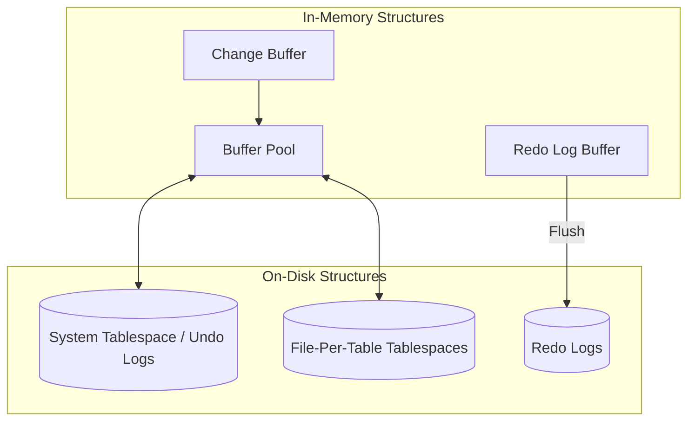

# MySQL InnoDB Storage Engine: Architecture and Design Discussion

## 1. Problem Background
MySQL was designed as a multi-engine database, but InnoDB has become its default and most crucial storage engine. The core problem InnoDB solves is providing ACID-compliant transaction capabilities, crash recovery, and high concurrency (row-level locking) for MySQL. Unlike the older MyISAM engine, which only supported table-level locking and lacked crash recovery, InnoDB brings enterprise-grade relational database features while maintaining high read/write performance.

## 2. Architecture Overview
The InnoDB architecture is split into in-memory structures and on-disk structures.

Data is cached in the Buffer Pool. When modified, changes are written to the Redo Log Buffer and then sequentially flushed to Redo Logs on disk for durability. Undo Logs store older versions of modified data to support MVCC and transaction rollback.

## 3. Internal Design

### Clustered Indexes
In InnoDB, data is stored differently than in PostgreSQL's heap structure.
- **Primary Key Storage:** The table data is stored directly inside the leaf nodes of the primary key's B+Tree. This is known as a clustered index. This architecture makes primary key lookups incredibly fast since the data is retrieved simultaneously with the index search.
- **Secondary Indexes:** Secondary indexes store the indexed column(s) and the primary key value as the pointer to the actual data (instead of a physical disk pointer). Thus, a secondary index lookup requires a two-step process: finding the primary key in the secondary index, then traversing the clustered index to find the row.

### Buffer Pool
The Buffer Pool is the main memory area where InnoDB caches table and index data as it is accessed. It uses a variation of the LRU algorithm to keep frequently accessed data in memory, significantly speeding up processing.

### Undo Logs and Redo Logs
- **Undo Logs:** Undo logs record the state of data *before* a modification. If a transaction is rolled back, or if another transaction needs to see an older version of the data (MVCC), InnoDB reads from the undo logs.
- **Redo Logs:** Redo logs record the state of data *after* a modification. They ensure durability. In the event of a crash, InnoDB replays the redo logs during startup to recover committed transactions that had not yet been flushed to the tablespaces.

### Transaction Processing & Row-Level Locking
InnoDB supports true row-level locking.
- **Gap Locks:** InnoDB uses gap locks (locking the "gap" between index records) to prevent phantom reads in the REPEATABLE READ isolation level. This prevents other transactions from inserting new rows into ranges that are currently being queried.

## 4. Design Trade-Offs

### Key Comparison with PostgreSQL
| Feature | PostgreSQL | MySQL InnoDB |
|---------|------------|--------------|
| **Storage Model** | Heap tables with separate B-Tree indexes pointing to tuples (CTIDs). | Clustered Index (data stored in PK B+Tree). |
| **Updates** | Append-only. New tuple version is inserted; old tuple is kept until VACUUM. | In-place updates. Old data is moved to Undo Logs. |
| **MVCC Model** | Multiple versions exist in the main heap table. | Oracle-style MVCC. Current version in table, old versions in Undo Logs. |
| **Secondary Indexes** | Point directly to the physical tuple (requires index updates when tuple moves). | Point to the Primary Key (no update needed if row moves physically, but slower lookups). |

### Advantages & Limitations
- **Advantage:** Clustered indexes provide superior performance for primary key lookups and range scans.
- **Advantage:** In-place updates avoid the table bloat seen in PostgreSQL.
- **Limitation:** Secondary index lookups are slower due to the double-lookup requirement.
- **Limitation:** Large primary keys significantly increase the size of all secondary indexes, as the PK is duplicated in every secondary index entry.

## 5. Experiments / Observations
**Locking Behavior Observation:**
In InnoDB, executing a `SELECT ... FOR UPDATE` on a range (e.g., `WHERE id BETWEEN 10 AND 20`) under `REPEATABLE READ` isolation places gap locks. If another transaction attempts to `INSERT` an `id` of 15, it will block until the first transaction completes. This differs from PostgreSQL's default `READ COMMITTED` behavior, highlighting InnoDB's strict approach to preventing phantom reads by default.

## 6. Key Learnings
- **Storage Dictates Performance:** The decision to use a clustered index makes InnoDB exceptionally fast for primary key operations but imposes a cost on secondary index lookups.
- **Dual Log System:** Understanding the distinction between Undo Logs (for Atomicity and MVCC) and Redo Logs (for Durability) is crucial to grasping how modern databases handle crash recovery and concurrency.
- **MVCC Variations:** InnoDB's "Oracle-style" MVCC using undo segments avoids PostgreSQL's `VACUUM` bloat issue, though it introduces complexity in managing the undo tablespaces.
