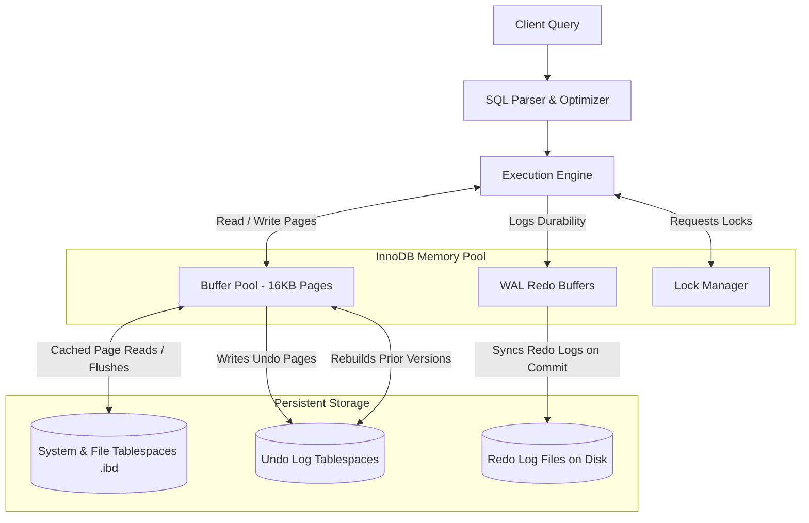

# MySQL InnoDB Storage Engine — Architecture & Design

**Roll Number:** 24BCS10230  
**Name:** Parth Taneja  

---

## 1. Problem Background

InnoDB is the default transaction-safe (ACID compliant) storage engine for MySQL. In database engine design, there is a constant tension between write performance, search performance, and data durability. 

The primary challenges InnoDB is designed to address are:
*   **Crash Resilience:** Guaranteeing that database modifications are never lost, even if power is cut mid-transaction.
*   **High Write Concurrency:** Allowing thousands of concurrent clients to modify rows without blocking readers.
*   **Physical Locality Optimization:** Structuring tables on disk so that primary key-based lookups and range scans require minimal random disk I/O.

To achieve this, InnoDB organizes data around a **Clustered Index**, handles modifications **in-place** on 16 KB data pages, and separates transaction history into **Undo Logs** (for rolling back and reading snapshots) and **Redo Logs** (for durability and crash recovery).

---

## 2. High-Level Architecture

The diagram below shows how client queries interact with InnoDB's memory buffers, lock manager, log systems, and physical disk storage:



### Flow of an `UPDATE` Statement:
1.  **Page Retrieval:** The execution engine requests the target row's page from the **Buffer Pool**. If the page is not cached, the Buffer Pool reads the 16 KB block from the tablespace on disk.
2.  **Lock Acquisition:** The transaction requests a row lock from the **Lock Manager**.
3.  **Undo Log Write:** Before modifying the row, its prior version is recorded in the **Undo Log** space. This is used for transaction rollbacks and consistent MVCC reads.
4.  **In-Place Update:** The row is modified directly inside the cached page in the Buffer Pool. The page is marked as "dirty."
5.  **Redo Log Write:** A redo log record describing the update is appended to the **Redo Buffers**.
6.  **Commit Durability:** When the transaction commits, the Redo Buffers are flushed sequentially to the Redo Log files on disk. The dirty page in the Buffer Pool is written to disk later by background flusher threads.

---

## 3. Detailed Internal Design

### 3.1. Clustered Index & Primary Key Storage
Unlike databases that store data rows in an unordered heap, InnoDB structures tables as a **Clustered Index** B+Tree.
*   **Physical Sort Order:** Table rows are physically sorted and stored in the leaf pages of the B+Tree based on the primary key (PK).
*   **PK Lookup Speed:** Searching by primary key is highly efficient because a traversal down the B+Tree directly yields the row data in the leaf page. No secondary lookup is required.
*   **Fallback PK:** If no primary key is explicitly defined, InnoDB uses the first `UNIQUE NOT NULL` index. If none is available, InnoDB automatically generates a hidden 6-byte internal row identifier (`ROW_ID`) to build the clustered index.
*   **Page Size:** The default block size is 16 KB. Each page includes a header, a page directory for binary search within the page, and the row records.

### 3.2. Secondary Index Design
All indexes other than the primary key are **Secondary Indexes**.
*   **Leaf Record Contents:** In InnoDB, leaf pages of a secondary index do not contain physical addresses or row pointers. Instead, they store the **primary key value** of the matching row.
*   **Double Lookup Traversal:**
    Searching via a secondary index is a two-step process:
    1.  Traverse the secondary index B+Tree to retrieve the primary key value.
    2.  Traverse the clustered index B+Tree using that primary key to find the actual row data.
*   **Trade-Off:** The advantage is that if a data page splits or rows are moved, secondary indexes do not need to be updated because the logical identifier (PK) remains the same. The disadvantage is that index lookups incur a double traversal cost unless the query is "covering" (can be answered entirely using the columns in the secondary index).

### 3.3. Buffer Pool Mechanics
The **Buffer Pool** is InnoDB's central memory cache. It holds data pages, index pages, undo log blocks, and the change buffer.
*   **Caching Policy:** Every read and write request is routed through the Buffer Pool. 
*   **Page Cleaning:** Background flusher threads continuously identify dirty pages and write them to disk.
*   **Instances:** To prevent mutex bottlenecking under high concurrent workloads, the Buffer Pool can be split into multiple independent instances, each managing its own lock and page lists.

### 3.4. Undo Log Subsystem
The Undo Log serves two main purposes: transaction rollback and consistent reads (MVCC).
*   **Rollback Pointer Chain:** Each clustered index row contains a hidden pointer linking to a chain of prior row versions stored in the Undo tablespace.
*   **MVCC Snapshot Generation:** When a transaction reads a row, InnoDB walks the rollback pointer chain to reconstruct the row version that was committed before the reader's transaction snapshot began.
*   **Purge Thread:** A background worker (the Purge Thread) periodically deletes old undo logs once no active transaction snapshots require them. This acts similarly to PostgreSQL's `VACUUM` but leaves data pages untouched, operating only on the separate undo segment.

### 3.5. Redo Log (Write-Ahead Logging)
The Redo Log guarantees durability and crash safety.
*   **Append-Only Logging:** Changes are logged sequentially as circular log files. Because sequential logging requires minimal disk head movement, it is fast.
*   **Log Sequence Number (LSN):** Redo logs and data pages track modifications using a monotonically increasing LSN.
*   **Checkpoints:** The checkpointer records the LSN up to which all modified memory pages have been flushed to disk. During recovery, the engine only replays WAL records starting from that LSN.

### 3.6. Lock Types & Behavior
InnoDB applies locks on index records rather than physical table rows.
*   **Record Lock:** Locks a specific index record (e.g., `id = 10`).
*   **Gap Lock:** Locks the gap *between* two index records (or before the first/after the last) to prevent concurrent inserts.
*   **Next-Key Lock:** A combination of a Record Lock and a Gap Lock (locks the record and the gap preceding it). This is the default locking mode at the Repeatable Read isolation level.
*   **Insert Intention Lock:** A type of gap lock set by inserts to allow multiple transactions to insert different rows in the same gap concurrently.

#### Range Locking Example:
If you have index entries `{10, 20, 30}` and execute:
```sql
SELECT * FROM table WHERE id BETWEEN 15 AND 25 FOR UPDATE;
```
*   InnoDB will acquire a Record Lock on `20`.
*   It will acquire Gap Locks on the intervals `(10, 20)` and `(20, 30)`.
*   This prevents other connections from inserting records like `id = 12` or `id = 22` until the transaction commits, eliminating phantom reads.

### 3.7. Transaction Isolation Levels
InnoDB implements SQL isolation levels as follows:
1.  **Read Uncommitted:** Queries read modifications directly from the Buffer Pool without checking commit status (causes dirty reads).
2.  **Read Committed:** Every statement takes a new MVCC snapshot, reading only committed data. Gap locks are disabled.
3.  **Repeatable Read (Default):** The MVCC snapshot is established at the start of the transaction and remains constant. **Next-Key Locks** are applied during index scans, which prevents phantom reads.
4.  **Serializable:** Implemented by implicitly upgrading all `SELECT` queries to `SELECT ... FOR SHARE`, locking all read records.

---

## 4. Key Comparisons & Trade-Offs

### 1. In-Place Updates (InnoDB) vs. Append-Only Heap (PostgreSQL)
*   **InnoDB:** Overwrites modified rows in-place on their physical page and writes the previous version to a separate Undo Log.
    *   *Advantage:* Data pages remain clean. No heap table bloat, and no table-level `VACUUM` scans are required.
    *   *Limitation:* Higher write latency because rollback records must be structured, and long-running transactions can delay the undo log purging.
*   **PostgreSQL:** Appends the new version of the row as a new tuple in the table heap, leaving the old version in place.
    *   *Advantage:* Transactions rollback instantly (by updating the commit status in the commit log).
    *   *Limitation:* Table and index pages accumulate dead tuples, requiring continuous `VACUUM` scans to reclaim space.

### 2. Clustered B+Tree Storage (InnoDB) vs. Heap-Based Storage (PostgreSQL)
*   **InnoDB:** Table records are physically sorted and stored directly in primary key leaf nodes.
    *   *Advantage:* Primary key lookup is fast (data and index are in the same block). Range scans on primary keys are sequential.
    *   *Limitation:* Secondary indexes must store primary key values rather than physical pointers. Secondary index lookups require a double search (secondary tree $\to$ clustered tree).
*   **PostgreSQL:** Data rows are placed arbitrarily in heap pages. Indexes contain physical offsets (`TID`) pointing directly to these rows.
    *   *Advantage:* Secondary index lookups are fast because they point directly to the physical row without traversing the primary key.
    *   *Limitation:* Primary key lookups require an index search followed by a separate heap lookup.

### 3. Concurrency Control Strategy
*   **InnoDB:** Enforces phantom read prevention at the `REPEATABLE READ` isolation level using gap locks and next-key locking. This provides stronger default transactional guarantees but can introduce lock-wait contention or deadlocks during range-based writes.
*   **PostgreSQL:** Prevents phantom reads at the `REPEATABLE READ` level using snapshot isolation (and uses Serializable Snapshot Isolation (SSI) at `SERIALIZABLE`). It does not use gap locks, meaning readers and writers never block each other, but transactions may fail serialization checks under write skew conflicts.

---

## 5. Experimental Observations

I defined a test schema representing an order entry system:
```sql
CREATE TABLE customers (
    id INT AUTO_INCREMENT PRIMARY KEY,
    city VARCHAR(50) NOT NULL
) ENGINE=InnoDB;

CREATE TABLE products (
    id INT AUTO_INCREMENT PRIMARY KEY,
    category VARCHAR(50) NOT NULL
) ENGINE=InnoDB;

CREATE TABLE orders (
    id INT AUTO_INCREMENT PRIMARY KEY,
    customer_id INT NOT NULL,
    product_id INT NOT NULL,
    amount DECIMAL(10,2) NOT NULL,
    FOREIGN KEY (customer_id) REFERENCES customers(id),
    FOREIGN KEY (product_id) REFERENCES products(id)
) ENGINE=InnoDB;

CREATE INDEX idx_orders_customer ON orders(customer_id);
CREATE INDEX idx_orders_product ON orders(product_id);
```

I populated the database with skewed customer locations (85% New York, 15% London) and product categories (90% books, 10% electronics) across 50,000 orders.

### Execution Plan Analysis
I analyzed the following join query:
```sql
EXPLAIN
SELECT c.city, p.category, COUNT(*), SUM(o.amount)
FROM orders o
JOIN customers c ON c.id = o.customer_id
JOIN products p ON p.id = o.product_id
WHERE p.category = 'books'
GROUP BY c.city, p.category;
```

#### Plan Observations:
1.  **Clustered Index Traversals:**
    Joins on primary keys (`c.id = o.customer_id` and `p.id = o.product_id`) utilize **clustered index lookups** (indicated by `type: eq_ref` and `key: PRIMARY` in MySQL EXPLAIN output). Data is fetched directly from the B+Tree leaf nodes without an extra lookup step.
2.  **Secondary Index Pointer Fetching:**
    During the scan of the `orders` table, the secondary index on `product_id` is read. The index leaf page yields the customer and product primary key values. InnoDB uses these values to traverse the clustered index and construct the join results.
3.  **Buffer Cache Alignment:**
    Because the table rows are physically clustered by primary key, lookup operations on customer or product records exhibit high spatial locality, keeping page cache hit rates high in the Buffer Pool.

---

## 6. Suggested Questions Addressed

### 6.1. Why does InnoDB need both undo and redo logs?
*   **Redo Log (Forward Progress):** Handles **Durability**. It records modifications sequentially. If the database crashes, the redo log is replayed to write committed modifications that were lost from memory, ensuring data is never lost.
*   **Undo Log (Backward Progress / Consistency):** Handles **Atomicity and Isolation**. It stores the data state *prior* to a modification. If a transaction aborts, the undo log is used to roll back the changes. Additionally, it allows concurrent readers to reconstruct older row snapshots without needing lock allocations.

### 6.2. What advantages do clustered indexes provide?
*   **Fast Primary Key Reads:** The actual data row is co-located with the index key. A primary key search only traverses the index tree once to retrieve the row, skipping the step of finding a physical pointer and fetching a heap block.
*   **Contiguous Range Scans:** Rows with adjacent primary keys are physically stored next to each other on disk, converting what would be random I/O into sequential page reads.
*   **Index Stability:** Secondary index leaf records use logical primary key values rather than physical file addresses. When B+Tree splits occur or pages are reorganized, secondary indexes do not need to be updated.

### 6.3. Why did PostgreSQL choose a different MVCC model?
PostgreSQL chose an append-only heap model (storing multiple row versions in the table) due to several design goals:
*   **Simple Writes and Rollbacks:** Aborting a transaction does not require traversing undo logs to write old values back to page files; it simply updates the transaction status in the commit log (CLOG) to aborted.
*   **Unconstrained Custom Index Types:** Since all index structures in PostgreSQL (B-Tree, GIN, GiST, BRIN) use a standard physical address (`TID`) to point to the heap, PostgreSQL can easily support advanced custom indexing models without dealing with clustered index mappings.
*   **Avoiding Rollback Segment Contention:** Under heavy write workloads, databases with rollback segments can experience contention when writing undo records. PostgreSQL's heap-versioning avoids this bottleneck by treating updates as appends.

---

## 7. Key Takeaways

1.  **Index Types Determine Row Access:** InnoDB tables *are* B+Tree indexes. Row access is optimized for primary keys, while secondary indexes require a double tree search (secondary B+Tree $\to$ clustered B+Tree).
2.  **Separate Logs for Separate Roles:** Redo logs are write-ahead logs for crash safety, while undo logs are logical records used to roll back transactions and reconstruct MVCC read snapshots.
3.  **Next-Key Locking Prevents Phantoms:** InnoDB prevents phantom reads at the `REPEATABLE READ` isolation level by locking both the index records and the gaps between them, which is a stronger guarantee than the SQL standard requirement.
4.  **MVCC Trade-off:** By storing old row versions in the undo log rather than the main heap tables, InnoDB avoids the table bloat and continuous heap vacuuming associated with PostgreSQL, shifting the cleanup workload to a background purge thread operating on undo tablespaces.
