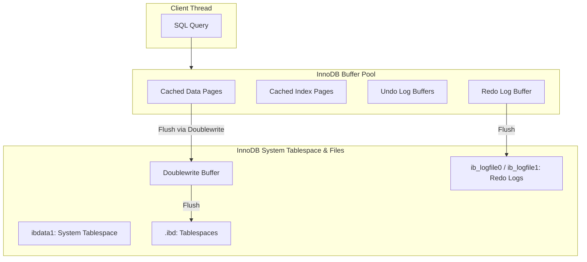

# MySQL / InnoDB Storage Engine

## 1. Problem Background

The InnoDB storage engine was designed to provide MySQL with transactional capabilities (ACID compliance) and row-level locking, replacing the legacy MyISAM storage engine which only supported table-level locking and lacked crash safety. 

The primary problems InnoDB solves are:
- **Crash Recovery & Durability**: Guaranteeing that committed data is never lost, even if the database crashes.
- **High Write Concurrency**: Overcoming table-level write bottlenecks via fine-grained row-level locking.
- **Efficient Disk Space Utilization**: Modifying rows in-place to avoid the table fragmentation and vacuum overhead common in append-only storage engines.

## 2. Architecture Overview

### High-level architecture diagram

### Main system components
- **Buffer Pool**: The memory area where InnoDB caches table and index data as they are accessed.
- **Redo Log Buffer & Redo Logs**: Sequential disk logs (Write-Ahead Logging) used during crash recovery to correct data written by incomplete transactions.
- **Undo Logs**: Stores copies of data before it was modified, allowing transaction rollbacks and MVCC.
- **Clustered Index Storage**: Organizes tables physically on disk based on the primary key.

### Data flow
1. A transaction modifies a row. The change is made to the page in the Buffer Pool (making it a dirty page).
2. The change is simultaneously written to the Redo Log Buffer in memory.
3. Upon commit, the Redo Log Buffer is flushed to the Redo Log files on disk (WAL requirement).
4. Dirty pages in the Buffer Pool are asynchronously flushed to the tablespace (`.ibd`) files via the doublewrite buffer.
5. Old versions of the row are recorded in the Undo logs for rollbacks and reads by concurrent transactions.

## 3. Internal Design

### Storage Structures & Clustered Indexes
- **Clustered Storage**: InnoDB stores table data physically sorted by the primary key. The leaf nodes of the clustered index contain the actual row data.
- **Primary Key Storage**: Since data is clustered around the primary key, lookups by primary key are extremely fast (a single index traversal directly retrieves the row).
- **Secondary Indexes**: Secondary indexes contain the index key and the primary key of the corresponding row (acting as pointers). A secondary index lookup requires a two-step process: traversing the secondary index, then traversing the clustered index (index lookup / bookmark lookup).

### Buffer Pool
- Caches data and index pages in memory.
- Uses a modified Least Recently Used (LRU) algorithm to evict pages. The LRU list is split into "new" (sublist of young pages) and "old" pages to prevent sequential table scans from flushing out frequently accessed pages.

### Undo Logs & Redo Logs
- **Redo Logs**: Log physical modifications to pages. They ensure **Durability (D in ACID)**. Since writing sequentially to redo logs is much faster than writing random database pages, changes are flushed to redo logs first.
- **Undo Logs**: Log logical steps to reverse changes. They ensure **Atomicity (A in ACID)** and support **MVCC**. If a transaction rolls back, undo logs are read to reconstruct the original data.

### Locking Mechanisms & Gap Locks
- **Row-level locking**: Locks specific rows rather than the entire table.
- **Shared (S) and Exclusive (X) Locks**: For read and write operations on rows.
- **Intention Locks**: Table-level locks indicating that a transaction intends to lock rows in the table.
- **Gap Locks & Next-Key Locks**: Locks the gap between index records (or before the first/after the last). Gap locks prevent other transactions from inserting new rows into the range, solving the phantom read problem under REPEATABLE READ isolation.

### Transaction Processing & Isolation Levels
- Supports READ UNCOMMITTED, READ COMMITTED, REPEATABLE READ (default), and SERIALIZABLE.
- MVCC is implemented using the rollback segment in undo logs to construct earlier versions of a row.

---

## 4. Key Comparison with PostgreSQL

| Architectural Feature | PostgreSQL | MySQL / InnoDB |
| :--- | :--- | :--- |
| **MVCC Model** | Append-only tuple versioning in the main heap table. | In-place updates in the tablespace; historical versions kept in Undo Logs. |
| **Data Storage** | Heap storage (tuples stored unordered; indexes point to TIDs). | Clustered storage (tuples stored in the primary key B-Tree leaf nodes). |
| **Cleanup Mechanism** | Requires `VACUUM` to clean up dead tuple versions. | Purge threads clean up Undo logs once no longer needed by active transactions. |
| **Secondary Index Lookup** | Secondary indexes point directly to heap TIDs. | Secondary indexes point to primary keys (requires re-lookup in clustered index). |

---

## 5. Design Trade-Offs

### Advantages
- **In-place updates**: Reduces database fragmentation and eliminates the need for a vacuum process, saving disk I/O and CPU overhead.
- **Clustered Indexing**: Highly optimized for primary key queries and range scans along the primary key.
- **Point Selects**: Secondary index lookups are slower due to double traversals, but primary key selects are faster.

### Limitations
- **Primary Key Dependence**: Performance is highly dependent on primary key selection. Poor primary key choices (like UUIDs) lead to page splits and major disk fragmentation.
- **Rollback Overhead**: Long-running transactions generate massive undo log queues, which can degrade overall database performance until they are purged.

### Engineering Decisions
- InnoDB chose in-place updates + undo logs to avoid the overhead of PostgreSQL-style vacuuming. However, this increases complexity in transaction rollback and MVCC page reconstruction.

## 6. Key Learnings

- **Important insights**: Clustered storage changes how tables must be designed. Choosing a sequential primary key (e.g., auto-incrementing integer) is critical for InnoDB to prevent costly random disk write patterns caused by index page splits.
- **Architectural lessons**: By utilizing undo logs, InnoDB separates the current "live" data from historical versions. This keeps the primary table clean at the expense of needing complex transaction rollback logic and active purge threads.
- **Practical takeaways**: Avoid random primary keys (like non-sequential UUIDs) in MySQL. Always structure indexes with the two-step lookup model of secondary indexes in mind.
