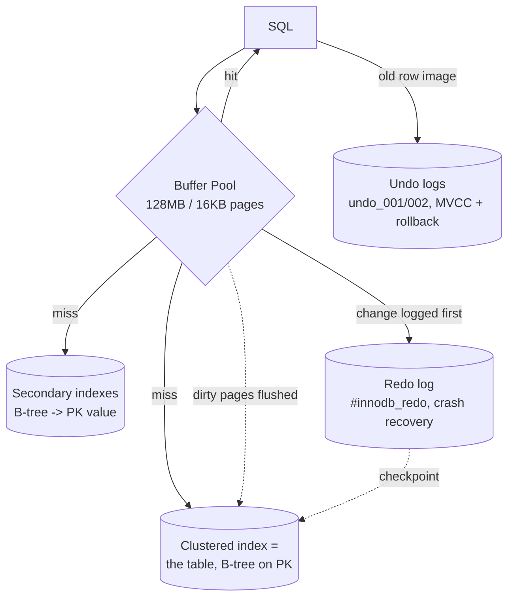

# MySQL / InnoDB Storage Engine

> InnoDB, MySQL's default storage engine, is a case study in the choices PostgreSQL deliberately *did not* make. Postgres keeps unordered heaps and creates new row versions by appending; InnoDB instead lays out every table **as a B-tree clustered on its primary key** and versions rows by stashing their *old* values in **undo logs** while overwriting the row **in place**. Both of those claims are checked here against a running **MySQL 9.6 / InnoDB** server. Every EXPLAIN, lock dump, and size figure that follows is real captured output (`results.txt`, `locks.txt`) over this folder's dataset (20k students, 200k enrollments).

---

## 1. Problem Background

InnoDB (Innobase, 2001; under Oracle since 2005) exists to supply the features MySQL's original MyISAM engine never had: **transactions, crash recovery, and row-level locking**. Architecturally it sits squarely in the Oracle/System-R tradition — clustered storage, undo-based MVCC, and ARIES-style redo logging. The central bet is to let the **primary key define the physical layout of the data**, making PK point lookups and range scans about as fast as they can get, and absorbing the cost of everything else (secondary indexes, concurrent reads) on top of that foundation.

---

## 2. Architecture Overview



Two logs doing two separate jobs — which answers the assignment's question ("why both?"):
- **Redo log** = "what the new value *will* be." After a crash it is replayed forward to re-apply committed changes that never made it to disk. → **durability**.
- **Undo log** = "what the old value *was*." It rolls back aborted transactions **and** rebuilds earlier row versions for MVCC reads. → **atomicity + isolation**.

---

## 3. Internal Design

### 3.1 Clustered index = the table itself

InnoDB does **not** keep a separate heap with indexes pointing into it (that's the Postgres model). Here the table *is* a B-tree, sorted by primary key, and its **leaf nodes hold the complete rows**. A primary-key lookup therefore descends a single B-tree straight onto the data:

```
EXPLAIN SELECT * FROM enrollments WHERE id = 12345;
-> Rows fetched before execution (cost=0..0 rows=1)   -- direct clustered hit, no extra step
```

### 3.2 Secondary indexes store the PK, not a row pointer

A secondary-index leaf doesn't reference a physical row position — it carries the **primary-key value** instead. A lookup through a secondary key is thus *two* B-tree descents: secondary index → PK, then PK → clustered index → row. This is the well-known **"back-reference"** (also called a bookmark lookup):

```
-- needs full row -> secondary index THEN clustered lookup
EXPLAIN SELECT * FROM enrollments WHERE student_id = 12345;
-> Index lookup using idx_student (student_id=12345)  (cost=3.5 rows=10)

-- only needs columns already in the index -> no back-reference
EXPLAIN SELECT id, student_id FROM enrollments WHERE student_id = 12345;
-> Covering index lookup using idx_student            (cost=1.25 rows=10)
```

The cost falls **3.5 → 1.25** entirely because the **covering** query never needs to bounce back to the clustered index. The trade-off shows up on disk: since every secondary-index entry must embed the PK, the index ends up almost as big as the clustered table itself —

```
table        index        pages   size
enrollments  PRIMARY        481   7.5 MB   <- clustered (full rows)
enrollments  idx_student    353   5.5 MB   <- secondary (student_id + PK id)
```

### 3.3 Selectivity still decides index vs scan

The Postgres lesson holds here too — InnoDB drops to a **full clustered scan** whenever a predicate isn't selective enough:
```
EXPLAIN SELECT * FROM enrollments WHERE grade = 7;
-> Table scan on enrollments (cost=20104 rows=199836), Filter: grade=7
```
`grade` only takes 11 distinct values, so `grade=7` covers roughly 18k rows — and the optimizer rightly refuses an index for 9% of the table.

### 3.4 Buffer pool

InnoDB's **buffer pool** plays the same role Postgres shared buffers do: an in-memory cache of **16 KB pages** (compare: 16 KB here, 8 KB in Postgres, 4 KB in SQLite) governed by a **midpoint-insertion LRU** built to resist scan pollution — incoming pages land at the LRU *midpoint* rather than the head, so a large scan can't evict the hot working set.
```
innodb_buffer_pool_size = 128 MB | page_size = 16384 | flush_log_at_trx_commit = 1
POOL pages = 8191 | data pages = 2126 | free = 6065
```

### 3.5 MVCC via undo logs (not extra row versions)

InnoDB overwrites rows **in place** within the clustered index. To still hand readers a consistent snapshot, each row carries hidden `DB_TRX_ID` and `DB_ROLL_PTR` columns; `DB_ROLL_PTR` references the **undo log**, where the *previous* version lives. When an MVCC read lands on a too-new row, it follows the undo chain backwards until it reaches the version its snapshot is allowed to see. A background **purge** thread reclaims old undo once no snapshot still needs it — effectively Postgres's VACUUM, except aimed at undo records rather than dead heap tuples:
```
History list length 10      -- undo versions still retained for active/old snapshots
```

### 3.6 Locking — row locks and gap locks

What InnoDB actually locks is **index records**, not abstract rows. At **REPEATABLE READ** (the default), it applies **next-key locks** = a lock on the index record **together with the gap in front of it**, and that is precisely how it blocks **phantom** inserts. I held a transaction with `SELECT ... WHERE id BETWEEN 100 AND 110 FOR UPDATE` open and read `performance_schema.data_locks` from a separate session:

```
OBJECT     INDEX    LOCK_TYPE  LOCK_MODE        LOCK_DATA
students   NULL     TABLE      IX               (intention exclusive on table)
students   PRIMARY  RECORD     X,REC_NOT_GAP    100      <- the row itself
students   PRIMARY  RECORD     X                101      <- next-key: record 101 + gap (100,101)
students   PRIMARY  RECORD     X                102
   ... through ...                              110
trx_rows_locked = 11
```

Look closely: it locked more than just the 11 rows. Each bare `X` (next-key) lock spans the record **and the gap preceding it**, so no other session **can insert** an `id` inside the range — that is phantom prevention. The boundary row 100 receives `REC_NOT_GAP` (the record only). The table-level **IX** (intention) lock signals "I'm holding row X-locks in this table," letting a whole-table lock request spot the conflict in O(1) without walking every individual row lock.

### 3.7 Redo log & crash recovery

```
Log sequence number 40386926 | Log flushed up to 40386926 | Last checkpoint 40386926
redo files: 32 × ~3 MB in #innodb_redo/   |  undo: undo_001, undo_002 (16 MB each)
```
Under `flush_log_at_trx_commit = 1`, each commit flushes the **redo log** to disk (ARIES write-ahead logging) before it returns. The dirty 16 KB data pages get flushed lazily; at restart, InnoDB replays redo forward from the **last checkpoint LSN**, then unwinds any transactions that were still open at the moment of the crash using the **undo** log. New value forward (redo) plus old value backward (undo) yields exactly-once recovery.

---

## 4. Design Trade-Offs

**Clustered index — the upside and the bill.**
- *Advantage:* PK lookups and PK range scans are as fast as possible — the data lives *inside* the index leaf, in PK order, so a range scan reads sequentially and a point lookup is one B-tree descent (`cost ≈ 0`).
- *Cost:* every **secondary-index lookup owes a back-reference** to the clustered index (3.5 vs 1.25 above), secondary indexes are **inflated** by carrying the PK (5.5 MB vs 7.5 MB), and a **big or random PK** (a UUID, say) wrecks insert locality and swells every secondary index. That's exactly why InnoDB shops favor small, monotonically increasing primary keys.

**Why keep both undo and redo logs?** Because they cover different halves of ACID and run in opposite temporal directions. **Redo** = *durability*: re-apply committed changes that were lost in the buffer pool at crash time. **Undo** = *atomicity + isolation*: reverse aborted transactions and feed old row versions to MVCC readers. The two can't be merged into one log — one is a record of the future, the other of the past.

**In-place update + undo (InnoDB) vs append new version + VACUUM (Postgres).**

| | InnoDB | PostgreSQL |
|---|---|---|
| Update | in place, old value → undo | append new tuple, mark old dead |
| MVCC source | undo chain | multiple heap tuples (xmin/xmax) |
| Cleanup | **purge** old undo | **VACUUM** dead tuples |
| Secondary index on update | unchanged if non-key cols (PK stable) | non-HOT update touches every index |
| Cost of long readers | undo segment grows (history list) | dead tuples accumulate / bloat |

InnoDB keeps the *primary* table compact (in-place writes) and pays with undo-chain traversals for old snapshots; Postgres keeps the write itself trivial (just append) and pays with table bloat. Neither comes for free — it's the one MVCC problem, settled out of a different pocket.

**Isolation levels.** InnoDB defaults to **REPEATABLE READ** and leans on next-key locking to make it phantom-free (stricter than the SQL standard demands). Postgres defaults to **Read Committed**. The price InnoDB pays is its gap locks: they cut concurrency on ranges (and can produce deadlocks) in return for that phantom protection.

---

## 5. Experiments / Observations

1. **Clustered vs secondary, measured.** A full-row fetch by `student_id` cost **3.5** (secondary index plus clustered back-reference); the *covering* version that needed only indexed columns cost **1.25** — straight evidence that the secondary index holds the PK and must hop back to the cluster for any non-covered column.
2. **Secondary-index size confirms the design.** `idx_student` weighs **5.5 MB** against the clustered **7.5 MB** — a secondary index over one `INT` column is this large precisely because each entry also stores the 4-byte PK.
3. **The join ran as a nested loop with covering index lookups:**
   ```
   EXPLAIN ANALYZE ... JOIN ... WHERE s.dept='CS'
   Nested loop inner join (actual time=0.04..6.55 rows=40000)
     Covering index lookup on s using idx_dept (dept='CS') rows=4000
     Covering index lookup on e using idx_student (student_id=s.id) loops=4000
   ```
   InnoDB drove the join off the selective `dept='CS'` side (4,000 rows) and probed `idx_student` 4,000 times — a textbook index nested-loop.
4. **Gap locks are real and observable.** `BETWEEN 100 AND 110 FOR UPDATE` yielded **11 next-key locks** plus an **IX** table lock; the gaps between keys were locked, which is exactly what blocks a concurrent `INSERT id=105`.
5. **Two logs, two on-disk files.** `#innodb_redo/` (32 files) for redo; `undo_001/undo_002` (16 MB each) for undo. At idle the redo LSN, flushed-LSN, and checkpoint-LSN were all identical (everything durably flushed).

---

## 6. Key Learnings

1. **"The table is a B-tree on the PK" accounts for nearly everything else** — fast PK access, the secondary-index back-reference, the size of secondary indexes, and why the choice of PK matters so much.
2. **Covering indexes are InnoDB's single biggest query win** (3.5 → 1.25): when the index already carries every column you select, InnoDB never has to touch the clustered index.
3. **Undo and redo aren't redundant.** Redo re-does committed work after a crash (durability); undo un-does aborted work and powers MVCC (atomicity + isolation). Opposite directions in time, both indispensable.
4. **Gap/next-key locking is REPEATABLE READ's phantom defense** — I watched it lock the gaps, not just the rows. It's stronger isolation than Postgres's default, bought with reduced range-concurrency.
5. **InnoDB and PostgreSQL tackle the same MVCC problem as mirror images.** In-place + undo + purge versus append + dead-tuples + VACUUM. Setting them side by side is the clearest way to see that "MVCC" names a goal, not one specific implementation.
