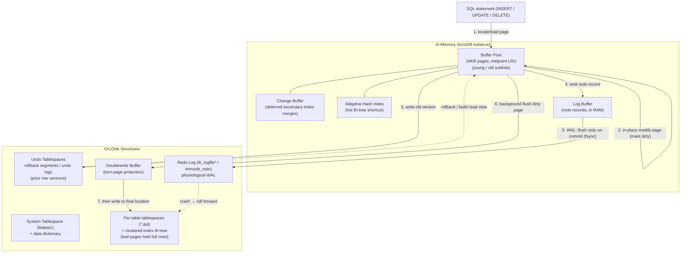

# MySQL / InnoDB Storage Engine — A System Design Discussion

> Advanced DBMS — System Design Discussion
> Topic: The InnoDB Storage Engine, analyzed against PostgreSQL.

This document is an attempt to reason about *why* InnoDB is built the way it is, not
merely to catalogue its parts. The recurring lens is a comparison with PostgreSQL,
because the two engines made nearly opposite choices on the same problems (MVCC,
row identity, on-disk layout), and the contrast is the fastest way to expose the
engineering reasoning behind each.

---

## 1. Problem Background

InnoDB began life outside MySQL. It was developed by **Innobase Oy** (Heikki Tuuri,
Finland) in the late 1990s as a transactional storage engine that could be plugged
into MySQL through MySQL's pluggable storage-engine API. Oracle acquired Innobase in
2005 and later MySQL itself (via Sun) in 2010, so today both sit under one roof. From
**MySQL 5.5 (2010) InnoDB became the default engine**, displacing **MyISAM**.

That replacement was not cosmetic. MyISAM was a fast, compact engine for read-heavy,
mostly-static workloads, but it had structural gaps that made it unsuitable as a
general transactional backend:

| Requirement | MyISAM | Why it matters |
|---|---|---|
| Transactions (ACID) | None — no commit/rollback | Multi-statement business logic cannot be atomic |
| Locking granularity | **Table-level locks** only | One writer blocks all readers/writers on the table → no OLTP concurrency |
| Crash recovery | None — relies on `myisamchk` repair after a crash | A power loss mid-write can silently corrupt tables |
| Referential integrity | No foreign keys | Integrity pushed entirely into the application |
| Durability | Writes can be lost on crash | Cannot promise "committed means persisted" |

The design goal of InnoDB follows directly from that gap list: a **crash-safe,
fully ACID, high-concurrency OLTP engine**. Concretely that meant four commitments
that shape everything in section 3:

1. **Row-level locking + MVCC** so that readers never block writers and writers
   rarely block readers — the prerequisite for high concurrency.
2. **Write-ahead logging (redo)** so a crash can be rolled *forward* to the last
   committed state.
3. **Undo logging** so an in-flight transaction can be rolled *back*, and so old row
   versions exist for consistent reads.
4. **Clustered storage** so primary-key access and range scans are cheap by
   construction.

Everything below is downstream of those four decisions.

---

## 2. Architecture Overview

InnoDB is split into **in-memory structures** (volatile, for speed) and **on-disk
structures** (durable, for correctness). The interesting part is the *write path*:
a change touches memory first, is made durable in the redo log via WAL **before** the
data page is flushed, and the old version is preserved in undo for rollback/MVCC.



**Write data flow in words:**

```
SQL  →  buffer-pool page (in-place modify, page now "dirty")
     →  undo log records the PRIOR version of the row
     →  redo log buffer gets a physiological record of the change
     →  on COMMIT: redo is fsync'd (WAL — durability point)
     →  later, a background thread flushes the dirty page:
            page → doublewrite buffer (sequential, fsync)
                 → final .ibd location (random write)
```

The key invariant — the *write-ahead* rule — is: **the redo record for a change is
made durable before the corresponding data page is allowed to reach the datafile.**
This is what makes the data page on disk "recoverable even if it is stale": redo can
always replay the missing changes forward.

---

## 3. Internal Design

### 3.1 Clustered Index / Primary-Key Storage

The single most consequential design decision in InnoDB: **the table *is* the
primary-key B+tree.** There is no separate heap. The clustered index's **leaf pages
store the full row**, physically ordered by primary key. The B+tree internal pages
hold only key + child-pointer; the leaves hold the actual columns.

```
Clustered index (the table itself) — ordered by PRIMARY KEY
┌───────────────────────────────────────────────────────────┐
│ internal page:  [k=100 | k=200 | k=300] → child pointers    │
└───────────────────────────────────────────────────────────┘
                 │            │            │
                 ▼            ▼            ▼
  ┌──────────────────────────────────────────────────────┐
  │ LEAF PAGE (16 KB), rows in PK order:                  │
  │  PK=101 | name | email | created_at | DB_TRX_ID | ... │
  │  PK=102 | name | email | created_at | DB_TRX_ID | ... │
  │  PK=103 | ...full row...                              │
  └──────────────────────────────────────────────────────┘
```

Consequences that fall out of this layout:

- **PK point lookups are fast**: descend the B+tree once and the *entire row* is right
  there at the leaf — no second fetch.
- **PK range scans are fast and cache-friendly**: `WHERE id BETWEEN 100 AND 200`
  walks physically adjacent leaf pages (the leaves are doubly linked), so the rows are
  *already* in order and clustered on the same/neighboring pages. Sequential I/O,
  great locality.
- **Pages are 16 KB by default.** A 16 KB page holds many rows; InnoDB requires a page
  to hold at least two rows, which bounds maximum row size in the clustered index.

**Your choice of primary key silently controls physical layout.** Because rows are
stored *in PK order*:

- An **`AUTO_INCREMENT`** PK means every new row sorts to the *end* → inserts append to
  the rightmost leaf page → minimal page splits, tight packing.
- A **random PK (e.g. a random UUIDv4)** scatters inserts across the whole key space →
  a new row lands in the *middle* of a near-full page → **page split**, half the page
  copied elsewhere, fragmentation, more dirty pages, worse cache hit ratio, and a
  larger index. This is one of the most common real-world InnoDB performance traps.
  (Time-ordered UUIDs like v7 largely fix this by restoring append-mostly behaviour.)

### 3.2 Secondary Indexes

A secondary index is a *separate* B+tree, but its leaves do **not** point at a physical
row location. Instead each secondary leaf entry stores **(indexed columns + the
PRIMARY KEY value)**.

```
Secondary index on (email)            Then a second descent (bookmark lookup):
┌───────────────────────────────┐     ┌──────────────────────────────────────┐
│ LEAF: email='a@x' → PK=103     │ ──► │ Clustered index: find PK=103 → row    │
│       email='b@y' → PK=101     │     │ (full columns at the clustered leaf)  │
└───────────────────────────────┘     └──────────────────────────────────────┘
        (indexed col + PK)                    "double lookup"
```

So a query like `SELECT * FROM users WHERE email = ?` does **two** B+tree descents:
one in the secondary index to find the PK, then a **bookmark lookup** into the
clustered index to fetch the rest of the row. The exception is a **covering index** —
if every column the query needs is already in the secondary index (the indexed columns
plus the PK that is implicitly stored), InnoDB answers from the secondary index alone
and skips the clustered descent (`EXPLAIN` shows `Using index`).

**Why store the PK instead of a physical pointer?** Because in a clustered table a row
**moves** — a page split or row update can physically relocate it within the clustered
B+tree. A physical pointer would have to be chased and rewritten across potentially
many secondary indexes on every relocation. The **PK is a stable logical identity**
that survives relocation, so secondary indexes never need updating when a row merely
moves pages. The cost paid for this stability:

- Every secondary index implicitly **carries the PK in every entry** → a fat PK (e.g.
  a 36-char UUID string) **bloats every secondary index**.
- Non-covering secondary lookups cost an extra clustered descent.

> **Contrast with PostgreSQL:** Postgres indexes store a **heap TID** (a direct
> `(page, slot)` pointer into the heap). A secondary-index lookup is one index descent
> plus a direct heap fetch — no second B+tree descent. But because the pointer is
> physical, Postgres needs extra machinery (HOT updates, index bloat, VACUUM) to keep
> those pointers valid as tuples are versioned. Two philosophies: InnoDB indirects
> through a logical key; Postgres points physically and cleans up later.

### 3.3 Buffer Pool

The buffer pool is InnoDB's page cache: 16 KB pages of *both* data and index, kept in
RAM. Hits avoid disk entirely; this is usually the single most important tuning knob
(`innodb_buffer_pool_size`). Notable internals:

- **Midpoint-insertion LRU.** A naive LRU would let a one-off full table scan evict the
  entire hot working set ("scan pollution"). InnoDB splits the LRU into a **young
  (new) sublist** and an **old sublist**, and inserts newly read pages at the
  **midpoint** (head of the *old* sublist, ~37% from the tail by default). A page only
  graduates to the young sublist if it is accessed *again* after a short time window.
  A big sequential scan reads each page once → those pages stay in the old sublist and
  are evicted first, **protecting the hot set**.
- **Dirty pages and flushing.** Modified pages are "dirty" and flushed lazily by
  background threads (page cleaners), driven by checkpoint age and free-list pressure.
  Decoupling modify-time from flush-time is what lets writes batch and turn random
  writes into more sequential ones.
- **Change buffer.** When a DML changes a **secondary, non-unique** index and the
  target leaf page is *not* in the buffer pool, InnoDB records the change in the
  **change buffer** instead of reading the page in just to modify it. The change is
  merged later when the page is naturally read for another reason. This converts random
  read-modify-write of secondary indexes into deferred, batched work — a big win for
  write-heavy workloads with indexes that don't fit in RAM.
- **Adaptive Hash Index (AHI).** InnoDB watches access patterns and, for hot index
  prefixes, builds an in-memory **hash index** on top of the B+tree so repeated lookups
  skip the tree descent and go straight to the page. It's automatic and self-tuning
  (and can be disabled if it becomes a contention point).

### 3.4 Undo Logs

When InnoDB updates a row **in place**, it first copies the **prior version** of that
row into an **undo log record** (stored in rollback segments inside undo tablespaces).
Undo serves **two distinct purposes**:

1. **Rollback (atomicity).** If the transaction aborts, InnoDB walks its undo records
   and restores the prior versions — undoing the in-place changes.
2. **MVCC consistent reads.** A reader that should *not* see this transaction's change
   follows the undo chain backward to **reconstruct the version of the row as of its
   read view**. This is how readers don't block writers: instead of waiting, a reader
   builds the older version from undo.

Two hidden columns wire this together on every clustered row:

- **`DB_TRX_ID`** — the transaction id that last modified the row.
- **`DB_ROLL_PTR`** — a pointer to the undo record holding the *previous* version,
  which itself points further back, forming a **version chain**.

```
Current row (clustered leaf)            Undo log (older versions)
  PK=42 | val='C' | TRX=300 | ROLL ─────►  val='B' | TRX=200 | ROLL ──► val='A' | TRX=100
   (latest)                                   (visible to older read views, walking back)
```

A **read view** captures the set of transactions that were active at snapshot time.
For each row, InnoDB checks `DB_TRX_ID`: if the modifying transaction is not visible to
this read view, it follows `DB_ROLL_PTR` back through undo until it finds a version
that *is* visible.

Undo can't grow forever. The **purge thread** runs in the background and discards undo
records once **no read view could still need them** (i.e. older than the oldest active
snapshot). Long-running transactions are dangerous precisely because they hold the
oldest read view open and **block purge**, causing undo (the "history list") to balloon.

### 3.5 Redo Logs

The redo log is InnoDB's **write-ahead log** and the basis of durability and crash
recovery. It is **physiological**: records are logical-within-a-physical-page
("apply change X to page P at offset O"), a compromise that is compact like a logical
log but unambiguous like a physical one.

- **WAL ordering:** the redo record of a change is fsync'd to the redo log **before**
  the dirty data page may be written to its datafile. On `COMMIT`, the relevant redo is
  flushed (subject to `innodb_flush_log_at_trx_commit`) — *that* fsync is the moment a
  transaction becomes durable, even though the data page is still only dirty in RAM.
- **LSN (Log Sequence Number):** a monotonically increasing byte offset into the redo
  stream. Every page records the LSN of the last change applied to it. On recovery,
  InnoDB replays redo from the last checkpoint forward, **skipping changes already in a
  page** (page LSN ≥ redo LSN), and **applying** those that are missing — *roll
  forward* to the last committed state.
- **Fuzzy checkpointing:** InnoDB does not stop the world to checkpoint. It
  continuously advances a checkpoint LSN as dirty pages are flushed, which lets it
  *truncate* old redo. "Fuzzy" = pages are flushed gradually, so the checkpoint marks
  "everything before LSN N is safely on disk," bounding recovery time.

**Doublewrite buffer — defending against torn pages.** A 16 KB InnoDB page is larger
than the typical 4 KB the OS/disk writes atomically. A crash mid-write can leave a
**torn (partial) page** — half old, half new — which redo *cannot* fix, because redo
assumes it is applied to a *consistent* page. So before writing a batch of dirty pages
to their final scattered locations, InnoDB first writes them **sequentially into the
doublewrite buffer and fsyncs**. If a crash tears a final write, recovery finds the
intact copy in the doublewrite buffer and restores it, *then* applies redo. It is a
small write-amplification cost (~the data is written twice) bought to guarantee redo
always has a clean page to replay onto.

> **Contrast with PostgreSQL:** Postgres solves torn pages differently — with
> **full-page writes**, logging the entire page image into the WAL the first time it is
> touched after a checkpoint. Same problem, two solutions: InnoDB pays with a separate
> doublewrite area; Postgres pays with a larger WAL.

### 3.6 Locking

InnoDB does **row-level locking**, but the crucial detail is *how*: **locks are placed
on index records, not on rows directly.** A lock is a lock on a B+tree index entry.

Lock types:

- **Shared (S) / Exclusive (X) record locks** on individual index records.
- **Gap locks** — a lock on the *gap between* index records (a range where no record
  currently exists).
- **Next-key locks** — the **default under REPEATABLE READ**: a record lock **plus**
  the gap *before* it. This is the phantom-prevention mechanism.
- **Intention locks (IS / IX)** — *table-level* flags announcing "I intend to take
  row locks of this kind below." They let InnoDB check table-vs-row lock compatibility
  cheaply without scanning every row lock (e.g. a table-level `LOCK TABLES ... WRITE`
  conflicts with an existing IX).
- **Insert intention locks** — a special gap lock that lets concurrent inserts into the
  same gap proceed if they don't collide on the same key.

**Why gap / next-key locks exist.** Under **REPEATABLE READ**, a transaction must not
see **phantom rows** — rows that appear in a re-run of the same range query because
another transaction inserted into that range. A pure record lock can't prevent an
*insert of a new key* in the range (there's no existing record to lock). By locking the
**gaps** as well, InnoDB forbids inserts into the queried range until the transaction
ends, eliminating phantoms *without* needing full serialization. This is why InnoDB's
REPEATABLE READ is stronger (re: phantoms) than the SQL-standard definition.

**Deadlock detection.** InnoDB maintains a waits-for graph and, on detecting a cycle,
**rolls back the transaction with the least work** to break it (returning a deadlock
error to that client) rather than waiting for a timeout.

**Isolation levels and read views:**

| Level | Behaviour in InnoDB |
|---|---|
| READ UNCOMMITTED | Dirty reads allowed; reads latest version, may see uncommitted data |
| READ COMMITTED | **A fresh read view per statement** → each statement sees latest committed data; non-repeatable reads possible; uses mostly record locks (fewer gap locks) |
| **REPEATABLE READ** *(default)* | **One read view for the whole transaction** → consistent snapshot for the duration; next-key locks prevent phantoms |
| SERIALIZABLE | Like RR but plain `SELECT` becomes locking (`LOCK IN SHARE MODE`), fully serializing |

The MVCC distinction is worth stating sharply: **READ COMMITTED takes a new snapshot at
the start of each statement; REPEATABLE READ takes the snapshot once at the
transaction's first read and reuses it.** That single difference is what makes RR
repeatable and RC not.

---

## 4. Design Trade-Offs (InnoDB vs PostgreSQL)

This is the heart of the discussion. InnoDB and PostgreSQL both implement ACID + MVCC,
but they made *opposite* choices on row identity, update strategy, and where old
versions live. Each set of choices is internally coherent — they are different points
on the same trade-off surface.

### 4.1 Head-to-head comparison

| Dimension | **InnoDB (MySQL)** | **PostgreSQL** |
|---|---|---|
| Table storage | **Clustered** — table IS the PK B+tree, rows in PK order | **Heap** — unordered tuples; all indexes are "secondary" |
| Update strategy | **In-place update**; prior version pushed to undo | **Append-only** — UPDATE writes a *new tuple version* in the heap |
| Where old versions live | **Undo log** (separate area) | **In the table itself** (dead tuples among live ones) |
| MVCC style | Oracle-style: one current row + undo version chain | Multi-version tuples: many versions coexist in the heap |
| Garbage collection | **Purge thread** trims undo no read view needs | **VACUUM** reclaims dead tuples |
| Secondary index leaf | (indexed cols + **PK value**) → double lookup | Direct **heap TID** `(page, slot)` pointer |
| Row identity | **Primary key** (logical, stable across moves) | Physical TID (must be maintained: HOT, bloat) |
| PK range scan | Cheap — data physically ordered & adjacent | Needs an index + heap fetches; data not clustered (unless `CLUSTER`, which decays) |
| Cost of a hot UPDATE | Cheap if version chain short; long txns bloat undo/history | Cheap write, but creates dead tuples → bloat → VACUUM pressure |
| Torn-page defense | Doublewrite buffer | Full-page writes in WAL |

### 4.2 Why does InnoDB need *both* undo AND redo logs?

This trips people up, so state it plainly: **undo and redo solve opposite-direction
problems.**

- **Redo = roll *forward* for durability.** After a crash, redo lets InnoDB *replay*
  committed changes that hadn't yet reached the datafiles. It answers: *"how do I not
  lose committed work?"*
- **Undo = roll *backward* for atomicity (and MVCC).** Undo lets InnoDB *reverse* the
  in-place changes of a transaction that did **not** commit, and lets readers
  *reconstruct* older versions. It answers: *"how do I cancel uncommitted work, and how
  do I show readers a consistent past?"*

They are duals: redo moves the database *toward* the latest committed state; undo moves
a row *back* to a prior state. Because InnoDB updates **in place**, it *must* stash the
old bytes somewhere before overwriting them — that's undo. And because it flushes data
pages lazily (after commit), it *must* have a way to re-apply committed-but-unflushed
changes — that's redo. PostgreSQL needs **no undo log** precisely because it *doesn't*
overwrite in place: the old version is still sitting in the heap, so "rollback" just
means "the new tuple version is never made visible," and MVCC reads just find the right
existing tuple. The price Postgres pays instead is **dead tuples and VACUUM**.

### 4.3 Clustered index: advantages and costs

**Advantages:**

- **PK range-scan locality** — physically ordered rows mean range queries and
  PK-ordered iteration are sequential I/O; no separate heap fetch.
- **No separate heap** — the leaf already holds the row, so PK lookups are one descent
  and there's no heap-bloat/visibility-map machinery.

**Costs:**

- **Expensive non-covering secondary lookups** — every secondary hit needs a second
  clustered descent (the bookmark lookup).
- **PK bloats every secondary index** — the PK is embedded in *every* secondary entry;
  a wide PK multiplies storage and cache pressure across all indexes. (Strong argument
  for a narrow, monotonic surrogate PK.)
- **Insert fragmentation with random PKs** — random insertion order → page splits and
  poor packing, as described in §3.1.

### 4.4 Why did PostgreSQL choose a different MVCC model?

Postgres put **versions in the table** (append-only heap tuples) instead of in a
separate undo area. The reasoning and its consequences:

- **Simpler write path / no undo subsystem** — an UPDATE just inserts a new tuple and
  marks the old one's `xmax`; rollback is trivial (don't make the new one visible).
  There's no undo to manage, no purge thread, no version-chain rebuild on read.
- **But it needs VACUUM** — dead tuples accumulate in the heap and must be reclaimed;
  neglected VACUUM → **table and index bloat**, transaction-id wraparound risk, and
  degraded scans. Autovacuum exists to manage exactly this.
- **InnoDB keeps the table compact** (one current row in place) at the cost of **undo +
  purge complexity** and the risk that a long transaction freezes purge and bloats the
  undo/history list.

So the trade is symmetric: *Postgres trades clean writes for cleanup later (VACUUM);
InnoDB trades a compact table for the bookkeeping of undo and purge.* Neither is free.

### 4.5 Performance implications, summarized

- **PK-ordered range / point access:** InnoDB tends to win (clustering, locality).
- **Wide-row UPDATE-heavy churn:** Postgres's append can be simpler per-write, but
  generates bloat; InnoDB stays compact but loads the undo/purge path.
- **Many secondary-index reads of full rows:** Postgres's direct TID fetch avoids the
  second B+tree descent InnoDB pays.
- **Long-running transactions:** painful for *both*, in mirror-image ways — undo/history
  bloat in InnoDB, blocked VACUUM and dead-tuple accumulation in Postgres.

---

## 5. Experiments / Observations

> **Honesty note:** MySQL was **not run on this machine** for this submission. The
> outputs below are **representative output (documented behaviour — not run on this
> machine)**, constructed to match how MySQL/InnoDB is documented to behave, and are
> labelled as such. They are included to interpret InnoDB's behaviour, not to claim a
> live benchmark.

### (a) `EXPLAIN` for a join — clustered vs secondary access

```sql
EXPLAIN
SELECT o.id, o.total, u.email
FROM   orders o
JOIN   users  u ON u.id = o.user_id
WHERE  o.status = 'PAID';
```

```
-- representative output (documented behaviour — not run on this machine)
+----+-------------+-------+--------+------------------+-----------+---------+-----------------+------+----------+-------------+
| id | select_type | table | type   | possible_keys    | key       | key_len | ref             | rows | filtered | Extra       |
+----+-------------+-------+--------+------------------+-----------+---------+-----------------+------+----------+-------------+
|  1 | SIMPLE      | o     | ref    | idx_status,...   | idx_status| 4       | const           | 1200 |   100.00 | Using where |
|  1 | SIMPLE      | u     | eq_ref | PRIMARY          | PRIMARY   | 4       | shop.o.user_id  |    1 |   100.00 | NULL        |
+----+-------------+-------+--------+------------------+-----------+---------+-----------------+------+----------+-------------+
```

**Interpretation:**

- For `orders`, `type: ref` on `idx_status` means a **secondary-index** range is scanned
  for `status='PAID'` (~1200 estimated rows). Each match yields a PK, and since the
  query needs `o.total` (not in `idx_status`), InnoDB performs the **bookmark lookup**
  into the clustered index — the §3.2 double-lookup in action.
- For `users`, `type: eq_ref` with `key: PRIMARY` is the *best possible* join access:
  for each order, exactly one user row is fetched by **primary key** — a single
  clustered B+tree descent that lands directly on the full row (§3.1). This is why
  joining on a PK is so cheap in InnoDB.
- If we created a covering index `idx_status_total(status, total)`, `Extra` would read
  `Using index` and the bookmark lookup would disappear entirely.

### (b) `SHOW ENGINE INNODB STATUS` excerpt

```
-- representative output (documented behaviour — not run on this machine)

------------
TRANSACTIONS
------------
Trx id counter 0  4827193
Purge done for trx's n:o < 4827020 undo n:o < 0
History list length 412
---TRANSACTION 4827188, ACTIVE 7 sec starting index read
mysql tables in use 1, locked 1
LOCK WAIT 3 lock struct(s), heap size 1136, 2 row lock(s)
MySQL thread id 88, query id 90122 ... updating
UPDATE accounts SET balance = balance - 100 WHERE id = 7
------- TRX HAS BEEN WAITING 4 SEC FOR THIS LOCK TO BE GRANTED:
RECORD LOCKS space id 42 page no 5 n bits 80 index PRIMARY of table `bank`.`accounts`
  trx id 4827188 lock_mode X locks rec but not gap waiting

----------------------
BUFFER POOL AND MEMORY
----------------------
Total large memory allocated 137428992
Buffer pool size        8192      (pages, i.e. 128 MB)
Free buffers            512
Database pages          7680
Modified db pages       430        (dirty pages awaiting flush)
Buffer pool hit rate    998 / 1000 (≈99.8%)
Pages made young 14233, not young 90122   (midpoint-LRU promotions)

---
LOG
---
Log sequence number          1 938472615      (current LSN)
Log flushed up to            1 938472615
Last checkpoint at           1 938201044      (checkpoint LSN)
Checkpoint age ≈ 271 KB  (LSN - checkpoint LSN → bounds crash recovery)
```

**Interpretation:**

- **History list length 412** and `Purge done for trx's < ...`: undo versions still
  retained for MVCC; if this number grew into the millions it would signal a long-lived
  transaction blocking **purge** (§3.4) — undo bloat.
- **TRANSACTIONS:** a transaction is **LOCK WAIT**ing on an **X record lock** on the
  PRIMARY index of `accounts` — an exclusive **record lock, "but not gap"** (§3.6). A
  second transaction holds the conflicting lock on the same PK.
- **BUFFER POOL:** ~99.8% hit rate means the working set fits in RAM; 430 **modified
  (dirty) pages** await background flush; *Pages made young / not young* exposes the
  **midpoint-insertion LRU** (§3.3) doing its job.
- **LOG:** the gap between **current LSN** and **last checkpoint LSN** ("checkpoint
  age") is exactly the amount of redo that would need replaying on crash — fuzzy
  checkpointing keeps it bounded (§3.5).

### (c) A next-key lock / deadlock scenario under REPEATABLE READ

Two sessions, table `accounts(id PK, balance)`, isolation = **REPEATABLE READ**.

```sql
-- representative behaviour (documented; not run on this machine)

-- T1
START TRANSACTION;
SELECT * FROM accounts WHERE id BETWEEN 10 AND 20 FOR UPDATE;
   -- T1 acquires NEXT-KEY locks over the range [10,20] AND the gaps around it,
   -- including the gap after the last existing key (say 18) up to the next key.

-- T2 (concurrently)
START TRANSACTION;
INSERT INTO accounts (id, balance) VALUES (15, 0);
   -- 15 falls inside a gap T1 has locked → T2 BLOCKS (insert-intention vs gap lock).
   -- This is phantom prevention: T1 must not see a new row 15 appear in its range.

-- T1 (continues, now also wants to insert)
INSERT INTO accounts (id, balance) VALUES (16, 0);
   -- If T2 had meanwhile acquired a conflicting gap/insert lock, the two now
   -- wait on each other → InnoDB detects the cycle and aborts the lower-cost trx:
   --   ERROR 1213 (40001): Deadlock found when trying to get lock;
   --   try restarting transaction
```

**Step-by-step interpretation:**

1. `SELECT ... FOR UPDATE` over a **range** takes **next-key locks** (record + preceding
   gap) across `[10,20]`, *including the open gaps* — not just the rows that exist.
2. T2's `INSERT` of `id=15` targets a **locked gap**, so it blocks. This is precisely
   the **phantom-prevention** guarantee of REPEATABLE READ (§3.6): no new row may slip
   into a range T1 has read for update.
3. When both transactions end up waiting on gap/insert-intention locks the other holds,
   InnoDB's **waits-for graph** finds a cycle and **rolls back the cheaper victim** with
   error 1213 — rather than hanging until a lock timeout.

The lesson: gap/next-key locks are *not* a bug or over-locking — they are the mechanism
that makes REPEATABLE READ phantom-free, and they are the most common source of
"surprising" lock waits and deadlocks in InnoDB.

---

## 6. Key Learnings

- **Your primary-key choice silently controls physical layout — and the size of every
  secondary index.** Because the table *is* the PK B+tree (§3.1) and every secondary
  entry embeds the PK (§3.2), a random/wide PK simultaneously fragments inserts *and*
  bloats every other index. A narrow, monotonic PK (`AUTO_INCREMENT` or UUIDv7) is not
  a style preference — it's a layout decision with engine-wide consequences.

- **Undo and redo are duals, not redundancy.** Redo rolls *forward* (durability); undo
  rolls *backward* (atomicity) and doubles as the source of MVCC old versions. InnoDB
  needs both *because* it updates in place and flushes lazily. Seeing them as opposite
  directions of the same time-axis is the clean mental model.

- **MVCC has no single "right" implementation.** InnoDB hides old versions in undo and
  keeps the table compact (paying purge complexity); PostgreSQL keeps old versions in
  the heap and stays simple on write (paying VACUUM). Same correctness guarantee,
  mirror-image costs — and the *same* Achilles' heel: long-running transactions wreck
  both (undo/history bloat vs blocked VACUUM).

- **Locks live on the index, and gaps are first-class.** "Row locking" is really
  *index-record* locking, and the gap/next-key machinery exists for one reason —
  phantom prevention under REPEATABLE READ. Most unexpected InnoDB lock waits are gap
  locks doing exactly their job.

- **Several features are pure trade-off purchases.** The doublewrite buffer buys
  torn-page safety with double writes; the change buffer buys write throughput with
  deferred consistency of secondary indexes; the adaptive hash index buys lookup speed
  with memory and occasional contention; midpoint LRU buys scan-resistance with a more
  complex eviction policy. Each is a knob someone can turn the wrong way.

- **The overarching lesson:** *a storage engine is a portfolio of engineering
  trade-offs, not a list of features.* Almost every InnoDB design choice has a coherent
  reason and a measurable cost, and the clearest way to *see* the cost is to put it next
  to PostgreSQL, which made the opposite bet on the same question. Understanding the
  *why* behind each bet is what lets you predict behaviour — and pick the right engine
  for a workload — instead of memorizing defaults.

---

## References

- **MySQL Reference Manual — Chapter "The InnoDB Storage Engine"**, Oracle/MySQL
  official documentation. In particular the sections on:
  - *InnoDB Architecture* (in-memory and on-disk structures).
  - *Clustered and Secondary Indexes* (the table as PK B+tree; secondary entries
    carrying the PK; covering indexes).
  - *Buffer Pool* (midpoint-insertion LRU / young & old sublists, change buffer,
    adaptive hash index).
  - *Redo Log*, *Undo Logs*, *Doublewrite Buffer*, and *Checkpoints* (WAL, LSN, fuzzy
    checkpointing, torn-page protection).
  - *InnoDB Locking and Transaction Model* (shared/exclusive, gap, next-key and
    intention locks; isolation levels; consistent nonlocking reads; deadlock detection).
  - *InnoDB Multi-Versioning* (DB_TRX_ID, DB_ROLL_PTR, read views, purge).
- **PostgreSQL official documentation**, used throughout for comparison — *MVCC /
  Concurrency Control* (in-heap tuple versions, `xmin`/`xmax`), *Routine Vacuuming*,
  *Index Access / heap TID pointers*, and *Reliability / WAL* (full-page writes). The
  PostgreSQL contrasts (append-only heap, VACUUM, TID pointers, no undo log) are drawn
  from that documentation to highlight the opposite design choices discussed in §4.

*All explanations, diagrams, comparisons, and interpretations above are written
originally for this submission; the references credit the source documentation whose
described behaviour the analysis is based on.*
