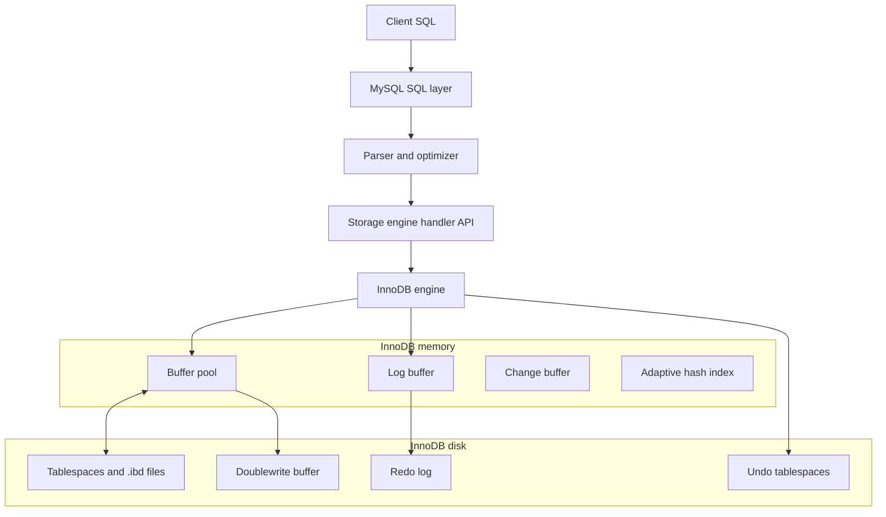
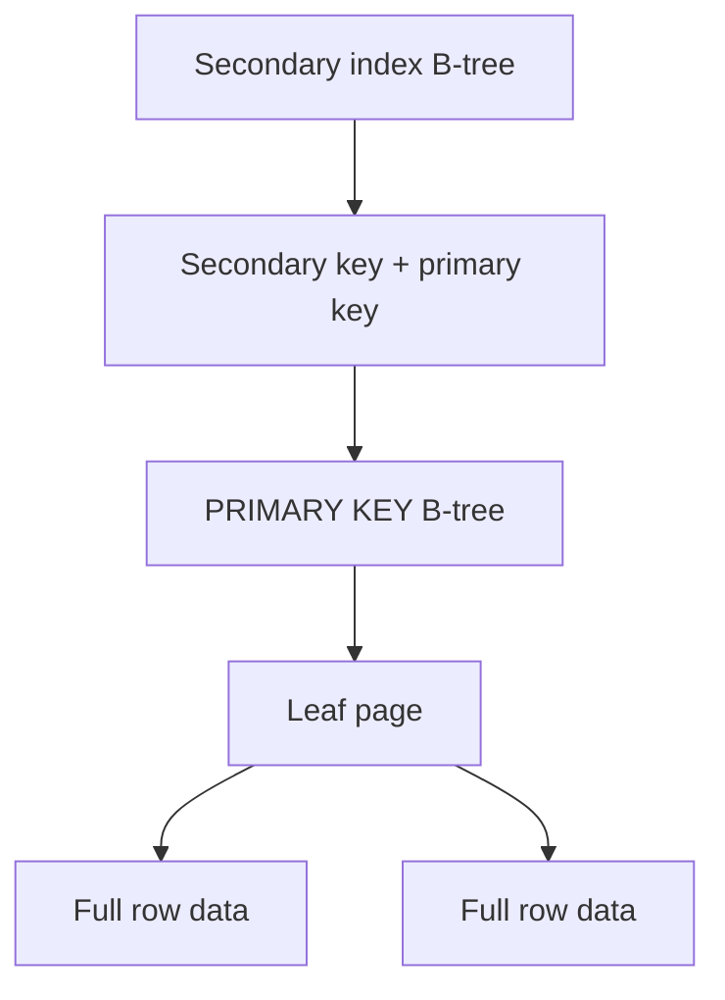
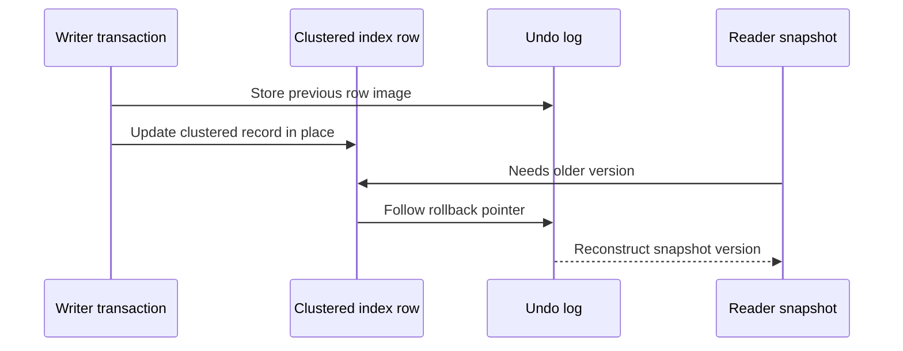

# MySQL / InnoDB Storage Engine

## 1. Problem Background

InnoDB is MySQL's default transactional storage engine. It exists to provide ACID transactions, row-level locking, foreign keys, crash recovery, and high-concurrency OLTP behavior behind the MySQL SQL layer.

The design problem is: how can a SQL database update rows in place, preserve older versions for consistent reads, recover after crashes, and still allow concurrent transactions?

InnoDB solves this by combining clustered B-tree storage, a buffer pool, undo logs for rollback and MVCC reads, redo logs for crash recovery, and index-record locks such as record, gap, and next-key locks.

## 2. Architecture Overview



The MySQL SQL layer owns parsing, optimization, and the handler interface. InnoDB owns row storage, indexes, page caching, locking, undo, redo, and physical recovery.

## 3. Internal Design

### Clustered Indexes and Primary Key Storage

Each InnoDB table has a clustered index that stores the row data. Usually the clustered index is the primary key. If no primary key exists, InnoDB chooses a suitable unique non-null index or creates a hidden clustered index. This means primary-key lookup reaches the row data directly through the clustered index.



The primary-key choice is therefore a physical design decision. A short, stable, monotonic key can help locality and reduce secondary-index size. A wide primary key is repeated in secondary indexes.

### Secondary Indexes

InnoDB secondary index records contain the secondary key plus the primary key columns. A secondary lookup normally finds matching primary keys first, then uses the clustered index to find full rows. This is why secondary indexes help reads but also add write cost and storage overhead.

### Buffer Pool

The buffer pool caches table and index pages in memory. MySQL documentation describes it as the main memory area where InnoDB caches table and index data. It uses a modified LRU approach with old and young page regions, which helps protect frequently used pages from large scans.

### Undo Logs and MVCC

InnoDB updates clustered index records in place, but hidden system columns point to undo log records. Undo logs let InnoDB roll back changes and reconstruct older versions for consistent reads. This differs from PostgreSQL, which stores multiple heap tuple versions directly in table pages until VACUUM can reclaim them.



### Redo Logs

Redo logs record page changes so InnoDB can recover committed work after a crash. Undo answers "how do I roll this transaction back or read an older version?" Redo answers "how do I replay committed page changes that were not fully flushed to tablespaces?"

### Row-Level Locking and Gap Locks

InnoDB row locks are index-record locks. The locking documentation says row-level locks are actually locks on index records. Gap locks protect gaps between index records, and next-key locks combine a record lock with a gap lock before the record. Under default `REPEATABLE READ`, range scans and locking reads can use next-key locks to prevent phantom inserts.

### Transaction Processing

The InnoDB transaction model combines multi-versioning with two-phase locking. Plain consistent reads use snapshots. Locking reads, updates, and deletes acquire locks on scanned index records or ranges. The default isolation level is `REPEATABLE READ`, though InnoDB also supports `READ UNCOMMITTED`, `READ COMMITTED`, and `SERIALIZABLE`.

## 4. Design Trade-Offs

| Design choice | Benefit | Cost |
| --- | --- | --- |
| Clustered index stores rows | Primary-key lookups are direct | Primary-key choice affects layout and secondary-index size |
| Secondary indexes include primary key | Secondary lookup can find clustered rows | Wide primary keys enlarge every secondary index |
| In-place clustered updates plus undo | Efficient current-row storage and snapshot reconstruction | Long transactions retain undo history |
| Redo log | Crash recovery for committed changes | Extra write path and checkpoint pressure |
| Gap and next-key locks | Prevent phantoms for locking range reads | Range locks can block inserts |
| Buffer pool | Reduces disk I/O for hot pages | Requires memory sizing and can be affected by scans |

### Comparison with PostgreSQL MVCC

| Area | InnoDB | PostgreSQL |
| --- | --- | --- |
| Row version storage | Current clustered record plus undo chain | Multiple heap tuple versions |
| Cleanup pressure | Undo history retained while needed by transactions | Dead tuples retained until VACUUM |
| Primary storage | Clustered primary-key B-tree | Heap table plus separate indexes |
| Locking | Index-record, gap, and next-key locks for locking operations | Tuple locks plus MVCC visibility |
| Default isolation | `REPEATABLE READ` | `READ COMMITTED` |

## 5. Experiments / Observations

I ran these checks locally in Docker using `mysql:8.4`. The container reported MySQL Community Server 8.4.10 and a 128 MB InnoDB buffer pool. I used fake data with 5,000 customers and 100,000 orders so I could observe InnoDB behavior without depending on an external dataset.

### InnoDB Metadata

I first checked the table metadata:

```text
customers: ENGINE=InnoDB, TABLE_ROWS=5000, DATA_LENGTH=196608
orders:    ENGINE=InnoDB, TABLE_ROWS=99912, DATA_LENGTH=4734976, INDEX_LENGTH=2637824
```

Before adding manual indexes, I looked at `information_schema.STATISTICS`:

```text
customers: PRIMARY(id)
orders:    PRIMARY(id), customer_id(customer_id)
```

The `customer_id` index was created automatically because the `orders.customer_id` foreign key needed an index.

### Query Plan Observation

Query:

```sql
SELECT c.country, COUNT(*), ROUND(SUM(o.total), 2)
FROM orders o
JOIN customers c ON c.id = o.customer_id
WHERE c.country = 'US'
  AND o.status = 'paid'
  AND o.created_at = DATE '2026-06-05'
GROUP BY c.country;
```

Before indexes, `EXPLAIN ANALYZE` showed a table scan on customers followed by 1,000 index lookups on `orders.customer_id`, with status/date filtering afterward:

```text
Table scan on c: 5000 rows
Index lookup on o using customer_id: 20 rows per customer loop
Actual time: 23.2 ms
```

After:

```sql
CREATE INDEX idx_orders_status_date_customer
  ON orders(status, created_at, customer_id);
CREATE INDEX idx_customers_country ON customers(country);
ANALYZE TABLE customers, orders;
```

The plan changed:

```text
Index lookup on o using idx_orders_status_date_customer
  status='paid', created_at=DATE'2026-06-05'
Single-row index lookup on c using PRIMARY
Actual time: 2.19 ms
```

For this local query, the composite secondary index let InnoDB start from the selective `orders` predicate and then use the clustered primary key to fetch customers. This was a useful example because it connects the query plan back to InnoDB's physical design: secondary indexes route back to the clustered index.

### Gap Lock Observation

Test table:

```sql
CREATE TABLE gap_demo(id INT PRIMARY KEY, note VARCHAR(20)) ENGINE=InnoDB;
INSERT INTO gap_demo VALUES (10,'a'),(20,'b');
```

Session A:

```sql
SET SESSION TRANSACTION ISOLATION LEVEL REPEATABLE READ;
START TRANSACTION;
SELECT * FROM gap_demo WHERE id BETWEEN 10 AND 20 FOR UPDATE;
DO SLEEP(5);
COMMIT;
```

Session B, while Session A was open:

```sql
SET SESSION innodb_lock_wait_timeout=1;
INSERT INTO gap_demo VALUES (15,'blocked');
```

I observed:

```text
ERROR 1205 (HY000): Lock wait timeout exceeded; try restarting transaction
```

This result made gap locks much more concrete for me. The range locking read blocked an insert into the protected key range, which matches InnoDB's next-key/gap-lock design for preventing phantoms under locking reads.

### Limitations

These query and lock observations used a small local Docker container and warm state. I would treat them as mechanism checks, not as production throughput numbers.

## 6. Key Learnings

1. I learned that InnoDB row storage is organized around the clustered primary key, so primary-key design is also physical storage design.
2. It was interesting to see that secondary indexes are not independent row stores. They carry primary-key values back to the clustered index, which explains why wide primary keys can affect every secondary index.
3. I initially grouped undo and redo together as "logging", but this assignment made the difference clearer: undo supports old-version reconstruction and rollback, while redo supports crash recovery.
4. The gap-lock test was mildly surprising. I expected the range read to lock records, but seeing it block an insert into the gap made phantom prevention more tangible.
5. Comparing InnoDB with PostgreSQL helped me understand two different MVCC implementations: InnoDB keeps the current row in the clustered index and reconstructs older versions through undo, while PostgreSQL keeps heap tuple versions until cleanup.

## References

Accessed on 2026-06-23.

- MySQL Documentation: [The InnoDB Storage Engine](https://dev.mysql.com/doc/refman/8.4/en/innodb-storage-engine.html)
- MySQL Documentation: [InnoDB Multi-Versioning](https://dev.mysql.com/doc/refman/8.4/en/innodb-multi-versioning.html)
- MySQL Documentation: [Clustered and Secondary Indexes](https://dev.mysql.com/doc/refman/8.4/en/innodb-index-types.html)
- MySQL Documentation: [Buffer Pool](https://dev.mysql.com/doc/refman/8.4/en/innodb-buffer-pool.html)
- MySQL Documentation: [Change Buffer](https://dev.mysql.com/doc/refman/8.4/en/innodb-change-buffer.html)
- MySQL Documentation: [Redo Log](https://dev.mysql.com/doc/refman/8.4/en/innodb-redo-log.html)
- MySQL Documentation: [Undo Logs](https://dev.mysql.com/doc/refman/8.4/en/innodb-undo-logs.html)
- MySQL Documentation: [InnoDB Locking](https://dev.mysql.com/doc/refman/8.4/en/innodb-locking.html)
- MySQL Documentation: [Locks Set by Different SQL Statements](https://dev.mysql.com/doc/refman/8.4/en/innodb-locks-set.html)
- MySQL Documentation: [InnoDB Transaction Model](https://dev.mysql.com/doc/refman/8.4/en/innodb-transaction-model.html)
- MySQL Documentation: [Transaction Isolation Levels](https://dev.mysql.com/doc/refman/8.4/en/innodb-transaction-isolation-levels.html)
- MySQL Documentation: [Persistent Optimizer Statistics](https://dev.mysql.com/doc/refman/8.4/en/innodb-persistent-stats.html)
- MySQL Documentation: [Avoiding Full Table Scans](https://dev.mysql.com/doc/refman/8.4/en/table-scan-avoidance.html)
- MySQL Documentation: [EXPLAIN Statement](https://dev.mysql.com/doc/refman/8.4/en/explain.html)

Footnote: Mermaid diagrams drafted with Claude assistance.
