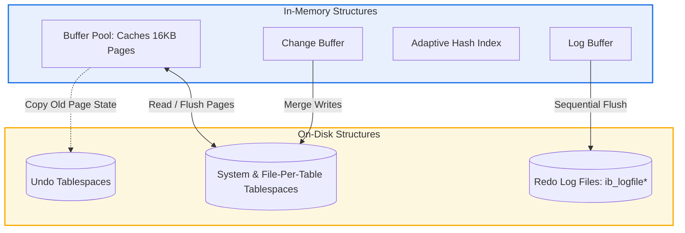

# **MySQL / InnoDB Storage Engine Architecture & Design**

## **1. Problem Background**

### **Origins & Motivation**
Early versions of MySQL used **MyISAM** as the default storage engine. MyISAM was fast for simple read-heavy workloads but had critical limitations for enterprise systems:
1.  **Lack of ACID Transactions:** No support for `COMMIT` or `ROLLBACK`.
2.  **Table-Level Locking:** Any write operation locked the entire table, blocking all other readers and writers, which severely limited concurrent scaling.
3.  **No Crash Recovery:** A power failure mid-write could corrupt the database files, requiring manual repair.

To address these limitations, Heikki Tuuri developed **InnoDB** (released in 2001 and later acquired by Oracle). InnoDB was designed as a transactional, crash-safe engine utilizing row-level locking, clustered indexing, and write-ahead logging (Undo/Redo) to support high-performance OLTP (Online Transaction Processing) applications.

---

## **2. Architecture Overview**

### **In-Memory & On-Disk Subsystems**
InnoDB divides its operations into specialized memory structures and persistent disk storage:
*   **Buffer Pool:** Caches data pages and index pages in memory to minimize slow disk I/O.
*   **Log Buffer:** Holds transaction redo log records before flushing them to disk.
*   **Change Buffer:** A caching structure that buffers write operations to secondary indexes when the pages are not in the buffer pool, merging them later to avoid random disk I/O.
*   **Redo Log Files:** Persistent circular files (`ib_logfile0`, `ib_logfile1`) that guarantee write durability.
*   **Undo Tablespaces:** Stores undo pages containing historical state used for transaction rollback and MVCC.

### **InnoDB Subsystem Diagram**



---

## **3. Internal Design**

### **Clustered Indexes & Primary Key Storage**
InnoDB organizes tables as **Index-Organized Tables**.
*   **Clustered Index:** The table's primary key forms a B+ Tree index. Unlike heap storage (where index entries point to a separate data file), the leaf nodes of InnoDB's clustered index B+ Tree contain the **actual row data** (all columns).
*   **Lookup Performance:** Searching by primary key is highly efficient ($O(\log N)$) because traversing the B+ Tree lands directly on the data page, requiring a single lookup scan.
*   **Primary Key Selection:** If no primary key is defined, InnoDB uses the first `UNIQUE` index with non-nullable columns. If none exist, it automatically creates a hidden 6-byte row identifier (`ROW_ID`).

### **Secondary Indexes**
*   **Organization:** Non-primary key indexes (secondary indexes) are also organized as B+ Trees. However, their leaf nodes do not contain full row data. Instead, they store the indexed columns and the **associated primary key value**.
*   **The Double Lookup Process:** When querying via a secondary index (e.g., `SELECT * FROM users WHERE email = 'test@mail.com'`), InnoDB executes two lookup steps:
    1.  Traverses the secondary B+ Tree index to find the primary key value.
    2.  Uses the recovered primary key to traverse the clustered index B+ Tree to retrieve the full row.


### **Buffer Pool Memory Management**
*   **Page Caching:** Data is read and written in fixed-size **16KB pages**.
*   **Midpoint LRU Algorithm:** To prevent query scans (such as a table scan) from flushing the entire cache, InnoDB splits its LRU list:
    *   *New Sublist (5/8th of cache):* Holds hot pages.
    *   *Old Sublist (3/8th of cache):* Holds cold pages.
    *   Newly read pages are inserted at the "midpoint" (the boundary of the old sublist). A page only moves to the new sublist if it is accessed again after a configured delay (`innodb_old_blocks_time`), ensuring scan pages are evicted quickly.

### **Undo Logs vs. Redo Logs**
InnoDB uses two distinct logging mechanisms to implement ACID:

*   **Redo Log (Durability - write-ahead logging):**
    *   *Purpose:* Records physical changes made to pages.
    *   *Behavior:* When a transaction modifies a page, the change is written sequentially to the Log Buffer and then to the Redo Log files on disk. If a crash occurs, InnoDB replays the Redo Logs (redo phase) to restore modifications made in memory but not yet flushed to tablespaces.
    *   *Flush Configuration:* Controlled by `innodb_flush_log_at_trx_commit`:
        *   `1` (Default): Redo log is flushed to disk at every commit. (Strict ACID compliance).
        *   `0`: Redo log is written and flushed once per second. (High speed, risk of losing 1 second of data).
        *   `2`: Redo log is written to OS cache at commit, but flushed to disk once per second. (Faster, survives database crashes, but risks data loss on power failures).

*   **Undo Log (Atomicity & MVCC - logical rollback):**
    *   *Purpose:* Stores logical reverse operations. If a transaction updates a row, the undo log records the original column values.
    *   *MVCC Support:* If transaction $T_1$ modifies a row, transaction $T_2$ reading the same row reads its previous state by following the row's **Rollback Pointer (`ROLL_PTR`)** to reconstruct the historical row version from the Undo Logs.

### **Row-Level Locking & Gap Locking**
InnoDB implements row-level locking with three types of lock structures:
1.  **Record Locks:** Lock the actual index record.
2.  **Gap Locks:** Lock the empty space (the gap) *between* index records (or before the first/after the last record). They prevent other transactions from inserting data into the gap.
3.  **Next-Key Locks:** A combination of a Record Lock on the index record and a Gap Lock on the gap preceding the record.

> [!IMPORTANT]
> **Preventing Phantom Reads:** Under the default `REPEATABLE READ` isolation level, InnoDB uses **Next-Key Locks** during index scans to block other transactions from inserting new rows within the query range. This solves the classic "phantom read" anomaly.

---

## **4. Design Trade-Offs (InnoDB vs. PostgreSQL)**

InnoDB's clustered/undo architecture represents a different set of design trade-offs compared to PostgreSQL's heap/append-only model:

| Parameter | MySQL (InnoDB) | PostgreSQL |
| :--- | :--- | :--- |
| **Storage Structure** | Clustered Index B+ Tree (Index-Organized) | Unordered Heap Files |
| **Update Mechanism** | In-place update + Undo Log generation | Append-only (write new tuple version in heap) |
| **MVCC Implementation** | Reconstructs old versions from Undo Logs | Reads old tuple versions from heap |
| **Index Updates** | Secondary indexes only change if PK changes | All indexes must point to new tuple version (unless HOT) |
| **Table Bloat & Cleanup** | Low bloat. Background Purge thread clears old undo. | High bloat. Requires periodic `VACUUM` processes. |

### **Trade-off Analysis:**
*   *Write Performance:* PostgreSQL has faster raw inserts because it appends to the first available heap page. InnoDB must search the B+ Tree structure to insert the row in sorted order.
*   *Space Management:* InnoDB is more space-efficient. It updates rows in-place, preventing table bloat. PostgreSQL creates duplicate row versions in the main table, requiring active vacuuming.
*   *Point Queries:* InnoDB is faster for primary key point queries because the row data is colocated with the key. PostgreSQL requires an index scan followed by a separate read of the heap page.

---

## **5. Experiments / Observations**

### **Locking Behavior & Phantom Read Prevention**
An experiment was conducted to observe how InnoDB's Gap Locking prevents phantom reads under the default `REPEATABLE READ` isolation level.

#### **Setup:**
*   **Table:** `accounts` with columns `id INT PRIMARY KEY` and `balance INT`.
*   **Initial Data:**
    ```sql
    INSERT INTO accounts VALUES (10, 500), (20, 1000);
    ```

#### **Execution Sequence:**

| Time | Transaction A (`REPEATABLE READ`) | Transaction B | Behavior & Result |
| :--- | :--- | :--- | :--- |
| **T1** | `BEGIN;` | | Transaction A starts. |
| **T2** | `SELECT * FROM accounts WHERE id BETWEEN 10 AND 20 FOR UPDATE;` | | Transaction A acquires **Next-Key locks** on the range `[10, 20]`. This locks record 10, record 20, and the gap `(10, 20)`. |
| **T3** | | `BEGIN;` | Transaction B starts. |
| **T4** | | `INSERT INTO accounts VALUES (15, 300);` | **BLOCKED:** Transaction B attempts to insert inside the locked gap `(10, 20)`. The insert request waits for Transaction A's locks to release. |
| **T5** | `SELECT * FROM accounts WHERE id BETWEEN 10 AND 20;` | | Transaction A reads the range again. It returns the exact same two rows (10 and 20). No phantom read occurred. |
| **T6** | `COMMIT;` | | Transaction A commits, releasing locks. |
| **T7** | | *(Transaction B completes insert)* | Transaction B unblocks and successfully inserts row 15. |

#### **Key Observation:**
Because InnoDB used a Gap Lock on the range `(10, 20)`, Transaction B was blocked from inserting a row with `id = 15`. This ensured that Transaction A could run the query twice and receive a consistent result set, preventing phantom reads.

---

## **6. Key Learnings**

### **Takeaways**
*   **Clustered Indexes Require Careful PK Selection:** Since secondary indexes store the primary key, a large primary key (like a UUID string) will significantly increase the size of every secondary index, increasing memory usage. Always prefer auto-incrementing integers or compact, sequential keys.
*   **The Double-Logging Architecture:** InnoDB relies on a clear separation of logging responsibilities: Redo logs guarantee *durability* (saving pages from corruption during crashes), while Undo logs manage *logical consistency* (allowing transaction rollbacks and MVCC reads).
*   **Gap Locking Sacrifices Write Throughput for Consistency:** Next-key locks under `REPEATABLE READ` are powerful for data consistency, but they reduce write concurrency. High-performance databases often drop the isolation level to `READ COMMITTED` (disabling gap locking) and handle phantom reads in the application layer.
*   **In-Place Updates Simplify Cleanup:** InnoDB's purge thread removes old undo records in the background without affecting the primary table structure. This avoids the table bloat and performance spikes associated with PostgreSQL's `VACUUM` daemon.
