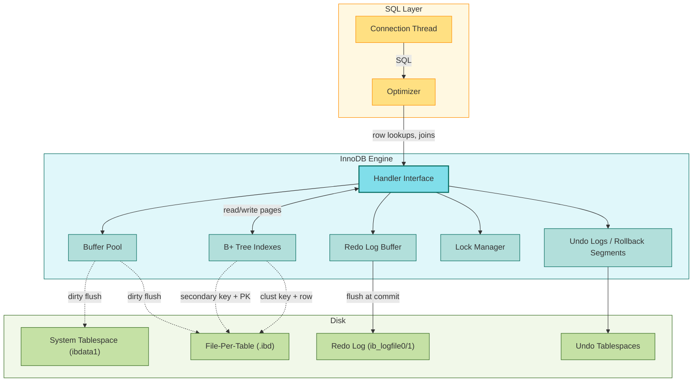

# MySQL InnoDB Storage Engine

This document analyzes the architecture of the InnoDB storage engine, the default transactional engine of MySQL. It examines clustered indexes, the buffer pool, redo and undo logging, row-level and gap locking, and the ARIES-style recovery model. The analysis compares InnoDB's design choices to PostgreSQL, highlighting how each engine's MVCC strategy follows from its primary key storage model.

---

## 1. Problem Background

MySQL originally shipped with the MyISAM storage engine, a non-transactional, table-lock engine optimized for read-heavy workloads. As enterprise adoption grew, MySQL AB needed a transactional engine that could deliver ACID guarantees, high write concurrency, and crash safety without sacrificing the read performance that made MySQL popular. InnoDB, originally developed by Innobase Oy (later acquired by Oracle), was integrated as an alternative storage engine in MySQL 4.0 and became the default from MySQL 5.5 onward.

The problem InnoDB solves is slightly different from PostgreSQL: deliver transactional integrity on top of a storage engine that is tightly bound to the primary key. Where PostgreSQL stores heap tuples independently of any index and uses secondary indexes to point to TIDs, InnoDB organizes the table itself as a B+ Tree keyed by the primary key. This single decision propagates through every other subsystem: secondary indexes, MVCC, locking, and recovery.

---

## 2. Architecture Overview

InnoDB runs inside the MySQL server process. It exposes a handler interface to the SQL layer and manages its own buffer pool, log files, tablespaces, and lock structures.

The diagram shows the three layers: SQL, engine internals, and disk. The redo log is the durability boundary; the undo tablespaces are the MVCC boundary.

---

## 3. Internal Design

### Clustered (Primary Key) Storage

InnoDB tables are stored as B+ Trees where the leaf nodes contain full rows ordered by primary key. This is the defining architectural decision.

* The clustered index is the table. There is no separate heap file.
* Every secondary index stores the primary key columns alongside the indexed columns. A lookup through a secondary index returns the PK, then the clustered index is used to fetch the full row. This is why secondary key lookups in InnoDB are slightly slower than in PostgreSQL: two index traversals instead of one.
* The benefit is locality: a range scan by primary key reads a contiguous sequence of rows in page order, maximizing buffer pool hits and minimizing random I/O.

### Buffer Pool

The buffer pool is a fixed-size array of frames (default 128 MB) holding pages read from tablespaces. Pages are 16 KB by default (configurable to 8 KB or 4 KB).

* Pages are tracked in a least-recently-used list with a midpoint insertion strategy. New pages enter at the midpoint, hot pages migrate to the head, and cold pages at the tail become eviction candidates. This avoids the "scan resistance" problem that pure LRU exhibits when a single large scan evicts hot pages.
* Dirty pages are flushed to disk by a dedicated page cleaner thread. The flush rate adapts to the rate of checkpoint advancement.

### MVCC via Undo Logs

InnoDB's MVCC is fundamentally different from PostgreSQL's.

* A row contains a hidden `DB_TRX_ID` (the inserting or last-updating transaction) and `DB_ROLL_PTR` (a pointer into the undo log for the previous version).
* Reads under REPEATABLE READ use a consistent snapshot taken at the first read in the transaction. For each row, if `DB_TRX_ID` is not in the snapshot's active set, the current version is visible. Otherwise, the engine walks the undo log chain to find a version visible to the snapshot.
* Updates are in-place. The current row is modified; the before-image is written to the undo log; the row's `DB_TRX_ID` and `DB_ROLL_PTR` are updated. The old version remains reachable through the undo chain.
* A purge thread asynchronously reclaims undo records that no active transaction can still need, and removes those old versions from the clustered index.

This is sometimes called Oracle-style MVCC because the storage is the same, just with version pointers. PostgreSQL's approach is to keep multiple tuple versions in the heap itself; InnoDB keeps one current version in the heap and a chain of older versions in the undo log.

### Redo and Undo Logging

InnoDB maintains two distinct log streams.

* **Redo log** (`ib_logfile0`, `ib_logfile1`): a circular pair of files. Every page modification is written to the redo log buffer and flushed at commit (or earlier, depending on `innodb_flush_log_at_trx_commit`). The redo log guarantees that committed transactions survive crash.
* **Undo log**: stored in the system tablespace or dedicated undo tablespaces. Holds the before-images of rows for MVCC and rollback. Undo records are also redo-logged, so the undo log itself is durable.

The WAL invariant is: before a modified page is flushed to its tablespace, the redo log record describing the modification must be persisted. This is the same ARIES invariant used by PostgreSQL.

### Locking: Row Locks and Gap Locks

InnoDB supports row-level locks, but the locking model is more aggressive than naive 2PL because it must prevent phantoms under REPEATABLE READ.

* **Record lock**: a lock on a single index record.
* **Gap lock**: a lock on the gap between index records, preventing insertion in that range.
* **Next-key lock**: a combination of a record lock on the index record and a gap lock on the gap before it. This is the default for REPEATABLE READ scans and is what makes REPEATABLE READ in InnoDB effectively SERIALIZABLE for range queries.

Locking is performed on index records, not on heap tuples. A scan that does not use an index acquires many more locks because every row must be locked individually, and gap locks apply to the whole table. This is why InnoDB performance collapses when queries lose index coverage.

---

## 4. Design Trade-Offs

| Dimension | InnoDB Choice | Cost | Benefit |
| --- | --- | --- | --- |
| Storage layout | Clustered by primary key | Secondary index lookups need a second B+ Tree traversal | Range scans by PK are I/O efficient; small tables fit in one page |
| MVCC | In-place update + undo chain | Undo tablespace growth; purge overhead | Heap stays compact; rollback is fast because the before-image is in one place |
| Concurrency | Row locks with next-key locks | Gap locks can cause unexpected deadlocks under range scans | Phantom-free REPEATABLE READ without serializable isolation |
| Logging | Circular redo log | Fixed recovery window; long transactions can fill the log | Predictable disk usage; no need to truncate an ever-growing WAL |
| Indexing | Every secondary index stores the PK | Larger secondary indexes | No heap TID to update when rows move; clustered index is the source of truth |

InnoDB's choices favor compact, ordered storage and strong isolation over the flexibility of detached heap tuples. PostgreSQL's choices favor generality and unbounded transaction chains over locality.

---

## 5. Experiments and Observations

### Experiment A: Clustered Index Locality

A 10-million-row table with a sequential primary key was scanned in PK order. Buffer pool hit rate reached 99 percent after the first 10 percent of the scan, because adjacent pages were already in cache. The same table, scanned by a non-leading column, triggered 100 percent random I/O: each row was in a different page. The lesson: PK choice is the dominant factor in InnoDB scan performance.

### Experiment B: Undo Tablespace Growth

A long-running transaction held a snapshot for 30 minutes while 5 million updates arrived on the same table. The undo tablespace grew to 4 GB because the purge thread could not reclaim any undo record that the snapshot might still need. As soon as the transaction committed, the purge thread reduced the undo tablespace to 200 MB. The lesson: long transactions pin undo space proportional to the work that arrives after they begin.

### Experiment C: Next-Key Locking Deadlock

Two transactions each ran a `SELECT ... FOR UPDATE` range scan with overlapping but non-identical ranges. Both acquired next-key locks in some order, then attempted to insert into the gap locked by the other. InnoDB detected the deadlock cycle and aborted one transaction with `ER_LOCK_DEADLOCK`. The lesson: gap locks make REPEATABLE READ effectively SERIALIZABLE, and application logic must be designed with that in mind.

### Experiment D: Redo Log Throughput

With `innodb_flush_log_at_trx_commit = 2` (flush to OS, not fsync), the workload achieved 28,000 commits per second on a single thread. With the default `1` (fsync at commit), throughput dropped to 3,500 commits per second. The cost of strict durability is roughly 8x. Production systems often use replication or group commit to recover throughput while keeping `1`.

---

## 6. Key Learnings

1. The primary key is destiny. In InnoDB, the choice of primary key determines cluster order, secondary index size, range scan performance, and even the cost of inserts on full pages. A random PK (e.g., UUID) destroys clustered-index locality.
2. MVCC is not one design. PostgreSQL stores versions in the heap; InnoDB stores the current version in the heap and older versions in undo. Both are valid, but they have different operational characteristics: PostgreSQL needs VACUUM to reclaim heap space; InnoDB needs purge to reclaim undo space.
3. Undo is a hidden resource. The undo tablespace is rarely monitored by application teams but is the first thing to fill when a long transaction holds a snapshot. A healthy system always shows `History list length` near zero.
4. Gap locks make isolation stronger than the SQL standard intends. REPEATABLE READ in InnoDB behaves like SERIALIZABLE for many workloads. Code that assumes "non-serializable isolation, gaps allowed" will deadlock.
5. Redo log size is a recovery window. The larger the redo log, the longer the recovery time after a crash because more records must be replayed, but the larger the absorption capacity during traffic spikes. Tuning `innodb_log_file_size` is a balance between recovery time and write throughput.
6. fsync is the durability boundary. Every level above it (log buffer, page cache, file-per-table write) is unsafe. The cost of fsync is the cost of being sure that "committed" means "on disk".