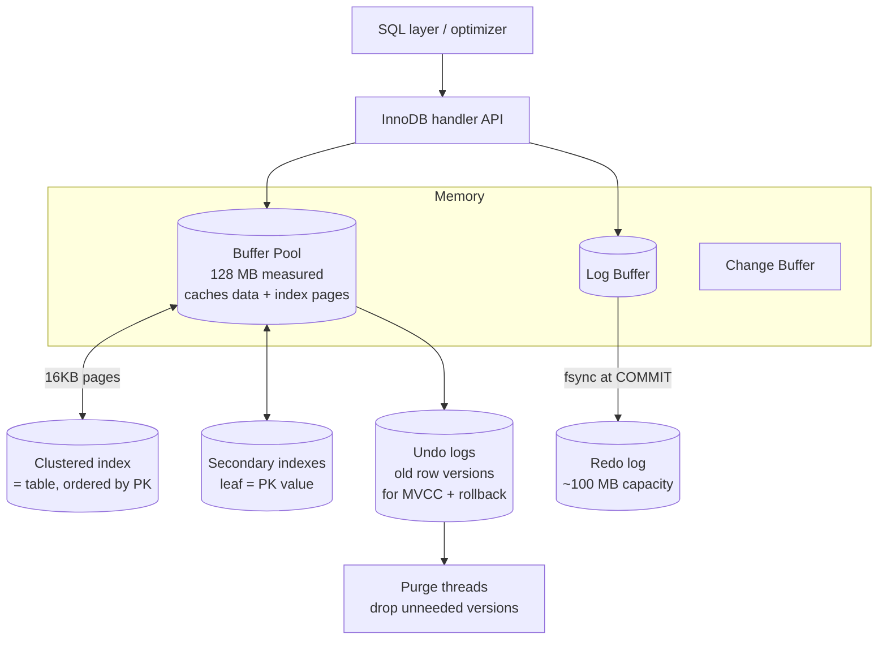

# MySQL / InnoDB Storage Engine

> InnoDB is the transactional storage engine that ships as MySQL's default. Three ideas hold the whole design together: **index-organized (clustered) storage**, **in-place updates protected by undo logs** (the Oracle-style flavour of MVCC), and a **redo log** that buys durability. Every experiment here was run live against **MySQL 8.4.10 / InnoDB** (the `mysql:8.4` Docker image) over a dataset of 50k customers and 200k orders.

---

## 1. Problem Background

When MySQL first appeared in 1995, its storage layer (MyISAM) was deliberately simple and fast but had no notion of transactions. Once MySQL started being used for OLTP and e-commerce, that gap mattered: applications needed **ACID transactions, recovery after a crash, and concurrency at the row level**, none of which MyISAM offered. InnoDB, built by Innobase Oy (later folded into Oracle), filled exactly that hole and was promoted to the default engine in MySQL 5.5.

Read InnoDB's structure as a point-by-point reply to what OLTP demands:
- Lots of small transactions each touching a single row → lock individual rows, **not whole tables**.
- Frequent key lookups and key-ordered range scans → store rows **clustered** so a row sits next to its key.
- Surviving a crash without flushing every dirty page on commit → a **redo log**.
- Rollback plus consistent snapshots → **undo logs** that retain earlier versions of a row.

---

## 2. Architecture Overview



**Following a write:** the transaction changes a page that already lives **in the buffer pool**, copies the *before-image* of the row into an **undo log** (so it can roll back and so other readers can see old versions), and records the *delta* in the **redo log buffer**. The redo record is forced to disk with `fsync` at `COMMIT`; the dirty data page drains to disk only later. That is textbook write-ahead logging, the same family PostgreSQL belongs to, but with one key divergence: InnoDB rewrites the row **in place** and parks the prior versions in a *dedicated* undo area, whereas PostgreSQL leaves old versions sitting *inside the table* itself.

---

## 3. Internal Design

### 3.1 The clustered index is the table

For InnoDB, a table literally **is** a B+-tree keyed on the primary key. The leaves hold the *complete rows*, laid out in primary-key order; there is no separate heap structure beside it. That has knock-on effects:
- A primary-key lookup is one B-tree descent that arrives straight at the row.
- Because rows sit physically next to their PK neighbours, PK range scans read sequentially and play nicely with the cache.
- Skip declaring a PK and InnoDB quietly fabricates a hidden 6-byte `ROW_ID` to cluster on instead.

**Experiment — a PK lookup is a `const` access against the clustered index:**
```text
mysql> EXPLAIN SELECT * FROM orders WHERE id=12345 \G
        type: const
         key: PRIMARY        <- the clustered index IS the table
        rows: 1
```

### 3.2 Secondary indexes hold the PK, not a row address

The leaf entries of a secondary index carry the indexed column(s) **together with the primary-key value**, rather than a physical row pointer. A secondary lookup is therefore *two* descents: locate the PK inside the secondary index, then resolve the row through the clustered index (a "bookmark lookup").

**Experiment — secondary lookup versus a covering index:**
```text
-- needs the row → secondary index, then clustered lookup
mysql> EXPLAIN SELECT * FROM orders WHERE status='paid' \G
        type: ref
         key: idx_status
        rows: 87992
       Extra: NULL              <- must visit clustered index for each row

-- needs only the indexed column → covered entirely by the secondary index
mysql> EXPLAIN SELECT customer_id FROM orders WHERE customer_id=42 \G
        type: ref
         key: idx_customer
       Extra: Using index       <- no clustered-index lookup needed
```
Since every secondary leaf already stores the PK, an index on `customer_id` holds everything that `SELECT customer_id` asks for → `Using index` (a covering index, no trip to the clustered index). The flip side of putting the PK in every secondary index is that **a wide primary key inflates all of them**, which is exactly why "keep the PK narrow" is a core InnoDB schema rule.

### 3.3 Buffer pool

InnoDB keeps 16 KB data and index pages in the **buffer pool** (measured here at 128 MB) under a midpoint-insertion **LRU** scheme, whose young/old split stops a single large scan from washing the whole cache out. Background threads write dirty pages out asynchronously rather than at commit time. A **change buffer** postpones maintenance of secondary indexes whose pages aren't resident, converting scattered index writes into sequential ones.

### 3.4 Undo logs → in-place updates plus MVCC

InnoDB overwrites rows **in place** and stashes the previous image in an **undo log**. Every row hides two fields, `DB_TRX_ID` (the last transaction to write it) and `DB_ROLL_PTR` (a pointer into its undo record). To serve a consistent read, InnoDB rebuilds the version a given snapshot should see by following the undo chain backwards. That is **Oracle-style MVCC**: one live row in the table, with older copies kept off to the side.

**Experiment — undo log drives ROLLBACK:**
```text
START TRANSACTION;
UPDATE acct SET bal=999 WHERE id=1;
SELECT bal FROM acct WHERE id=1;   -> 999   (in-place change, visible in txn)
ROLLBACK;
SELECT bal FROM acct WHERE id=1;   -> 100   (undo log restored the old image)
```
The value was overwritten in place to 999, and `ROLLBACK` then leaned on the undo record to put 100 back. Stale undo versions are eventually reclaimed by **purge threads**, once no live transaction could still need them (the backlog shows up as `History list length`, measured at 0 while idle).

### 3.5 Redo log → durability

The **redo log** is a fixed-size circular log (measured at 100 MB) recording page-level changes, so committed work outlives a crash even when the matching dirty pages never made it to disk. With `innodb_flush_log_at_trx_commit=1` (the default, and confirmed below), each commit `fsync`s the redo log.

**Experiment — writes produce redo:**
```text
Innodb_os_log_written before bulk UPDATE : 33,519,104 bytes
UPDATE orders SET total_cents=total_cents+1 WHERE status='paid';   (~50k rows)
Innodb_os_log_written after             : 38,209,024 bytes
                                          ──────────
redo written by the update              ≈ 4.69 MB
```
That ~50k-row update tacked on roughly 4.7 MB of redo. After a restart InnoDB runs its two-phase recovery: replay redo forward from the last checkpoint (REDO), then undo any transaction that hadn't committed (UNDO).

### 3.6 Locking: row locks and gap locks

InnoDB locks **index records** rather than rows as such, which is why its locking behaviour tracks the indexes you have. Under **REPEATABLE READ** (MySQL's default isolation, confirmed below) it additionally takes **gap locks** and **next-key locks** to keep out *phantom rows*, i.e. inserts landing inside a range another transaction is still scanning.

**Experiment — a gap lock stops an INSERT into the gap:**
```text
table gaps has ids {10, 20, 30}

[A] SET TRANSACTION ISOLATION LEVEL REPEATABLE READ; START TRANSACTION;
[A] SELECT * FROM gaps WHERE id BETWEEN 11 AND 19 FOR UPDATE;   -- locks the gap

[B] INSERT INTO gaps VALUES (15);   -- into the locked gap (11..19)
    -> ERROR 1205: Lock wait timeout exceeded        (BLOCKED)

[B] INSERT INTO gaps VALUES (25);   -- different, unlocked gap
    -> [B] insert 25 OK                              (SUCCEEDS immediately)
```
The lock over the (11..19) gap rejected `INSERT 15` (phantom prevention) yet left `INSERT 25` untouched. This is how InnoDB honours REPEATABLE READ without freezing the entire table.

### 3.7 Isolation levels
```text
@@transaction_isolation = REPEATABLE-READ      (InnoDB default)
@@innodb_flush_log_at_trx_commit = 1           (durable commits)
```
All four SQL isolation levels are available. The default **REPEATABLE READ** mixes MVCC snapshots for plain reads with next-key locks for locking reads and writes, which is stricter than PostgreSQL's default of READ COMMITTED.

---

## 4. Design Trade-Offs

| Aspect | InnoDB approach | Benefit | Cost |
|---|---|---|---|
| **Storage** | Clustered (table = PK B-tree) | Fast PK lookups & PK range scans; no heap | Secondary indexes need a second lookup; big PK bloats all indexes |
| **Updates** | In-place + undo log | Table stays compact; no append bloat | Undo management & purge; long transactions hold history |
| **MVCC** | One current row + undo chain | Compact storage; fast reads of current data | Reconstructing old versions walks undo (cost grows with version depth) |
| **Redo log** | Fixed circular WAL | Cheap durable commits; bounded disk | Checkpoint pressure if redo too small; double write of log+data |
| **Locking** | Index-record + gap/next-key locks | Phantom-free REPEATABLE READ; high row concurrency | Gap locks can block inserts unexpectedly; deadlocks possible |

### Why InnoDB keeps **both** an undo and a redo log
Each tackles the opposite failure and runs in the opposite direction:
- **Redo** handles **durability / roll-forward**: reapply committed changes that were lost from the buffer pool when the crash hit.
- **Undo** handles **atomicity + isolation / roll-back**: unwind uncommitted changes and rebuild prior row versions for MVCC reads.
A committed transaction depends on redo; an aborted one (plus every consistent read) depends on undo. Neither log can substitute for the other.

### Why PostgreSQL went the other way on MVCC
PostgreSQL stores *every* row version right in the table heap (no undo segment at all) and reclaims them with VACUUM. InnoDB keeps a single live row in place and shelves the old ones in undo.
- **InnoDB's edge:** steadier table size (updates don't bloat it) and quick reads of *current* rows.
- **PostgreSQL's edge:** simpler updates and rollbacks (nothing to undo-manage), but it pays with table bloat and unavoidable VACUUM (the *PostgreSQL Internals* document shows 3 updates doubling a table's size).

---

## 5. Experiments / Observations

| # | Experiment | Key result |
|---|---|---|
| 1 | PK lookup plan | `type=const`, `key=PRIMARY`, clustered index *is* the table |
| 2 | Secondary vs covering index | `status` lookup → `ref` (then clustered lookup); `customer_id` → `Using index` (covered, no clustered lookup) |
| 3 | Gap lock (REPEATABLE READ) | INSERT 15 into locked gap (11..19) **timed out**; INSERT 25 (other gap) **succeeded** |
| 4 | Redo log | bulk 50k-row update wrote **≈4.7 MB** of redo (`Innodb_os_log_written` 33.5 MB → 38.2 MB) |
| 5 | Undo log | in-place UPDATE to 999, then `ROLLBACK` restored **100** via undo |

Config observed: buffer pool **128 MB**, default isolation **REPEATABLE READ**, redo capacity **100 MB**, `flush_log_at_trx_commit=1`.

---

## 6. Key Learnings

- **Clustering decides everything downstream.** Because the table *is* the PK B-tree and every secondary index stores the PK, the primary-key choice sets lookup cost, scan locality, and the footprint of each secondary index. A bloated PK quietly bloats the entire schema.
- **Two logs, two distinct jobs.** Watching redo grow on an UPDATE, then watching ROLLBACK hand back an old value, turned the redo/undo split from theory into something concrete: forward for durability, backward for atomicity and MVCC.
- **InnoDB's MVCC is PostgreSQL's reflected in a mirror.** Identical goal (reads that never lock), inverted mechanics: undo-chain reconstruction here versus in-heap versions plus VACUUM there. InnoDB swaps update bloat for undo/purge machinery.
- **Locking rides on the indexes, and gap locks catch people off guard.** A phantom-blocking gap lock turned away a perfectly reasonable INSERT, a classic source of "deadlock"/timeout confusion in production and a direct side effect of the REPEATABLE READ default.
- **Surprising observation:** InnoDB defaults to the *stricter* REPEATABLE READ while PostgreSQL defaults to READ COMMITTED, so the very same application code can behave differently under concurrency depending on which database is underneath it.

---

### Reproducing
```bash
docker run -d --name mysql -e MYSQL_ROOT_PASSWORD=root -e MYSQL_DATABASE=labdb -p 3310:3306 mysql:8.4
# load schema + data, then run the EXPLAIN / locking / log queries shown above
```
*Engine: MySQL 8.4.10 with InnoDB (Docker). Concurrency tests used overlapping `mysql` client sessions with `SELECT SLEEP()` to hold transactions open. Sources: MySQL 8.4 Reference Manual (InnoDB Storage Engine, Locking, Redo/Undo Logs) and the InnoDB architecture documentation.*
