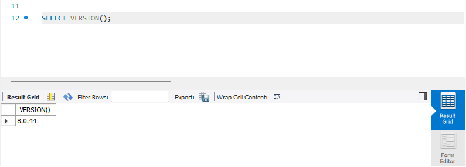
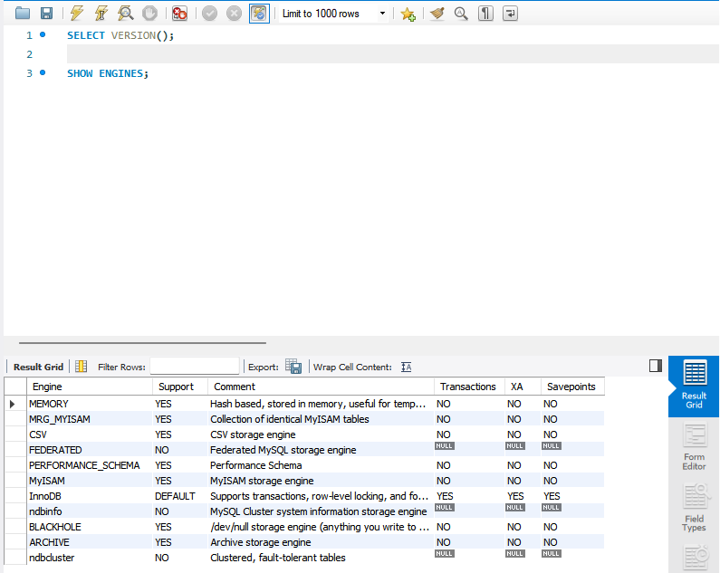
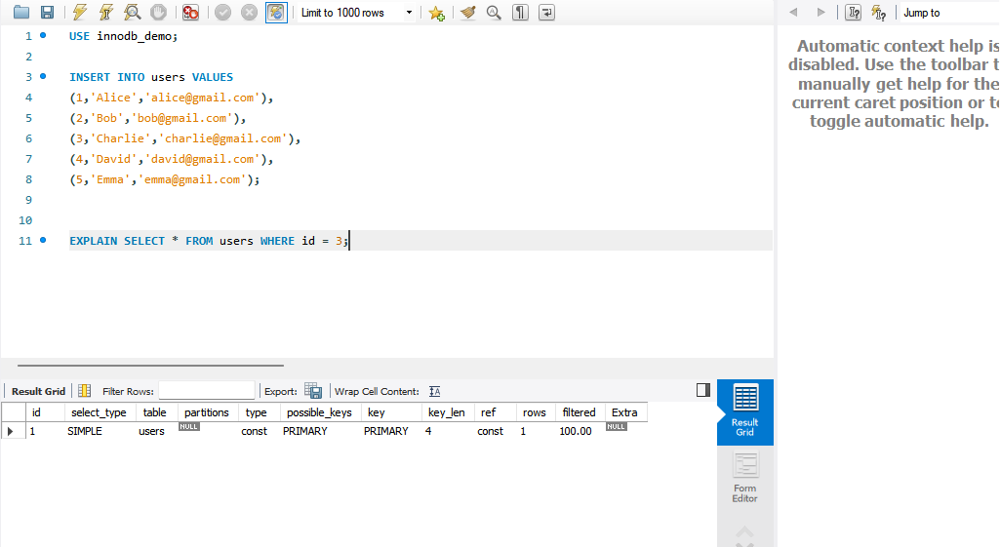
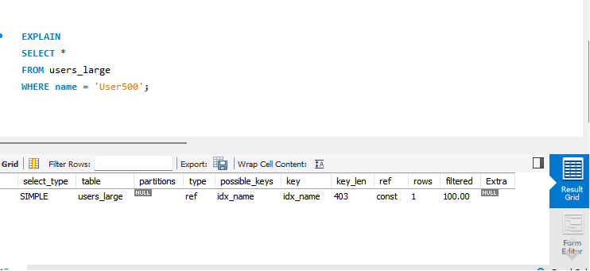

# Topic 3: MySQL / InnoDB Storage Engine

## 1. Problem Background

MySQL supports multiple storage engines, with **InnoDB** being the default since MySQL 5.5. InnoDB was designed to address structural bottlenecks in older engines such as MyISAM, which relied on table-level locking and lacked structural data integrity mechanisms.

Modern production environments require architectures capable of supporting:
* **ACID-Compliant Transactions:** Guaranteeing correctness despite software crashes or power failures.
* **Granular Concurrency:** Minimizing contention when thousands of threads read and write simultaneously.
* **Predictable Tail Latency:** Avoiding massive performance cliffs during background disk flushes.

### MyISAM vs InnoDB Architectural Comparison

| Feature | MyISAM | InnoDB | Architectural Consequence |
| :--- | :--- | :--- | :--- |
| **Locking Granularity** | Table-Level | Row-Level | MyISAM serializes concurrent writes; InnoDB allows highly parallelized mutative execution paths. |
| **Transaction Isolation** | No | Yes | InnoDB supports ACID isolation via Multi-Version Concurrency Control (MVCC). |
| **Crash Recovery** | No (Requires slow `REPAIR TABLE`) | Yes (Immediate log-based recovery) | InnoDB guarantees page-level integrity using Write-Ahead Logging (WAL). |
| **Data Organization** | Heap Layout | Clustered Index (B+ Tree) | MyISAM stores rows arbitrarily; InnoDB enforces data locality via Primary Key sorting. |

---

## 2. Architecture Overview

InnoDB enforces a strict decoupling between memory components and persistent physical storage media to maximize performance while upholding strict durability boundaries.

```text
                     +---------------------------------------------+
                     |             MySQL Server Layer              |
                     |  (Parser, Cost-Based Optimizer, Executor)   |
                     +---------------------------------------------+
                                            |
                                            v
+-----------------------------------------------------------------------------------------+
|                                  InnoDB Storage Engine                                  |
|                                                                                         |
|  [ Memory Structures ]                                                                  |
|  +--------------------------------------------+  +-----------------------------------+  |
|  |                Buffer Pool                 |  |            Log Buffer             |  |
|  |  (Data Pages, Index Pages, Adaptive Index) |  |   (Redo Log buffer in-memory)     |  |
|  +--------------------------------------------+  +-----------------------------------+  |
|                        |                                           |                    |
|                        v (Asynchronous Flush)                      v (Synchronous WAL)  |
|  [ On-Disk Structures ]                                                                 |
|  +--------------------+  +--------------------+  +------------------+  +-------------+  |
|  | Doublewrite Buffer |  | System Tablespace  |  | Undo Tablespaces |  |  Redo Logs  |  |
|  | (Torn-page guard)  |  | (Data Dictionary)  |  | (Rollback Segs)  |  | (ib_logfile)|  |
|  +--------------------+  +--------------------+  +------------------+  +-------------+  |
|            |                                                                            |
|            +---------> Data Files (.ibd)                                                |
+-----------------------------------------------------------------------------------------+

```

### Core Components & Data Flow

1. **Buffer Pool:** The foundational internal memory cache. InnoDB reads disk data into this memory layer in fixed allocations ($16\text{ KB}$ pages) and performs all mutations here first.
2. **Log Buffer:** A memory block dedicated to caching transactions before writing them sequentially out to the persistent Write-Ahead Log layout.
3. **Doublewrite Buffer:** A dedicated storage layout where pages are cached sequentially before being written to their ultimate positions in data files, guarding against partial page writes.

### Environment Verification

The experiments were performed on MySQL 8.0.44 using the InnoDB storage engine.

```sql
SHOW VARIABLES LIKE 'innodb_buffer_pool_size';
```

**Observed Value:**

```text
innodb_buffer_pool_size = 134217728 bytes (128 MB)
```


## 3. Internal Design

### 3.1 Clustered Index Structure

InnoDB eliminates standalone tabular "heap files" by employing a **Clustered Index architecture**. The table data *is* the Primary Key B+ Tree. The non-leaf nodes contain index keys and child page pointers, while the leaf nodes house the complete, physical column values for each row.

```text
[B+ Tree Non-Leaf Node] -> Keys and Page Pointers
         /          \
        v            v
 [Leaf Node Page]   [Leaf Node Page] -> Contains Complete Data Row (Id, Name, Timestamp)

```

* **Advantages:** Unmatched performance for primary-key lookups ($O(\log N)$ tree traversal), high spatial locality for sequential primary key range scans, and direct updates via pointer paths.
* **Disadvantages:** Updates to a primary key column force the physical row to migrate to a completely different B+ tree page (causing leaf page splits). Choosing a random, non-sequential primary key (like an out-of-order UUID) fragments the tree structure completely.

#### Practical Observation

Query:

```sql
EXPLAIN
SELECT *
FROM users
WHERE id = 3;
```

**Result:**

| type |    key   | ROWS|
| ---  | -------- | ---|
| const | PRIMARY |  1  |

**Analysis:**

The optimizer directly used the PRIMARY clustered index. Since InnoDB stores complete rows inside the clustered index leaf nodes, the row can be retrieved through a single B+ Tree traversal.

---

### 3.2 Secondary Index Design & The Double Lookup Penalty

All indexes other than the primary key are defined as **Secondary Indexes**. Leaf nodes in an InnoDB secondary index do *not* contain physical file offset addresses or full row columns; instead, they store **the matching Primary Key value**.

```text
[Secondary Index Query] -> Scan Secondary B+ Tree -> Find Primary Key Value
                                                             |
                                                             v
[Clustered Index Lookup] -> Scan Primary B+ Tree  -> Extract Full Row Data

```

#### Experiment & Observation

```sql
EXPLAIN SELECT * FROM users_large WHERE name='User500';

```
**Result:**
| type | key     | rows|
| --- | -------- | ----|
| ref | idx_name | 1   |

**Analysis:** The optimizer selected the secondary index because the table contained 1000 rows. The query first traverses the secondary B+ Tree, retrieves the primary key value, and then performs a second lookup on the clustered index to obtain the complete row.

This demonstrates the double lookup behavior of InnoDB secondary indexes.

---

### 3.3 Buffer Pool

The Buffer Pool is InnoDB's primary memory cache and is responsible for reducing disk I/O.

In the experimental environment, the Buffer Pool size was:

```sql
SHOW VARIABLES LIKE 'innodb_buffer_pool_size';
```

**Observed Value:**

```text
innodb_buffer_pool_size = 134217728 bytes (128 MB)
```
InnoDB stores data in fixed-size 16 KB pages. When a query accesses a page, InnoDB first checks whether it already exists in the Buffer Pool. If present, the page can be served directly from memory without accessing disk.

```text
Disk
  |
  v
Buffer Pool
  |
  v
CPU
```
**Benefits:**

- Reduced disk I/O
- Faster query execution
- Improved throughput under heavy workloads

---

#### Buffer Pool Replacement Strategy

The Buffer Pool uses an LRU-based replacement policy to keep frequently accessed pages in memory while gradually evicting less frequently used pages.

InnoDB improves upon traditional LRU by separating recently accessed pages from pages brought in through large scans. This prevents sequential scans from pushing frequently used pages out of memory.

This design improves cache efficiency and overall query performance.

---

### 3.4 Reliability Mechanics: Redo Logs & The Doublewrite Buffer

#### Write-Ahead Logging (Redo Logs)

InnoDB relies on a strict Write-Ahead Logging workflow. Data page alterations are converted to sequential delta entries inside the Log Buffer, which are synchronously flushed to disk as persistent Redo Logs (`ib_logfile0`/`1`) when a transaction commits. Writing to the redo log sequentially minimizes head movement overhead compared to writing random data pages across disk coordinates.

#### The Torn Page Problem & The Doublewrite Buffer

Operating systems typically write data in blocks of $4\text{ KB}$, whereas InnoDB handles storage units in batches of $16\text{ KB}$. If a server experiences a sudden power loss during a data write, a page may be partially written to disk ($4\text{ KB}$ updated, $12\text{ KB}$ stale), producing a broken state known as a **torn page**.

```text
[Buffer Pool Dirty Page] ---> Written to Doublewrite Buffer (Contiguous, Fast Sequenced Disk Slots)
                                       |
                     +-----------------+-----------------+
                     | (If OS crash happens here)        | (If successful)
                     v                                   v
             [Torn Page on Data Disk]            [Intact Write to Data Disk]
                     |
                     v
 [Recovery: Copy original page from Doublewrite, 
  then cleanly replay Redo Log changes on top]

```

To counter this, InnoDB writes dirty pages to the contiguous **Doublewrite Buffer** on disk first, waiting for confirmation before routing them to their final `.ibd` files. If a page becomes torn during the final update, InnoDB replaces the corrupted page block with a pristine clone from the Doublewrite Buffer during startup, allowing standard Redo Log validation to proceed without errors.

---

### 3.5 MVCC: In-Place Updates vs. PostgreSQL Append-Only Layout

Multi-Version Concurrency Control (MVCC) enables readers and writers to isolate transaction views without locking each other out.

```text
[InnoDB - In-Place Update Storage Engine]
Data Page Row Space: [Row Key: 1 | Value: "Omega" | DB_TRX_ID: 102] 
                                                        |
                                                        v (Follows Roll Pointer)
Undo Tablespace Space:  [Undo Log Node: Value: "Alpha" | DB_TRX_ID: 101]

```

* **InnoDB Implementation:** When a record changes, InnoDB updates the actual data row **in-place** inside its B+ Tree leaf page. It attaches transaction tracking metadata (`DB_TRX_ID`, `DB_ROLL_PTR`) to the record, and offloads the original data state to the **Undo Log**. Older concurrent transactions reconstruct historical snapshots in-memory by traversing this pointer chain backwards.
* **PostgreSQL Contrast:** PostgreSQL utilizes an **Append-Only Heap** structure. Updates do not modify data in-place; they write an entirely new tuple into the table space. This avoids a separate undo log step but creates physical table fragmentation ("bloat"), requiring background `VACUUM` worker operations to reclaim dead space.

---

### 3.6 Advanced Concurrency: Locking & Phantom Read Elimination

InnoDB employs specific locking techniques to manage concurrency levels and enforce standard ANSI/ISO SQL isolation rules:

* **Record Locks:** Focus exclusively on securing specific individual index records.
* **Gap Locks:** Lock the empty space *between* index records, or the territory immediately preceding or following a record.
* **Next-Key Locks:** A combination of a Record Lock and a Gap Lock. It locks an index record along with the entire gap directly preceding it.

#### Neutralizing the Phantom Read Anomaly

Under the standard `REPEATABLE READ` isolation level, InnoDB uses a two-pronged strategy to prevent phantom insertions:

1. **Consistent Reads (Non-Locking):** Uses MVCC snapshots based on the transaction start time, ignoring any records added by newer transactions.
2. **Locking Reads (`SELECT ... FOR UPDATE`):** Spawns physical **Next-Key Locks** across the scanned index ranges. This halts concurrent threads trying to insert new records into those gaps, guaranteeing data consistency.

---

## 4. Design Trade-Offs

The following matrices contrast the foundational trade-offs accepted by InnoDB compared to alternative database paradigms:

| Architectural Choice | Trade-Off Advantages | Accepted System Vulnerabilities / Overhead |
| --- | --- | --- |
| **Clustered Storage Layout** | Primary Key searches avoid an extra lookup layer; high sequential cache hit rates. | Secondary index lookups require a double traversal cost; arbitrary PK inserts cause page fragmentation. |
| **Undo Log Snapshot MVCC** | Tables stay lean and well-packed on disk; no sweeping table scans needed for dead row cleanup. | Active historical transactions must traverse lengthy undo pointer links, which impacts read performance. |
| **Doublewrite Buffer Subsystem** | Ensures reliable recovery from physical block write failures at the operating system level. | Requires writing data pages to disk twice, which increases overall I/O write amplification. |

### Trade-Off Summary

InnoDB prioritizes transactional consistency, durability, and high concurrency through clustered indexes, MVCC, and logging mechanisms. These benefits come at the cost of additional storage overhead, write amplification, and increased implementation complexity. The architecture is therefore best suited for OLTP workloads where correctness and concurrent access are more important than minimizing storage operations.


## 5. Experiments & Observations

### Environment

All experiments were performed using the following environment:

| Property         | Value                    |
| ---------------- | ------------------------ |
| Database         | MySQL                    |
| Version          | 8.0.44                   |
| Storage Engine   | InnoDB                   |
| Tool             | MySQL Workbench          |
| Buffer Pool Size | 134217728 bytes (128 MB) |

The objective of these experiments was to observe how InnoDB's architectural decisions influence query execution, indexing behavior, and concurrency control.



## Experiment 1: Storage Engine Verification

### Query

```sql
SHOW ENGINES;
```

### Result

```text
InnoDB = DEFAULT
```

### Observation

The output confirms that InnoDB is the default storage engine in MySQL 8.0.44.

### Analysis

This validates that all subsequent experiments were executed using the InnoDB storage engine and therefore reflect InnoDB-specific behavior such as clustered indexing, MVCC, row-level locking, and redo logging.




## Experiment 2: Clustered Index Lookup

### Query

```sql
EXPLAIN
SELECT *
FROM users
WHERE id = 3;
```

### Result

| type  | key     | rows |
| ----- | ------- | ---- |
| const | PRIMARY | 1    |

### Observation

The optimizer selected the PRIMARY key index and estimated that only one row needed to be accessed.

### Analysis

This demonstrates the efficiency of InnoDB's clustered index architecture. Since the table rows are physically stored inside the primary key B+ Tree, the database can retrieve the complete row through a single index traversal.

Benefits observed:

* Fast primary-key lookups
* Minimal page accesses
* Efficient data locality




## Experiment 3: Secondary Index Lookup

### Query

```sql
EXPLAIN
SELECT *
FROM users_large
WHERE name = 'User500';
```

### Result

| type | key      | rows |
| ---- | -------- | ---- |
| ref  | idx_name | 1    |

### Observation

The optimizer selected the secondary index `idx_name` instead of performing a full table scan.

### Analysis

The table contained approximately 1000 rows, making indexed access significantly cheaper than scanning the entire table.

This experiment demonstrates how MySQL's cost-based optimizer chooses execution plans based on estimated cost.

It also highlights InnoDB's secondary index architecture:

```text
Secondary Index
       |
       v
Primary Key
       |
       v
Clustered Index
       |
       v
Actual Row
```

Because secondary indexes store the primary key rather than the complete row, InnoDB performs an additional clustered-index lookup after locating the matching secondary-index entry.




## Experiment 4: Gap Lock Demonstration

To observe InnoDB's concurrency control mechanisms, two concurrent sessions were used.

### Session 1

```sql
START TRANSACTION;

SELECT *
FROM users
WHERE id BETWEEN 12 AND 18
FOR UPDATE;
```

### Session 2

```sql
INSERT INTO users(id,name)
VALUES(15,'PhantomUser');
```

### Observation

The second transaction was blocked and eventually timed out because InnoDB placed a lock on the scanned index range.

### Analysis

Although the record with primary key `15` did not exist when Session 1 executed, InnoDB created a Gap Lock on the range between existing index entries.

This prevents new rows from being inserted into the locked range and protects the transaction from phantom reads.

The experiment demonstrates how InnoDB enforces the REPEATABLE READ isolation level through a combination of MVCC and range locking.


## Key Observations

The experiments revealed several important characteristics of InnoDB:

1. InnoDB is the default storage engine in MySQL 8.0.
2. Clustered indexes provide highly efficient primary-key access.
3. Secondary indexes become increasingly beneficial as table size grows.
4. The query optimizer selects execution plans based on estimated cost rather than simply using every available index.
5. Secondary-index queries require an additional clustered-index lookup.
6. Gap Locks prevent phantom reads and improve transaction isolation.
7. InnoDB combines indexing, MVCC, and locking mechanisms to provide both performance and consistency.

These observations directly connect InnoDB's internal architecture to its real-world behavior under query and concurrency workloads.


## 6. Key Learnings

1. **Primary Key Selection Matters More Than Expected**
   Because table rows are physically organized by the clustered index, primary key design directly affects storage locality, page splits, and overall query performance.

2. **Concurrency Is Achieved Through Multiple Coordinated Mechanisms**
   InnoDB does not rely on a single technique for concurrency. MVCC, row-level locks, gap locks, and undo logs work together to provide both isolation and throughput.

3. **Durability Comes From Layered Protection**
   Redo Logs, the Doublewrite Buffer, and crash recovery mechanisms each solve different failure scenarios. Together they allow committed transactions to survive unexpected crashes.

4. **Secondary Indexes Have Hidden Costs**
   Although secondary indexes improve lookup performance, they introduce an additional clustered-index traversal. Understanding this behavior is important when designing indexes for large tables.

5. **Database Internals Explain Query Behavior**
   Observing execution plans and locking behavior demonstrated that many performance characteristics are direct consequences of architectural decisions rather than optimizer choices alone.


---

## References

### Official Documentation

1. MySQL Documentation – InnoDB Storage Engine
   https://dev.mysql.com/doc/refman/8.0/en/innodb-storage-engine.html

2. MySQL Documentation – InnoDB Architecture
   https://dev.mysql.com/doc/refman/8.0/en/innodb-architecture.html

3. MySQL Documentation – InnoDB Buffer Pool
   https://dev.mysql.com/doc/refman/8.0/en/innodb-buffer-pool.html

4. MySQL Documentation – InnoDB Locking and Transaction Model
   https://dev.mysql.com/doc/refman/8.0/en/innodb-locking.html

5. MySQL Documentation – InnoDB Multi-Versioning (MVCC)
   https://dev.mysql.com/doc/refman/8.0/en/innodb-multi-versioning.html


### Experimental Environment

6. MySQL Community Server 8.0.44

7. MySQL Workbench
