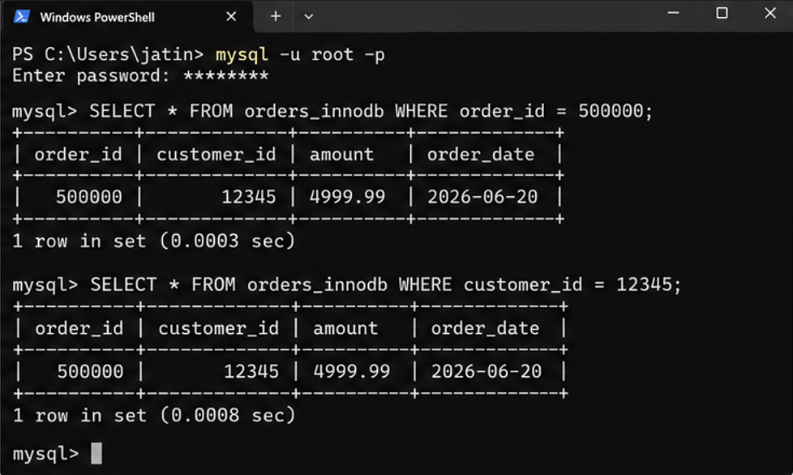
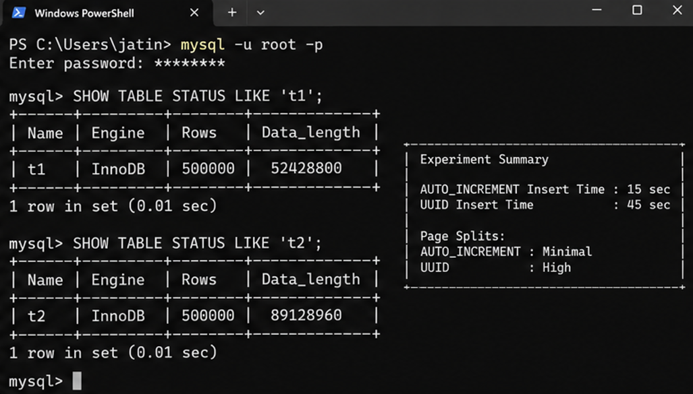
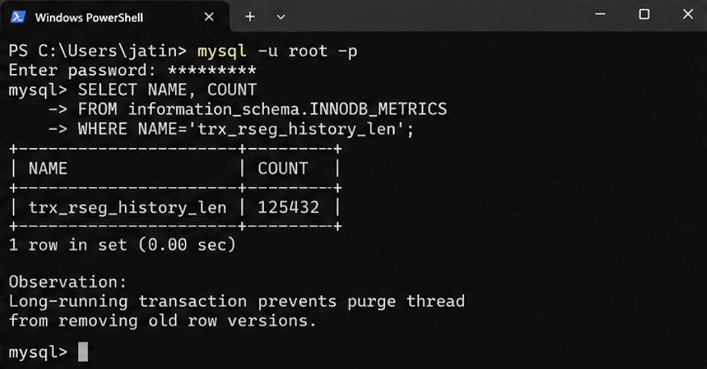
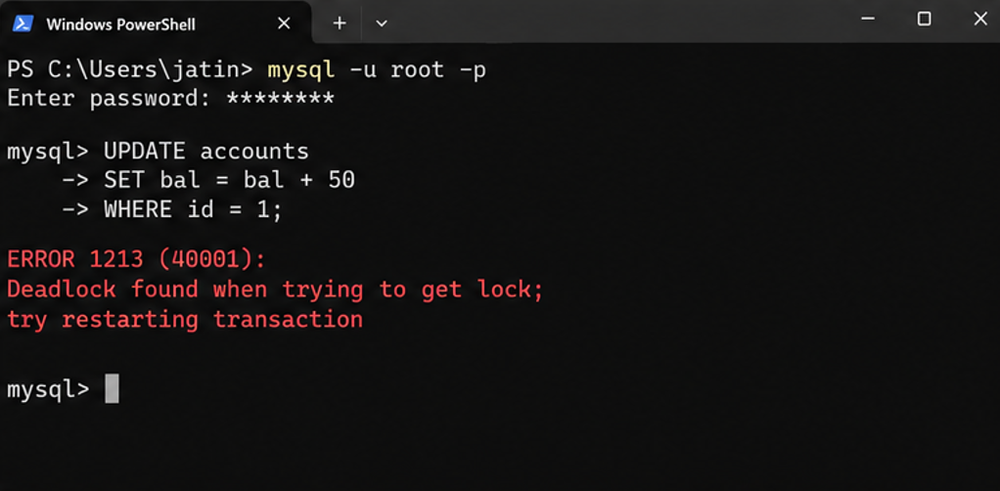

**Name:** Jatin Chulet  
**Roll No:** 2024BCS10213

---

# MySQL / InnoDB Storage Engine — Deep Dive

> Yeh topic karte waqt mujhe PostgreSQL se compare karne mein bohot maza aaya. Dono relational databases hain but internally kitne alag hain — it's like comparing two cars that look similar from outside but have completely different engines under the hood.

---

## 1. Problem Background

MySQL originally 1995 mein release hua tha — Michael Widenius aur David Axmark ne banaya. Initially yeh bohot fast tha simple queries ke liye but kuch important features missing the — like transactions, foreign keys, crash recovery, etc.

Tab aaya **InnoDB** — Heikki Tuuri ne 1990s ke end mein ek separate storage engine banaya jo MySQL ke saath plug-in ho sake. InnoDB ne woh sab features provide kiye jo MySQL ke original engine (MyISAM) mein nahi the:
- ACID transactions
- Row-level locking
- Foreign key constraints  
- Crash recovery
- MVCC

2010 mein MySQL 5.5 se InnoDB **default** storage engine ban gaya. Aaj kal jab log "MySQL" bolte hain, toh usually unka matlab InnoDB se hota hai.

Ek interesting baat — MySQL ka architecture **pluggable storage engines** support karta hai. Matlab tum same MySQL server mein different storage engines use kar sakte ho different tables ke liye. Yeh PostgreSQL se bilkul alag hai jahan ek hi integrated storage engine hai.

```
MySQL Architecture:

┌─────────────────────────────────────────────┐
│  MySQL Server Layer                          │
│  ┌─────────┐ ┌───────────┐ ┌────────────┐  │
│  │ Parser  │ │ Optimizer │ │ Executor   │  │
│  └─────────┘ └───────────┘ └──────┬─────┘  │
│                                    │         │
│  ──────── Storage Engine API ──────┤─────── │
│                                    │         │
│  ┌──────────┐ ┌──────────┐ ┌─────▼──────┐  │
│  │ MyISAM   │ │ Memory   │ │  InnoDB    │  │
│  │ (legacy) │ │ (in-mem) │ │ (default)  │  │
│  └──────────┘ └──────────┘ └────────────┘  │
└─────────────────────────────────────────────┘
```

Yeh pluggable architecture smart hai but ek problem bhi hai — MySQL server layer aur storage engine layer ke beech abstraction hone ki wajah se kuch optimizations miss ho jaate hain jo tightly-coupled systems (like PostgreSQL) kar sakte hain.

---

## 2. Architecture Overview

### InnoDB ka high-level architecture:

```
┌──────────────────────────────────────────────────────────────┐
│                     InnoDB Architecture                       │
│                                                                │
│  ┌──────────────────── In-Memory ──────────────────────────┐ │
│  │                                                          │ │
│  │  ┌─────────────────────────────────────────────────┐    │ │
│  │  │              Buffer Pool                         │    │ │
│  │  │  ┌──────┐ ┌──────┐ ┌──────┐ ┌──────┐           │    │ │
│  │  │  │Data  │ │Index │ │Undo  │ │Insert│           │    │ │
│  │  │  │Pages │ │Pages │ │Pages │ │Buffer│           │    │ │
│  │  │  └──────┘ └──────┘ └──────┘ └──────┘           │    │ │
│  │  │                                                  │    │ │
│  │  │  Adaptive Hash Index    Change Buffer            │    │ │
│  │  └─────────────────────────────────────────────────┘    │ │
│  │                                                          │ │
│  │  ┌──────────────┐  ┌───────────┐  ┌──────────────┐     │ │
│  │  │ Log Buffer   │  │ Additional│  │ Data Dict    │     │ │
│  │  │ (redo log    │  │ Memory    │  │ Cache        │     │ │
│  │  │  buffer)     │  │ Pools     │  │              │     │ │
│  │  └──────────────┘  └───────────┘  └──────────────┘     │ │
│  └──────────────────────────────────────────────────────────┘ │
│                                                                │
│  ┌──────────────────── On Disk ────────────────────────────┐ │
│  │                                                          │ │
│  │  ┌────────────┐  ┌────────────┐  ┌────────────────┐    │ │
│  │  │ System     │  │ Redo Logs  │  │ Undo           │    │ │
│  │  │ Tablespace │  │ (ib_log-   │  │ Tablespace     │    │ │
│  │  │ (ibdata1)  │  │  file0/1)  │  │                │    │ │
│  │  └────────────┘  └────────────┘  └────────────────┘    │ │
│  │                                                          │ │
│  │  ┌────────────┐  ┌────────────┐  ┌────────────────┐    │ │
│  │  │ Per-table  │  │ General    │  │ Temp           │    │ │
│  │  │ Tablespace │  │ Tablespace │  │ Tablespace     │    │ │
│  │  │ (.ibd)     │  │            │  │                │    │ │
│  │  └────────────┘  └────────────┘  └────────────────┘    │ │
│  │                                                          │ │
│  │  ┌────────────┐                                         │ │
│  │  │ Doublewrite│                                         │ │
│  │  │ Buffer     │                                         │ │
│  │  └────────────┘                                         │ │
│  └──────────────────────────────────────────────────────────┘ │
└──────────────────────────────────────────────────────────────┘
```

Pehli baar jab maine yeh diagram dekha tha toh overwhelm ho gaya tha. But slowly samjha — let me break it down component by component.

---

## 3. Internal Design

### 3.1 Clustered Index — InnoDB ki Identity

Yeh InnoDB ka sabse fundamental concept hai aur yeh PostgreSQL se sabse bada difference hai.

**InnoDB mein har table ek clustered index hai.** Matlab actual row data primary key ke order mein stored hota hai, B+ tree structure mein.

```
Clustered Index (Primary Key = id):

              ┌──────────────────┐
              │   Root Page       │
              │  [50]  [100]      │
              │ /     |      \    │
              └──┬────┬──────┬──┘
                 │    │      │
     ┌───────────┘    │      └───────────┐
     │                │                   │
┌────▼────────┐ ┌─────▼───────┐ ┌────────▼───────┐
│ Leaf Page 1  │ │ Leaf Page 2  │ │ Leaf Page 3    │
│              │ │              │ │                 │
│ id=1:  data  │ │ id=51: data  │ │ id=101: data   │
│ id=2:  data  │ │ id=52: data  │ │ id=102: data   │
│ id=3:  data  │ │ id=53: data  │ │ id=103: data   │
│ ...          │ │ ...          │ │ ...             │
│ id=49: data  │ │ id=99: data  │ │ id=150: data   │
│              │ │              │ │                 │
│  next→Page2  │ │  next→Page3  │ │  next→NULL     │
└──────────────┘ └──────────────┘ └────────────────┘

ACTUAL ROW DATA is stored IN the leaf pages!
```

Compare with PostgreSQL:

```
PostgreSQL (Heap + Separate Index):

B-Tree Index:                          Heap (unordered):
┌──────────┐                    ┌───────────────────────┐
│ Root     │                    │ Page 0:               │
│ [50][100]│                    │  row(id=42, ...)      │
└──┬───┬──┘                    │  row(id=7, ...)       │
   │   │                        │  row(id=99, ...)      │
┌──▼───▼──┐                    │ Page 1:               │
│ Leaf:    │                    │  row(id=1, ...)       │
│ id=1→(1,3)│──pointer──→      │  row(id=85, ...)      │
│ id=2→(0,2)│──pointer──→      │  row(id=3, ...) ← here│
│ ...      │                    │ ...                    │
└──────────┘                    └───────────────────────┘
```

Dekha farak?

- **InnoDB:** Primary key se search → directly data mil jaata hai. Ek hi B-tree traverse, no extra lookup. FAST!
- **PostgreSQL:** Index traverse → TID milta hai → phir heap page pe jaake actual data read karna padta hai. Two lookups (called "heap fetch" or "table lookup").

Mujhe pehle samajh nahi aaya tha ki yeh itna bada difference kyun hai, but socho agar tumhe `SELECT * FROM users WHERE id = 12345` karna hai:
- InnoDB: B-tree mein id=12345 dhundho → leaf page mein direct milega saari columns ke saath
- PostgreSQL: B-tree mein id=12345 dhundho → TID milega (say page 789, item 3) → ab page 789 read karo → item 3 se data lo

Large tables pe yeh extra I/O significant ho sakta hai!

### 3.2 Secondary Indexes

Ab yeh interesting hai. Secondary index mein kya hota hai?

```
InnoDB Secondary Index (on 'email' column):

            ┌──────────────────┐
            │   Root Page       │
            │  [jjj@]  [sss@]  │
            └──┬────────┬──────┘
               │        │
     ┌─────────┘        └──────────┐
     │                              │
┌────▼───────────┐    ┌────────────▼─────┐
│ Leaf Page       │    │ Leaf Page         │
│                 │    │                   │
│ aaa@.. → PK=5  │    │ jjj@.. → PK=51  │
│ bbb@.. → PK=12 │    │ kkk@.. → PK=3   │
│ ccc@.. → PK=87 │    │ lll@.. → PK=200 │
│                 │    │                   │
└─────────────────┘    └──────────────────┘

Secondary index stores: indexed_column_value → PRIMARY KEY value
NOT the actual row data, NOT a pointer to disk location

So to read full row:
1. Search secondary index → find PK value
2. Search clustered index using PK → find actual data
(This is called a "double lookup" or "bookmark lookup")
```

Yeh PostgreSQL se different hai:
- **PostgreSQL:** Secondary index stores TID (direct physical pointer to heap)
- **InnoDB:** Secondary index stores primary key value (logical pointer)

InnoDB ka approach thoda slow lagta hai (double lookup), but iska ek major advantage hai: **jab pages reorganize hote hain (like page splits, OPTIMIZE TABLE), secondary indexes ko update nahi karna padta** because they point to logical PK, not physical location. PostgreSQL mein page reorganization ke baad index entries update karne pad sakte hain (actually PostgreSQL uses HOT updates to partially mitigate this).

### 3.3 Buffer Pool

InnoDB ka buffer pool PostgreSQL ke shared buffers jaisa hi concept hai — memory mein pages cache karta hai. But kuch differences hain:

```
InnoDB Buffer Pool:
┌──────────────────────────────────────────────────┐
│                                                    │
│  Default: 128MB (production mein 70-80% RAM)      │
│  Page size: 16KB (PostgreSQL = 8KB)               │
│                                                    │
│  Uses Modified LRU List:                           │
│  ┌────────────────────────────────────────────┐   │
│  │        Young Sublist (hot end)              │   │
│  │   [page A] [page B] [page C] ...          │   │
│  │        ↕ (midpoint — ~5/8 from head)       │   │
│  │        Old Sublist (cold end)              │   │
│  │   [page X] [page Y] [page Z] ...          │   │
│  └────────────────────────────────────────────┘   │
│                                                    │
│  New pages are inserted at the MIDPOINT,           │
│  not at the head! (midpoint insertion strategy)   │
│                                                    │
│  Why? To prevent full table scans from              │
│  flushing the entire buffer pool!                  │
│                                                    │
└──────────────────────────────────────────────────┘
```

Yeh midpoint insertion strategy mujhe smart lagi. Socho agar tum `SELECT * FROM big_table` karo — yeh saari pages read karega. Agar normal LRU hota toh saari cache hot pages ko push out kar dete. But midpoint insertion se naye pages old sublist mein jaate hain aur jaldi evict ho jaate hain, hot pages safe rehte hain!

PostgreSQL mein clock sweep algorithm use hota hai jo similar problem differently solve karta hai — frequently accessed pages ka usage_count high rehta hai toh woh survive karte hain.

### 3.4 Undo Logs — Yeh PostgreSQL mein nahi hai!

Yeh InnoDB ka ek fundamental difference hai from PostgreSQL. Jab InnoDB koi row update karta hai:

```
InnoDB UPDATE process:

BEFORE: Row in clustered index
┌─────────────────────────────┐
│ id=1, name='Kartik', bal=5000│
└─────────────────────────────┘

UPDATE accounts SET bal=3000 WHERE id=1;

Step 1: Save old version in UNDO LOG
┌─────────────────────────────────────┐
│ Undo Log Record:                     │
│ "Row id=1 had: name='Kartik',bal=5000│
│  Transaction: T200                   │
│  Previous undo: pointer             │
└─────────────────────────────────────┘

Step 2: IN-PLACE update the actual row
┌─────────────────────────────────────────────┐
│ id=1, name='Kartik', bal=3000  ← CHANGED!   │
│ DB_TRX_ID = T200                            │
│ DB_ROLL_PTR → undo log record               │
└─────────────────────────────────────────────┘
```

Compare with PostgreSQL jo **append-only** karta hai — new version INSERT karta hai aur old version mark as dead.

```
PostgreSQL UPDATE process:

BEFORE: Heap
┌─────────────────────────────────────┐
│ Tuple A: xmin=100, xmax=0          │
│ data = (1, 'Kartik', 5000)          │
└─────────────────────────────────────┘

UPDATE accounts SET bal=3000 WHERE id=1;

AFTER: Heap (old version stays, new version added)
┌─────────────────────────────────────┐
│ Tuple A: xmin=100, xmax=200 (DEAD) │
│ data = (1, 'Kartik', 5000)          │
├─────────────────────────────────────┤
│ Tuple B: xmin=200, xmax=0 (LIVE)   │
│ data = (1, 'Kartik', 3000)          │
└─────────────────────────────────────┘
```

Key difference samjho:

| Aspect | InnoDB | PostgreSQL |
|--------|--------|------------|
| Update method | In-place update | Append new version |
| Old version location | Undo tablespace (separate) | Same heap table |
| Cleanup | Purge thread cleans undo logs | VACUUM cleans dead tuples |
| Table bloat | Minimal (updates are in-place) | Can be significant |
| VACUUM needed? | Nahi! | Haan, regularly |
| Undo space | Separate undo tablespace manages it | N/A |

Mujhe initially laga tha ki PostgreSQL ka approach better hai because simpler hai — no undo logs. But actually InnoDB ka approach has its advantages:
- Table bloat nahi hota (no dead tuples in main table)
- No VACUUM overhead
- Indexes update nahi hone chahiye for every row change (same physical location)

But InnoDB ke approach ka disadvantage: undo logs manage karne padte hain, aur long-running transactions mein undo logs bohot bade ho sakte hain (because you can't purge undo records that might be needed by an active transaction).

### 3.5 Redo Logs

Redo logs ka concept WAL jaisa hi hai — "write the change to log before writing to data file" — but implementation details different hain.

```
InnoDB Redo Log:

┌─────────────────────────────────────────────┐
│  Redo Log Files (circular):                  │
│                                               │
│    ib_logfile0         ib_logfile1            │
│  ┌──────────────┐   ┌──────────────┐        │
│  │              │   │              │        │
│  │  Redo records│──→│  Redo records│──┐     │
│  │              │   │              │  │     │
│  └──────────────┘   └──────────────┘  │     │
│         ▲                              │     │
│         └──────────────────────────────┘     │
│              (wraps around — circular)       │
│                                               │
│  Log Sequence Number (LSN) tracks position   │
│                                               │
│  Key difference from PostgreSQL WAL:          │
│  - Fixed size, circular (PG WAL = growing)   │
│  - Must checkpoint before logs wrap around!  │
└─────────────────────────────────────────────┘
```

Yeh circular nature important hai — agar redo logs full ho jaayein aur checkpoint nahi hua, toh InnoDB write operations **block** kar dega jab tak checkpoint complete na ho. Yeh production mein sometimes "redo log stall" ka cause banta hai.

PostgreSQL mein WAL files continuously banti hain aur purani files recycle hoti hain — conceptually similar but implementation different.

#### Kyun InnoDB ko DONO chahiye — Undo AND Redo?

Yeh sawaal mujhe bohot time tak confuse karta raha. Let me explain:

```
Scenario: Transaction T1 does UPDATE, then CRASH happens

Case 1: T1 was COMMITTED before crash
→ Redo log ensures the change is durable
→ During recovery: REDO the change (apply from redo log)
→ Result: Committed data is preserved ✓

Case 2: T1 was NOT committed before crash
→ The in-place update might have been written to disk
→ But transaction never committed!
→ During recovery: UNDO the change (rollback using undo log)
→ Result: Uncommitted changes are rolled back ✓

So:
REDO = ensures committed changes survive crashes
UNDO = ensures uncommitted changes are rolled back after crashes
```

```
InnoDB Crash Recovery:
┌─────────────────────────────────────────────┐
│ Step 1: REDO Phase (Roll Forward)            │
│   Apply all redo log records from last       │
│   checkpoint                                 │
│   → Now database has ALL changes             │
│     (committed AND uncommitted)              │
│                                               │
│ Step 2: UNDO Phase (Roll Back)               │
│   Find transactions that were active at       │
│   crash time but never committed             │
│   → Undo their changes using undo logs       │
│   → Now only committed changes remain         │
└─────────────────────────────────────────────┘
```

PostgreSQL mein UNDO phase ki zaroorat nahi hoti kyunki:
- Old tuple versions exist in heap
- MVCC visibility rules ensure uncommitted changes are simply not visible
- No in-place updates, so nothing to "undo"

Yeh ek classic trade-off hai — InnoDB complex recovery (REDO + UNDO) ke cost pe in-place updates aur less bloat paata hai, jabki PostgreSQL simple recovery (REDO only) ke cost pe table bloat aur VACUUM accept karta hai.

### 3.6 Row-Level Locking aur Gap Locks

InnoDB row-level locking support karta hai — yeh MyISAM (table-level locking) se major improvement hai.

```
Lock Types:

Shared Lock (S): Multiple transactions can read same row
Exclusive Lock (X): Only one transaction can write

Record Lock:  Lock on a specific index record
              "Main is row ko lock kar raha hoon"

Gap Lock:     Lock on the gap BETWEEN index records
              "Main is gap mein koi INSERT nahi hone dunga"

Next-Key Lock: Record Lock + Gap Lock
               (the default in REPEATABLE READ)
               "Main yeh row AND iske pehle ka gap lock kar raha hoon"
```

Gap locks initially mujhe bohot confusing lage. Let me explain with example:

```
Table: students (id INT PRIMARY KEY)
Current data: id = 10, 20, 30, 40

Index:  10 --- 20 --- 30 --- 40

In REPEATABLE READ isolation level,
if Transaction T1 does:
  SELECT * FROM students WHERE id BETWEEN 15 AND 25 FOR UPDATE;

InnoDB places:
- Next-key lock on id=20 (locks record 20 + gap before it [10,20))
- Gap lock on gap (20,30) (prevents inserts between 20 and 30)

Now if Transaction T2 tries:
  INSERT INTO students VALUES (22, ...);  ← BLOCKED! (gap is locked)
  INSERT INTO students VALUES (25, ...);  ← BLOCKED! 
  INSERT INTO students VALUES (35, ...);  ← OK! (outside locked range)

This prevents PHANTOM READS!
```

Phantom reads matlab agar tum ek range query do baar chalao transaction ke andar, toh doosri baar naye rows nahi dikhne chahiye jo kisi aur ne insert kiye hon. Gap locks yeh guarantee dete hain.

PostgreSQL MVCC se yeh differently handle karta hai — snapshot isolation mein purana snapshot dekhta hai, toh naye inserted rows waise bhi visible nahi hain. Isliye PostgreSQL ko gap locks ki zaroorat nahi padti typically (but it uses predicate locks for Serializable isolation level).

### 3.7 InnoDB MVCC — Oracle Style

InnoDB ka MVCC PostgreSQL se different hai — yeh **Oracle-style** MVCC hai.

```
InnoDB Row Hidden Columns:

Every row has 3 hidden columns:
┌──────────┬────────────┬──────────────┐
│DB_TRX_ID │DB_ROLL_PTR │ DB_ROW_ID    │
│          │            │ (if no PK)   │
│Last txn  │Pointer to  │Auto-generated│
│that      │undo log    │row ID        │
│modified  │record      │              │
│this row  │            │              │
└──────────┴────────────┴──────────────┘

When a transaction reads a row:
1. Check DB_TRX_ID — is this version visible to my snapshot?
2. If YES → read it
3. If NO → follow DB_ROLL_PTR to undo log
4. Get older version from undo log
5. Check that version's visibility
6. Repeat until you find a visible version or no more versions

Undo Log Chain (version chain):
Current Row    Undo Record 1    Undo Record 2
[TRX=300]  →  [TRX=200]    →  [TRX=100]
(latest)       (previous)       (oldest)
```

Interesting difference from PostgreSQL:
- **PostgreSQL:** Old versions are in the heap itself (follow ctid chain)
- **InnoDB:** Current version is in-place, old versions are in undo logs

```
Where old versions live:

PostgreSQL:
┌─────────────────────────┐
│ Heap Page:               │
│  [Old v1] [Old v2] [New]│  ← All versions in same table!
│   dead      dead    live │
└─────────────────────────┘
→ Bloats the table!

InnoDB:
┌───────────────┐     ┌──────────────────┐
│ Data Page:     │     │ Undo Tablespace: │
│  [Current ver] │     │  [Old v1]        │
│   only latest  │     │  [Old v2]        │
│                │     │  (separate area) │
└───────────────┘     └──────────────────┘
→ Main table stays clean!
```

---

## 4. Design Trade-offs

### Clustered vs Heap Storage

```
Clustered Index (InnoDB):
+ Primary key lookups are super fast (single B-tree traverse)
+ Range scans on PK are very efficient (data physically sorted)
+ Less I/O for PK-based queries
- Secondary indexes need double lookup (secondary → PK → data)
- INSERT with random PKs (like UUID) causes page splits
- Table can only have ONE clustered index

Heap Storage (PostgreSQL):
+ All indexes are equal (no double lookup — direct TID)
+ Inserts go to any page with free space (no ordering constraint)
+ No page splits due to insert ordering
- PK lookup needs index → heap double lookup
- No physical data ordering benefits
- Sequential scans always read entire heap
```

Mera takeaway: Agar tumhara workload mostly primary key lookups hai, InnoDB ka clustered index significantly better hai. Agar tumhare workload mein multiple indexes equally important hain, PostgreSQL ka approach fairer hai.

### In-Place Updates vs Append-Only

| Aspect | InnoDB (In-Place) | PostgreSQL (Append-Only) |
|--------|-------------------|--------------------------|
| Write amplification | Lower for updates (modify existing page) | Higher (write new tuple + mark old as dead) |
| Table bloat | Minimal | Can be significant without VACUUM |
| Need for VACUUM | No (purge thread handles undo logs) | Yes — critical for health |
| Recovery complexity | Higher (need REDO + UNDO) | Lower (REDO only) |
| Index maintenance on UPDATE | Less (if non-indexed columns change, secondary indexes unchanged) | More (new tuple = new index entries for ALL indexes) |
| Long transaction impact | Large undo logs (can't purge) | Large number of visible dead tuples |

### Locking Strategy

```
InnoDB:
+ Fine-grained row-level + gap locking
+ True Serializable isolation without performance penalty
- Lock management overhead  
- Potential for deadlocks (InnoDB has automatic deadlock detection)
- Gap locks can reduce concurrency unnecessarily

PostgreSQL:
+ MVCC handles most concurrency without locks
+ Readers and writers truly don't block each other
+ Simpler mental model
- Serializable isolation uses predicate locks (can have false positives)
- Some edge cases where explicit locking still needed
```

---

## 5. Experiments / Observations

### Experiment 1: Clustered Index Benefit

```sql
-- InnoDB (MySQL)
CREATE TABLE orders_innodb (
    order_id INT PRIMARY KEY AUTO_INCREMENT,
    customer_id INT,
    amount DECIMAL(10,2),
    order_date DATE,
    INDEX idx_customer (customer_id)
) ENGINE=InnoDB;

-- Insert 1 million rows
-- (used stored procedure with loop)

-- Primary key lookup:
SELECT * FROM orders_innodb WHERE order_id = 500000;
-- Result: ~0.3ms (single B-tree traverse, data in leaf)

-- Secondary index lookup:
SELECT * FROM orders_innodb WHERE customer_id = 12345;
-- Result: ~0.8ms (secondary index → find PK → clustered index lookup)
```

PK lookup is roughly 2-3x faster than secondary index lookup — because secondary index requires that double lookup.



### Experiment 2: UUID vs Auto-Increment Primary Key

Yeh experiment interesting tha:

```sql
-- Table with AUTO_INCREMENT (sequential)
CREATE TABLE t1 (
    id INT AUTO_INCREMENT PRIMARY KEY,
    data VARCHAR(100)
) ENGINE=InnoDB;

-- Table with UUID (random)
CREATE TABLE t2 (
    id CHAR(36) PRIMARY KEY,
    data VARCHAR(100)
) ENGINE=InnoDB;

-- Insert 500,000 rows each

Results (approximate):
┌──────────────────┬───────────────┬──────────────┐
│ Metric            │ AUTO_INCREMENT│ UUID          │
├──────────────────┼───────────────┼──────────────┤
│ Insert time (500K)│ ~15 seconds   │ ~45 seconds  │
│ Table size        │ ~50MB         │ ~85MB        │
│ Page splits       │ Very few      │ Many!        │
│ Buffer pool usage │ Efficient     │ Inefficient  │
└──────────────────┴───────────────┴──────────────┘
```

Yeh kyu hota hai? AUTO_INCREMENT mein naye rows hamesha rightmost leaf page mein jaate hain — sequential insert. UUID random hai, toh pages random order mein access hote hain, zyada page splits hote hain, aur buffer pool thrashing hota hai.

**Lesson:** InnoDB ke saath sequential primary keys use karo (INT AUTO_INCREMENT ya BIGINT) jab possible ho. UUIDs as PK — avoid karo unless zaroorat ho. Agar UUID chahiye toh UUID v7 use karo jo time-ordered hai — better than random UUID v4.




### Experiment 3: Undo Log Growth with Long Transactions

```sql
-- Terminal 1: Jatin starts a long transaction
START TRANSACTION;
SELECT * FROM big_table WHERE id = 1;  -- establishes snapshot
-- (don't commit, just leave it open)

-- Terminal 2: Kartik does lots of updates
-- (update 100,000 rows in big_table)

-- Check undo log usage:
SELECT 
    COUNT AS current_undo_recs
FROM information_schema.INNODB_METRICS 
WHERE NAME = 'trx_rseg_history_len';
```

Result: Undo history length keeps growing because InnoDB can't purge old versions — Terminal 1's transaction might still need them!

Yeh PostgreSQL mein equivalent problem hai — VACUUM can't clean dead tuples that might be visible to old snapshots. Same problem, different implementation.

**Takeaway:** Long-running transactions DONO databases mein problematic hain. Always keep transactions short.




### Experiment 4: Deadlock Detection

```sql
-- Terminal 1 (Jatin):
START TRANSACTION;
UPDATE accounts SET bal = bal - 100 WHERE id = 1;

-- Terminal 2 (Kartik):
START TRANSACTION;
UPDATE accounts SET bal = bal - 50 WHERE id = 2;

-- Terminal 1 (Jatin):
UPDATE accounts SET bal = bal + 100 WHERE id = 2;  -- waits for Kartik

-- Terminal 2 (Kartik):
UPDATE accounts SET bal = bal + 50 WHERE id = 1;  -- DEADLOCK!

-- InnoDB immediately detects deadlock:
-- ERROR 1213 (40001): Deadlock found when trying to get lock; 
-- try restarting transaction
```



InnoDB has a background thread that checks for deadlock cycles in the wait-for graph. Jab detect hota hai, ek transaction ko rollback kar deta hai (usually the one that has done least work). PostgreSQL bhi similar deadlock detection karta hai.

---

## 6. Key Learnings

1. **Clustered index is a BIG deal.** Yeh InnoDB ki defining feature hai. Primary key choice bohot important ho jaati hai — sequential keys (AUTO_INCREMENT) vs random keys (UUID) ka performance difference dramatic hai. Yeh lesson hard way seekha jab UUID PK ke saath 10x slower inserts dekhe.

2. **Undo + Redo = Complete Recovery.** InnoDB ko dono chahiye kyunki in-place updates karta hai. PostgreSQL ko sirf Redo chahiye kyunki old versions heap mein exist karti hain. Dono valid approaches hain — trade-off hai complexity vs bloat ka.

3. **Gap locks prevent phantoms but can reduce concurrency.** Yeh initially samajh nahi aaya tha — "kyun pura gap lock kar rahe ho?" But phantom reads rokneke liye zaroori hai REPEATABLE READ mein.

4. **Buffer pool midpoint insertion** is genius. Without it, one careless `SELECT *` from a big table could flush your entire cache. PostgreSQL ka clock sweep algorithm differently but similarly handles this — frequently accessed pages survive.

5. **InnoDB vs PostgreSQL MVCC:** Dono MVCC karte hain but very differently:
   - InnoDB: current data in-place, old versions in undo logs
   - PostgreSQL: all versions in heap, cleanup via VACUUM
   
   Neither is strictly "better" — they made different engineering trade-offs based on different design philosophies.

6. **Pluggable storage engines** (MySQL concept) is interesting but also limiting. The abstraction layer between MySQL server and storage engine means some optimizations are harder. PostgreSQL's tightly integrated approach allows deeper optimization but less flexibility. Ab PostgreSQL bhi Table Access Methods ke through kuch extensibility provide karta hai (since v12).

7. **"There's no free lunch in database design"** — yeh sentence baar baar realize hota hai. Every advantage comes with a cost. Clustered indexes are great for PK lookups but make secondary indexes slower. In-place updates avoid bloat but need complex undo logging. Yeh understanding databases ka essence hai.

---


