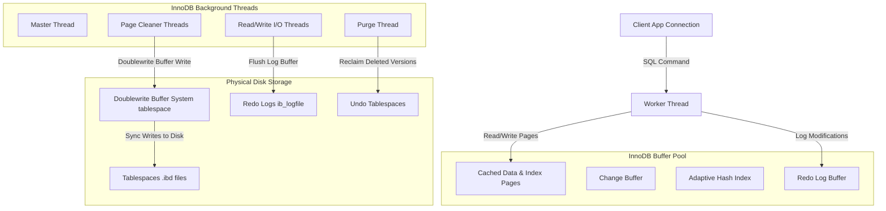

# Advanced DBMS System Design — MySQL InnoDB Storage Engine

## 1. Problem Background

MySQL's original architecture separated the SQL query parser/optimizer from the pluggable storage engines. Early versions used the default **MyISAM** engine, which was highly performant for simple read-heavy workloads but lacked support for transactions, foreign keys, crash recovery, and row-level concurrency (it relied on table-level locking).

To support enterprise workloads, **InnoDB** was developed by Innobase Oy (later acquired by Oracle). InnoDB was designed as a transaction-safe (ACID compliant) storage engine for MySQL, featuring:
- **Clustered Storage**: Row data is physically co-located with the primary key.
- **High Concurrency**: Multi-version concurrency control (MVCC) utilizing row-level locking.
- **Crash Safety**: Write-Ahead Logging via a doublewrite buffer and redo log files.

---

## 2. Architecture Overview

InnoDB uses a **thread-based worker architecture** where a single process (`mysqld`) handles connections using internal thread pools.

### System Components & Data Flow Diagram

---

## 3. Internal Design

### 3.1 Clustered Index (Primary Key Storage)
InnoDB organizes tables using a **clustered index structure**.
- **Clustered Index**: In an InnoDB table, the leaf nodes of the primary key B+Tree contain the *actual physical row data*. There is exactly one clustered index per table. If no primary key is defined, InnoDB implicitly selects the first unique non-null key, or generates a hidden 6-byte row ID (`DB_ROW_ID`).
- **Secondary Indexes**: All indexes other than the primary key are secondary indexes. The leaf nodes of a secondary index do *not* contain data or direct row pointers. Instead, they store the **primary key value** of the corresponding row.
- **Performance Impact**:
  - **Advantage**: Point lookups and range scans on the primary key are extremely fast because the data pages are accessed directly within the index B+Tree leaf. This avoids an extra disk seek to fetch data.
  - **Disadvantage**: Secondary index lookups require a two-step traverse: first, traverse the secondary index to find the primary key, then traverse the clustered index (a process called **index lookup rollback** or **row lookup**) to fetch the actual row data.

### 3.2 Buffer Pool
The **InnoDB Buffer Pool** is a large, contiguous memory block where InnoDB caches data, index pages, change buffers, and other structures.
- **Page Cache**: Caches data pages (default 16 KB) to reduce physical read I/Os.
- **Adaptive Hash Index**: InnoDB monitors index searches. If it detects that a specific index page is queried frequently, it automatically creates an in-memory hash index on top of the B+Tree to enable $O(1)$ lookups.
- **Change Buffer**: When a secondary index page is modified but is not in the buffer pool, InnoDB caches the modification in the Change Buffer instead of reading the page from disk, merging it later when the page is loaded.

### 3.3 Undo Logs vs. Redo Logs
InnoDB separates the durability mechanism from transaction rollback and concurrency control:

- **Redo Logs (WAL)**:
  - **Purpose**: Guarantee **durability** (the "D" in ACID) for committed transactions and enable crash recovery.
  - **Mechanism**: Writes physical changes made to pages (e.g., "offset 120 in page 5 modified to value X") to the **Log Buffer**, which is flushed sequentially to disk (`ib_logfile0`/`1`) on transaction commit.
  - **Doublewrite Buffer**: To prevent data corruption caused by partial page writes (OS page size is typically 4 KB vs InnoDB's 16 KB), InnoDB writes dirty pages to a contiguous area of disk called the Doublewrite Buffer first, before flushing them to their final `.ibd` tablespaces.

- **Undo Logs**:
  - **Purpose**: Support **transaction rollbacks** (the "A" in ACID) and **MVCC** (visibility of historical data versions).
  - **Mechanism**: Stores logical inverse operations (e.g., if a query inserts a row, the undo log stores a delete command). Under MVCC, if a transaction reads a row modified by another uncommitted transaction, InnoDB uses the undo log to construct the older, visible version of the row dynamically in memory.

### 3.4 Concurrency Control & Row-Level Locking
InnoDB uses a combination of row-level locks and multi-version concurrency control.

- **MVCC (Non-Locking Reads)**: InnoDB uses undo logs to reconstruct historical snapshots of rows, allowing read queries to bypass locks entirely.
- **Locking Mechanisms**:
  - **Record Locks**: Lock the index record directly.
  - **Gap Locks**: Lock the "gap" (space) between index records, or the gap before the first or after the last record. This prevents other transactions from inserting new rows in that range, solving the **Phantom Read** problem.
  - **Next-Key Locks**: A combination of a Record Lock on the index record and a Gap Lock on the gap preceding that record. Used by default in *Repeatable Read* isolation level.

---

## 4. Design Comparison: InnoDB vs. PostgreSQL

The table below contrasts the core architectural choices of MySQL/InnoDB against PostgreSQL:

| Feature / Concept | MySQL InnoDB | PostgreSQL |
| :--- | :--- | :--- |
| **MVCC Model** | **Undo-Log Based**: Updates are done in-place. Older versions of rows are reconstructed on-the-fly using the Undo Log. | **Append-Only Heap**: Updates create a new version of the row elsewhere in the heap. Old versions remain on the table page. |
| **Row Storage** | **Clustered Storage (Index-Organized)**: Row data is physically stored in the primary key B+Tree leaf nodes. | **Heap Table**: Row data is stored in unstructured heap pages. Indexes store TIDs (Tuple IDs) pointing to the heap. |
| **Secondary Indexes** | Point to the **Primary Key value**. Changing a row's location (due to size changes) doesn't require index updates. | Point directly to the **Heap Tuple ID (TID)**. Heap relocations require updating all indexes (unless optimized by HOT). |
| **Garbage Collection** | **Purge Thread**: Reclaims space in undo logs once no active transactions need those versions. Very little table bloat. | **VACUUM / autovacuum**: Scans the heap files to remove dead tuples and reclaim space. High potential for table/index bloat. |
| **Deadlock Handling** | Instant detection via internal wait-for lock graphs; automatically aborts the transaction with the fewest lock updates. | Periodic detection via background lock waiters check; aborts the youngest transaction. |

---

## 5. Architectural Q&A

### Q1: Why does InnoDB need both undo and redo logs?
- **Redo Logs** are optimized for **Write-Ahead Logging (WAL)**. They store physical changes to pages to guarantee that once a transaction commits, its modifications are crash-safe and durable, even if the actual data files are not written to disk yet.
- **Undo Logs** are logical logs. They store the reverse operations to allow rolling back active transactions that abort, and to allow concurrent readers to reconstruct older versions of rows for MVCC snapshot isolation without blocking writers.

### Q2: What advantages do clustered indexes provide?
- **Faster Primary Key Lookups**: Primary key lookups require zero auxiliary disk seeks to fetch row data, as the data page is reached directly through the B+Tree leaf.
- **Efficient Range Scans**: Data rows are physically ordered by the primary key, enabling extremely fast sequential range scans on primary key columns.
- **Reduced Pointer Fragmentation**: Since secondary indexes reference the primary key value rather than physical disk pointers, page splits and row updates in the clustered index do *not* require updating all secondary indexes.

### Q3: Why did PostgreSQL choose a different MVCC model?
- PostgreSQL chose an **append-only heap** model to simplify transaction processing:
  - **Instant rollback**: Aborting a transaction only requires writing one bit to `pg_xact` to mark the transaction ID as aborted, making rollback $O(1)$.
  - **No Reconstruction Overhead**: PostgreSQL reads historical versions directly from the table heap pages, whereas InnoDB must construct historical versions in memory by parsing chain links in the Undo logs, which can degrade read performance under long-running transactions.
  - **Simpler Codebase**: It avoids the complexity of managing dedicated Undo logs and tablespaces.

---

## 6. Key Learnings

1. **In-place updates minimize storage bloat**: By performing updates in-place and delegating historical visibility to undo tablespaces, InnoDB maintains table compact density, reducing disk fragmentation compared to PostgreSQL's heap structure.
2. **Clustered index design shifts the lookup cost**: While primary key lookups are highly optimized, secondary index queries pay a double traversal penalty, making primary key design a critical performance factor in InnoDB.
3. **Gap locks prevent phantoms**: Next-key locking enables InnoDB to guarantee strict Repeatable Read isolation, eliminating phantom reads at a lower cost than full serializable transaction isolation.