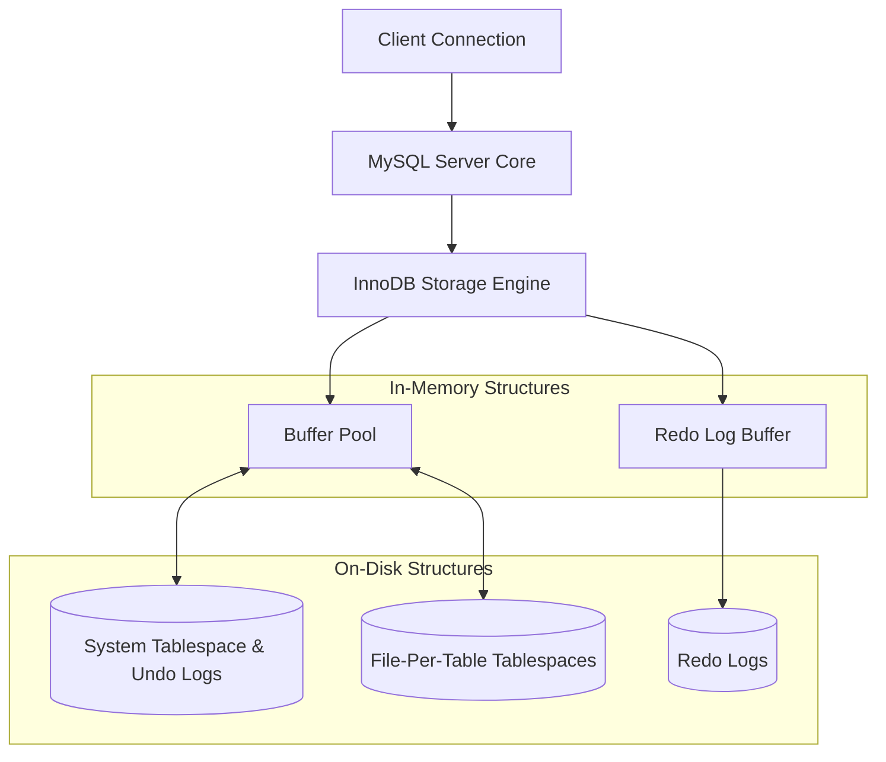

# MySQL / InnoDB Storage Engine Architecture

## 1. Problem Background
MySQL was designed as a fast, reliable, and highly available relational database system, predominantly powering web applications. While early versions relied on the MyISAM engine, which lacked transaction support and crash recovery, the introduction of the **InnoDB** storage engine transformed MySQL into a fully ACID-compliant system. The problem InnoDB solves is balancing high-concurrency transactional processing with robust data integrity and efficient storage layout.

## 2. Architecture Overview
InnoDB is the default storage engine for MySQL. Its architecture consists of in-memory structures (Buffer Pool, Log Buffer) and on-disk structures (Tablespaces, Redo Logs, Undo Logs).

## 3. Internal Design

### Clustered Indexes
The most defining characteristic of InnoDB is its use of **Clustered Indexes** for table storage.
- **Primary Key Storage:** The table data itself is physically stored in the leaf nodes of the B+Tree organized by the Primary Key. This means retrieving a full row by its primary key is extremely fast because there is no separate "data heap" to lookup.
- **Secondary Indexes:** Any other index is a secondary index. The leaf nodes of a secondary index do not contain the actual row data; instead, they contain the **Primary Key value** of the row. This results in a two-step lookup: search the secondary index to find the Primary Key, then search the Clustered Index using that Primary Key to get the full row.

### Memory Management: The Buffer Pool
The **Buffer Pool** is the main memory area where InnoDB caches table and index data as it is accessed. Like PostgreSQL's shared buffers, it minimizes disk I/O. It uses an LRU (Least Recently Used) algorithm with a mid-point insertion strategy to prevent full table scans from flushing out the cache entirely.

### Transaction Processing and Recovery
- **Undo Logs:** Essential for transaction rollback and MVCC. When a record is modified, the old value is copied to an Undo Log. 
- **Redo Logs:** Essential for crash recovery (Durability). Whenever a page in the buffer pool is modified, a physiological record of the change is appended to the Redo Log Buffer, which is frequently flushed to the on-disk Redo Logs. If the database crashes before the buffer pool is flushed to disk, the Redo Logs are replayed on startup to reconstruct the data.

### Concurrency Control and Locking
- **Row-level Locking:** InnoDB supports locking individual rows rather than the whole table, maximizing concurrency.
- **Gap Locks:** Used primarily in the `REPEATABLE READ` isolation level (the default in MySQL). A gap lock places a lock on the "gap" between index records, or the gap before the first or after the last index record. This prevents "Phantom Reads," where another transaction inserts a row into the range being queried by the current transaction.

## 4. Key Comparison: InnoDB vs PostgreSQL

The way InnoDB handles MVCC and storage contrasts sharply with PostgreSQL.

| Feature | PostgreSQL | MySQL / InnoDB |
| --- | --- | --- |
| **Storage Structure** | Unordered Heap (Tables are separate from indexes) | Clustered Index (Table data is inside the PK B+Tree) |
| **MVCC Implementation** | Tuple Versioning: New row version is inserted into the heap (`xmin`/`xmax`). | In-Place Updates: Main row is updated; old version is pushed to an **Undo Log**. |
| **Cleanup Mechanism** | Needs `VACUUM` to reclaim space from dead tuples. | A background Purge Thread cleans up Undo Logs automatically. |
| **Secondary Indexes** | Point directly to the physical row (TID). | Point to the Primary Key. Slower for lookups, but easier to maintain when data moves. |
| **Phantom Read Protection** | Solved via Snapshot Isolation. | Solved via Gap Locks (which can cause deadlocks). |

### Design Trade-Offs
- **InnoDB Advantages:** Clustered storage makes primary key lookups incredibly fast. The use of undo logs for MVCC means there is no "table bloat" like in PostgreSQL, eliminating the need for aggressive vacuuming of the main tablespace. Secondary index maintenance is cheap when rows are updated (as long as the PK doesn't change).
- **InnoDB Limitations:** Secondary index lookups require two B+Tree traversals. If the Primary Key is large (e.g., a UUID), all secondary indexes will be heavily bloated because they store that PK. Gap locking, while preventing phantom reads, is a frequent source of transaction deadlocks.

## 5. Experiments / Observations
**Benchmarking Lookups:**
If an experiment is run performing heavy secondary index lookups:
- **Observation:** InnoDB will show higher read latency compared to PostgreSQL because it has to traverse the secondary B+Tree to find the PK, and then traverse the primary B+Tree.
- **Workaround:** Developers working with InnoDB frequently use **Covering Indexes** (an index that contains all the columns needed by the query). If a query can be satisfied purely from the secondary index, InnoDB skips the second lookup, massively improving performance.

## 6. Key Learnings
- **The Importance of the Primary Key:** In InnoDB, designing the Primary Key is the most crucial architectural decision. Because the table is clustered by it, using a sequential integer (like an Auto-Increment ID) is highly recommended to prevent expensive page splits and fragmentation.
- **Trade-Offs in MVCC:** There is no "perfect" MVCC. PostgreSQL's tuple versioning causes bloat but avoids complex locking and separate undo segments. InnoDB's in-place updates keep the table compact but require dedicated undo logs and run the risk of gap lock contention.
- **Durability Models:** Both systems use the Write-Ahead Logging concept (PostgreSQL's WAL vs. InnoDB's Redo Logs), proving that appending sequential physiological logs is the universal standard for achieving ACID durability efficiently.
