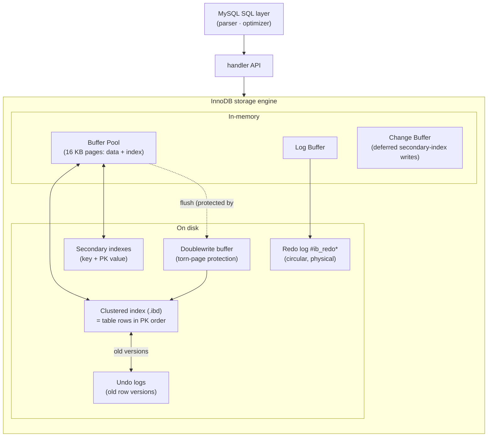

# MySQL / InnoDB — Clustered Storage, Undo/Redo Logs & Locking

> **Topic 3 — Advanced DBMS System Design Discussion**
> Author: Rudhar Bajaj · Roll No: 24BCS10143
>
> All experiments in §5 were run against a **real, locally-running MySQL 8.0.40 server**
> (portable zip, `mysqld --initialize-insecure`, port 33099, InnoDB engine, 16 KB pages,
> default isolation **REPEATABLE READ**). Two-session locking demos use `PyMySQL`. Every
> figure is captured verbatim inline.

---

## 1. Problem Background

**InnoDB** is MySQL's default transactional **storage engine** — the layer that actually
stores rows, indexes them, locks them, logs them and recovers them after a crash. MySQL's
pluggable-engine architecture separates the SQL layer (parser, optimizer) from the storage
engine; InnoDB is the engine that makes MySQL ACID.

InnoDB's defining design choices were made to provide **OLTP** (online transaction
processing): many short read/write transactions, strong durability, and high concurrency.
Its three foundational ideas are:

1. **The table *is* its primary-key B-tree** (a *clustered index*) — rows live in PK order, in the leaves.
2. **Updates happen in place**, with the previous image preserved in an **undo log** — this powers both rollback and MVCC.
3. **A redo log** makes committed changes durable without flushing data pages synchronously.

This is a deliberately *different* answer to the same problems PostgreSQL solves — and the
contrast (§4) is the most instructive part of this study.

---

## 2. Architecture Overview



| Component | Role |
|-----------|------|
| **Buffer Pool** | In-memory cache of 16 KB pages (default 128 MB). All reads/writes go through it. |
| **Clustered index** | The table itself, organised as a B-tree on the primary key; leaf pages contain the *full rows*. |
| **Secondary index** | B-tree on other columns; its leaves store the indexed value **+ the primary key** (not a physical row pointer). |
| **Undo log** | Old versions of changed rows. Serves transaction **rollback** *and* **MVCC** consistent reads. |
| **Redo log** | Physical log of page changes. Serves **crash recovery** (roll-forward). Circular files in `#innodb_redo/`. |
| **Doublewrite buffer** | Pages are written here first, then to their final location, so a torn 16 KB write can be repaired after a crash. |
| **Change buffer** | Buffers modifications to secondary-index pages not currently in the pool, applied later. |

---

## 3. Internal Design

### 3.1 Clustered index — the table *is* the primary key

In InnoDB, a table is **not** a heap with separate indexes (PostgreSQL's model). The table
**is** a B-tree keyed by the primary key, and the **whole row lives in the leaf**. There is
no separate heap.

Consequences, all measured in §5.2:
- A **primary-key lookup is a single B-tree seek** straight to the row — `EXPLAIN` shows
  `type = const`, `key = PRIMARY`.
- **Rows are physically stored in PK order**, so PK range scans are sequential I/O.
- A **secondary index** stores `(indexed columns, primary key)`. Looking up a row via a
  secondary index is therefore a **two-step** operation: search the secondary B-tree to get
  the PK, then search the clustered index for the row (a "bookmark lookup"). Unless the
  index is **covering** (`Using index`), in which case the second step is skipped.

This is why **choosing a good, small primary key matters so much in InnoDB**: the PK is
duplicated into *every* secondary index, and every non-covering secondary lookup pays the
clustered-index hop.

### 3.2 Buffer pool

The buffer pool caches 16 KB pages and uses a **midpoint-insertion LRU** (a young/old
sublist split) so that a single large scan can't flush the whole working set. Measured: a
128 MB pool (8191 pages) holding 1648 data pages with a **100 % hit rate** after the
working set warmed (§5.4). Dirty pages are flushed in the background, protected by the
doublewrite buffer — never synchronously at commit.

### 3.3 Undo logs — rollback *and* MVCC

When a transaction modifies a row, InnoDB writes the change **in place** and saves the
*previous* version into an **undo log record**. Each row carries hidden system columns
`DB_TRX_ID` (last writer) and `DB_ROLL_PTR` (pointer to the undo record). This single
mechanism does two jobs:

1. **Rollback** — `ROLLBACK` replays undo records to restore the original rows.
2. **MVCC consistent reads** — a transaction reading a row that a *newer* transaction has
   modified follows `DB_ROLL_PTR` back through the undo log to **reconstruct the version
   visible to its snapshot**. Readers therefore never block writers, and never need locks.

The **purge** background thread discards undo records once no active snapshot can still
need them. The "**History list length**" (measured at 20, §5.4) is how much old-version
history is currently retained — InnoDB's analogue of PostgreSQL's dead-tuple backlog,
except it lives in compact undo logs, not bloating the table.

### 3.4 Redo log — durability without flushing data pages

The redo log is a **circular, physical** log of page-level changes. On commit, InnoDB
flushes the redo up to the commit (`innodb_flush_log_at_trx_commit = 1`, measured §5.4) and
returns — the modified data pages can stay dirty in the buffer pool. After a crash, InnoDB
**rolls forward** by replaying redo from the last checkpoint, then **rolls back**
uncommitted transactions using undo. Measured: a 25,000-row update generated **~3.9 MB of
redo** (LSN advanced 36,054,695 → 39,966,770, §5.4).

### 3.5 Why BOTH undo and redo are needed

This is the topic's headline question, and the two logs are **not redundant** — they face
opposite directions in time:

| | **Redo log** | **Undo log** |
|---|---|---|
| Direction | Roll **forward** (re-apply) | Roll **back** (un-apply) |
| Contains | *New* page images / physical changes | *Old* row versions |
| After a crash | Re-applies committed changes lost from the buffer pool | Reverts transactions that hadn't committed |
| In normal running | (not used) | Serves MVCC snapshot reads + `ROLLBACK` |
| Lives in | `#innodb_redo/` (circular) | Undo tablespaces / rollback segments |

A crash can leave the data files in *either* of two bad states: **committed changes not yet
written** (fixed by **redo**) and **uncommitted changes already written** (fixed by
**undo**). You need both to reach a correct, consistent state — this is the classic
ARIES-style recovery (redo-then-undo).

### 3.6 Row-level locking, gap locks & isolation

InnoDB locks at **row granularity**, not page or table. Under the default **REPEATABLE
READ**, locking reads (`SELECT … FOR UPDATE`, and the implicit locks of `UPDATE`/`DELETE`)
take **next-key locks** = a record lock **plus** a **gap lock** on the gap *before* the
record. Gap locks prevent **phantom rows**: another transaction cannot insert into a range
that has been locked, even for keys that don't exist yet (measured §5.3).

- **Plain `SELECT`** is a non-locking **consistent read** (served from undo, takes no locks).
- **REPEATABLE READ** (MySQL default): snapshot fixed at first read; gap/next-key locks prevent phantoms in locking reads.
- **READ COMMITTED**: each statement gets a fresh snapshot; gap locks largely disabled (more concurrency, phantoms possible).

---

## 4. Design Trade-Offs — InnoDB vs PostgreSQL

The assignment's central comparison. Both are ACID and both do MVCC, but via **opposite**
storage strategies:

| Dimension | **InnoDB** | **PostgreSQL** |
|-----------|-----------|----------------|
| Update strategy | **In place**, old version → undo log | **Append** a new tuple version into the heap |
| Old versions live in | Compact **undo logs** (separate) | The **table heap itself** (as dead tuples) |
| Table storage | **Clustered** by PK (rows in leaves) | **Heap** (unordered) + separate indexes |
| Garbage collection | **Purge** thread trims undo | **VACUUM** reclaims dead tuples |
| MVCC read | Reconstruct old version via undo | Read the visible tuple version directly (check xmin/xmax) |
| Secondary index | Stores **PK value** as pointer | Stores **physical TID** (block,offset) |
| PK lookup | One clustered B-tree seek (row in leaf) | Index seek **+** heap fetch |

**Why clustered indexes help (advantages):**
- PK point lookups land directly on the row — no separate heap visit.
- PK range scans are **physically sequential** — ideal for range queries and joins on the PK.
- Covering secondary indexes avoid the clustered hop entirely (`Using index`, §5.2).

**Costs of clustering:**
- Secondary lookups pay a double traversal (secondary → clustered).
- The PK is copied into every secondary index → a fat PK bloats all of them.
- Inserts not in PK order cause page splits / fragmentation; a monotonically increasing PK is strongly preferred.

**Why PostgreSQL chose a different MVCC model:** appending versions into the heap keeps the
storage engine simpler (no undo-segment management, no separate rollback machinery, cheaper
long-rollback) and makes building new index types easy — at the cost of table bloat and the
mandatory VACUUM. InnoDB's undo-based model keeps the table compact and rollback cheap, at
the cost of undo-tablespace management and a purge thread. **Neither is "better" — they are
different placements of the same complexity** (old-version storage + its cleanup).

---

## 5. Experiments / Observations

**Setup.** MySQL 8.0.40, InnoDB, 16 KB pages, 128 MB buffer pool, REPEATABLE READ, 100,000
rows in `employees` (clustered on `emp_id`, secondary indexes on `dept_id`, `salary`).

### 5.1 On-disk layout (file-per-table) & the two logs

```
adbms/employees.ibd     18,874,368 bytes   ← the clustered index = the whole table, one tablespace file
adbms/departments.ibd      114,688 bytes
#innodb_redo/ :  #ib_redo10  #ib_redo11  #ib_redo12_tmp …   ← circular redo log files
@@innodb_redo_log_capacity   = 104,857,600 (100 MB)
@@innodb_flush_log_at_trx_commit = 1        ← fsync redo at every commit (full durability)
```

Each InnoDB table is its own `.ibd` tablespace; the 18 MB `employees.ibd` *is* the clustered
B-tree (data + PK together), confirming §3.1.

### 5.2 Clustered vs secondary index access paths

```
-- PRIMARY KEY lookup — single clustered seek straight to the row:
EXPLAIN SELECT * FROM employees WHERE emp_id=54321;
  type=const  key=PRIMARY  rows=1

-- Secondary-index range scan (idx_salary), with Index Condition Pushdown:
EXPLAIN ANALYZE SELECT * FROM employees WHERE salary>76000;
  -> Index range scan on employees using idx_salary over (76000 < salary),
     with index condition (salary > 76000)  (cost=2700 rows=6000) (actual time=1.03..10 rows=6000)

-- COVERING query — secondary index alone answers it, no clustered hop:
EXPLAIN SELECT emp_id FROM employees WHERE salary=75000;
  key=idx_salary   Extra="Using index"
```

**Observation.** The PK path is a `const` clustered seek. The secondary path scans
`idx_salary`; because it selects `*`, InnoDB must then hop to the clustered index per row —
*except* in the covering case (`SELECT emp_id`), where `Using index` shows the secondary
index already contains everything needed (the PK `emp_id` is embedded in every secondary
index).

### 5.3 Row locks & gap locks (two concurrent transactions)

```
EXPERIMENT 2 — ROW-LEVEL locking:
[A] holds X lock on row emp_id=100 (uncommitted)
[B] UPDATE DIFFERENT row emp_id=200 committed in 3.2 ms  -> NO BLOCK
[B] UPDATE SAME row emp_id=100 -> BLOCKED on A's row lock, timed out after 2027 ms

EXPERIMENT 3 — GAP LOCKS prevent phantoms:
[A] SELECT ... WHERE emp_id BETWEEN 500 AND 510 FOR UPDATE
    Locks held by A (performance_schema.data_locks):
      TABLE    IX                 x1      ← intention lock on the table
      RECORD   X                  x10     ← next-key locks (record + preceding gap)
      RECORD   X,REC_NOT_GAP      x1
[B] INSERT emp_id=505000 (OUTSIDE locked range) -> OK in 3.6 ms
[B] INSERT emp_id=505 INTO LOCKED GAP -> BLOCKED, timed out after 2021 ms
```

**Observation.** Locks are per-row: concurrent writers on different rows don't block; only
same-row contention serialises. The `FOR UPDATE` range took **10 next-key locks** (visible
in `performance_schema.data_locks`), and those gap locks **blocked an insert of id=505 — a
row that doesn't even exist yet** — while an insert outside the range succeeded. This is how
InnoDB delivers phantom-free REPEATABLE READ.

### 5.4 MVCC consistent read from the undo log

```
[A] first read  (snapshot established): salary = 31000
[B] UPDATE salary += 5000 and COMMIT  (new committed value = 36000)
[A] second read in SAME txn          : salary = 31000   <- still old value, read from UNDO
[A] read after COMMIT (new snapshot) : salary = 36000   <- now sees B's commit
```

Plus, from `SHOW ENGINE INNODB STATUS`: **History list length 20** (undo versions retained
for active snapshots), and the redo LSN advanced **36,054,695 → 39,966,770 (~3.9 MB)** for a
25,000-row update — buffer-pool hit rate **100 %** (1648 of 8191 pages resident).

**Observation.** InnoDB updated the row *in place* (B's commit changed the live row to
36000), yet transaction A kept reading **31000** because its snapshot reconstructed the old
version from the undo log. This is the exact mechanism contrasted with PostgreSQL in §4:
same MVCC guarantee, opposite storage of the old version (undo log vs heap tuple).

### 5.5 Optimizer contrast (vs PostgreSQL on the identical query)

InnoDB's `EXPLAIN ANALYZE` for the join+group+order:

```
-> Sort: hc DESC (actual time=91.4..91.4 rows=4)
  -> Aggregate using temporary table (actual rows=4)
    -> Nested loop inner join (cost=14206 rows=66693) (actual rows=38000)
      -> Table scan on d (rows=4)
      -> Filter: salary>60000 -> Index lookup on e using idx_dept (actual rows=25000, loops=4)
```

**Observation.** MySQL chose a **nested-loop join driven from `departments`** with an index
lookup on `idx_dept`, estimating **66,693** rows vs **38,000** actual — a coarser estimate
than PostgreSQL's `37,753` (which matched 38,000 within 1 %). Same query, two optimizers,
two strategies (nested-loop vs hash join) — a concrete look at how planner statistics and
join algorithms differ between engines.

---

## 6. Key Learnings

1. **Undo and redo are complementary, not redundant.** Redo rolls *forward* (re-applies
   committed work lost from the buffer pool); undo rolls *back* (reverts uncommitted work
   and reconstructs old versions for MVCC). A crash needs both to reach consistency — the
   ARIES redo-then-undo recovery made tangible by the 3.9 MB redo + History-list-length 20
   measurements.

2. **Clustering is a trade, paid on every secondary index.** Putting the row in the PK
   leaf makes PK access and range scans excellent (§5.2), but the PK is embedded in every
   secondary index and non-covering lookups pay a second traversal — so PK choice is an
   architectural decision, not a detail.

3. **InnoDB and PostgreSQL solve MVCC with mirror-image storage.** Watching A read `31000`
   from undo while the live row already said `36000` (§5.4) is the precise counterpart to
   PostgreSQL keeping two heap tuples (Topic 2). Undo logs keep the table compact (purge,
   not VACUUM); PostgreSQL keeps versions in the heap (VACUUM, not purge). The complexity is
   conserved, just relocated.

4. **Gap locks are the surprising, load-bearing detail of REPEATABLE READ.** Blocking the
   insert of a *non-existent* id=505 (§5.3) shows phantom prevention is enforced by locking
   *gaps*, not just rows — the subtle mechanism behind InnoDB's strong default isolation,
   and a frequent source of unexpected lock waits in production.

5. **Durability is decoupled from data-page writes** (as in PostgreSQL): commit cost is one
   sequential redo flush, while 16 KB data pages are flushed lazily and protected from torn
   writes by the doublewrite buffer — the same core idea, engine-specific machinery.

---

### References & tooling
- *MySQL 8.0 Reference Manual* — "InnoDB Storage Engine": clustered indexes, redo/undo logs, locking, the buffer pool, doublewrite.
- Mohan et al., *ARIES* (1992) — the redo/undo recovery model InnoDB follows.
- Live runs: MySQL 8.0.40 (`EXPLAIN`, `EXPLAIN ANALYZE`, `SHOW ENGINE INNODB STATUS`, `performance_schema.data_locks`, `information_schema.INNODB_BUFFER_POOL_STATS`) + `PyMySQL` two-session locking demos on Windows 11. Outputs shown are captured verbatim.
