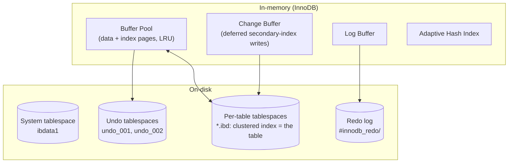
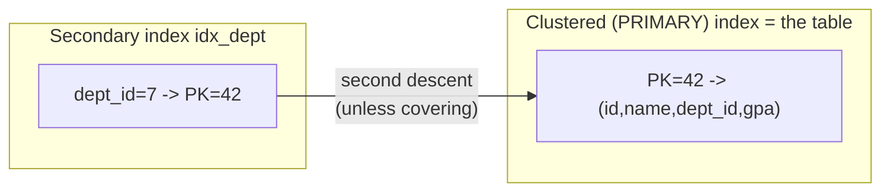

# MySQL / InnoDB Storage Engine

> InnoDB and PostgreSQL solve the *same* problem — ACID + MVCC — with **opposite**
> storage strategies. InnoDB updates rows **in place**, keeps old versions in a separate
> **undo log**, and physically clusters the table around its primary key. This document
> dissects those choices against real InnoDB output.

All output below was captured on **MySQL 9.3.0 (Homebrew)**, default storage engine InnoDB,
against a `students` table of 50 000 rows across 20 departments.

---

## 1. Problem Background

MySQL began (1995) with simple, fast, non-transactional storage (MyISAM). As MySQL moved into OLTP, it needed **transactions, crash recovery, and row-level concurrency** — InnoDB (Innobase Oy, later Oracle) was created to provide them and became the **default engine in MySQL 5.5 (2010)**.

InnoDB's design DNA is **Oracle-style MVCC**: rows are updated in place, and the *previous* versions needed to satisfy older readers live in an **undo log**, not in the table itself. This is the cleanest single contrast with PostgreSQL, and it explains nearly every other difference.

---

## 2. Architecture Overview



- **Buffer Pool** — InnoDB's equivalent of PostgreSQL's shared buffers; caches data+index pages with a midpoint-insertion LRU.
- **Clustered index** — the table's rows are stored *inside* the primary-key B-tree leaves (the table **is** the PK index).
- **Redo log** — physical log of page changes, for crash recovery (durability).
- **Undo log** — logical "how to go back" log, for MVCC reads and rollback.

---

## 3. Internal Design

### 3.1 Clustered index — the table is the primary key

In InnoDB, **leaf nodes of the primary-key B-tree hold the full rows**. There is no separate heap. A PK lookup therefore lands directly on the row data:

```
$ EXPLAIN FORMAT=TREE SELECT * FROM students WHERE id = 42;
-> ... lookup on the clustered (PRIMARY) index -> row is right there at the leaf
```

A **secondary index** (here `idx_dept` on `dept_id`) does **not** store a row pointer — it stores the **primary key value**. So a secondary lookup is *two* B-tree descents: secondary index → PK value → clustered index → row. We can see the extra cost in the optimizer:

```
-- Secondary index, then back to clustered index to fetch 'name' (the extra hop)
$ EXPLAIN FORMAT=TREE SELECT name FROM students WHERE dept_id = 7;
-> Index lookup on students using idx_dept (dept_id = 7)  (cost=371 rows=2500)

-- COVERING index: query needs only (dept_id, id); 'id' is in the secondary index for free
$ EXPLAIN FORMAT=TREE SELECT id FROM students WHERE dept_id = 7;
-> Covering index lookup on students using idx_dept (dept_id = 7)  (cost=251 rows=2500)
```

The covering query costs **251 vs 371** for the same 2500 rows — the difference *is* the avoided clustered-index back-references. This is a direct, measured demonstration of why clustered indexes make PK access fast but make secondary indexes carry the PK as their "row pointer."



### 3.2 Buffer Pool

```
$ SELECT POOL_SIZE, FREE_BUFFERS, DATABASE_PAGES, MODIFIED_DATABASE_PAGES
  FROM information_schema.INNODB_BUFFER_POOL_STATS;
 POOL_SIZE | FREE_BUFFERS | DATABASE_PAGES | MODIFIED_DATABASE_PAGES
-----------+--------------+----------------+-------------------------
      8191 |         7119 |           1072 |                      60
```

1072 pages are in use caching our table/indexes, 60 are **dirty** (modified, not yet flushed). InnoDB uses a midpoint-insertion LRU (new pages enter at 5/8 down the list) to keep a single large scan from evicting the hot working set — a refinement over plain LRU.

### 3.3 Redo log — durability (physical, "redo the change")

The redo log records *physical page modifications* so that committed work survives a crash. The log sequence number advances with every change:

```
$ SHOW ENGINE INNODB STATUS  (LOG section)
Log sequence number          24181538
Log buffer assigned up to    24181538
Log buffer completed up to   24181538

$ ls mydata/#innodb_redo/
#ib_redo10 ... 32 fixed redo files, 3276800 bytes each
```

On commit, the log buffer is flushed to these files (governed by `innodb_flush_log_at_trx_commit`). On restart after a crash, InnoDB **replays redo** from the last checkpoint to bring pages forward — this is *write-ahead logging*, exactly like PostgreSQL's WAL.

### 3.4 Undo log — MVCC + rollback (logical, "undo the change")

Here is the deep divergence from PostgreSQL. When InnoDB updates a row, it modifies the row **in place** in the clustered index, and writes the *old* column values to the **undo log**:

```
$ ls mydata/undo_001 mydata/undo_002
undo_001  (16 MB)
undo_002  (16 MB)        <- dedicated undo tablespaces
```

- **Rollback:** apply the undo records in reverse to restore the previous values.
- **MVCC reads:** an older transaction that must not see the new value follows the row's **roll pointer** back through undo records to **reconstruct the version it is entitled to see**. Each row carries hidden `DB_TRX_ID` (last writer) and `DB_ROLL_PTR` (pointer into undo) columns for exactly this.

So **InnoDB reconstructs old versions on demand at read time**, whereas **PostgreSQL stores all versions physically and cleans up with VACUUM** (Topic 2). Same MVCC guarantee, mirror-image implementation.

### 3.5 Locking — row, gap, and next-key

InnoDB does **row-level locking** in the clustered index. Under the default **REPEATABLE READ** it also takes **gap locks** to prevent phantom rows. A live demonstration via `performance_schema.data_locks` while holding `SELECT ... WHERE id BETWEEN 100 AND 105 FOR UPDATE`:

```
$ SELECT INDEX_NAME, LOCK_TYPE, LOCK_MODE, LOCK_DATA
  FROM performance_schema.data_locks WHERE OBJECT_NAME='students';
 INDEX_NAME | LOCK_TYPE | LOCK_MODE        | LOCK_DATA
------------+-----------+------------------+-----------
 NULL       | TABLE     | IX               | NULL          <- intention-exclusive table lock
 PRIMARY    | RECORD    | X                | 101           <- next-key lock (record + gap before it)
 PRIMARY    | RECORD    | X                | 102
 PRIMARY    | RECORD    | X                | 103
 PRIMARY    | RECORD    | X                | 104
 PRIMARY    | RECORD    | X                | 105
 PRIMARY    | RECORD    | X,REC_NOT_GAP    | 100           <- first matched row: record-only lock
```

This shows all three lock flavors at once: an **IX intention lock** on the table, **next-key locks** (`X` = record + the gap before it) on 101–105, and a **record-only lock** (`REC_NOT_GAP`) on the boundary row 100. The gap locks are what stop another session from *inserting* an `id=103` phantom into the locked range.

### 3.6 Isolation levels

```
$ SELECT @@transaction_isolation;   ->  REPEATABLE-READ
```

InnoDB defaults to **REPEATABLE READ** (vs PostgreSQL's READ COMMITTED). It supports all four SQL levels; READ COMMITTED drops most gap locks (more concurrency, more phantoms), SERIALIZABLE promotes plain reads to locking reads.

---

## 4. Design Trade-Offs

| | **InnoDB** | **PostgreSQL** |
|---|---|---|
| Update strategy | **in-place** + undo log | **append new version** to heap |
| Old versions live in | **undo tablespaces** (transient) | **the table heap** (until VACUUM) |
| Cost of MVCC paid at | **read time** (reconstruct via undo) | **maintenance time** (VACUUM) |
| Table physical order | **clustered on PK** | **unordered heap** |
| Secondary index points to | **PK value** (→ second descent) | **heap tuple id (ctid)** (→ direct) |
| Bloat behavior | undo recycled quickly; no table bloat from updates | dead tuples accumulate → bloat |
| Long-running readers | grow the **undo / history list** → "purge lag" | hold back the **VACUUM horizon** → bloat |

**Why does InnoDB need *both* logs?** They answer different questions:
- **Redo** = *durability* — "the database changed; make sure that survives a crash" (physical, redo-forward).
- **Undo** = *atomicity + isolation* — "let me undo this, and let old readers see the old value" (logical, undo-backward).

You cannot collapse them: redo cannot reconstruct an old version for a reader, and undo cannot recover a committed change after a crash.

**Advantages of the clustered design:** range scans on the PK are sequential and cache-friendly; PK lookups need no extra heap fetch. **Limitations:** a large or randomly-distributed PK (e.g. a UUID) bloats *every* secondary index (they all embed the PK) and causes page-split churn on insert — which is precisely why InnoDB best practice is a small, monotonically-increasing PK.

---

## 5. Experiments / Observations

| Observation | Measured result | Interpretation |
|---|---|---|
| Covering vs non-covering secondary scan | cost **251** vs **371** (same 2500 rows) | the delta is the avoided clustered-index back-reference |
| Buffer pool occupancy | 1072 pages used, **60 dirty** | dirty pages await background flush; redo already protects them |
| Redo LSN | `24181538`, monotonically advancing | every change is logged before/at commit |
| Undo tablespaces | `undo_001`, `undo_002` (16 MB each) | old versions stored *outside* the table |
| Locks under RR | next-key on 101–105 + `REC_NOT_GAP` on 100 + table `IX` | gap locks prevent phantoms in the scanned range |
| Default isolation | `REPEATABLE-READ` | stricter default than PostgreSQL |

---

## 6. Key Learnings

1. **The table is an index.** InnoDB's clustered design means "find by PK" and "the row data" are the same B-tree traversal — fast PK access, but secondary indexes pay a second descent (measurably: 371 vs 251).
2. **Two logs, two jobs.** Redo = durability (crash-forward); undo = atomicity + MVCC (logical-backward). Seeing both `#innodb_redo/` and `undo_00x` on disk makes the separation concrete.
3. **MVCC has two legitimate implementations.** InnoDB reconstructs old versions *on read* from undo; PostgreSQL keeps them *in the heap* and vacuums later. InnoDB trades read-time CPU for no update-bloat; PostgreSQL trades vacuum maintenance for cheap, overwrite-free updates. **Neither is strictly better — they move the cost to different places.**
4. **Gap locks are real and observable.** The `data_locks` output shows REPEATABLE READ defending against phantoms by locking *gaps*, not just rows — the source of many real-world deadlocks and a key reason some shops switch InnoDB to READ COMMITTED.
5. **PK choice is an architecture decision in InnoDB**, not a detail — because it is physically embedded in the clustered index *and every secondary index*.

---

### References
- MySQL 8.x / 9.x Reference Manual — *InnoDB Storage Engine* (clustered indexes, buffer pool, redo/undo, locking): https://dev.mysql.com/doc/refman/8.0/en/innodb-storage-engine.html
- J. T, *InnoDB MVCC and the undo log*; MySQL `performance_schema.data_locks` documentation
- Comparison framing cross-referenced with `../PostgreSQL_Internals/README.md`

*All `EXPLAIN`, buffer-pool, redo-LSN, undo-file, and `data_locks` output above is live capture from MySQL 9.3.0 / InnoDB.*
