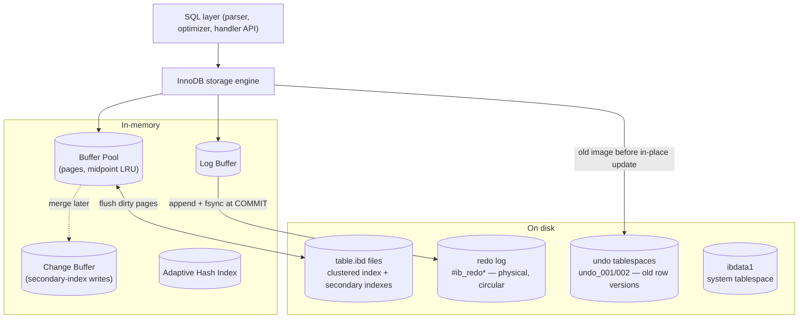
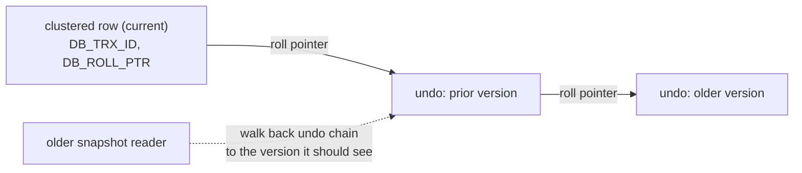

# MySQL / InnoDB Storage Engine

> InnoDB is MySQL's default transactional storage engine. Its design centers on three ideas:
> **clustered storage** (the table *is* its primary-key B-tree), **in-place updates backed by
> an undo log** (Oracle-style MVCC), and a **redo log** for durability. This document explains
> how those pieces fit together — and why InnoDB's choices differ from PostgreSQL's append-only
> heap + VACUUM model.
>
> Every plan, lock dump, status counter, and file listing below was captured first-hand on
> **MySQL 9.6.0 / InnoDB**, loaded with 50k customers / 200k orders / 600k order-items.

---

## Table of Contents

1. [Problem Background](#1-problem-background)
2. [Architecture Overview](#2-architecture-overview)
3. [Internal Design](#3-internal-design)
   - [3.1 Clustered index & primary-key storage](#31-clustered-index--primary-key-storage)
   - [3.2 Secondary indexes](#32-secondary-indexes)
   - [3.3 Buffer pool](#33-buffer-pool)
   - [3.4 Redo log (durability)](#34-redo-log-durability)
   - [3.5 Undo log & MVCC](#35-undo-log--mvcc)
   - [3.6 Locking: row locks & gap locks](#36-locking-row-locks--gap-locks)
   - [3.7 Isolation levels](#37-isolation-levels)
4. [Design Trade-Offs (vs PostgreSQL)](#4-design-trade-offs-vs-postgresql)
5. [Experiments / Observations](#5-experiments--observations)
6. [Key Learnings](#6-key-learnings)
7. [References](#7-references)

---

## 1. Problem Background

MySQL began (1995) with simple, fast, non-transactional storage (MyISAM). As MySQL moved into
serious OLTP, it needed **ACID transactions, crash recovery, and row-level concurrency** —
which MyISAM (table-level locks, no transactions, no crash safety) could not provide. **InnoDB**
(created by Heikki Tuuri, acquired by Oracle) became that engine and, since MySQL 5.5, the
default.

InnoDB's lineage is deliberately **Oracle-like**: clustered (index-organized) tables, MVCC via
a separate **undo log** (rollback segments), and **redo** logging for durability. The problem it
solves: *high-concurrency transactional workloads where most access is by primary key.* Its
architecture is optimized hard for that case — which is exactly where it differs from
PostgreSQL.

---

## 2. Architecture Overview



**Data flow of a write:** modify the page **in place** in the buffer pool → write the *old*
version to the **undo log** (for MVCC/rollback) → append a **redo** record to the log buffer →
on `COMMIT`, fsync the redo log (durable). Dirty data pages are flushed to the `.ibd` files
**lazily** by background threads. This is the same "log first, write data pages later" principle
PostgreSQL uses for WAL — but InnoDB needs *two* logs (redo **and** undo) because it updates in
place; see [§4](#4-design-trade-offs-vs-postgresql).

---

## 3. Internal Design

### 3.1 Clustered index & primary-key storage

In InnoDB, **the table is its primary-key B-tree.** The full row lives in the **leaf pages of
the clustered index**, physically ordered by primary key. There is no separate heap. (PostgreSQL
is the opposite: an unordered heap with the PK as just another index.)

```
Clustered index (the table itself):
        [ internal pages: PK ranges ]
                  │
        ┌─────────┴─────────┐
   [ leaf: PK=1 → FULL ROW ] [ leaf: PK=2 → FULL ROW ] ...   ← rows stored in PK order
```

Consequences:
- **PK point lookups and PK range scans are extremely fast** — one B-tree traversal lands on
  the actual row data, and adjacent PKs are physically adjacent (great cache/readahead behavior).
- **The choice of primary key matters enormously.** A monotonic key (`AUTO_INCREMENT`) gives
  sequential inserts; a random key (UUID) scatters inserts across the tree, causing page splits
  and fragmentation. And because *every secondary index stores the PK* (§3.2), a wide PK bloats
  every index.

### 3.2 Secondary indexes

A secondary index's leaf entries do **not** point to a physical row location. They store the
**indexed column(s) + the primary key value**. To fetch non-indexed columns, InnoDB must do a
**second lookup** — traverse the clustered index using that PK. This is the classic InnoDB
"double lookup":

```
secondary index (customer_id) ──leaf──▶ (customer_id, PK)
                                              │  PK
                                              ▼
                              clustered index ──▶ full row
```

- A **covering** query (needs only indexed columns + PK) is answered from the secondary index
  alone — no second lookup. §5 measures this: a covering lookup costs **0.651** vs **1.4** for
  the non-covering version that must visit the clustered index.
- Pointing at the PK (not a physical address) means rows can move within the clustered index
  (page splits) without invalidating every secondary index — the trade for the double lookup.

### 3.3 Buffer pool

The **buffer pool** is InnoDB's in-memory page cache (default 128 MB; production = most of RAM),
holding clustered- and secondary-index pages. Key design points:

- **Midpoint-insertion LRU.** The LRU list is split into a **young (hot)** sublist and an
  **old** sublist. A newly read page is inserted at the **midpoint** (head of *old*), not the
  very top. It only moves to the young sublist if it's accessed *again* after a short delay.
  This protects the hot working set from being evicted by a one-off large scan (e.g. a full
  table scan reads many pages once — they enter "old" and age out quickly). §5 shows real
  `young`/`old` page counts and a young-making rate.
- **Change buffer:** secondary-index writes to pages not currently cached are buffered and
  merged later, turning random secondary-index I/O into batched I/O.
- **Adaptive hash index:** InnoDB auto-builds an in-memory hash over hot B-tree pages to shortcut
  repeated lookups.

InnoDB manages its own buffer pool aggressively and (unlike PostgreSQL) does **not** lean on the
OS page cache — it typically opens files with O_DIRECT, owning caching end-to-end.

### 3.4 Redo log (durability)

The **redo log** (`#ib_redo*` files, a fixed-size **circular** log) makes committed transactions
durable. On `COMMIT`, InnoDB appends physical "page X, change Y" records to the log buffer and
**fsyncs the redo log** — the data pages themselves can stay dirty in the buffer pool. The
governing **write-ahead** rule is identical to PostgreSQL's: log first, flush data pages later.

- A **checkpoint** advances the point up to which all changes are safely in the data files,
  letting the circular log space be reused.
- **Crash recovery = redo replay:** on restart, InnoDB replays redo from the last checkpoint to
  bring data files up to date (then uses undo to roll back any uncommitted transactions — §3.5).
- §5 shows the live **Log Sequence Number** and that "flushed up to" = "checkpoint at" on an
  idle server (everything durable).

### 3.5 Undo log & MVCC

This is the heart of InnoDB's MVCC and its biggest contrast with PostgreSQL. InnoDB updates rows
**in place**, but before overwriting, it copies the **old version into the undo log**
(rollback segments, stored in `undo_001/002`). Each clustered row carries hidden system columns:

- **`DB_TRX_ID`** — the transaction that last modified the row.
- **`DB_ROLL_PTR`** — a pointer to the undo record holding the *previous* version.



- **Reads** that need an older snapshot **reconstruct** the row by walking the undo chain
  backward — they do not see the in-place new value. This gives consistent (snapshot) reads
  without blocking writers.
- **Rollback** = apply undo to restore the old image.
- **Purge** threads delete undo records once no snapshot can still need them. The amount of
  not-yet-purged undo is the **history list length** (§5 shows it).

Contrast with PostgreSQL: PostgreSQL keeps *all* row versions **in the table heap itself** and
reclaims dead ones with VACUUM; InnoDB keeps old versions **out-of-line in the undo log** and
reclaims them with purge. (Full comparison in [§4](#4-design-trade-offs-vs-postgresql).)

### 3.6 Locking: row locks & gap locks

InnoDB does **row-level locking** implemented on index records, plus **gap locks** to prevent
phantoms under REPEATABLE READ.

- **Record lock:** locks a single index record.
- **Gap lock:** locks the *space between* index records, so no other transaction can insert
  there.
- **Next-key lock:** record lock **+** the gap before it — InnoDB's default for range scans
  under REPEATABLE READ. This is how InnoDB stops *phantom rows* from appearing in a range a
  transaction has read.
- **Intention locks (IS/IX):** table-level flags signaling intent to lock rows, so table- and
  row-level locks coexist cheaply.

§5 contains a real lock dump: a `SELECT ... WHERE order_id BETWEEN 100 AND 105 FOR UPDATE`
acquires next-key (`X`) locks on records 101–105 and a record-only (`X,REC_NOT_GAP`) lock on the
boundary — exactly the next-key/gap mechanism described here.

### 3.7 Isolation levels

InnoDB supports all four SQL isolation levels; its **default is REPEATABLE READ** (§5 confirms
`REPEATABLE-READ`) — notably stricter than the SQL standard's typical default of READ COMMITTED,
and stricter than PostgreSQL's default (READ COMMITTED).

| Level | Reads | Phantom protection |
|---|---|---|
| READ UNCOMMITTED | dirty reads allowed | no |
| READ COMMITTED | fresh read view per statement | no gap locks |
| **REPEATABLE READ** (default) | one consistent snapshot for the txn | **gap/next-key locks** prevent phantoms |
| SERIALIZABLE | plain `SELECT` becomes locking | full |

Under REPEATABLE READ, InnoDB combines MVCC snapshot reads with gap locking, so it achieves
phantom protection that the standard only requires at SERIALIZABLE.

---

## 4. Design Trade-Offs (vs PostgreSQL)

The cleanest way to understand InnoDB is against PostgreSQL's opposite choices.

| Dimension | **InnoDB** | **PostgreSQL** |
|---|---|---|
| Table storage | **clustered** by PK (table = PK B-tree) | unordered **heap** |
| Update | **in place** | write a **new tuple** (append-only) |
| Old versions live in | **undo log** (out-of-line) | the **heap** itself |
| Read old snapshot | **reconstruct** via undo chain | read the older heap tuple directly |
| GC of old versions | **purge** threads | **VACUUM** |
| Rollback | apply undo (work ∝ undo size) | ~free (versions just never become visible) |
| Logs needed | **redo + undo** | **redo (WAL) only** |
| Secondary index → row | via **primary key** (double lookup) | via physical **TID** (ctid) |
| PK range scan | sequential (clustered) | random unless `CLUSTER`ed |

### Why clustered indexes improve lookups
PK point/range access lands directly on row data in physically-sorted order — fewer indirections
and excellent locality. The price: insert order matters (random PKs fragment the tree), and the
PK is duplicated into every secondary index, so secondary lookups pay a second traversal.

### Why InnoDB needs *both* undo and redo logs
Because it updates **in place**, it needs two different "time directions":
- **Redo** answers *"a committed change might not be in the data file yet — replay it forward"*
  (durability, crash recovery).
- **Undo** answers *"an older reader, or a rollback, needs the previous value — reconstruct it
  backward"* (MVCC + rollback).

PostgreSQL needs no undo log: because it never overwrites, the old version is *already sitting in
the heap*, so "rollback" is just "don't make the new version visible," and old-snapshot reads
just read the old tuple. InnoDB trades that simplicity for **no table bloat from dead versions**
(old images live in undo, not in the table) and **cheap clustered PK access** — but pays with
undo maintenance, purge, more complex rollback, and secondary-index double lookups.

### The bloat/VACUUM vs purge trade
PostgreSQL's append-only model can bloat heavily-updated tables (dead tuples until VACUUM).
InnoDB avoids table bloat but can suffer **undo log growth / a long history list** if a
long-running transaction holds back purge. Different failure mode, same root cause: old versions
that can't yet be reclaimed.

---

## 5. Experiments / Observations

MySQL 9.6.0 / InnoDB; `customers (50k)`, `orders (200k)`, `order_items (600k)`.

### 5.1 Clustered index: PK lookup walks the table's own B-tree

```sql
EXPLAIN ANALYZE SELECT * FROM orders WHERE order_id=12345;
-->  Rows fetched before execution  (rows=1)   -- single-row clustered PK access
```
The full row is found directly in the clustered (PK) B-tree — no separate heap fetch.

### 5.2 Secondary index → clustered index "double lookup", measured

```sql
EXPLAIN SELECT * FROM orders WHERE customer_id=12345;          -- non-covering
-->  Index lookup on orders using idx_customer (customer_id=12345)  (cost=1.4 rows=4)

EXPLAIN SELECT customer_id FROM orders WHERE customer_id=12345; -- covering
-->  Covering index lookup on orders using idx_customer (...)      (cost=0.651 rows=4)
```
The **covering** query (0.651) is cheaper than the **non-covering** one (1.4) precisely because
the latter must take the indexed value's **primary key and traverse the clustered index again**
to fetch `*`. This is the InnoDB double-lookup cost, made visible in the optimizer's own numbers.

A join uses nested-loop with index lookups:
```sql
EXPLAIN FORMAT=TREE SELECT c.country, COUNT(*) FROM customers c
  JOIN orders o ON o.customer_id=c.customer_id
  WHERE c.country='IN' AND o.status='complete' GROUP BY c.country;
-->  Nested loop inner join
       -> Covering index lookup on c using idx_country (country='IN')  (rows=17998)
       -> Index lookup on o using idx_customer (customer_id=c.customer_id)
```

### 5.3 Buffer pool with midpoint-insertion LRU

```sql
SHOW ENGINE INNODB STATUS;   -- BUFFER POOL AND MEMORY
```
```
Buffer pool size   8191          (pages; 128 MB / 16 KB)
Database pages     4769
Old database pages 1740          <- the "old" LRU sublist (scan-resistance)
Modified db pages  0
Buffer pool hit rate 1000 / 1000 <- 100% hit
young-making rate 929 / 1000 not 0 / 1000   <- pages promoted old→young on re-access
```
The split into **old** (1740) and young pages, plus the `young-making rate`, is the
midpoint-insertion LRU in action — a large scan's pages enter "old" and age out without evicting
the hot set.

### 5.4 Redo log state (durability)

```
Log sequence number          100876942
Log flushed up to            100876942
Pages flushed up to          100876942
Last checkpoint at           100876942
```
On an idle server, the LSN, the flushed point, and the checkpoint all coincide — every committed
change is durably in the redo log and the data files. During load these diverge (writes
outrun checkpointing), which is exactly what bounds crash-recovery time.

### 5.5 Undo / MVCC history

```
History list length 0
```
The **history list length** is the count of undo records not yet purged (old row versions still
potentially needed by some snapshot). Zero here = purge has fully caught up. A long-running
transaction would hold this open and the number would climb — the InnoDB analogue of PostgreSQL
bloat pressure.

### 5.6 Gap / next-key locks (real lock dump)

```sql
SET SESSION TRANSACTION ISOLATION LEVEL REPEATABLE READ;
START TRANSACTION;
SELECT order_id FROM orders WHERE order_id BETWEEN 100 AND 105 FOR UPDATE;
SELECT INDEX_NAME, LOCK_TYPE, LOCK_MODE, LOCK_DATA FROM performance_schema.data_locks;
```
```
INDEX_NAME | LOCK_TYPE | LOCK_MODE        | LOCK_DATA
-----------+-----------+------------------+----------
NULL       | TABLE     | IX               | NULL        <- intention-exclusive table lock
PRIMARY    | RECORD    | X                | 101         <- next-key locks (record + preceding gap)
PRIMARY    | RECORD    | X                | 102
PRIMARY    | RECORD    | X                | 103
PRIMARY    | RECORD    | X                | 104
PRIMARY    | RECORD    | X                | 105
PRIMARY    | RECORD    | X,REC_NOT_GAP    | 100         <- boundary: record only, no gap
```
This is gap locking exactly as described in §3.6: the range scan takes **next-key locks** on
101–105 (each = the record **plus** the gap before it), blocking phantom inserts into the range,
with the lower boundary 100 locked as record-only. Under READ COMMITTED these gap locks would
largely disappear.

### 5.7 On-disk file architecture

```bash
shop/customers.ibd     12 MB     <- file-per-table: clustered + secondary indexes
shop/orders.ibd        22 MB
shop/order_items.ibd   46 MB
#innodb_redo/#ib_redo10..13      <- circular redo log files
undo_001, undo_002               <- undo tablespaces (old row versions / MVCC)
ibdata1                          <- system tablespace
```
Three distinct on-disk roles — **clustered table data** (`.ibd`), **redo** (`#ib_redo*`), and
**undo** (`undo_00*`) — are precisely the redo+undo duality that defines InnoDB's design.

---

## 6. Key Learnings

1. **Clustered storage is the organizing principle.** The table *being* its PK B-tree explains
   the fast PK access, the secondary-index double lookup, why PK choice (sequential vs random)
   dominates write performance, and why every secondary index carries the PK. Seeing covering
   (0.651) beat non-covering (1.4) made the double lookup concrete.

2. **Two logs because of in-place updates.** Redo (replay forward for durability) and undo
   (reconstruct backward for MVCC/rollback) are *both* required only because InnoDB overwrites
   rows. PostgreSQL needs no undo precisely because it never overwrites — a clean illustration of
   how one storage decision cascades into the whole logging design.

3. **Two MVCC philosophies, same goal.** InnoDB keeps old versions out-of-line in undo and purges
   them; PostgreSQL keeps them in the heap and VACUUMs them. Both let readers avoid blocking
   writers; both have a "can't reclaim yet" failure mode (long history list vs heap bloat).

4. **The buffer pool is smarter than a plain LRU.** Midpoint insertion (old vs young sublists)
   and the change buffer exist specifically to survive big scans and random secondary-index
   writes — InnoDB owns its caching rather than deferring to the OS.

5. **REPEATABLE READ + gap locks is a strong default.** InnoDB gives phantom protection at its
   *default* isolation level via next-key locking — the live lock dump (next-key X on 101–105)
   showed the mechanism directly. It's stricter than PostgreSQL's default and a frequent source
   of "why is this insert blocking?" surprises.

6. **Surprising observation:** an idle server's redo LSN, flush point, and checkpoint were all
   the *same* number — a tidy reminder that "durable" (redo fsynced) and "in the data files"
   (checkpointed) are different states that only converge when the system is caught up.

---

## 7. References

- MySQL 8/9 Reference Manual — *InnoDB Storage Engine* (clustered indexes, buffer pool, redo/undo
  logs, locking, isolation). https://dev.mysql.com/doc/refman/en/innodb-storage-engine.html
- J. Gray & A. Reuter, *Transaction Processing* (ARIES-style redo/undo logging concepts).
- Companion submission: [PostgreSQL Internals](../PostgreSQL_Internals/README.md) — used for the
  PostgreSQL side of every comparison here.
- Experiments performed first-hand on MySQL 9.6.0 / InnoDB; diagrams authored in Mermaid for this
  submission.
