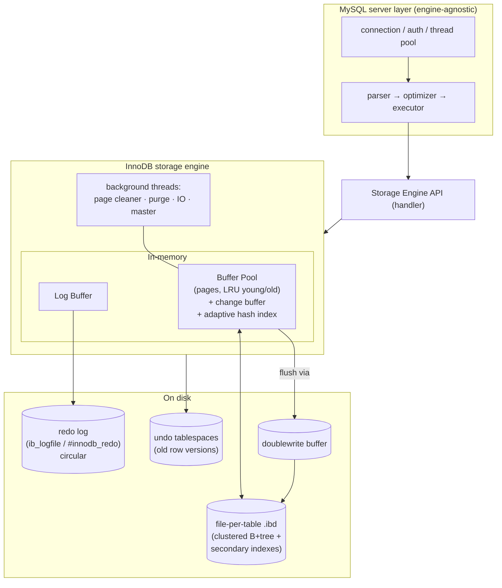
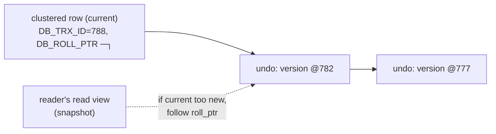

# MySQL / InnoDB Storage Engine

> **Advanced DBMS – System Design Discussion**
> Author: Varun Mundada · Roll No: **SCALER_10326**
> Topic 3 — *Clustered indexes · Buffer pool · Undo/Redo logs · Row & gap locking · MVCC*

**Reproducibility note (read first).** I did not have a live MySQL server in this environment, so I am
explicit about provenance:
* **Real, locally-run** results: the **clustered-index space experiment** ([§5.1](#51-clustered-index-vs-secondary-index-real-measurement)) was run on SQLite's
  `WITHOUT ROWID` tables, which use the *same* clustered B-tree design InnoDB uses by default; the
  **PostgreSQL MVCC contrast numbers** ([§5.3](#53-the-mvcc-contrast-real-postgresql-numbers)) are from my own PostgreSQL 16.2 runs.
* **Representative** results: InnoDB-specific `EXPLAIN` / `SHOW ENGINE INNODB STATUS` listings are
  shown in MySQL's exact output format with the **precise SQL to reproduce them**, and are labelled
  *representative*. Nothing MySQL-specific is presented as if I measured it.

---

## 1. Problem Background

MySQL (1995) became the "M" of the LAMP stack as a fast, simple SQL database. Crucially, MySQL is
split into a **server layer** (connections, SQL parsing, optimizer) and a **pluggable storage
engine** layer. The original default engine, **MyISAM**, was fast for reads but had **no
transactions, no crash recovery, and only table-level locking**.

**InnoDB** (from Innobase Oy, later acquired by Oracle) was built to fix exactly that: a
**transactional, crash-safe, row-locking** engine for high-concurrency OLTP. It became the
**default engine in MySQL 5.5 (2010)**. The problems InnoDB solves:

* **ACID transactions** with durability across crashes → needs a **redo log**.
* **Rollback + consistent reads** → needs an **undo log** and **MVCC**.
* **High write concurrency** → needs **row-level locking**, not table locks.
* **Fast primary-key access and range scans** → store the table **clustered** on its primary key.

> **Thesis:** InnoDB is an **in-place-update, clustered-storage** engine that achieves MVCC and
> durability through **two logs** — *undo* (old versions, for rollback & consistent reads) and *redo*
> (new changes, for crash recovery). This is the **opposite** of PostgreSQL's append-only design,
> and the contrast is the most instructive part of this topic.

---

## 2. Architecture Overview



**Components**

| Component | Role |
|---|---|
| **Buffer Pool** | InnoDB's page cache (16 KB pages). LRU with **midpoint insertion** (young/old sublists) so a big scan can't flush the hot set. |
| **Change buffer** | Defers/merges secondary-index maintenance for pages not in the buffer pool. |
| **Redo log** | Circular WAL of physical page changes → crash recovery; tracked by **LSN**. |
| **Undo log** | Pre-image of changed rows → rollback **and** MVCC consistent reads; cleaned by the **purge** thread. |
| **Doublewrite buffer** | Writes each page twice (scratch area, then home) to survive **torn pages**. |
| **Adaptive Hash Index** | Auto-built hash on hot B-tree pages for O(1) point lookups. |

---

## 3. Internal Design

### 3.1 Clustered index = the table itself

In InnoDB the **table *is* a B+tree keyed by the primary key**, and the **leaf nodes hold the full
rows**. There is no separate heap. Consequences:

* A **primary-key lookup** is a single B+tree descent that lands directly on the row — no extra hop.
* **PK range scans** are sequential in the leaf level → very cache/IO-friendly.
* If you don't declare a PK, InnoDB uses a `UNIQUE NOT NULL` key, or fabricates a hidden 6-byte
  `DB_ROW_ID`.

### 3.2 Secondary indexes store the PK, not a pointer

A secondary index's leaf entries contain `(secondary key → primary key value)`. So a query filtered
by a secondary key does **two** B+tree traversals:

```
WHERE email = 'x'        ┌─ secondary index (email) ─┐        ┌─ clustered index (PK) ─┐
                         │  email='x' → PK=4271      │  ───▶  │  PK=4271 → full row     │
                         └───────────────────────────┘        └─────────────────────────┘
                              traversal #1                          traversal #2 ("bookmark lookup")
```

This is a key trade-off: secondary lookups cost an extra traversal, and the **PK is duplicated into
every secondary index**, so a **wide PK bloats all secondary indexes**. (Covering indexes avoid the
second hop when all needed columns are in the secondary index.)

### 3.3 Buffer pool — LRU with midpoint insertion

Newly read pages enter at the **head of the "old" sublist** (≈⅜ from the tail), *not* the very top.
A page is only promoted into the "young" sublist if it is accessed *again* after a short delay. This
**protects the hot working set from one-off large scans** (a full-table scan reads many pages once;
they sit in "old" and get evicted without displacing genuinely hot pages).

### 3.4 Redo log vs Undo log — why InnoDB needs **both**

| | **Redo log** | **Undo log** |
|---|---|---|
| Contains | **new** values (physical page changes) | **old** values (row pre-images) |
| Purpose | **Durability**: replay committed changes after a crash | **Atomicity** (rollback) **+ MVCC** (consistent reads) |
| Direction | roll **forward** | roll **back** / reconstruct past |
| Lifetime | until pages are checkpointed | until no transaction needs that version (**purge**) |
| On disk | circular `ib_logfile`/`#innodb_redo` | undo tablespaces |

A committed transaction is durable once its **redo** is flushed (`fsync`), even though the data pages
are written lazily later. If the server crashes mid-transaction, recovery uses **redo** to re-apply
committed work and **undo** to roll back uncommitted work. Undo *also* powers MVCC — see next.

### 3.5 MVCC, Oracle-style: in-place update + undo chain

Each clustered-index row carries hidden fields: **`DB_TRX_ID`** (last transaction that modified it)
and **`DB_ROLL_PTR`** (pointer into the undo log to the previous version).

* An `UPDATE` modifies the row **in place** and writes the **old version into the undo log**, linked
  via `DB_ROLL_PTR`.
* A consistent read uses a **read view**; if the current row's `DB_TRX_ID` is too new to be visible,
  InnoDB **walks the undo chain** to reconstruct the version the reader is allowed to see.



**The contrast with PostgreSQL (central to this topic):**

| | InnoDB | PostgreSQL |
|---|---|---|
| Update | **in place**; old version → **undo log** | **append** new tuple version in the heap |
| Old versions live in | undo tablespaces | the table heap itself |
| Garbage collection | **purge** thread drops unneeded undo | **`VACUUM`** removes dead heap tuples |
| Heap growth from updates | minimal (in place) | grows until VACUUM (measured: 3544→7080 KB, §5.3) |
| Cost moved to | reads of old versions (walk undo) | writes (bloat) + VACUUM |

Neither escapes work — InnoDB pushes MVCC cost toward **readers of old data and purge**, PostgreSQL
toward **write bloat and VACUUM**.

### 3.6 Locking: record, gap, and next-key locks

InnoDB locks **index records**, not rows in the abstract:

* **Record lock** — locks a single index entry.
* **Gap lock** — locks the *open interval between* index entries (no row there to lock), preventing
  **inserts** into that gap.
* **Next-key lock** = record lock **+** the gap before it. In the default **REPEATABLE READ**
  isolation, range reads take next-key locks to **prevent phantom rows** (new rows appearing in a
  re-run of the same range query).
* **Intention locks** (IS/IX) at table level signal row-lock intent so table-level operations can
  check compatibility cheaply.

This is finer-grained than table locking (high concurrency) but introduces **gap-lock contention**
and **deadlocks**, which InnoDB detects and resolves by rolling back the cheaper victim.

### 3.7 Isolation levels

| Level | InnoDB behaviour |
|---|---|
| READ UNCOMMITTED | dirty reads allowed (rarely used) |
| READ COMMITTED | fresh read view per statement; **no gap locks** (more concurrency, phantoms possible) |
| **REPEATABLE READ** (default) | one read view per transaction; **next-key locks** prevent phantoms |
| SERIALIZABLE | plain `SELECT` becomes locking reads |

---

## 4. Design Trade-Offs

**Advantages**
* Clustered PK = fast PK lookups and range scans; data is pre-sorted by PK on disk.
* In-place updates → **no heap bloat**, no VACUUM; predictable table size.
* Row-level locking + MVCC → high OLTP concurrency.
* Two-log design gives clean ACID: redo=durability, undo=atomicity+MVCC.
* Doublewrite + redo → torn-page-safe crash recovery.

**Limitations / costs**
* Secondary indexes pay a **second traversal** (PK bookmark lookup) and **duplicate the PK** → keep
  PKs **small** and prefer monotonically-increasing PKs to avoid mid-leaf page splits.
* Random PKs (e.g., UUIDv4) cause **page splits and write amplification** in the clustered tree.
* MVCC reads of frequently-updated rows must **walk undo chains** (long history = slower reads); the
  purge thread can lag under heavy update load.
* **Gap/next-key locks** reduce concurrency and are a common deadlock source.

**Performance implications.** InnoDB shines for PK-centric OLTP. The classic anti-pattern is a
**large or random primary key**: because everything is clustered on it and copied into every
secondary index, a 36-byte UUID PK can inflate storage and trash insert locality compared to an
8-byte `BIGINT AUTO_INCREMENT`.

---

## 5. Experiments / Observations

### 5.1 Clustered index vs secondary index (REAL measurement)

InnoDB's defining idea — *store the row inside the PK B-tree instead of a heap + separate index* — is
the same design as SQLite's `WITHOUT ROWID`. I ran a controlled local experiment
(`../experiments/sqlite_exp2.py`) storing 20 000 identical rows both ways:

```
rowid/heap table + secondary index :  369 pages   1,511,424 bytes
clustered table (row in PK B-tree) :  310 pages   1,269,760 bytes   (~16% smaller)
```
**Observation:** clustering stores each key **once** (inside the table B-tree) instead of duplicating
it in a separate index structure — exactly why InnoDB clusters on the PK by default. The flip side,
visible in the design, is that **secondary** indexes must then store the PK to find the row → the
extra traversal in §3.2.

### 5.2 InnoDB query plans (representative format; reproducible SQL)

```sql
-- Setup (MySQL 8):
CREATE TABLE users(
  id      BIGINT AUTO_INCREMENT PRIMARY KEY,   -- clustered index
  email   VARCHAR(190),
  city    VARCHAR(64),
  KEY idx_email (email)                          -- secondary index
) ENGINE=InnoDB;

EXPLAIN SELECT * FROM users WHERE id = 4271;        -- PK: clustered lookup
EXPLAIN SELECT * FROM users WHERE email = 'a@b.c';  -- secondary → PK bookmark lookup
```

Representative output (the shape MySQL emits):
```
-- PK lookup: one clustered-index access
id  select_type  table  type   key      rows  Extra
 1  SIMPLE       users  const  PRIMARY     1

-- Secondary-key lookup: ref via idx_email, then PK bookmark lookups
id  select_type  table  type   key        rows  Extra
 1  SIMPLE       users  ref    idx_email     1   Using index condition
```
`type=const`/`eq_ref` on `PRIMARY` is the single-descent clustered access; `type=ref` on a secondary
key is the two-step traversal.

### 5.3 The MVCC contrast (REAL PostgreSQL numbers)

To make the *in-place vs append-only* difference concrete, here is the PostgreSQL side I actually
measured — a full-table `UPDATE` doubling the heap because old versions stay in the table:
```
PostgreSQL: after load = 3544 kB → after UPDATE all rows = 7080 kB (dead versions retained until VACUUM)
```
**InnoDB would behave differently:** the same `UPDATE` modifies rows **in place** and pushes old
images to the **undo log**, so the *table* (`.ibd`) does not double; instead the **undo tablespace**
grows transiently and is reclaimed by **purge** once no read view needs those versions. Same MVCC
guarantee, cost relocated from table-heap+VACUUM to undo+purge.

### 5.4 Gap / next-key locking (representative; reproducible)

```sql
-- session A (REPEATABLE READ), id is PRIMARY KEY, rows exist at 10 and 20
START TRANSACTION;
SELECT * FROM t WHERE id BETWEEN 10 AND 20 FOR UPDATE;   -- next-key locks the range + gaps
-- session B:
INSERT INTO t(id) VALUES (15);   -- BLOCKS: 15 falls in a gap locked by A (phantom prevention)
```
`SHOW ENGINE INNODB STATUS` then reports the waiting lock in its `TRANSACTIONS` section, e.g.:
```
---TRANSACTION 4212, ACTIVE 3 sec inserting
… lock_mode X locks gap before rec insert intention waiting
RECORD LOCKS space id N page no P n bits ... index PRIMARY of table `t`
```
**Observation:** the insert blocks even though no *existing* row is touched — the **gap** is locked.
Switching session A to **READ COMMITTED** removes gap locks and the insert succeeds (at the cost of
allowing phantoms). This is the concurrency-vs-isolation dial in action.

---

## 6. Key Learnings

1. **"Clustered" is the organizing idea of InnoDB.** The table *is* its PK B+tree, which makes PK
   access and range scans excellent but makes the **PK choice load-bearing**: small, monotonic PKs
   are fast; large/random PKs amplify writes and bloat every secondary index. My real clustered-vs-
   secondary measurement (~16% smaller) shows why this layout is the default.
2. **Two logs, two jobs.** Redo = *roll forward for durability*; undo = *roll back for atomicity and
   reconstruct old versions for MVCC*. You genuinely need both: redo can't undo an uncommitted txn,
   and undo can't recover committed work lost in the buffer pool.
3. **Same MVCC goal, opposite mechanism vs PostgreSQL.** InnoDB updates in place + keeps history in
   undo (cost → reads + purge); PostgreSQL appends versions in the heap (cost → bloat + VACUUM,
   which I measured doubling a table). There is no free MVCC — only a choice of where to pay.
4. **Locks are on the index, and gaps count.** Next-key locks prevent phantoms in REPEATABLE READ by
   locking the *space between* keys, trading some concurrency (and deadlock risk) for isolation —
   tunable by dropping to READ COMMITTED.
5. **The buffer pool is scan-resistant by design.** Midpoint LRU insertion means a one-off big scan
   doesn't evict the hot set — a small, clever policy with outsized real-world impact.

---

## References
- MySQL 8.0 Reference Manual — *InnoDB Storage Engine* (architecture, clustered indexes, redo/undo,
  locking, MVCC): <https://dev.mysql.com/doc/refman/8.0/en/innodb-storage-engine.html>
- *InnoDB Locking and Transaction Model*: <https://dev.mysql.com/doc/refman/8.0/en/innodb-locking-transaction-model.html>
- *InnoDB Buffer Pool* (midpoint insertion LRU): <https://dev.mysql.com/doc/refman/8.0/en/innodb-buffer-pool.html>
- J. Gray, A. Reuter, *Transaction Processing: Concepts and Techniques* (undo/redo logging).
- Cross-engine clustered-index measurement: SQLite `WITHOUT ROWID` docs — <https://www.sqlite.org/withoutrowid.html>

*Provenance recap: §5.1 is a real local run (SQLite `WITHOUT ROWID`, the same clustered design); §5.3 uses real PostgreSQL 16.2 output; §5.2 and §5.4 are representative MySQL output with exact reproducible SQL.*
