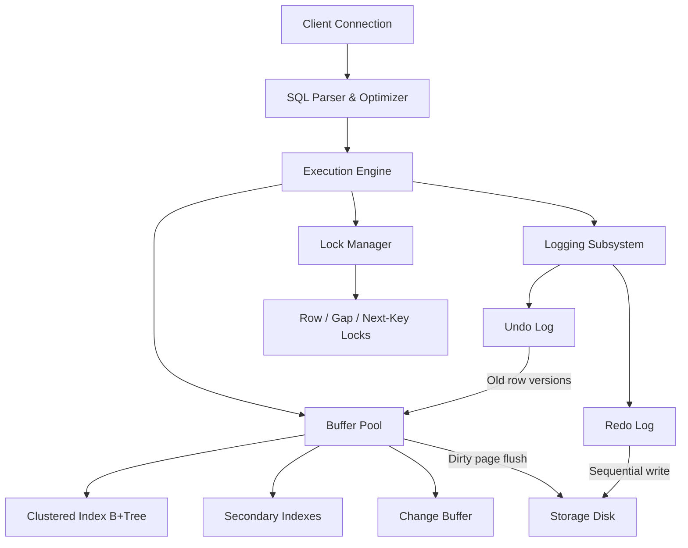
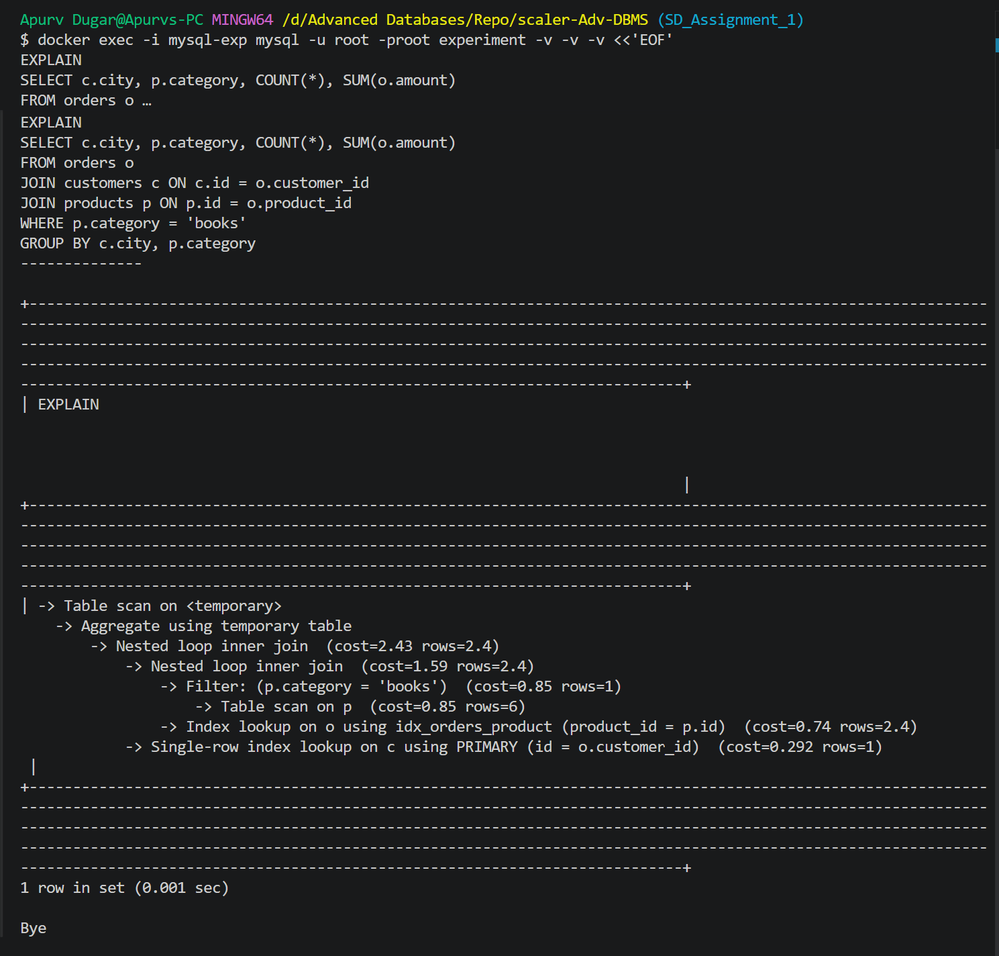

# System Design Document: MySQL InnoDB Storage Engine

## 1. Introduction to InnoDB

InnoDB resolves the fundamental conflict between high write/read **performance** and transactional **correctness**:

- **ACID Integrity** — Full Atomicity, Consistency, Isolation, and Durability guarantees.
- **Robust Recovery** — Automatic restoration of a consistent state after unexpected server crashes.
- **Concurrency Management** — Simultaneous reads and writes without excessive locking blocks.
- **Optimized Storage** — Co-locating data with the primary index to speed up primary key scans.

---

## 2. Architectural Structure



### Data Path for UPDATE Queries

1. The Execution engine requests the **buffer pool** to lock the appropriate 16 KB page in memory.
2. If the page is not in memory, InnoDB reads it from disk storage.
3. The **original data state** is saved to the **undo log** for MVCC reads and transactions rollback.
4. The page in the buffer pool is updated **in-place**.
5. A **redo log block** is flushed to disk upon transaction commit.
6. Background threads subsequently flush dirty pages from memory to disk.

---

## 3. Core Internals

### Clustered Index Layout

Tables in InnoDB are structured physically as B+Trees sorted by their primary key. The actual data records reside inside the leaf nodes. As a result, querying by primary key requires only one tree traversal.

- If a table lacks a defined Primary Key (PK), InnoDB defaults to using the first `UNIQUE NOT NULL` index; otherwise, it creates an internal 6-byte row identifier.
- Pages are sized at 16 KB by default, housing a page header, page directory, and records ordered by PK.

### Secondary Indexes

Leaf nodes of secondary indexes contain the primary key value instead of physical page addresses. Therefore, a secondary index lookup performs a two-stage process: secondary B+Tree traversal → extract PK → traverse clustered index B+Tree.

This two-stage lookup ensures that page splits in the clustered index do not invalidate secondary indexes. However, it introduces the cost of a second index probe unless the query is satisfied entirely by a covering index.

### Buffer Pool Mechanism

The buffer pool acts as the main caching area in memory for 16 KB pages (data, indexes, undo blocks, and change buffers). 

A dedicated page cleaner thread pool handles dirty page flushing. The rate of flushing dynamically balances the redo log usage and the ratio of dirty pages. To scale with multiple concurrent threads, the buffer pool can be split into separate instances.

### Undo Logs

Undo logs are utilized for **transaction rollback** and **MVCC snapshot reads**:

- Prior to any update, the original row data is written to the undo log.
- Each database row in the clustered index holds a roll pointer that links back to its chain of undo entries.
- Rollback: Traverses the undo chain to revert modified fields.
- MVCC reads: Traverses the undo chain to find the most recent version committed before the reader's transaction snapshot began.
- Purge process: Background threads clean up old undo logs when no active transaction requires them (analogous to PostgreSQL's VACUUM, but isolated to separate undo spaces).

### Redo Logs

Redo logs guarantee durability using the Write-Ahead Logging (WAL) protocol: change records must be persisted on disk before the modified memory pages can be considered committed.

- Write operations are recorded sequentially in circular log files.
- The redo buffer is flushed to disk at transaction commit.
- Data pages are written asynchronously later.
- Checkpoints mark the Log Sequence Number (LSN) where all previous changes have been successfully written to data files, narrowing the recovery window.

### Locking Mechanisms

InnoDB locks index records directly, not row rows. This behavior varies depending on the queried index.

| Lock Type | Description | Intended Purpose |
|-----------|--------------|------------------|
| Record Lock | Locks a specific index entry | Exact match isolation |
| Gap Lock | Locks the range between index entries | Blocks inserts within a range |
| Next-Key Lock | Combines record lock with the preceding gap lock | Default for REPEATABLE READ; stops phantoms |
| Insert Intention Lock | Type of gap lock (non-conflicting with others) | Enables concurrent inserts within the same gap |

**Example:** Given index keys `{10, 20, 30}`, running `SELECT ... WHERE id BETWEEN 15 AND 25 FOR UPDATE` places gap locks on the intervals `(10,20)` and `(20,30)`, along with a record lock on `20`. This blocks any other transaction from inserting `17` or `22`, preventing phantom reads.

### Transaction Isolation Levels

| Isolation Level | Phantom Reads? | Implementation Technique |
|-------|----------|-----------|
| READ UNCOMMITTED | Yes | No snapshot isolation |
| READ COMMITTED | Yes | A new snapshot created per SQL statement; no gap locks |
| REPEATABLE READ (default) | No | A snapshot is created at the first read; utilizes next-key locks |
| SERIALIZABLE | No | Promotes all read statements to `SELECT ... FOR SHARE` |

InnoDB's implementation of `REPEATABLE READ` is **stricter than the standard SQL spec** because it actively eliminates phantoms through next-key locks.

---

## 4. Critical Trade-offs

### In-Place Updates (InnoDB) vs. Append-Only (PostgreSQL)

| Characteristic | InnoDB | PostgreSQL |
|--------|--------|------------|
| Update Approach | Overwrites memory page; logs old state in undo | Appends new row version; old version stays until VACUUM |
| Page Cleanliness | Pages hold only active row versions | Pages accumulate outdated, dead tuples (bloat) |
| Space Reclamation | Separate purge threads scan undo logs (low impact) | VACUUM scans and clean up table pages |
| Rollback Latency | Requires scanning and applying undo logs | Very fast — simply marks transaction status as aborted |

InnoDB maintains clean data pages and avoids table-level garbage collection bloat, but requires managing undo tablespaces and can suffer from purge lag.

### Clustered vs. Non-Clustered Storage

| Characteristic | InnoDB (Clustered) | PostgreSQL (Heap) |
|--------|--------------------|--------------------|
| PK Lookup | Single B+Tree traversal | Traverse index → get CTID → fetch heap page |
| Secondary Index Query | Double index lookup (via PK) | Single fetch from pointer (via CTID) |
| PK Range Scans | Physical order matches key order | Potentially random page accesses |
| Non-sequential PK (e.g. UUID) | Causes page splits and fragmentations | No impact on heap arrangement |

Clustered storage is optimal for PK-centric OLTP systems. PostgreSQL's heap structure is more efficient when queries do not use primary keys or when tables contain numerous secondary indexes.

### Range Locking

InnoDB uses gap and next-key locking to block phantom inserts under `REPEATABLE READ`, whereas PostgreSQL relies on snapshot serialization checks. This makes InnoDB range queries highly secure but increases lock wait contention.

---

## 5. Practical Experiments and Observations

### Database Setup

```sql
CREATE TABLE customers (
    id INT AUTO_INCREMENT PRIMARY KEY, city VARCHAR(50) NOT NULL
) ENGINE=InnoDB;

CREATE TABLE products (
    id INT AUTO_INCREMENT PRIMARY KEY, category VARCHAR(50) NOT NULL
) ENGINE=InnoDB;

CREATE TABLE orders (
    id INT AUTO_INCREMENT PRIMARY KEY,
    customer_id INT NOT NULL, product_id INT NOT NULL,
    amount DECIMAL(10,2) NOT NULL,
    FOREIGN KEY (customer_id) REFERENCES customers(id),
    FOREIGN KEY (product_id) REFERENCES products(id)
) ENGINE=InnoDB;

CREATE INDEX idx_orders_customer ON orders(customer_id);
CREATE INDEX idx_orders_product ON orders(product_id);

INSERT INTO customers (city) VALUES ('New York'),('London'),('Tokyo'),('Paris'),('Berlin');
INSERT INTO products (category) VALUES ('books'),('electronics'),('furniture'),('clothing'),('books'),('books');
INSERT INTO orders (customer_id, product_id, amount) VALUES
  (1,1,29.99),(2,1,19.99),(1,2,99.99),(3,3,149.99),(4,4,59.99),(5,1,24.99),
  (1,5,34.99),(2,2,89.99),(3,1,19.99),(4,5,39.99),(5,3,129.99),(1,4,49.99);
ANALYZE TABLE customers, products, orders;
```

### Plan Analysis

```sql
EXPLAIN FORMAT=JSON
SELECT c.city, p.category, COUNT(*), SUM(o.amount)
FROM orders o
JOIN customers c ON c.id = o.customer_id
JOIN products p ON p.id = o.product_id
WHERE p.category = 'books'
GROUP BY c.city, p.category;
```

**Key Insights:**
- Joining on primary keys (`customers` and `products`) uses clustered index lookups, avoiding separate data storage fetches.
- With small datasets, the optimizer defaults to nested loops. Join ordering is determined by table statistics.
- If there is no index on `products.category`, MySQL performs a table scan.

### Actual Run Results

Executing the query with `EXPLAIN FORMAT=JSON` yields the following query plan structure:



**Key Observation:** Joins to `customers` and `products` tables on their primary keys are executed as direct clustered index lookups. Since secondary indexes like `idx_orders_product` store the PK key directly, MySQL can query index records and fetch the clustered leaf node data without separate page lookups. This highlights the architectural difference between InnoDB's clustered B+Tree approach and PostgreSQL's heap-based indexing.

---