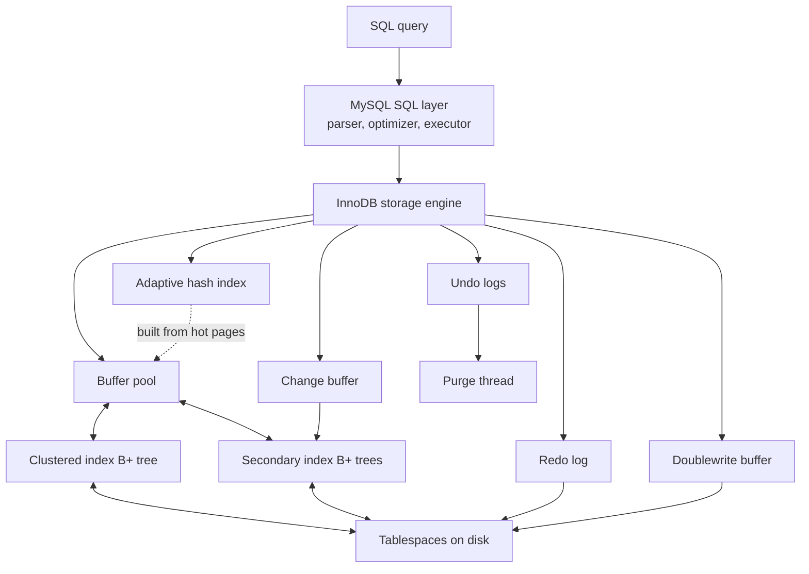
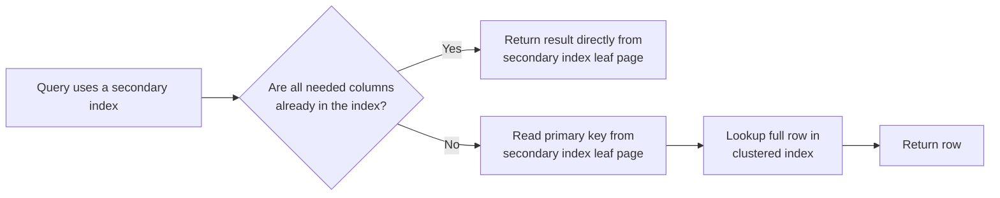

# MySQL / InnoDB Storage Engine

**Name:** Lekhana Dinesh  
**Roll Number:** 24BCS10108

In this write-up, I look at the InnoDB storage engine in MySQL from a system design point of view. My goal is not only to list features, but to explain why InnoDB is designed this way and how that design affects real query behavior. I focus on the parts that best explain day-to-day database behavior: clustered storage, secondary indexes, pages, the buffer pool, redo and undo logs, MVCC, locking, and background cleanup.

## Problem Background

In MySQL, a storage engine is the component that decides how table data is physically stored and how rows and indexes are accessed. The SQL layer of MySQL handles parsing, optimization, permissions, and execution planning, but the actual storage work is delegated to the engine. This separation is important because it lets MySQL keep one SQL interface while supporting engines with very different internal behavior.

That design choice gives MySQL flexibility. The same `SELECT`, `INSERT`, `UPDATE`, and `DELETE` syntax can operate on different engines, while each engine can optimize for a different workload. In older MySQL deployments, people often picked between MyISAM and InnoDB depending on whether they cared more about simple reads or transactional safety. Over time, real applications started needing both performance and correctness under concurrency, and this pushed InnoDB to the front.

InnoDB became the default engine because most modern applications are not single-user systems. They are OLTP systems with many users reading and writing the same data at the same time. In this setting, the database must do more than store rows. It must protect committed data, survive crashes, allow concurrent access, and still return logically correct answers.

Compared to MyISAM, InnoDB solves several major problems:

- It supports transactions with `COMMIT` and `ROLLBACK`.
- It supports crash recovery through redo logging.
- It uses row-level locking instead of relying mainly on table-level locking.
- It supports MVCC so readers and writers can work together with less blocking.
- It enforces stronger consistency guarantees for concurrent workloads.

These points matter because database failures are rarely dramatic at first. The real danger is silent inconsistency: a transfer that updates one row but not the other, a crash that leaves partial changes, or a range query that sees rows appear halfway through a transaction. InnoDB is designed to reduce exactly these problems. That is why it is not enough to say "InnoDB is faster" or "InnoDB is safer." Its value comes from how it balances correctness, concurrency, and performance together.

## Architecture Overview

At a high level, a MySQL query starts in the SQL layer, but almost all of the hard storage work happens inside InnoDB. The optimizer chooses a plan, InnoDB navigates B+ trees through cached pages in the buffer pool, and logging plus background threads make sure the result is durable and consistent.

The following diagram shows the main pieces and how they relate:



This picture helps explain the "big system" view of InnoDB. Data is not read directly from disk row by row. Instead, InnoDB works with pages, keeps hot pages in the buffer pool, organizes table data and indexes as B+ trees, records changes in redo logs before dirty pages are flushed, and stores older row versions in undo logs so transactions can roll back or read a consistent snapshot.

In a normal query path, the flow is usually:

1. The MySQL SQL layer parses the statement and the optimizer picks an access path.
2. InnoDB follows the chosen index path, usually through the clustered index or a secondary index.
3. The needed index and data pages are looked up in the buffer pool first.
4. If a page is not in memory, InnoDB reads it from disk into the buffer pool.
5. Updates change in-memory pages, write redo information, and create undo information if old versions may be needed.
6. Purge later removes versions and delete-marked records that are no longer visible to any active transaction.

The most important insight here is that InnoDB is not just "a B+ tree engine." It is a coordinated system of cache, logging, locking, and cleanup mechanisms. Each part exists because the others create new requirements.

## Internal Design

This section is the core of the write-up because InnoDB behavior makes sense only when we connect its structures to real execution paths.

### 1. Clustered index

InnoDB stores table rows inside the primary key B+ tree. This is called the clustered index. So in InnoDB, the primary key is not just a logical identifier. It is also the physical organization of the table.

The leaf pages of the clustered index contain the full row data. If a query looks up a row by primary key, the index search leads directly to the page containing that row. This is why primary-key lookups are usually very efficient in InnoDB.

This also means primary key choice affects almost everything:

- how rows are laid out on disk
- how inserts are distributed across pages
- how large secondary indexes become
- how much page splitting and fragmentation happen over time

Sequential integer primary keys are usually better than random keys for write-heavy tables. With a steadily increasing key, new rows tend to be inserted near the end of the clustered tree, so page growth is more predictable and locality is better. With random keys such as random UUIDs, inserts are scattered across the tree. That increases the chance of touching many different pages, reduces locality, and can cause more page splits and cache misses.

Another practical point is that if a table has no primary key, InnoDB must still create or choose a clustered key. That means "I did not define a primary key" does not remove the need for one. It only gives the engine less control-friendly choices.

### 2. Secondary indexes

Indexes other than the clustered index are secondary indexes. In InnoDB, a secondary index does not store the entire row. Instead, a secondary index record stores the secondary key columns plus the primary key of the row.

This design is elegant because the primary key becomes the stable pointer from every secondary index back to the actual row. But it also means a secondary index lookup can require two steps:

1. Search the secondary index and find the primary key.
2. Use that primary key to fetch the full row from the clustered index.

That second step is often called the extra clustered lookup. It is one of the most important reasons schema design matters in InnoDB.

The following small diagram shows why covering indexes are useful:



A covering index avoids the second step because the query can be answered using only the secondary index leaf page. This can save I/O and CPU, especially for repeated read-heavy queries. But the trade-off is that wider indexes take more space and are more expensive to maintain during writes.

Secondary indexes are also tightly linked to primary key design. Because each secondary index stores the primary key value, a long primary key makes every secondary index larger. So the cost of a poor primary key choice is multiplied across the whole table.

### 3. Pages and B+ tree structure

InnoDB works with pages, not individual rows as the main unit of I/O. A common page size is 16 KB. Both data and index information live inside these pages.

Most InnoDB indexes are B+ trees. Internal pages store separator keys and child pointers, while leaf pages store the actual index entries. For the clustered index, the leaf page stores full row data. For a secondary index, the leaf page stores the secondary key plus the primary key.

B+ trees are a strong fit for database systems for two reasons. First, they keep the tree height small even when the table is large, so a lookup needs only a small number of page reads. Second, they preserve key order, which makes range scans efficient. If I ask for rows between 100 and 200, the engine does not need to jump randomly all over storage. It can find the starting leaf page and continue through nearby ordered entries.

Page locality is the hidden reason many queries feel fast. If related keys are on the same page or nearby pages, one I/O can help multiple lookups. If pages are fragmented or the access pattern is random, more I/O is needed.

Page splits happen when an insert needs space in a full leaf page. In that case, InnoDB must split the page and redistribute records. This is normal, but too many splits increase write cost and fragmentation. That is one reason sequential inserts are usually friendlier than random inserts.

### 4. Buffer pool

The buffer pool is InnoDB's main memory cache for data and index pages. If a page is already in the buffer pool, InnoDB can use it directly from memory instead of reading it from disk again. This is one of the biggest reasons an optimized InnoDB system performs well.

The buffer pool does not just cache table rows. It caches index pages too, which is very important because almost every access path in InnoDB goes through an index structure. If index pages are hot, lookups become much cheaper.

When a page in memory is modified, it becomes a dirty page. InnoDB does not have to write that page to disk immediately. Instead, it can flush dirty pages later in the background. This improves performance because disk writes can be batched and scheduled more efficiently.

The trade-off is that memory is limited. A larger buffer pool reduces disk I/O and improves hit rate, but it also means the system must carefully manage dirty pages, flushing, and checkpoint pressure. If the buffer pool is too small, the database keeps evicting useful pages and reading them again, which creates avoidable I/O. If it is large but dirty pages accumulate too aggressively, background flushing must work harder to keep recovery and checkpointing under control.

### 5. Redo log

The redo log is the main durability mechanism in InnoDB. During normal execution, changes to pages first create redo information. If the server crashes before dirty pages are fully written back to the tablespace, InnoDB can replay the redo log during recovery and bring the database to a correct committed state.

This is the basic write-ahead logging idea: log the change before depending on the data page reaching disk. In simple words, InnoDB first writes "what change happened" in a durable form, and only later worries about flushing the changed page itself.

Why is this better than writing the whole page immediately every time? Because immediate page flushing would make transactions much slower. Redo logging lets commits stay fast while still preserving correctness after a crash.

The redo log also interacts with checkpoints. As checkpoints advance, old redo that is no longer needed can be discarded. If redo capacity is too small, dirty pages must be flushed more aggressively. If redo capacity is larger, the engine gets more room to smooth bursts of writes, but recovery planning and log management still matter.

### 6. Undo log

Undo logs store the information needed to reverse changes made by a transaction. If a transaction rolls back, InnoDB uses undo information to restore the older values.

Undo is also essential for consistent reads. Suppose one transaction updates a student's CGPA from `8.2` to `8.8`, but another transaction started earlier and should still see the older snapshot. InnoDB can reconstruct the older version from undo information even though the current row in the clustered index has already been updated.

This is an important design choice. InnoDB does not keep every historical row version as a separate current row in the main table. Instead, it keeps the current row in the clustered index and stores older version information in undo structures. That saves the main table from filling up with visible old versions, but it means undo and purge become critical supporting subsystems.

### 7. MVCC

MVCC stands for Multi-Version Concurrency Control. InnoDB uses it so that readers and writers can often proceed without blocking each other.

The key idea is that a transaction reads according to a read view, which is a logical snapshot of which transactions were committed when that read view was created. If a newer transaction has changed a row, but that change should not be visible in the current read view, InnoDB uses undo information to reconstruct the older version.

In InnoDB, clustered index records are updated in place, and older versions are reconstructed from undo logs when needed. Secondary indexes are treated differently: old secondary index entries may be delete-marked and later purged rather than holding the same visibility metadata style as clustered records.

This design improves read/write concurrency because normal readers do not need to wait for every writer to finish. At the same time, it preserves transactional correctness by making visibility depend on the read view, not just on the latest physical bytes in the page.

A short comparison with PostgreSQL helps make this clearer. PostgreSQL usually creates a new heap tuple version when a row is updated and later uses `VACUUM` to clean old versions. InnoDB usually keeps the newest row in the clustered index and reconstructs older versions from undo. So PostgreSQL stores multiple row versions directly in the heap, while InnoDB pushes more of that history into undo and background purge. Both approaches implement MVCC, but the storage consequences are different.

### 8. Locking

InnoDB uses row-level locking, but in practice these locks are index-record locks because row access is organized through indexes. This is an important detail. InnoDB does not think only in terms of "rows"; it thinks in terms of indexed positions.

The main lock types are:

- **Record lock:** locks a specific index entry.
- **Gap lock:** locks the gap between index entries.
- **Next-key lock:** a record lock plus the gap before it.
- **Intention lock:** a lightweight table-level signal that a transaction plans to take row-level locks inside the table.

Why do gap and next-key locks exist? They are needed to prevent phantom rows under `REPEATABLE READ`. If one transaction scans a range and another transaction inserts a new row into that range before the first transaction finishes, the first transaction might see a different set of rows on repeated execution. Next-key locking prevents that by locking both records and relevant gaps.

This is a strong correctness feature, but it has a cost. Stronger protection for range queries means lower concurrency for some workloads. A range `SELECT ... FOR UPDATE` or `UPDATE` can block inserts that logically fall into the locked interval. So InnoDB is not "more concurrent" in every situation. It is carefully concurrent where correctness allows it.

### 9. Purge process

Undo records and delete-marked rows cannot always be removed immediately. If any active transaction might still need an older version for a consistent read, that version must remain available.

The purge process cleans these old records later in the background. It processes undo history and physically removes rows or index entries that are no longer needed for MVCC or rollback.

This means purge is not just housekeeping. It is part of the correctness model. If purge runs too slowly, old versions accumulate. If a transaction stays open for a long time, especially under `REPEATABLE READ`, it can delay cleanup because the engine must preserve the older snapshot that transaction depends on.

That is why a forgotten long-running transaction can quietly become a system problem. It increases undo retention, slows cleanup, and may enlarge tablespaces and history list length even if it is not actively changing data.

### 10. Doublewrite buffer and checkpointing

Redo logging alone is not enough to protect page writes. A page write to disk can fail halfway through because of a crash, power failure, or storage-level interruption. If only part of a 16 KB page reaches disk, the result is a torn page.

The doublewrite buffer protects against this. Before a dirty page is written to its final place in the data file, InnoDB first writes it to the doublewrite area. If a crash happens during the final page write, recovery can use the safe copy from the doublewrite buffer.

This adds write overhead, but the overhead is smaller than it first sounds because the temporary doublewrite writes are done in a more sequential way than random page writes. The benefit is strong crash safety.

Checkpointing works together with redo. A checkpoint marks a point such that all changes before that log position are already reflected in the database files. During crash recovery, InnoDB can start from the latest checkpoint and replay forward, instead of reasoning from the beginning of log history.

InnoDB uses fuzzy checkpointing, which means it flushes dirty pages gradually in small batches. This avoids freezing the whole system for one giant flush. The trade-off is that the engine must constantly balance foreground query work against background write work.

### 11. Change buffer and adaptive hash index

Two additional structures are worth mentioning because they show how InnoDB tries to optimize common workloads without changing its transactional core.

The **change buffer** caches changes to secondary index pages when those pages are not currently in the buffer pool. This can avoid expensive random reads just to update secondary index entries. It is especially useful when secondary-index updates arrive in a scattered order. The downside is that the buffered changes must still be merged later, and the change buffer itself uses part of the buffer pool.

The **adaptive hash index** is an automatically built hash structure on top of frequently accessed B+ tree pages. If the workload repeatedly searches the same hot index areas, the adaptive hash index can speed those lookups and make InnoDB behave more like an in-memory system. But it is not always a win. Under some workloads it adds maintenance overhead or contention, so it is best understood as a workload-dependent optimization rather than a universally good feature.

## Design Trade-Offs

The most interesting part of InnoDB is that nearly every strong feature has a cost attached to it. It is not optimized for only one thing. It is built to balance durability, concurrency, and performance at the same time.

| Design Choice | Benefit | Cost / Limitation | Practical Impact |
| --- | --- | --- | --- |
| Clustered index storage | Primary-key lookup reaches row data directly and improves locality | Table layout is tied to primary key choice; random keys can hurt inserts and page behavior | Primary key design is a physical design decision, not only a logical one |
| Secondary index storing primary key | Secondary indexes stay linked to the real row without duplicating whole rows | Non-covering queries often need an extra clustered lookup; long primary keys bloat all secondary indexes | A bad primary key choice affects every secondary index |
| Undo-based MVCC | Readers and writers can overlap with less blocking; rollback is possible | Undo space must be maintained, and long transactions delay cleanup | Good concurrency, but operational discipline matters |
| Redo logging | Strong crash recovery and durable commits | Extra logging and flush coordination add write overhead | Essential for OLTP correctness, not optional safety |
| Buffer pool caching | Big reduction in disk I/O for hot data and indexes | Consumes large memory and needs careful dirty-page management | Buffer pool size is one of the biggest tuning decisions |
| Gap and next-key locks | Prevent phantom rows under `REPEATABLE READ` | Can block inserts into ranges and reduce concurrency | Range updates and locking reads must be designed carefully |
| Doublewrite buffer | Protects against torn pages during crashes | Adds extra write path work | Usually worth the overhead in production systems |
| Purge process | Cleans old versions and delete-marked rows in the background | Can lag behind heavy write workloads or long-running transactions | Slow purge increases undo retention and storage growth |
| Change buffer | Reduces random I/O for scattered secondary-index updates | Uses buffer pool memory and defers merge work | Helpful mainly for disk-bound write-heavy patterns |
| Adaptive hash index | Speeds repeated hot lookups on frequently accessed index pages | Not all workloads benefit; can add contention and maintenance overhead | Useful for some OLTP patterns, but not a guaranteed win |

Looking at the table as a whole, the pattern is clear: InnoDB keeps trading a little extra internal complexity for safer and more scalable behavior under real workloads. That is why it performs well in mixed read/write systems, but it also explains why schema design, workload shape, and transaction discipline have such a big effect on results.

## Experiments / Observations

Experiments 1 and 2 were run in MySQL Workbench and the real `EXPLAIN` outputs are included below. Experiments 3 and 4 are two-session transaction experiments written with expected behavior, because their main goal is to observe MVCC and locking interactions between concurrent sessions.

### Experiment 1: Clustered index vs secondary index

**Purpose.**  
To observe the difference between a primary-key lookup and a secondary-index lookup.

**SQL.**

```sql
DROP DATABASE IF EXISTS innodb_lab;
CREATE DATABASE innodb_lab;
USE innodb_lab;

CREATE TABLE students (
    student_id INT PRIMARY KEY,
    dept VARCHAR(20) NOT NULL,
    student_name VARCHAR(50) NOT NULL,
    cgpa DECIMAL(3,2) NOT NULL,
    city VARCHAR(30) NOT NULL,
    INDEX idx_dept_name (dept, student_name)
) ENGINE=InnoDB;

INSERT INTO students (student_id, dept, student_name, cgpa, city) VALUES
    (101, 'CSE', 'Aarav', 8.70, 'Bengaluru'),
    (102, 'ECE', 'Diya', 8.10, 'Hyderabad'),
    (103, 'CSE', 'Meera', 9.00, 'Chennai'),
    (104, 'ME',  'Rohit', 7.90, 'Pune'),
    (105, 'CSE', 'Anika', 8.40, 'Mysuru');

EXPLAIN SELECT * FROM students WHERE student_id = 103;

EXPLAIN SELECT * FROM students
WHERE dept = 'CSE' AND student_name = 'Aarav';
```

**Observation.**  
I ran both `EXPLAIN` queries in MySQL Workbench and got the following results.

**Experiment 1A result.**  
Query: `EXPLAIN SELECT * FROM students WHERE student_id = 103;`

| Field | Value |
| --- | --- |
| id | 1 |
| select_type | SIMPLE |
| table | students |
| partitions | NULL |
| type | const |
| possible_keys | PRIMARY |
| key | PRIMARY |
| key_len | 4 |
| ref | const |
| rows | 1 |
| filtered | 100.00 |
| Extra | NULL |

MySQL used the `PRIMARY` key here. Since InnoDB stores the full row in the clustered primary-key B+ tree, this is a direct clustered-index lookup. The access type `const` and `rows = 1` show that the optimizer expects one exact row.

**Experiment 1B result.**  
Query: `EXPLAIN SELECT * FROM students WHERE dept = 'CSE' AND student_name = 'Aarav';`

| Field | Value |
| --- | --- |
| id | 1 |
| select_type | SIMPLE |
| table | students |
| partitions | NULL |
| type | ref |
| possible_keys | idx_dept_name |
| key | idx_dept_name |
| key_len | 284 |
| ref | const,const |
| rows | 1 |
| filtered | 100.00 |
| Extra | NULL |

MySQL used the secondary index `idx_dept_name`. Because the query selects `*`, the index helps find the matching primary key, but InnoDB may still need the clustered index to fetch the full row.

From this experiment, I observed clearly that a secondary index is not the row itself. It is a path to the row.

**What it proves about InnoDB design.**  
This shows that the clustered index is the real home of the row, while secondary indexes are helper structures that often point back to it through the primary key.

### Experiment 2: Covering index vs non-covering index

**Purpose.**  
To see when a secondary index can answer a query by itself and when it cannot.

**SQL.**

```sql
USE innodb_lab;

EXPLAIN
SELECT dept, student_name
FROM students
WHERE dept = 'CSE' AND student_name = 'Aarav';

EXPLAIN
SELECT cgpa, city
FROM students
WHERE dept = 'CSE' AND student_name = 'Aarav';
```

**Observation.**  
I ran both covering-index checks in MySQL Workbench and the outputs matched the expected InnoDB behavior.

**Experiment 2A result.**  
Query:

```sql
EXPLAIN
SELECT dept, student_name
FROM students
WHERE dept = 'CSE' AND student_name = 'Aarav';
```

| Field | Value |
| --- | --- |
| id | 1 |
| select_type | SIMPLE |
| table | students |
| partitions | NULL |
| type | ref |
| possible_keys | idx_dept_name |
| key | idx_dept_name |
| key_len | 284 |
| ref | const,const |
| rows | 1 |
| filtered | 100.00 |
| Extra | Using index |

This is a covering-index case. The selected columns `dept` and `student_name` are already present in `idx_dept_name`, so MySQL can return the result directly from the secondary index. The `Extra` column shows `Using index`.

**Experiment 2B result.**  
Query:

```sql
EXPLAIN
SELECT cgpa, city
FROM students
WHERE dept = 'CSE' AND student_name = 'Aarav';
```

| Field | Value |
| --- | --- |
| id | 1 |
| select_type | SIMPLE |
| table | students |
| partitions | NULL |
| type | ref |
| possible_keys | idx_dept_name |
| key | idx_dept_name |
| key_len | 284 |
| ref | const,const |
| rows | 1 |
| filtered | 100.00 |
| Extra | NULL |

MySQL still uses `idx_dept_name` to find the row, but `cgpa` and `city` are not part of that secondary index. Since `Extra` does not show `Using index`, this is not a covering-index query. InnoDB needs to use the primary key from the secondary index entry to fetch the full row from the clustered index.

From this experiment, I observed that the first query is lighter because it avoids the extra clustered lookup.

**What it proves about InnoDB design.**  
It proves that covering indexes are powerful in InnoDB because they avoid the second B+ tree traversal. It also shows why "just add an index" is not enough; the column list in the index matters.

### Experiment 3: MVCC / REPEATABLE READ snapshot

**Purpose.**  
To observe how a transaction can keep seeing an older version even after another transaction commits a new value.

**SQL.**

Setup:

```sql
USE innodb_lab;

DROP TABLE IF EXISTS accounts;
CREATE TABLE accounts (
    account_id INT PRIMARY KEY,
    owner_name VARCHAR(50) NOT NULL,
    balance INT NOT NULL
) ENGINE=InnoDB;

INSERT INTO accounts VALUES (1, 'Riya', 1000);
```

Session 1:

```sql
SET SESSION TRANSACTION ISOLATION LEVEL REPEATABLE READ;
START TRANSACTION;

SELECT balance FROM accounts WHERE account_id = 1;
-- expected first read: 1000

-- wait here and let Session 2 commit

SELECT balance FROM accounts WHERE account_id = 1;
-- under REPEATABLE READ, expected second read: still 1000

COMMIT;

SELECT balance FROM accounts WHERE account_id = 1;
-- after commit, expected read: 1200
```

Session 2:

```sql
SET SESSION TRANSACTION ISOLATION LEVEL REPEATABLE READ;
START TRANSACTION;

UPDATE accounts
SET balance = 1200
WHERE account_id = 1;

COMMIT;
```

**Observation.**  
Session 2 changes the current version of the row and commits it. But Session 1, which already established its read view, should continue seeing the older value until it ends its transaction. After Session 1 commits and reads again, it should then see the new committed value.

This is one of the clearest ways to observe MVCC in practice. Session 1 is not reading stale memory by accident. It is reading a consistent snapshot by design.

**What it proves about InnoDB design.**  
It shows that InnoDB does not force every reader to wait for every writer. Instead, it uses read views plus undo information to reconstruct the version that is valid for that transaction.

### Experiment 4: Gap lock / next-key lock behavior

**Purpose.**  
To observe how InnoDB prevents phantom inserts in a locked range under `REPEATABLE READ`.

**SQL.**

Setup:

```sql
USE innodb_lab;

DROP TABLE IF EXISTS seat_allocations;
CREATE TABLE seat_allocations (
    seat_no INT PRIMARY KEY,
    student_name VARCHAR(50) NOT NULL
) ENGINE=InnoDB;

INSERT INTO seat_allocations VALUES
    (10, 'Aman'),
    (20, 'Bhavna'),
    (30, 'Charan');
```

Session 1:

```sql
SET SESSION TRANSACTION ISOLATION LEVEL REPEATABLE READ;
START TRANSACTION;

SELECT *
FROM seat_allocations
WHERE seat_no BETWEEN 10 AND 20
FOR UPDATE;

-- do not commit yet
```

Session 2:

```sql
SET SESSION TRANSACTION ISOLATION LEVEL REPEATABLE READ;
START TRANSACTION;

INSERT INTO seat_allocations VALUES (15, 'Diya');
-- expected behavior: this statement waits
```

Then in Session 1:

```sql
COMMIT;
```

**Observation.**  
The insert of `seat_no = 15` should block until Session 1 commits or rolls back. This happens because the range lock is not protecting only existing rows. It also protects the relevant gap where a new row could appear.

From this experiment, I would interpret the blocking as phantom prevention, not as a random lock conflict.

**What it proves about InnoDB design.**  
It proves that InnoDB's locking model is range-aware. Correctness under `REPEATABLE READ` requires more than record locking, so InnoDB adds gap and next-key behavior when needed.

## Key Learnings

Studying InnoDB in detail changed the way I think about database performance. I no longer see indexing, locking, and logging as separate topics. They are connected parts of one design.

- I learned that InnoDB performance is strongly connected to schema design.
- Primary key choice matters because table data is physically organized around it.
- Secondary indexes are not independent from primary key design; they inherit its cost.
- MVCC allows readers and writers to work concurrently, but it depends on undo logs and background purge.
- Locks are not only about rows; range locking matters for correctness.
- Durability mechanisms such as redo logging and doublewrite protection add overhead, but that overhead is the price of crash safety.
- Database internals explain many real-world performance behaviors that otherwise look mysterious from the SQL layer alone.

The clearest takeaway for me is that InnoDB is a balanced engine, not a one-trick optimization. It performs well because its structures support each other: clustered storage helps access paths, buffer pool caching reduces I/O, redo and undo preserve safety, MVCC improves concurrency, and purge plus checkpoints keep the whole system sustainable over time.

## References

1. [MySQL 8.4 Reference Manual - The InnoDB Storage Engine](https://dev.mysql.com/doc/refman/8.4/en/innodb-storage-engine.html)
2. [MySQL 8.0 Reference Manual - Introduction to InnoDB](https://dev.mysql.com/doc/refman/8.0/en/innodb-introduction.html)
3. [MySQL 8.0 Reference Manual - The Physical Structure of an InnoDB Index](https://dev.mysql.com/doc/refman/8.0/en/innodb-physical-structure.html)
4. [MySQL 8.4 Reference Manual - InnoDB Multi-Versioning](https://dev.mysql.com/doc/refman/8.4/en/innodb-multi-versioning.html)
5. [MySQL 8.4 Reference Manual - InnoDB Locking](https://dev.mysql.com/doc/refman/8.4/en/innodb-locking.html)
6. [MySQL 8.4 Reference Manual - InnoDB Transaction Isolation Levels](https://dev.mysql.com/doc/refman/8.4/en/innodb-transaction-isolation-levels.html)
7. [MySQL 8.4 Reference Manual - InnoDB Redo Log](https://dev.mysql.com/doc/refman/8.4/en/innodb-redo-log.html)
8. [MySQL 8.4 Reference Manual - InnoDB Undo Logs](https://dev.mysql.com/doc/refman/8.4/en/innodb-undo-logs.html)
9. [MySQL 8.4 Reference Manual - InnoDB Buffer Pool](https://dev.mysql.com/doc/refman/8.4/en/innodb-buffer-pool.html)
10. [MySQL 8.4 Reference Manual - InnoDB Purge Configuration](https://dev.mysql.com/doc/refman/8.4/en/innodb-purge-configuration.html)
11. [CMU 15-445/645 Database Systems - Recovery Notes / ARIES](https://15445.courses.cs.cmu.edu/fall2019/notes/21-recovery.pdf)
12. [EnterpriseDB - Well-known databases use different approaches for MVCC](https://www.enterprisedb.com/blog/well-known-databases-use-different-approaches-mvcc)
