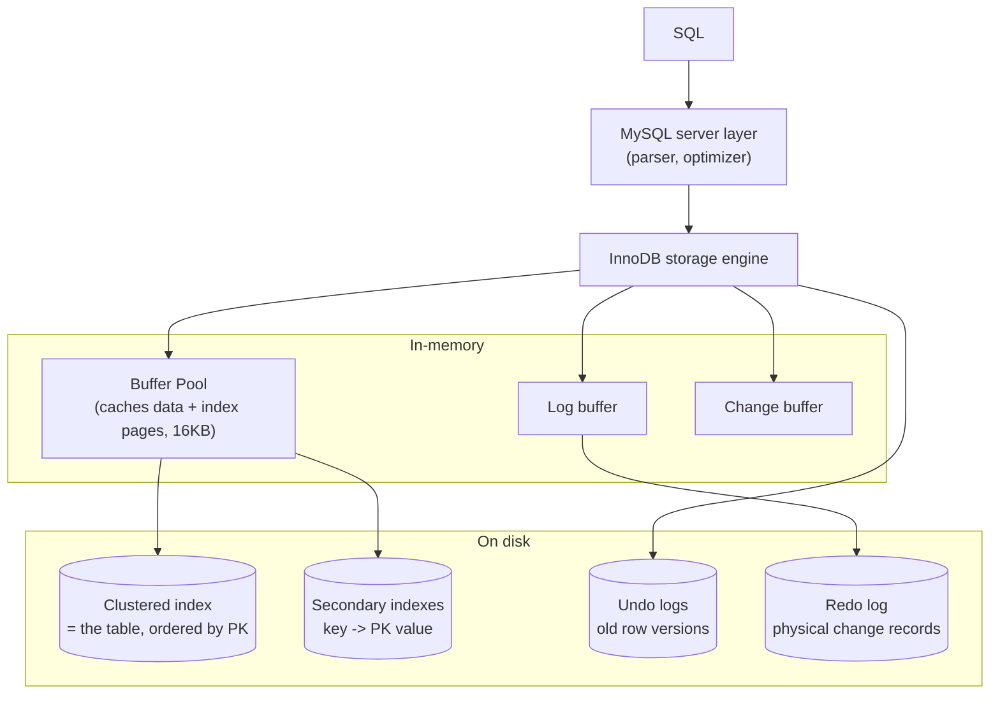

# MySQL / InnoDB Storage Engine

> Author: Gauri Shukla (24BCS10115)
> Measured on MySQL 9.6.0 with the InnoDB engine (Homebrew, Apple Silicon), same e-commerce dataset as my other topics (50k customers / 200k orders / 200k order items). The plans, index sizes, buffer-pool contents, and the lock traces below are real output from `setup.sql`, `queries.sql`, and `locks.txt`.

## 1. Problem Background

MySQL is the database behind a huge fraction of the web. InnoDB has been its default storage engine since 5.5, and it is what gives MySQL real transactions (ACID), row-level locking, and crash recovery. The engine was designed around two big bets that are worth understanding because they are the opposite of what PostgreSQL chose:

1. **Store the table physically as its primary key** (a clustered index), instead of an unordered heap.
2. **Update rows in place** and keep the old values in a separate undo log, instead of writing a new copy of the row each time.

Those two decisions shape everything else about InnoDB, so this document is organized around them.

## 2. Architecture Overview



The MySQL server layer parses and optimizes SQL, then hands execution to InnoDB. InnoDB caches pages in the buffer pool, writes changes physically to the redo log for durability, and keeps prior row versions in undo logs so that readers can reconstruct old versions for MVCC. The table itself lives on disk as a clustered B-tree.

## 3. Internal Design

### 3.1 Clustered index: the table *is* the primary key tree

This is the defining feature. In InnoDB the rows are stored inside the leaf pages of the primary key's B-tree, in primary key order. There is no separate heap. The leaf of the PK index holds the full row. This means a lookup by primary key walks one B-tree and lands directly on the data, with no extra hop.

I measured the page counts to see the clustered structure and the secondary indexes side by side:

```
 NAME             | NUM_ROWS | clustered_pages | secondary_pages
------------------+----------+-----------------+-----------------
 shop/customers   |    50263 |             161 |              97
 shop/orders      |   200200 |             481 |             353
 shop/order_items |   200200 |             481 |             225
 shop/products    |     1000 |               5 |               0
```

The `clustered_pages` column is the table itself stored as the PK B-tree (481 pages of 16 KB for 200k orders). The `secondary_pages` are the additional indexes.

### 3.2 Secondary indexes point at the PK, not at a physical location

Because rows live in the clustered index and can move when pages split, a secondary index in InnoDB does **not** store a physical row pointer. It stores the **primary key value** of the row. So a lookup through a secondary index is two B-tree descents: first the secondary index to find the PK value, then the clustered index to fetch the row. I confirmed this in the optimizer output:

```
EXPLAIN FORMAT=TREE
SELECT o.id, o.total FROM orders o WHERE o.customer_id = 12345;

-> Index lookup on o using idx_cust (customer_id = 12345)  (cost=1.4 rows=4)
```

For the three-table join, InnoDB chose **nested-loop joins driven by index lookups**:

```
-> Group aggregate: count(0), sum(o.total)
   -> Nested loop inner join
      -> Nested loop inner join
         -> Covering index lookup on c using idx_city (city = 'Pune')  (rows=17998)
         -> Index lookup on o using idx_cust (customer_id = c.id)      (rows=3.99)
      -> Covering index lookup on i using idx_order (order_id = o.id)  (rows=1)
```

This is a genuinely interesting contrast with PostgreSQL. On the exact same query and data, Postgres picked a hash join over sequential scans, while InnoDB picked nested loops over index lookups. Both are defensible. InnoDB leans on its indexes (and on covering them where it can, note "Covering index lookup" means the index had all the needed columns so it never had to visit the clustered index at all).

### 3.3 Buffer pool

InnoDB caches 16 KB pages in the buffer pool, managed with a variant of LRU that resists flooding from one-off full scans (it has a "young" and "old" sublist). After my queries I looked at what was resident:

```
 TABLE_NAME           | pages_cached
----------------------+--------------
 `shop`.`orders`      |          749
 `shop`.`order_items` |          624
 `shop`.`customers`   |          203
 `shop`.`products`    |            5
```

The default pool on my instance was 128 MB. The hot tables were fully resident, so repeated queries paid no disk cost.

### 3.4 Undo logs, redo logs, and why InnoDB needs both

This is the part students most often get backwards, so I want to be precise. The two logs do completely different jobs:

- **Redo log (physical, "do it again"):** records the physical changes to pages so that committed work survives a crash. On restart, InnoDB replays the redo log to bring data files up to date. This is the durability mechanism. My instance reported a 100 MB redo log with `innodb_flush_log_at_trx_commit = 1`, meaning the log is flushed to disk on every commit (the safest setting).

```
 redo_log_mb | log_buffer_mb | flush_policy
-------------+---------------+--------------
         100 |            64 |            1
```

- **Undo log (logical, "undo it"):** records the previous version of each modified row. It serves two purposes. First, rollback: if a transaction aborts, InnoDB uses the undo log to restore the old values. Second, and just as important, **MVCC**: when a transaction reads a row that another transaction has modified but not committed (or committed after this transaction's snapshot), InnoDB walks the undo log to reconstruct the version this transaction is allowed to see.

So the short answer to "why both?" is: **redo protects committed changes against a crash (roll forward), undo lets you take back uncommitted changes and lets readers see old versions (roll back / read consistent).** You need roll-forward and roll-back, and they are fundamentally different records.

This is also where InnoDB differs from PostgreSQL on MVCC. PostgreSQL keeps every version inline in the table and cleans up with VACUUM. InnoDB keeps the current version in place and pushes old versions into the undo log, which is purged once no transaction needs them. InnoDB's approach keeps the main table compact (no dead-tuple bloat in the table itself), at the cost of a undo log that has to be maintained and purged, and longer version chains for long-running read transactions.

### 3.5 Row locking and gap locks

InnoDB locks at the row level, not the table or page level, which is a big reason it scales for concurrent writers. Its default isolation level is `REPEATABLE READ`, which I confirmed:

```
 @@transaction_isolation
-------------------------
 REPEATABLE-READ
```

I demonstrated the locking directly with two concurrent transactions. First, a plain **row lock conflict**: transaction A updated row `id=100` and held the transaction open, and transaction B's attempt to update the same row blocked until it timed out:

```
-- while A holds the lock on id=100, B tries to update id=100:
ERROR 1205 (HY000): Lock wait timeout exceeded; try restarting transaction
```

Then the more subtle part, **gap and next-key locks**. Transaction A ran `SELECT * FROM orders WHERE id BETWEEN 500 AND 510 FOR UPDATE`. Looking at `performance_schema.data_locks` mid-flight showed exactly what InnoDB locked:

```
 INDEX_NAME | LOCK_TYPE | LOCK_MODE     | LOCK_DATA
------------+-----------+---------------+-----------
 NULL       | TABLE     | IX            | NULL
 PRIMARY    | RECORD    | X             | 501
 PRIMARY    | RECORD    | X             | 502
 ...        | RECORD    | X             | ...
 PRIMARY    | RECORD    | X             | 510
 PRIMARY    | RECORD    | X,REC_NOT_GAP | 500
```

The `X,REC_NOT_GAP` on 500 is a lock on that exact record, and the plain `X` locks on 501 through 510 are **next-key locks** that cover both the records and the gaps between them. To prove the gap itself was locked, transaction B tried to `INSERT` a new row with `id=505` into that range while A held the locks, and it was blocked:

```
-- B tries to INSERT id=505 into the locked range:
ERROR 1205 (HY000): Lock wait timeout exceeded; try restarting transaction
```

That is the whole point of gap locks: at `REPEATABLE READ`, they stop other transactions from inserting into a range you have read, which prevents phantom rows from appearing if you re-run the same range query.

## 4. Design Trade-Offs

| Decision | Advantage | Cost / limitation |
|---|---|---|
| Clustered index (table = PK B-tree) | PK lookups and PK range scans are very fast, data is pre-sorted by PK | Secondary lookups need a second descent (index -> PK -> row); a big or random PK bloats every secondary index |
| Secondary index stores PK value | Rows can move on page splits without breaking indexes | Two B-tree traversals per secondary lookup unless the index is covering |
| In-place update + undo log | Main table stays compact, no dead-tuple bloat | Undo logs must be purged; long-running readers extend version chains and delay purge |
| Redo + undo (both logs) | Durability (redo) and rollback + MVCC (undo) | Two separate write paths to maintain |
| Row-level + next-key locking | High write concurrency; prevents phantoms at RR | Gap locks can block inserts that "feel" unrelated, and can surprise you |

### Key comparison with PostgreSQL

| | PostgreSQL | InnoDB |
|---|---|---|
| Table storage | Unordered heap | Clustered by primary key |
| Update model | New tuple version, old left in table | In-place, old version to undo log |
| Old versions live in | The table itself | The undo log |
| Cleanup | VACUUM scans the table | Purge thread drops undo entries |
| Secondary index points to | Physical tuple (`ctid`) | Primary key value |

Neither is strictly better. PostgreSQL's heap keeps updates cheap and uniform but needs VACUUM. InnoDB's clustered design makes PK access excellent and keeps the table compact, but pays on every secondary-index lookup and on wide primary keys.

## 5. Experiments and Observations

Reproducible from the files here against a local MySQL 9.6.

1. **The table is the PK B-tree.** `INNODB_TABLESTATS` shows `orders` as 481 clustered pages plus 353 secondary-index pages, no separate heap.
2. **Secondary lookups are two-step**, and the optimizer reports "Index lookup ... using idx_cust" then resolves to the clustered row. Covering indexes skip the second step.
3. **Same query, different plan than Postgres.** InnoDB chose nested-loop + index lookups where Postgres chose hash join + seq scan.
4. **Buffer pool holds hot pages**: 749 pages of `orders` resident after the workload.
5. **Row locks block conflicting writers** (`Lock wait timeout exceeded` on the same row).
6. **Next-key / gap locks are visible and real.** `data_locks` showed `X` locks on records 501-510 plus the gaps, and an `INSERT` of `id=505` into the locked range was blocked. (`locks.txt`)

Files: `setup.sql`, `queries.sql`, `results.txt`, `locks.txt`.

## 6. Key Learnings

- "The table is the primary key index" is the sentence that unlocks InnoDB. Once I accepted that rows physically live in the PK B-tree, the two-hop secondary lookup and the advice to keep primary keys small and sequential both became obvious.
- Redo and undo are not redundant. Redo rolls committed work forward after a crash; undo rolls uncommitted work back and feeds MVCC. They answer different questions, which is why InnoDB keeps both.
- InnoDB and PostgreSQL reach ACID + MVCC by nearly opposite routes. Postgres copies new versions into the table and cleans up later; InnoDB updates in place and parks old versions in undo. Seeing both engines run the same workload made the trade-off tangible.
- Gap locks were the surprise. Watching an `INSERT` of an unrelated-looking `id=505` get blocked because another transaction had read a range taught me more about phantom prevention than any textbook definition.
- Locking granularity is a scalability lever. Row-level locks are why many InnoDB writers can proceed at once, and the `data_locks` view makes the otherwise invisible lock set concrete.

### References
- MySQL 8/9 Reference Manual, "InnoDB Storage Engine": https://dev.mysql.com/doc/refman/8.0/en/innodb-storage-engine.html
- "Clustered and Secondary Indexes": https://dev.mysql.com/doc/refman/8.0/en/innodb-index-types.html
- "InnoDB Locking" (record, gap, next-key): https://dev.mysql.com/doc/refman/8.0/en/innodb-locking.html
- "Redo Log" and "Undo Logs": https://dev.mysql.com/doc/refman/8.0/en/innodb-redo-log.html , https://dev.mysql.com/doc/refman/8.0/en/innodb-undo-logs.html
