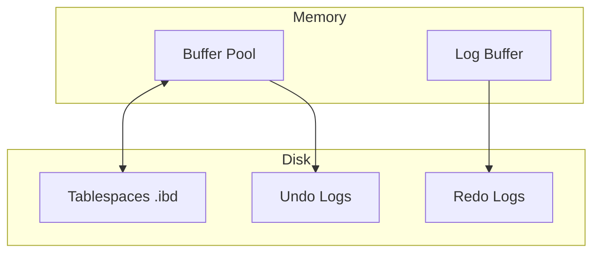

# MySQL / InnoDB Storage Engine

## 1. Problem Background
InnoDB was developed to provide a transactional, ACID-compliant storage engine for MySQL, replacing the older, non-transactional MyISAM engine. It needed to provide high concurrency through row-level locking, automatic crash recovery, and high performance for read-heavy and mixed workloads, matching enterprise databases like Oracle.

## 2. Architecture Overview
The InnoDB architecture is split into in-memory structures and on-disk structures:

*   **In-Memory:** Buffer Pool (caches data and indexes), Log Buffer (caches redo log entries), Adaptive Hash Index.
*   **On-Disk:** System Tablespace, File-Per-Table Tablespaces, Undo Tablespaces, and Redo Log files.

## 3. Internal Design

### Clustered Indexes
In InnoDB, tables are organized as Clustered Indexes based on the Primary Key. The leaf nodes of the B-tree for the primary key contain the actual row data.
*   **Secondary Indexes:** Leaf nodes of secondary indexes contain the primary key value, not a physical pointer.

### Undo and Redo Logs
*   **Redo Logs:** Store the physical changes made to pages. They are append-only and ensure that committed transactions are not lost during a crash (Durability).
*   **Undo Logs:** Store the "before image" of data being modified. Used for rolling back uncommitted transactions and for providing MVCC (so other transactions can read the older version).

### Locking Mechanisms
*   **Row-Level Locking:** InnoDB locks specific index records, not the whole table.
*   **Gap Locks:** Used in the `REPEATABLE READ` isolation level. Locks the gap between index records to prevent other transactions from inserting new rows (Phantom Reads) in a range that another transaction is currently querying.

## 4. Design Trade-Offs

### Key Comparison with PostgreSQL
*   **Updates and MVCC:** InnoDB updates rows *in-place*. The old data is moved to the Undo Log. PostgreSQL uses an append-only heap, writing the new row as a new version and leaving the old one in place.
*   **Trade-off:** InnoDB's in-place updates mean no "table bloat" like PostgreSQL, so there is no need for a heavy `VACUUM` process for the main data pages (though a purge thread cleans undo logs). However, large rollbacks in InnoDB are very expensive because the undo log must be applied to rewrite the old data back, whereas in Postgres it is instant.
*   **Clustered vs Heap:** InnoDB's clustered index makes Primary Key lookups extremely fast since the data is right there. PostgreSQL uses heap storage, meaning index lookups require traversing the B-tree and then doing a secondary fetch to the heap file. However, in InnoDB, secondary index lookups require two B-tree traversals (secondary index -> PK -> clustered index).

## 5. Experiments / Observations
If you observe insert throughput using UUIDs versus sequential Auto-Increment IDs in InnoDB:
*   **Observation:** Sequential IDs perform massively better. Because the table is a clustered index organized by PK, inserting sequential IDs appends data to the end of the B-tree. Inserting random UUIDs forces InnoDB to constantly insert rows into the middle of the B-tree, causing expensive "page splits" and fragmentation.

## 6. Key Learnings
*   InnoDB requires both undo and redo logs because they serve fundamentally different purposes: Undo is for logical rollback and MVCC; Redo is for physical crash recovery.
*   The choice between clustered indexes (InnoDB) and heap tables (PostgreSQL) dictates how developers should design schemas (e.g., keeping PKs small in InnoDB because they are duplicated in every secondary index).
