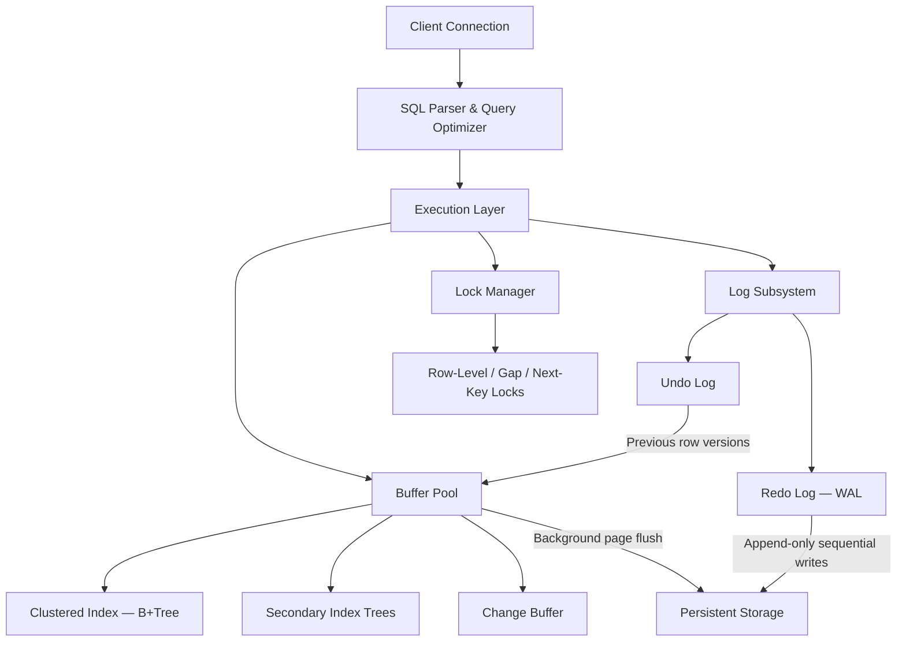

# MySQL InnoDB Storage Engine — Architecture & Design

## 1. What InnoDB Addresses

InnoDB is MySQL's default transactional storage engine, engineered to balance two often-competing goals — **raw performance** and **transactional correctness**:

- **Full ACID guarantees** — every transaction satisfies Atomicity, Consistency, Isolation, and Durability
- **Resilience to crashes** — the engine can reconstruct a consistent database state after abrupt failures
- **High concurrency** — simultaneous readers and writers operate with minimal mutual interference
- **Locality-optimized storage** — rows are physically organized alongside the primary key index, reducing disk seeks for PK-based access patterns

---

## 2. Architectural Overview



### How an UPDATE Flows Through the Engine

1. The execution layer requests the **buffer pool** to load and pin the target 16 KB data page.
2. If the page is not already cached, InnoDB fetches it from the data file into a buffer pool frame.
3. Before modifying the row, the **previous version** of the row is captured in the **undo log** (needed for transaction rollback and MVCC reads).
4. The row is then modified **in-place** within the buffered page.
5. A **redo log entry** describing the change is appended and synced to disk upon commit.
6. The modified page itself gets written back to the data file asynchronously by background flusher threads.

---

## 3. Detailed Internal Design

### Clustered Index Organization

InnoDB physically structures every table as a B+Tree ordered by the primary key. Actual row data resides directly in the leaf pages — so a primary key lookup traverses a single tree without needing a separate heap fetch.

- When a table lacks an explicit PK, InnoDB falls back to the first `UNIQUE NOT NULL` index. If none exists, it creates a hidden 6-byte internal row identifier.
- Data pages default to 16 KB and contain a page header, a page directory for binary search within the page, and row records stored in primary key order.

### Secondary Index Design

Leaf entries in secondary indexes hold the corresponding primary key value rather than a physical row pointer. Consequently, a lookup through a secondary index is a two-phase process: first the secondary B+Tree is traversed to find the PK, then the clustered index is traversed again to reach the actual row.

The upside of this design is that page splits or data movement in the clustered index never break secondary index entries — PK values are logical identifiers, not physical addresses. The downside is the additional clustered-index probe required for every secondary-index read, unless the query can be fully answered by a covering index.

### Buffer Pool Mechanics

The buffer pool serves as InnoDB's central memory cache, holding 16 KB pages of all types — data, index, undo, and change buffer pages. Every disk read and write is routed through it.

Background page-cleaner threads handle flushing dirty pages. The flush rate dynamically adjusts based on redo log utilization and the proportion of dirty pages in the pool. For workloads with heavy concurrency, the buffer pool can be split into multiple independent instances, each with its own mutex, to reduce contention.

### Undo Log Subsystem

The undo log fulfills a dual role: enabling **transaction rollback** and supporting **MVCC consistent reads**.

- Every time a row is modified, its prior state is recorded in the undo log before the in-place update takes effect.
- Each row in the clustered index carries a hidden roll pointer that links to its chain of previous versions in the undo space.

The mechanics:

- **Rollback**: traverse the undo chain backwards and restore each prior value.
- **Consistent reads (MVCC)**: walk the chain until finding a version that was committed before the reader's snapshot timestamp.
- **Purge**: a dedicated background thread periodically removes undo entries that are no longer referenced by any active transaction snapshot — conceptually similar to PostgreSQL's VACUUM, but operating on a separate undo tablespace rather than the main data pages.

### Redo Log (WAL Implementation)

The redo log implements the Write-Ahead Logging principle: a log entry must be durable on disk before the corresponding dirty page is considered committed.

- Entries are appended sequentially to a set of circular log files.
- At commit time, the redo buffer is flushed to guarantee durability.
- Actual data pages are written to their permanent locations later by background threads.
- Checkpoint markers record the log sequence number (LSN) up to which all dirty pages have been safely written, bounding the amount of log that needs replaying during recovery.

### Lock Types and Behavior

InnoDB's locking operates at the index-record level, not on physical row locations. The specific lock type applied depends on the index being used.

| Lock Type | Scope | Function |
|-----------|-------|----------|
| Record Lock | A single index entry | Guards an exact-match row |
| Gap Lock | The interval between two adjacent index entries | Blocks insertions into a key range |
| Next-Key Lock | An index entry plus the gap preceding it | Default at REPEATABLE READ; prevents phantom rows |
| Insert Intention Lock | A gap (compatible with other insert-intention holders) | Permits non-conflicting concurrent inserts |

**Illustration:** Given index entries `{10, 20, 30}`, a `SELECT ... WHERE id BETWEEN 15 AND 25 FOR UPDATE` will acquire gap locks on the intervals `(10, 20)` and `(20, 30)`, plus a record lock on `20`. This prevents any other transaction from inserting, say, `id=17` — thereby eliminating phantom reads.

### Transaction Isolation Levels

| Level | Phantom Rows Possible? | Implementation Strategy |
|-------|----------------------|------------------------|
| READ UNCOMMITTED | Yes | No consistent snapshot |
| READ COMMITTED | Yes | A new snapshot is taken for each individual statement; gap locks are not used |
| REPEATABLE READ (default) | No | Snapshot captured at the first read; next-key locks prevent phantoms |
| SERIALIZABLE | No | Every SELECT is implicitly promoted to `SELECT ... FOR SHARE` |

Notably, InnoDB's `REPEATABLE READ` provides **stronger guarantees than the SQL standard demands** — it eliminates phantom reads through next-key locking, a property the standard only mandates at `SERIALIZABLE`.

---

## 4. Architectural Trade-Offs

### In-Place Updates (InnoDB) vs. Append-Only Versioning (PostgreSQL)

| Dimension | InnoDB | PostgreSQL |
|-----------|--------|------------|
| How updates work | Row is overwritten in place; old version saved to undo log | New tuple is appended; old tuple persists until VACUUM |
| State of data pages | Always contains the current version only | Can accumulate dead/obsolete tuples (heap bloat) |
| How space is reclaimed | Purge thread operates on the undo tablespace (lightweight) | VACUUM must scan and rewrite heap pages |
| Cost of rollback | Requires actively undoing changes via the undo chain | Cheap — just mark the transaction as aborted in the commit log |

InnoDB's approach keeps data pages clean and sidesteps the need for VACUUM-style heap scans. The trade-off is the added complexity of undo-tablespace management and possible purge delays when long-running transactions hold old snapshots open.

### Clustered Storage vs. Heap-Based Storage

| Dimension | InnoDB (Clustered) | PostgreSQL (Heap) |
|-----------|--------------------|-------------------|
| Primary key lookup | One B+Tree traversal — data is in the leaf | Index lookup yields a CTID, then a separate heap fetch |
| Secondary index lookup | Two-phase: secondary tree → PK → clustered tree | One indirection: index → CTID → heap |
| PK range scans | Rows are physically contiguous | Rows may be scattered across heap pages |
| Non-sequential PKs (e.g., UUIDs) | Leads to random page splits and fragmentation | Heap is unaffected by PK ordering |

Clustered storage provides a clear advantage for PK-centric OLTP workloads. PostgreSQL's heap-based model is preferable when queries seldom use the primary key or when the table has numerous secondary indexes.

### Concurrency Control Strategy

InnoDB enforces phantom prevention at `REPEATABLE READ` through gap locking, whereas PostgreSQL relies on snapshot-based isolation (SSI when running at `SERIALIZABLE`). InnoDB's approach offers stronger default transactional guarantees but can introduce unexpected lock-wait scenarios during range-based operations.

---

## 5. Experimental Observations

### Schema Setup

```sql
CREATE TABLE customers (
    id INT AUTO_INCREMENT PRIMARY KEY, city VARCHAR(50) NOT NULL
) ENGINE=InnoDB;

CREATE TABLE products (
    id INT AUTO_INCREMENT PRIMARY KEY, category VARCHAR(50) NOT NULL
) ENGINE=InnoDB;

CREATE TABLE orders (
    id INT AUTO_INCREMENT PRIMARY KEY,
    customer_id INT NOT NULL, product_id INT NOT NULL,
    amount DECIMAL(10,2) NOT NULL,
    FOREIGN KEY (customer_id) REFERENCES customers(id),
    FOREIGN KEY (product_id) REFERENCES products(id)
) ENGINE=InnoDB;

CREATE INDEX idx_orders_customer ON orders(customer_id);
CREATE INDEX idx_orders_product ON orders(product_id);

INSERT INTO customers (city) VALUES ('New York'),('London'),('Tokyo'),('Paris'),('Berlin');
INSERT INTO products (category) VALUES ('books'),('electronics'),('furniture'),('clothing'),('books'),('books');
INSERT INTO orders (customer_id, product_id, amount) VALUES
  (1,1,29.99),(2,1,19.99),(1,2,99.99),(3,3,149.99),(4,4,59.99),(5,1,24.99),
  (1,5,34.99),(2,2,89.99),(3,1,19.99),(4,5,39.99),(5,3,129.99),(1,4,49.99);
ANALYZE TABLE customers, products, orders;
```

### Analyzing the Query Plan

```sql
EXPLAIN FORMAT=JSON
SELECT c.city, p.category, COUNT(*), SUM(o.amount)
FROM orders o
JOIN customers c ON c.id = o.customer_id
JOIN products p ON p.id = o.product_id
WHERE p.category = 'books'
GROUP BY c.city, p.category;
```

**Observations from the experiment:**
- Joins against the `customers` and `products` tables on their primary keys leverage **clustered index lookups** — data is fetched directly from the B+Tree leaves with no additional heap access (a structural advantage over PostgreSQL's heap-based layout).
- Given the small table sizes, the optimizer selects nested loop joins. The `ANALYZE TABLE` output feeds the statistics that inform join ordering.
- Since there is no secondary index on `products.category`, MySQL performs a full scan of the `products` table (negligible cost at only 6 rows).

### Execution Plan Output

Running `EXPLAIN FORMAT=JSON` on this multi-table join reveals how InnoDB processes the query:


**Primary Observation:** Every join to a PK column in `customers` and `products` resolves through the clustered index. The secondary index `idx_orders_product` stores the PK value, enabling MySQL to jump directly to the clustered-index leaf node without any extra heap lookup. This is the structural benefit of InnoDB's clustered storage model compared to PostgreSQL's non-clustered heap approach.

---