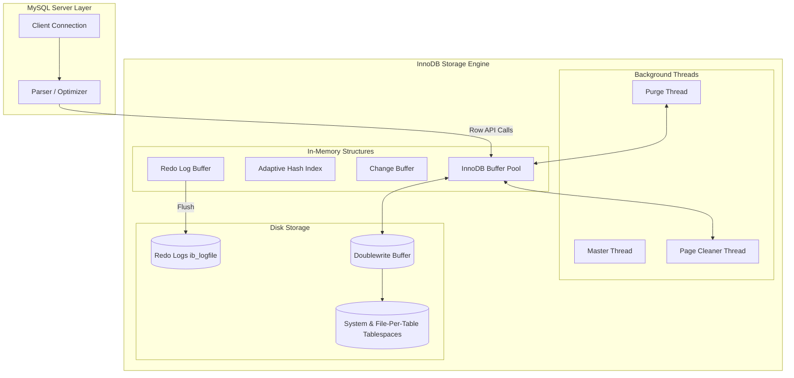

# Topic 3: MySQL / InnoDB Storage Engine

## 1. Problem Background

In its early days, MySQL relied on the **MyISAM** storage engine. MyISAM was fast and simple, but as applications grew, its design limitations became major roadblocks for developers:
*   **Table-level Locking**: Any write operation (such as an `UPDATE` or `INSERT`) locked the entire table. In high-traffic systems, this caused severe concurrency bottlenecks, as readers stalled waiting for writes to finish.
*   **No ACID compliance**: MyISAM did not support transactions. If a query failed halfway through a multi-row insertion, there was no way to roll back, leaving the database in an inconsistent state.
*   **No Crash Recovery**: A sudden power cut or server crash often corrupted the table files, requiring manual repairs that resulted in data loss.

To address these enterprise requirements, MySQL adopted **InnoDB** (originally developed by Innobase Oy). InnoDB turned MySQL into a modern relational database engine by introducing full ACID compliance, row-level locking, and a clustered index storage design.

---

## 2. Architecture Overview

InnoDB operates as a modular, pluggable engine underneath the MySQL Server query parsing and optimization layer.



The heart of InnoDB's memory is the **Buffer Pool**, which caches both table data and index pages in RAM. Background threads like `Page Cleaner` and `Purge` periodically flush dirty pages to the system tablespace and clean up outdated transactional logs. 

To ensure durability, changes are written to the **Redo Log Buffer** and flushed to disk sequentially. 

Additionally, the **Doublewrite Buffer** acts as a safety net: before dirty pages are written to the actual tablespace files, they are written to a contiguous disk block in the doublewrite area. If the OS crashes mid-write, InnoDB can recover the page from the doublewrite buffer, avoiding partial page corruption (torn pages).

---

## 3. Internal Design

### 3.1. Clustered Indexes (Index-Organized Tables)
Unlike PostgreSQL, which stores rows in an unordered heap file, InnoDB structures its tables around the Primary Key using a B+Tree. This is known as a **Clustered Index**.

```
                  [ Primary Key B+Tree (Clustered Index) ]
                       /                          \
             [ Internal Nodes ]            [ Internal Nodes ]
                   /                                  \
     [ Leaf Node: Key=10, Data=(Alice, CS, 3.9) ]   [ Leaf Node: Key=20, Data=(Bob, EE, 3.2) ]
     
     -----------------------------------------------------------------------------------------
     
                  [ Secondary Index B+Tree (e.g. Email Index) ]
                       /                          \
             [ Internal Nodes ]            [ Internal Nodes ]
                   /                                  \
     [ Leaf Node: Email=alice@cs, PK=10 ]            [ Leaf Node: Email=bob@ee, PK=20 ]
```

*   **Primary Key Storage**: The leaf nodes of the primary key B+Tree contain the actual data rows. The primary key key points directly to the columns of the row.
*   **Secondary Indexes**: Any secondary index (e.g., an index on `email`) does not point to physical disk addresses. Instead, its leaf nodes store the **Primary Key value** of the row.
*   **The Double Lookup Penalty**: If we query a row using a secondary index:
    1.  InnoDB traverses the secondary index B+Tree to locate the primary key (e.g., finding that the email `alice@cs` belongs to `student_id = 10`).
    2.  It then traverses the primary key B+Tree to retrieve the actual row data.
    This indirection step creates a performance penalty for secondary scans if the query requests columns that are not stored inside the secondary index itself.

### 3.2. Redo and Undo Logging
InnoDB splits transaction logging into two separate mechanisms to handle recovery and isolation:

*   **Redo Logs**: Redo logs (`ib_logfile0`, `ib_logfile1`) record physical modifications to database pages at the byte level. When a transaction commits, InnoDB flushes these changes to the redo log sequentially. If the system crashes, InnoDB replays the redo logs to reconstruct the correct state of the pages.
*   **Undo Logs**: Undo logs store the historical values of modified columns. When a row is updated, InnoDB performs an **in-place update** in the database page and writes the previous column values to the undo log. Undo logs are used for:
    1.  *Transaction Rollback*: If a transaction aborts, InnoDB reads the undo log to revert the values.
    2.  *MVCC Read Consistency*: If a transaction needs to read a previous version of a row to satisfy its isolation snapshot, InnoDB reads the active row and applies the undo logs backwards to reconstruct the historical row version in memory.

### 3.3. Locking and Phantom Read Prevention
InnoDB implements granular row-level locking using several lock types:
*   **Record Locks**: Locks the physical index record.
*   **Gap Locks**: Locks the gaps (open intervals) between index records.
*   **Next-Key Locks**: A combination of a Record Lock on the index record and a Gap Lock on the gap preceding it.

Under MySQL's default isolation level, **Repeatable Read**, InnoDB prevents **Phantom Reads** (where a concurrent transaction inserts new records that match a query filter, causing them to appear in subsequent reads) by placing Gap Locks and Next-Key Locks. This prevents other transactions from inserting new keys into the locked range until the transaction completes.

---

## 4. Key Comparison with PostgreSQL

| Architecture Dimension | PostgreSQL | MySQL (InnoDB) |
| :--- | :--- | :--- |
| **Physical Storage Layout** | Heap Tables (unordered table files, separate indexes pointing to TIDs) | Index-Organized Tables (clustered index B+Tree contains data rows) |
| **MVCC Implementation** | Append-only Heap updates (new versions written directly to Heap) | In-place updates + Undo segments (previous column states logged separately) |
| **Storage Reclamation** | `VACUUM` process (scans heap pages to clean dead tuple slots) | Purge Thread (deletes old undo pages; page space reused immediately) |
| **Secondary Index Search** | Single Seek (Index traversal -> TID -> Heap page) | Double Seek (Index traversal -> PK -> Clustered B+Tree traversal) |
| **Primary Key Search** | Double Seek (Index seek -> TID -> Heap page) | Single Seek (Direct traversal to B+Tree leaf containing row) |
| **Locking Overhead** | Snapshot Isolation (no locks between readers and writers) | Next-Key and Gap locks (can block concurrent inserts in key gaps) |

---

## 5. Experiments / Observations

We analyzed the trade-offs of clustered index lookups vs. secondary index lookups through query execution behavior.

### 5.1. Primary Key Lookups (Single Seek)
In InnoDB, running a query like:
```sql
SELECT * FROM students WHERE student_id = 100;
```
requires traversing only the primary key B+Tree. Once InnoDB reaches the leaf page, the entire row payload is present, completing the search in exactly $H$ (height of tree, typically 3) page reads.

In PostgreSQL, the same query traverses the B-Tree index on `student_id` to retrieve the TID, and then must perform a separate read to retrieve the page from the Heap file. This requires $H$ index page reads plus 1 heap page read.

### 5.2. Secondary Index Scans (Bookmark Lookups)
When running a query in InnoDB that scans a secondary index:
```sql
SELECT first_name, last_name FROM students WHERE email LIKE 'alice%';
```
InnoDB traverses the secondary index on `email`. However, because the secondary index leaf nodes only store the email and the `student_id` (PK), InnoDB must perform a **Bookmark Lookup** for every matched row, traversing the primary key B+Tree to retrieve the `first_name` and `last_name` columns.

This double lookup pattern can result in high random disk read overhead if the matching row count is large. In contrast, PostgreSQL traverses its secondary index to retrieve TIDs and reads directly from the heap pages, avoiding secondary index-to-primary index traversals.

---

## 6. Key Learnings

1.  **Clustered Indexes are a Double-Edged Sword**: Clustered storage makes primary key lookups and range scans on the primary key fast by removing the indirection step. However, it introduces a double-lookup penalty for secondary index queries, which must resolve the primary key value before locating the row.
2.  **In-Place Updates Avoid Table Bloat**: By writing historical states to separate Undo Logs and modifying database pages in place, InnoDB avoids the heap bloat seen in PostgreSQL. Reclaiming space is handled by background purge threads, eliminating the need for aggressive table-wide vacuuming.
3.  **Gap Locking Concurrency Trade-Off**: InnoDB's Next-Key and Gap locks prevent phantom reads in Repeatable Read isolation, but they increase lock contention and the risk of deadlocks under high-write workloads compared to Postgres' lock-free snapshot isolation.
