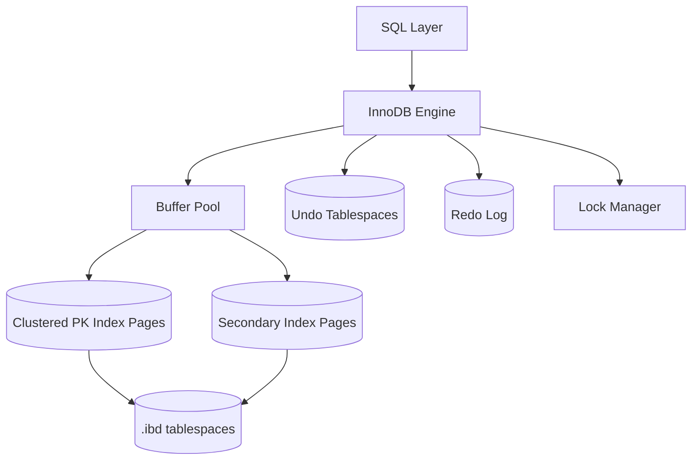

# MySQL InnoDB Storage Engine

**Author:** SCALER_23bcs10014  
**Course:** Advanced DBMS — System Design Discussion

---

## 1. Problem Background

MySQL ships multiple storage engines; **InnoDB** has been the default since MySQL 5.5 (2010). InnoDB was designed to provide **full ACID transactions**, **row-level locking**, and **crash recovery** for general-purpose OLTP—capabilities the older MyISAM engine lacked (table-level locks, no crash-safe transactions).

InnoDB's architecture draws heavily from Oracle-style databases:

- **Clustered primary key index** stores row data
- **MVCC via undo logs** rather than heap tuple chains
- **Redo log** for physical durability
- **Buffer pool** for page caching

Understanding InnoDB clarifies why MySQL performance tuning focuses on PK design, buffer pool sizing, and undo/redo log capacity—and why it behaves differently from PostgreSQL on the same SQL workload.

---

## 2. Architecture Overview



### Main Components

| Component | Purpose |
|-----------|---------|
| **Buffer pool** | Caches data and index pages (analogous to PostgreSQL shared buffers) |
| **Clustered index** | B+Tree where leaf pages contain full row data |
| **Secondary indexes** | B+Tree leaves store PK columns as row locator |
| **Undo log** | Stores previous row versions for rollback & consistent reads |
| **Redo log** | Physical WAL for crash recovery (circular) |
| **Lock manager** | Row locks, gap locks, next-key locks |

### Data Flow — Primary Key Lookup

1. Search clustered B+Tree by PK → leaf page in buffer pool (or read from disk).
2. Return row directly from leaf — **one tree descent**.

### Data Flow — Secondary Index Lookup

1. Search secondary index tree → obtain PK from leaf.
2. **回表 (back to table):** Search clustered index by PK → fetch full row.
3. Two tree descents unless covering index satisfies all columns.

---

## 3. Internal Design

### 3.1 Clustered Index & Primary Key Storage

InnoDB **requires** a clustered index. If no PK is declared, a hidden `ROW_ID` is used.

- Leaf pages store the **full row** in PK order.
- Range scans on PK are sequential leaf walks — excellent locality.
- Secondary index entries: `(index_key_columns, primary_key_columns)`.

**Why clustered indexes improve lookups:**

- PK point query: one B+Tree probe to leaf containing data.
- Range query on PK: sequential leaf traversal, minimal random I/O.

### 3.2 Secondary Indexes

Secondary index leaves do **not** contain full rows—only PK values as pointers.

Implications:

- Wide PKs bloat every secondary index.
- Covering indexes (all needed columns in index) avoid回表.

### 3.3 Buffer Pool

- Pages (default 16 KB) cached in LRU-ish lists (young/old sublists in modern InnoDB).
- Dirty pages flushed asynchronously; redo log ensures durability.
- `innodb_buffer_pool_size` is the dominant tuning knob.

### 3.4 Undo Logs — Oracle-Style MVCC

On `UPDATE`:

1. Current row version remains in clustered index (in-place mutation with undo chain).
2. Old column values written to **undo log**.
3. Consistent read traverses undo chain to reconstruct older versions.

| Operation | Undo role |
|-----------|-----------|
| `ROLLBACK` | Apply undo records to restore row |
| Consistent read (`READ COMMITTED` / `REPEATABLE READ`) | Build older version from undo |
| Purge | Discard undo no longer needed by any transaction |

**Purge thread** reclaims undo segments (PostgreSQL equivalent: `VACUUM` dead tuples).

### 3.5 Redo Log

- Physical log: records changes to **pages** (not SQL statements).
- Circular files (`ib_logfile0`, `ib_logfile1`); size fixed at creation.
- **Write-ahead:** redo flushed before dirty pages on disk.
- Crash recovery: redo replay from last checkpoint.

### 3.6 Locking

| Lock type | Purpose |
|-----------|---------|
| **Record lock** | Locks an existing index record |
| **Gap lock** | Locks a gap between index records |
| **Next-key lock** | Record + gap (default for `REPEATABLE READ`) |

Gap locks prevent **phantom reads** in RR isolation by blocking inserts into scanned ranges.

**Isolation levels (InnoDB):**

- `READ UNCOMMITTED` — dirty reads possible
- `READ COMMITTED` — consistent read per statement; gap locks reduced
- `REPEATABLE READ` — snapshot for transaction; next-key locks
- `SERIALIZABLE` — locks reads

---

## 4. Design Trade-Offs

### InnoDB vs PostgreSQL MVCC

| Aspect | PostgreSQL | InnoDB |
|--------|-----------|--------|
| Row storage | Heap (unordered) | Clustered PK B+Tree |
| Updates | New tuple version on heap | In-place + undo chain |
| Old versions | Dead heap tuples | Undo log records |
| Cleanup | VACUUM | Purge thread |
| Secondary index | Points to heap TID | Points to PK (回表) |
| PK requirement | Optional | Effectively required |

### Why InnoDB Needs Both Undo and Redo

| Log | Question answered | Phase |
|-----|-------------------|-------|
| **Undo** | "How do I reverse this change?" | Transaction lifetime / MVCC reads |
| **Redo** | "How do I replay committed page changes after crash?" | Recovery |

They solve **orthogonal problems:**

- **Undo** is logical row history (rollback, consistent read).
- **Redo** is physical page durability (crash after commit, before page flush).

Without redo, committed data in memory could be lost on crash. Without undo, rollback and snapshot reads would be impossible after in-place updates.

### Clustered Index Advantages & Limitations

| Advantage | Limitation |
|-----------|------------|
| PK lookups are one hop | Secondary lookups need回表 |
| Range scans on PK are fast | Poor PK choice hurts all secondary indexes |
| Data physically ordered by PK | Inserts with random PK cause page splits |

### Why PostgreSQL Chose Heap + Tuple Versioning

- No mandatory PK; heap RID is stable physical locator.
- Append-only updates simplify visibility (xmin/xmax) without undo chain traversal.
- Trade-off: table bloat and VACUUM instead of undo management.

---

## 5. Experiments / Observations

**Environment:** MySQL 8.0 (Docker), InnoDB, `shopdb` with 5K customers, 20K orders, 80K order_items.

### 5.1 Primary Key vs Secondary Index Lookup

**Query A — PK lookup (`id = 2500`):**

```json
"access_type": "const",
"key": "PRIMARY",
"rows_examined_per_scan": 1,
"query_cost": "1.00"
```

**Query B — Email lookup (`email = 'user2500@example.com'`):**

```json
"access_type": "ref",
"key": "idx_customers_email",
"rows_examined_per_scan": 1,
"query_cost": "0.35"
```

Both examine one row, but:

- PK `const` access reads the **clustered leaf** directly—data is there.
- Secondary index `ref` access reads index leaf, then uses embedded PK to fetch clustered leaf (回表) if non-covering columns (`name`, `city`) are selected.

### 5.2 Join via Secondary Index

Join `orders` to `customers` on email:

```json
"nested_loop": [
  { "table": "c", "key": "idx_customers_email", "rows_examined_per_scan": 1 },
  { "table": "o", "key": "idx_orders_customer", "rows_examined_per_scan": 4 }
]
```

**Observation:** Optimizer uses email index to find customer, then `idx_orders_customer` to fetch ~4 orders. Clustered PK on `customers` was not needed for the initial probe because email index leaves contain PK.

### 5.3 Cost Comparison Table

| Access pattern | Index used | Tree traversals | Notes |
|----------------|-----------|-----------------|-------|
| PK equality | PRIMARY (clustered) | 1 | Optimal point read |
| Secondary equality | Secondary → PK | 2 |回表 cost |
| PK range scan | PRIMARY | 1 + leaf chain | Sequential leaves |
| Covering secondary | Secondary only | 1 | If all columns in index |

---

## 6. Key Learnings

1. **Clustered index is the table** in InnoDB—PK design is the most important schema decision.
2. **Undo and redo are complementary**, not redundant: undo for logical reversal/MVCC; redo for physical crash recovery.
3. **Gap locks** are the price of phantom-free `REPEATABLE READ`—they can reduce concurrency on index ranges.
4. **Secondary indexes carry PK overhead**—wide UUID PKs inflate every index.
5. **PostgreSQL and InnoDB both implement MVCC** but with opposite update philosophies: append-only heap versions vs in-place updates with undo chains.

### Assignment Questions — Answered

| Question | Answer |
|----------|--------|
| Why both undo and redo? | Redo = durability after crash; undo = rollback + consistent reads for in-place updates. |
| Clustered index advantages? | Single-hop PK access, ordered range scans, better locality. |
| Why different MVCC from PostgreSQL? | Historical Oracle influence; in-place updates suit B+Tree clustered layout; PostgreSQL research heritage favored heap extensibility. |

---

## References

- MySQL 8.0 Reference — [InnoDB Storage Engine](https://dev.mysql.com/doc/refman/8.0/en/innodb-storage-engine.html)
- [InnoDB Undo Logs](https://dev.mysql.com/doc/refman/8.0/en/innodb-undo-logs.html)
- [InnoDB Redo Log](https://dev.mysql.com/doc/refman/8.0/en/innodb-redo-log.html)
- MySQL Internals Manual — InnoDB locking
