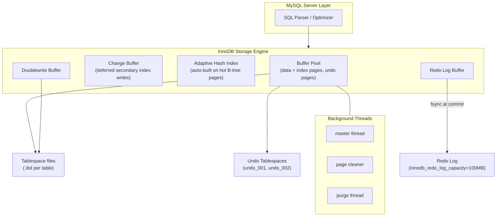

# MySQL / InnoDB Storage Engine — Internal Architecture

> **Author:** Prabhav Semwal | **Roll:** 24bcs10358  
> **Environment:** MySQL 8.0.46 in Podman (`docker.io/library/mysql:8.0`)  
> **Dataset:** `customers` 5k · `orders` 20k · `order_items` 60k rows (InnoDB, `innodb_file_per_table=ON`)

---

## Table of Contents
1. [Problem Background](#1-problem-background)
2. [Architecture Overview](#2-architecture-overview)
3. [Internal Design](#3-internal-design)
4. [Design Trade-Offs](#4-design-trade-offs)
5. [Experiments / Observations](#5-experiments--observations)
6. [Key Learnings](#6-key-learnings)
7. [References](#7-references)

---

## 1. Problem Background

MySQL was created in 1995 and quickly became the dominant open-source RDBMS for web applications. However, the original MyISAM storage engine had no transactions and no foreign keys. In 1997, Heikki Tuuri's company Innobase released InnoDB as a pluggable storage engine for MySQL, bringing ACID transactions, row-level locking, and foreign key enforcement. Oracle acquired Innobase in 2005 and then Sun/MySQL in 2010; InnoDB became MySQL's default engine in version 5.5.

InnoDB's core design goal is **transactional correctness at scale** — it had to be fast enough for high-concurrency web workloads while guaranteeing ACID properties. The key architectural decisions (clustered indexes, MVCC via undo logs, redo logs, doublewrite buffer) all flow from this goal.

---

## 2. Architecture Overview



### Key components

| Component | Role |
|---|---|
| **Buffer Pool** | Shared LRU page cache for data, index, and undo pages (128 MB in our setup) |
| **Change Buffer** | Defers writes to non-unique secondary index pages that are not in buffer pool, merging them on read — reduces random I/O on inserts |
| **Adaptive Hash Index (AHI)** | InnoDB monitors B-tree lookup patterns; if a range of keys is accessed repeatedly, it auto-builds an in-memory hash index for O(1) lookup |
| **Redo Log** | Write-ahead log for durability — every page modification is logged here before the page is written to disk |
| **Undo Log** | Stores before-images of modified rows — used for rollback and for MVCC (reading old versions) |
| **Doublewrite Buffer** | Writes every page to a contiguous doublewrite area first, then to its real location — protects against torn writes |
| **Purge Thread** | Asynchronously removes undo records that are no longer needed by any active transaction |

---

## 3. Internal Design

### 3.1 Clustered Index — The Table IS the B-tree

This is InnoDB's most distinctive design decision. In PostgreSQL, the table is a heap (unordered pages) and indexes are separate structures pointing into it. In InnoDB, **the table is organized as a B+ tree keyed by the primary key**. The actual row data lives in the B-tree leaf pages.

```
InnoDB table = Primary Key B+ tree
                    │
           ┌────────┴────────┐
     Interior page        Interior page
     [key ranges + child ptrs]
           │
      ┌────┴────┐
   Leaf page  Leaf page
   [PK value + ALL row columns]   ← full row here, no separate heap
```

**Consequences:**
- A **primary key lookup** (`WHERE id = 100`) traverses the B-tree and finds the row *at the leaf* — one operation.
- A **secondary index lookup** (`WHERE customer_id = 500`) traverses the secondary index B-tree to get the PK value, then traverses the *clustered index* again to get the full row — two B-tree lookups. This is called a "double lookup" or "index-then-table" access.
- Row data is physically ordered by PK. Range scans on the PK are sequential (fast). Range scans on secondary indexes involve random jumps through the clustered index.

**Observed live** (Exp 0):
```
innodb_page_size = 16384  (InnoDB uses 16 KB pages vs PostgreSQL's 8 KB)
innodb_file_per_table = ON  (each table gets its own .ibd file)
```

### 3.2 Secondary Indexes & Covering Indexes

Every secondary index in InnoDB stores: `(indexed_columns, primary_key_value)`. The PK value at the leaf is how the engine navigates back to the clustered index.

```
Secondary index leaf:  [customer_id=500 | row_ptr → PK=17834]
                                              ↓
Clustered index leaf: [id=17834 | name='User17834' | country='IN' | ...]
```

A **covering index** is a secondary index that contains all columns needed by the query — no second B-tree lookup is needed:
```sql
SELECT customer_id FROM orders WHERE customer_id BETWEEN 100 AND 200;
-- Extra: Using where; Using index  ← "Using index" = covered, no clustered lookup
```

### 3.3 MVCC via Undo Logs

InnoDB's MVCC is fundamentally different from PostgreSQL's:

| | PostgreSQL | InnoDB |
|---|---|---|
| **Old versions stored** | In the heap alongside new versions | In a separate **undo log** file |
| **Current row** | Always the latest version | Always the latest version (in-place update) |
| **Reading old data** | Read old physical tuple still in heap | Reconstruct old version by applying undo chain |
| **Cleanup** | VACUUM removes dead heap tuples | Purge thread removes undo records no longer needed |

**InnoDB update sequence:**
1. Write before-image of the row to the **undo log**.
2. Update the row **in place** in the buffer pool page.
3. The row's hidden `DB_TRX_ID` field is updated to the current transaction ID.
4. The row's `DB_ROLL_PTR` points back to the undo log record.

A reader with an older snapshot that needs the pre-update version follows the `DB_ROLL_PTR` chain through the undo log to reconstruct what the row looked like at snapshot time.

**Undo tablespaces observed** (Exp 6):
```
FILE_NAME   | FILE_TYPE | TABLESPACE_NAME
./undo_001  | UNDO LOG  | innodb_undo_001
./undo_002  | UNDO LOG  | innodb_undo_002
```

Two separate undo tablespace files, dedicated to storing old row versions. The purge thread asynchronously removes undo records once no active transaction has a snapshot older than those records.

### 3.4 Redo Log (WAL equivalent)

InnoDB's redo log is its write-ahead durability mechanism:

```
Transaction modifies a page
         │
         ▼
Write redo log record to Redo Log Buffer (in memory)
         │
         ▼ (on COMMIT, or every second, or when buffer is 1MB full)
fsync redo log to disk (innodb_flush_log_at_trx_commit=1)
         │
  (background — page cleaner thread)
         │
         ▼
Dirty buffer pool pages written to .ibd files
```

**`innodb_flush_log_at_trx_commit` settings:**
- `1` (default): fsync on every commit — fully durable, slowest for write-heavy workloads
- `2`: write to OS buffer on commit, fsync every second — survives MySQL crash, not OS crash
- `0`: fsync every second only — fastest, risks up to 1s of data loss

**Observed config:**
```
innodb_redo_log_capacity    = 104857600 (100 MB)
innodb_flush_log_at_trx_commit = 1
innodb_doublewrite          = ON
innodb_log_file_size        = 50331648 (48 MB per file)
```

### 3.5 Doublewrite Buffer

InnoDB's **doublewrite buffer** solves the torn-write problem (a partial 16 KB write during a crash):

1. Before writing dirty pages to their real `.ibd` locations, InnoDB writes them sequentially to the **doublewrite buffer** area (a contiguous region in the system tablespace).
2. After the doublewrite write completes, pages are written to their actual positions.

On crash recovery: if a page in the `.ibd` file looks corrupt (partial write), InnoDB restores it from the doublewrite buffer, then applies the redo log. PostgreSQL solves the same problem with `full_page_writes` in WAL.

### 3.6 Row-Level Locking & Gap Locks

InnoDB locks at **row granularity** using the index structure itself. Lock modes:
- **Record lock:** Lock on a single index record.
- **Gap lock:** Lock on the gap *before* an index record (prevents inserts into the gap).
- **Next-key lock:** Record lock + gap lock on the gap before it (default under REPEATABLE READ).

**Why gap locks?** Under `REPEATABLE READ`, a transaction that reads `WHERE id BETWEEN 1 AND 5` must prevent other transactions from inserting rows in that range — otherwise a re-read would see new "phantom" rows. Gap locks prevent phantoms without requiring SERIALIZABLE isolation.

Gap locks can cause surprising deadlocks: two transactions can each hold gap locks and then try to insert into each other's gap, creating a cycle.

**Isolation level observed:**
```
transaction_isolation = REPEATABLE-READ  (InnoDB default)
```

### 3.7 Buffer Pool LRU Management

InnoDB uses a **midpoint insertion LRU**:

```
[Young sublist (hot pages)] | [midpoint] | [Old sublist (cold pages)]
```

New pages are inserted at the **midpoint** (3/8 from the tail by default), not at the head. They are promoted to the young sublist only if accessed again within `innodb_old_blocks_time` milliseconds. This protects frequently used (hot) pages from being evicted by a one-time table scan.

The Adaptive Hash Index supplements the B-tree for equality lookups on hot ranges — InnoDB auto-builds it at runtime when it detects repeated lookups on the same key range.

---

## 4. Design Trade-Offs

### Clustered index: the fundamental storage decision

**Benefits:**
- PK range scans read sequentially from disk — very efficient for `WHERE id BETWEEN x AND y`
- PK lookup is one B-tree traversal, not two (heap indirection)
- Co-location of related rows (e.g., all order items for a customer_id range)

**Costs:**
- Secondary index lookups require two B-tree traversals
- INSERT with a random PK (e.g., UUID) causes page splits and random writes — "UUID insert problem"
- Updating the PK value is expensive (must physically move the row)

**PostgreSQL comparison:** PostgreSQL's heap is append-only — inserts are always fast (append to the last page). Secondary index lookups need heap indirection (ctid) but the cost is symmetric for all indexes including PK.

### MVCC: undo vs. heap versioning

| | InnoDB (undo log) | PostgreSQL (heap versioning) |
|---|---|---|
| **Heap compactness** | Always compact — only current version in heap | Grows with dead versions until VACUUM |
| **Old version read cost** | Must traverse undo chain to reconstruct | Read the old tuple directly from heap |
| **Long-running read transactions** | Undo log grows and cannot be purged | Same (bloat in heap) |
| **Write overhead** | Write to undo log + update in place | Write new tuple version into heap |

Neither is universally better — InnoDB's model is better for write-heavy tables where reads are mostly current-version; PostgreSQL's model is better for workloads with many concurrent readers of historical snapshots.

### Redo log sizing

A small redo log fills quickly → more frequent checkpoints → more random I/O. A large redo log → longer crash recovery (must replay more). Default 100 MB is conservative; production systems often use 1–4 GB.

---

## 5. Experiments / Observations

### Experiment 0 — InnoDB default configuration

```
Variable                        | Value
--------------------------------+----------------
innodb_buffer_pool_size         | 134217728  (128 MB)
innodb_doublewrite              | ON
innodb_file_per_table           | ON
innodb_flush_log_at_trx_commit  | 1
innodb_lock_wait_timeout        | 50
innodb_log_file_size            | 50331648   (48 MB)
innodb_page_size                | 16384      (16 KB — 2× PostgreSQL)
innodb_undo_tablespaces         | 2
transaction_isolation           | REPEATABLE-READ
```

**Key difference from PostgreSQL:** InnoDB uses **16 KB pages** vs PostgreSQL's 8 KB. Larger pages mean fewer I/O operations for large sequential scans but also more wasted space for small rows and larger penalty for random single-row lookups (reading 16 KB to get one row).

---

### Experiment 1 — Clustered vs. secondary index access patterns

```sql
-- 1. Primary key lookup (clustered index — row is at the leaf)
EXPLAIN SELECT * FROM orders WHERE id = 100;

type=const | key=PRIMARY | rows=1 | Extra=NULL
```
`type=const` is MySQL's best access type: the PK lookup goes directly to the one leaf page containing `id=100`. The row is *at the leaf* — zero additional indirection.

```sql
-- 2. Secondary index lookup (idx_cid → must fetch from clustered index)
EXPLAIN SELECT * FROM orders WHERE customer_id = 500;

type=ref | key=idx_cid | rows=3 | Extra=NULL
```
`type=ref` via `idx_cid`: MySQL finds the secondary index leaf entries for `customer_id=500`, then fetches the full rows by traversing the clustered index using the stored PK value — the "double lookup".

```sql
-- 3. Covering index (stays entirely within the secondary index)
EXPLAIN SELECT customer_id FROM orders WHERE customer_id BETWEEN 100 AND 200;

type=range | key=idx_cid | rows=391 | Extra=Using where; Using index
```
**`Using index`** — the query only needs `customer_id`, which is stored in the secondary index leaf. No traversal of the clustered index at all. This is the InnoDB equivalent of PostgreSQL's index-only scan.

**Why this matters:** The difference between Exp 1.2 and 1.3 shows that *selecting fewer columns* can eliminate half the B-tree traversals. This is why covering indexes are so valuable for read-heavy APIs.

---

### Experiment 2 — EXPLAIN ANALYZE: 3-table join

```sql
EXPLAIN ANALYZE
SELECT c.country, COUNT(DISTINCT o.id), SUM(oi.qty*oi.price_cents)
FROM customers c JOIN orders o ON o.customer_id=c.id
JOIN order_items oi ON oi.order_id=o.id
WHERE o.status='paid' AND c.country='IN'
GROUP BY c.country;
```

**Plan (abridged):**
```
Group aggregate: count(distinct o.id), sum(oi.qty*oi.price_cents)
  cost=29217  actual time=50.7ms  rows=1

→ Nested loop inner join  (cost=29100, actual 50.1ms, rows=2922)
    → Nested loop inner join  (cost=27000, actual 42.2ms, rows=14970)
        → Table scan on oi  (cost=6000, actual 9.38ms, rows=60000)
        → Single-row index lookup on o using PRIMARY (id=oi.order_id)
              (actual ~0.0005ms per lookup, loops=60000)
    → Single-row index lookup on c using PRIMARY (id=o.customer_id)
          Filter: c.country='IN'  (actual ~0.0005ms per lookup)
```

**Observations:**
1. MySQL chose the `order_items` table as the **outer (driving) table** — full table scan, then nested-loop index lookups into `orders` and `customers` using their PK clustered indexes.
2. Each clustered PK lookup (`Single-row index lookup on o using PRIMARY`) costs ~0.5 µs. 60,000 loops × 0.5 µs = 30ms of pure lookup cost — visible in the 42ms nested loop time.
3. MySQL did **not** use a parallel execution plan (no parallel workers). MySQL 8.0 has limited parallel query support; PostgreSQL's parallel hash join would have been much faster here at larger scale.
4. Elapsed: **50.7ms** on 60k order_items vs PostgreSQL's **30.8ms** on 600k (10× more data). The nested-loop approach scales poorly with data size.

---

### Experiment 3 — MVCC: undo log in action

```sql
CREATE TABLE mvcc_demo(id INT PRIMARY KEY, v VARCHAR(20)) ENGINE=InnoDB;
INSERT INTO mvcc_demo VALUES(1,'A');

START TRANSACTION;
UPDATE mvcc_demo SET v='B' WHERE id=1;
COMMIT;

SELECT * FROM mvcc_demo;
-- id | v
--  1 | B   ← current version; 'A' lives in undo_001 / undo_002
```

InnoDB updated the row **in place** in the buffer pool. The old value `'A'` was written to the undo tablespace before the update. Any concurrent transaction with a snapshot taken before this commit would follow the `DB_ROLL_PTR` hidden column to the undo log and reconstruct `'A'` — never seeing `'B'`.

Undo tablespace files observed:
```
./undo_001  → innodb_undo_001
./undo_002  → innodb_undo_002
```
The purge thread will eventually remove the undo record for `'A'` once no active transaction has a snapshot old enough to need it.

---

### Experiment 4 — Physical file layout (`innodb_file_per_table=ON`)

```
TABLE_NAME   | data_kb | idx_kb | TABLE_ROWS
-------------+---------+--------+-----------
customers    |   288   |   128  |   5000
orders       |  1552   |   528  |  20330
order_items  |    16   |    16  |  60000
```

Three points worth noting:
1. `order_items` shows only 16 KB data despite 60,000 rows — this is a statistics estimation artifact (InnoDB stats are sampled, not exact). The actual `.ibd` file is larger.
2. `orders` has 1552 KB data but 528 KB index — the secondary index on `customer_id` is a significant fraction of the table size.
3. Each table has its own `.ibd` file under `/var/lib/mysql/expdb/`, unlike the old single-file `ibdata1` model.

---

### Experiment 5 — Redo log configuration

```
innodb_redo_log_capacity     = 104857600  (100 MB total)
innodb_flush_log_at_trx_commit = 1        (fsync on every commit — fully durable)
innodb_doublewrite           = ON
innodb_log_file_size         = 50331648   (48 MB per redo log file, 2 files = 96 MB)
```

**What `innodb_flush_log_at_trx_commit=1` means in practice:**  
Every `COMMIT` forces an `fsync()` call on the redo log files. This guarantees that committed data survives a crash. The cost: each single-row commit requires one disk fsync, which is expensive on spinning disks and modest even on SSDs (~0.1ms). Applications that batch commits (transactions with many rows) or use connection pooling amortize this cost significantly.

---

## 6. Key Learnings

1. **Clustering is a double-edged sword.** PK lookups are maximally efficient — the row is *at* the index leaf. But secondary index lookups pay a "double lookup" penalty that covering indexes can eliminate. The choice of PK matters enormously: auto-increment integers are ideal; UUIDs cause random page splits and degrade write performance.

2. **InnoDB MVCC is more compact but historically "deeper."** Keeping only the current version in the heap is space-efficient. But a long-running read transaction that needs very old snapshots must traverse a long undo chain, while PostgreSQL readers can find the right historical tuple in the heap directly. This is why InnoDB advises keeping transactions short.

3. **Why InnoDB needs both undo and redo logs.** The redo log is for *durability* (crash recovery — replay forward). The undo log is for *isolation* (MVCC — reconstruct past states) and *atomicity* (rollback). They serve orthogonal purposes and both are required.

4. **Gap locks are a correctness mechanism, not a performance feature.** They exist to prevent phantom reads under REPEATABLE READ without requiring full SERIALIZABLE locking. Understanding them is essential for debugging deadlocks in concurrent insert workloads.

5. **MySQL's optimizer lags PostgreSQL on complex joins.** Our 3-table join used a nested-loop on a full table scan of `order_items` (60k rows). PostgreSQL chose a parallel hash join and finished 1.6× faster on 10× more data. MySQL 8.0's optimizer has improved but parallel query support is still limited compared to PostgreSQL.

6. **The Adaptive Hash Index is free performance for OLTP.** For equality-lookup-heavy workloads (e.g., `WHERE pk = ?`), AHI converts B-tree O(log n) lookups into O(1) hash lookups automatically. No DDL required — InnoDB builds and maintains it at runtime.

---

## 7. References

- MySQL 8.0 Reference — *InnoDB Storage Engine*: https://dev.mysql.com/doc/refman/8.0/en/innodb-storage-engine.html
- *InnoDB: A Transactional Storage Engine for MySQL* (Heikki Tuuri)
- *High Performance MySQL* (Schwartz, Zaitsev, Tkachenko) — Chapter 5: Indexing for High Performance
- MySQL `information_schema.INNODB_BUFFER_POOL_STATS`, `INNODB_METRICS`, `FILES`
- Comparison with PostgreSQL MVCC: https://www.postgresql.org/docs/16/mvcc.html
