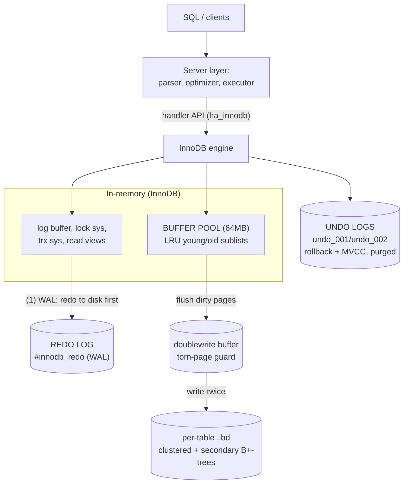

# MySQL / InnoDB Storage Engine: Clustered Storage, Undo+Redo, and MVCC

> An internals analysis of how InnoDB physically stores rows, isolates transactions,
> and survives crashes — and *why* it makes the opposite choices to PostgreSQL on
> almost every axis (clustered vs. heap, in-place-update + undo vs. append-only + VACUUM).
>
> Lab build: `mysqld Ver 9.5.0 for macos15.7 on arm64`, buffer pool 64&nbsp;MB,
> default isolation `REPEATABLE READ`. All numbers in §5 are captured from a live server.

---

## 1. Problem Background

A relational storage engine has to answer four questions at once, and the answers fight each other:

1. **Where do rows physically live?** Layout decides whether a range scan is one sequential
   walk or thousands of random reads.
2. **How do concurrent transactions see consistent data without blocking each other?** This is
   the MVCC (Multi-Version Concurrency Control) problem: a reader and a writer touching the same
   row must not corrupt or stall one another.
3. **How do you roll back a half-finished transaction?** You need the *old* version of every row
   the transaction touched.
4. **How do you survive a crash mid-write?** A power cut between "buffer pool page dirtied" and
   "page written to disk" must not lose committed work or leave torn pages.

InnoDB's answer is a specific, internally consistent bet:

- The table **is** a B+-tree keyed on the primary key (a *clustered index*). The row data lives
  in the leaf. There is no separate heap.
- Updates happen **in place** on the data page. The pre-image of the change is copied into an
  **undo log**, which simultaneously serves (a) rollback and (b) MVCC: old readers reconstruct
  the version they are entitled to see by walking the undo chain.
- A separate **redo log** records the physical *redo* of every page change (write-ahead logging)
  so committed transactions survive a crash even though their dirty pages may not have reached disk.
- A **doublewrite buffer** defends against torn pages.

PostgreSQL makes the opposite bet on nearly every point — append-only heap tuples, no undo, MVCC
via multiple physical row versions, and background `VACUUM` to reclaim dead ones (see
`src/backend/access/heap/heapam.c` and `src/backend/access/heap/vacuumlazy.c`). The rest of this
document explains both halves of that contrast and why each side is internally rational.

---

## 2. Architecture Overview

The buffer pool is the hub: every page is mutated there, and three separate
on-disk subsystems (redo, undo, doublewrite) exist to make those in-memory
mutations durable, reversible, and torn-page-safe. The diagram shows the flow;
the detailed ASCII map and the subsections expand each box.



```text
                         ┌──────────────────────────────────────────────┐
   SQL / clients ───────▶│  Server layer: parser, optimizer, executor    │
                         └───────────────────────┬──────────────────────┘
                                                 │ handler API (ha_innodb)
                         ┌───────────────────────▼──────────────────────┐
                         │                 InnoDB engine                 │
                         │                                               │
   ┌─────────────────────────────────────┐    ┌────────────────────────┐│
   │           BUFFER POOL (64MB)         │    │   IN-MEMORY LOG/CTRL    ││
   │   page cache, LRU young/old sublists │    │  log buffer, lock sys,  ││
   │   dirty pages, flush list            │    │  trx sys, read views    ││
   └───────────────┬─────────────────────┘    └───────┬────────────────┘│
                   │  flush dirty pages                 │ append          │
   ────────────────┼────────────────────────────────────┼───────────────┘
                   │  (1) WAL: redo must hit disk first  │
                   ▼                                     ▼
   ┌──────────────────────┐  ┌─────────────┐  ┌──────────────────────────┐
   │  doublewrite buffer  │  │  REDO LOG    │  │  UNDO LOGS (rollback +   │
   │  #ib_16384_*.dblwr   │  │ #innodb_redo │  │  MVCC) undo_001/undo_002 │
   │  (torn-page guard)   │  │  WAL, 100MB  │  │  history list, purged    │
   └──────────┬───────────┘  └──────────────┘  └──────────────────────────┘
              │ write-twice
              ▼
   ┌─────────────────────────────────────────────────────────────────────┐
   │  PER-TABLE TABLESPACES (.ibd)   each table = a clustered B+-tree      │
   │  books.ibd (27MB)  authors.ibd (114KB)   + secondary-index B+-trees   │
   │  system tablespace ibdata1 (data dictionary, etc.)                    │
   └─────────────────────────────────────────────────────────────────────┘
```

The load-bearing ideas:

- **Buffer pool** is the only place pages are mutated. Disk is never updated directly; it is
  brought up to date by *flushing* dirty pages plus *replaying* redo on recovery.
- **Two logs, two jobs.** Redo makes durability cheap (sequential append now, random page
  writes later). Undo makes rollback and consistent reads possible. They are orthogonal — §3.4
  explains why you genuinely need both.
- **Everything is a B+-tree.** The clustered index *is* the table; secondary indexes are separate
  B+-trees whose leaves point back into the clustered index by PK value.

---

## 3. Internal Design

### 3.1 Clustered index: the table is a B+-tree on the primary key

In InnoDB the primary key is not "an index on top of a table." It **is** the table. Leaf pages of
the PK B+-tree store the *entire row*, ordered by PK. There is no heap, no separate row store.

```text
            CLUSTERED INDEX (PRIMARY)  —  leaves hold full rows, ordered by PK
            ┌──────────────────────────────────────────────────────┐
   root ───▶│  [ . | 4096 | . | 8192 | . ]      (internal: PK -> child)
            └───┬───────────┬───────────┬──────────────────────────┘
                ▼           ▼           ▼
            ┌────────┐  ┌────────┐  ┌────────────────────────────┐
   leaf:    │ id=1   │  │ id=4096│  │ id=4242  title  author_id   │  full row lives here
            │ ...full│  │ ...full│  │ id=4243  title  author_id   │
            └────────┘  └────────┘  └────────────────────────────┘

            SECONDARY INDEX (idx_author)  —  leaf = (author_id, PK)  NO row data
            ┌──────────────────────────┐
   leaf:    │ (author_id=7 ▸ id=4242)  │ ──┐  to get title/year you must
            │ (author_id=7 ▸ id=8810)  │   │  re-descend the CLUSTERED tree
            └──────────────────────────┘ ──┘  ("back-to-clustered" lookup)
```

Consequences, all confirmed in §5:

- **PK lookup is one tree descent** ending on the row itself. EXPLAIN collapses the single-PK
  lookup to `"Rows fetched before execution (rows=1)"` — equivalent to a traditional `const`
  access, with no separate "fetch the row" step.
- **Secondary indexes store the PK as the row pointer**, not a physical address. The lab's
  `INNODB_INDEXES` shows `PRIMARY TYPE=3 N_FIELDS=6` while `idx_author TYPE=0 N_FIELDS=2` and
  `idx_year TYPE=0 N_FIELDS=2`. The clustered index spans far more fields because it carries the
  whole row, whereas a secondary index key is just (indexed column + appended PK). InnoDB also
  threads the hidden `DB_TRX_ID`/`DB_ROLL_PTR` system columns through the clustered record (the
  MVCC machinery of §3.3), though the captured `N_FIELDS=6` is not a clean "PK columns + 2 system
  columns" breakdown — it counts the clustered key fields, which here track the table's user
  columns rather than a `1+2` decomposition. Using the PK as the pointer means a row can move within
  a page (in-place update growing it) without invalidating every secondary index — a deliberate
  contrast with PostgreSQL's physical `ctid`, which is why PG needs HOT updates and index bloat
  management.
- **A non-covering secondary read costs two trees:** descend `idx_author`, get the PK, then
  descend PRIMARY to fetch the row. A **covering** query (all needed columns already in the
  secondary index) skips the second descent entirely. §5 quantifies this: cost `857` vs `401`.

**Trade-off baked in:** range scans on the PK are gloriously sequential (rows are physically
adjacent), inserts in PK order are cheap, but random-PK inserts cause page splits, and *every*
secondary index pays a back-to-clustered lookup. This is the right call for OLTP keyed by PK and a
poor one for wide tables read mostly through secondary keys.

### 3.2 Buffer pool: LRU with a midpoint (young/old) insertion point

The buffer pool caches 16&nbsp;KB pages. A naive LRU is destroyed by one big table scan: the scan
pulls in thousands of pages that will never be touched again, evicting the genuinely hot working
set. InnoDB defends against this with a **midpoint-insertion LRU** split into two sublists:

```text
       MRU end                          midpoint (~5/8)              LRU end
   ┌──────────────── YOUNG (hot) ───────────┬──── OLD (~3/8) ────────────┐
   │  frequently re-accessed pages           │  newly read pages land HERE │
   └─────────────────────────────────────────┴──────────────┬────────────┘
                                                              ▼ evicted first
   A scan's pages enter at the midpoint, stay in OLD, and get evicted
   without ever polluting YOUNG — UNLESS re-accessed after a time window,
   which promotes them to YOUNG ("made young").
```

New pages enter at the **old** sublist head. A page is promoted to **young** only if it is
re-accessed (and, to defeat sequential prefetch artifacts, only after a small dwell time). A
one-shot scan therefore churns through the old sublist and is evicted before it can touch the hot
data in young. §5 shows `Pages made young 97, not young 7434` and `Old database pages 848` —
i.e., of accesses to old-sublist pages, only 97 earned promotion to young versus 7434 that did
not, exactly the scan-resistant behavior the design targets.

PostgreSQL's shared buffers use a clock-sweep (`src/backend/storage/buffer/freelist.c`) with a
similar goal achieved differently; it also issues ring buffers for large sequential scans.

InnoDB also keeps a **change buffer** for non-unique secondary-index maintenance: when a
secondary-index leaf page that needs updating is *not* resident in the pool, the change is
recorded in the change buffer and merged into the page later, when it is read in for another
reason. This converts what would be random secondary-index page reads-then-writes into
sequential, batched work (it surfaces as `Ibuf` in `SHOW ENGINE INNODB STATUS`). It is purely an
I/O optimization — it never changes query results, only *when* the index pages are touched.

### 3.3 Undo logs: rollback **and** MVCC from the same structure

When InnoDB updates a row in place, it first writes the **before-image** of the affected columns
into an undo log record, and stamps the row's hidden `DB_ROLL_PTR` to point at it (and `DB_TRX_ID`
to the writing transaction). This single mechanism does two jobs:

1. **Rollback.** If the transaction aborts, apply the undo records in reverse to restore the old
   values.
2. **MVCC consistent reads.** A reader under REPEATABLE READ takes a **read view** at its first
   read: a snapshot of which transaction IDs are committed. When it meets a row whose `DB_TRX_ID`
   is too new to be visible, it follows `DB_ROLL_PTR` down the undo chain, reconstructing the
   version that *was* committed at snapshot time.

```text
   Clustered leaf row (current, in place)        UNDO LOG (old versions)
   ┌───────────────────────────────────┐         ┌───────────────────────┐
   │ id=42  qty=10  TRX_ID=1577  ROLL ─┼────────▶│ qty=8   TRX_ID=1560 ──┐│
   └───────────────────────────────────┘         │                       ▼│
        ▲ readers with snapshot < 1577 don't      │ qty=5   TRX_ID=1542   ││
        │ see qty=10; they walk the chain         └───────────────────────┘│
        │ until DB_TRX_ID is visible to them ──────────────────────────────┘
```

Old undo records cannot be freed while some open read view might still need them. They sit on the
**history list**. A background **purge thread** reclaims them once no read view can see them.
§5 shows `History list length 39` and `Purge done for trx's n:o < 1574` — the history is short
because the system is nearly idle (`0 read views open`), so purge keeps up.

This is "Oracle-style" rollback-segment MVCC: **one current row + an undo chain of deltas.** The
key property is that *the main data page stays compact* — old versions live elsewhere and are
garbage-collected by purge, not by rewriting the table.

### 3.4 Redo logs: WAL for durability, and why undo is not enough

Redo is a **physical(-logical) write-ahead log**. Before a dirty page is allowed to reach the data
file, the redo describing that change must already be on disk (WAL invariant). On commit with
`innodb_flush_log_at_trx_commit=1` (the lab setting), the redo for the transaction is fsync'd, so
the commit is durable even though its data pages may still be dirty in the buffer pool.

Recovery after a crash is:

```text
   Last checkpoint LSN ───────────────────────▶ current LSN (end of redo)
        │                                              │
        │◀──────── REDO is replayed forward ───────────┤   (redo: make committed
        │          to bring data pages up to date      │    changes durable)
        └─▶ then UNDO rolls back transactions that      ◀── (undo: erase
            were in-flight and never committed              uncommitted changes)
```

**Why both logs are mandatory — they answer different questions:**

| | Undo log | Redo log |
|---|---|---|
| Holds | *old* image (before) | *new* change (after / how to redo) |
| Purpose | rollback + MVCC snapshots | crash durability (WAL) |
| Read by | running txns + recovery's rollback phase | recovery's roll-forward phase |
| Lifetime | until no read view needs it (purge) | until checkpoint advances past it |

Redo alone cannot roll back or give old readers their snapshot (it only knows the *new* state).
Undo alone cannot recover committed-but-unflushed pages after a crash (it only knows *old* state).
A crash can leave the buffer pool in a mixed state — some committed pages flushed, some not; some
uncommitted pages flushed. Recovery **redoes forward** to reinstate every committed change, then
**undoes** every transaction that hadn't committed. You need both directions.

**Checkpoint LSN** is the bound on how far recovery must scan: redo before the last checkpoint is
already reflected on disk and can be recycled. §5 shows the checkpoint LSN *lagging* the current
LSN (`Last checkpoint at 19012320` vs `Log sequence number 43044552`) — the normal, healthy state:
fuzzy checkpointing trickles dirty pages out lazily so writes stay sequential, accepting a longer
recovery window in exchange.

### 3.5 Doublewrite buffer: defending against torn pages

InnoDB pages are 16&nbsp;KB but the OS/disk atomic write unit is typically 4&nbsp;KB. A crash
mid-write can leave a **torn page** — half new, half old — which redo cannot fix, because redo is a
*delta* applied to a known-good base page. The doublewrite buffer fixes this: every page is first
written to a contiguous doublewrite area, fsync'd, then written to its real home location. On
recovery, if a home page is found torn, InnoDB restores it from the intact doublewrite copy and
*then* applies redo. §5 confirms `Innodb_doublewrite=ON` and the two `#ib_16384_*.dblwr` files.
(PostgreSQL solves the same problem differently: `full_page_writes` logs the entire page image into
WAL the first time it is touched after a checkpoint — a logically equivalent trade made in the log
instead of a side file.)

### 3.6 Locking: row locks, gap locks, next-key locks

InnoDB locks **index records**, not rows in the abstract. Under REPEATABLE READ it uses
**next-key locks** = a lock on the index record **plus** the gap before it, to stop *phantoms*
(new rows appearing in a range a transaction has already read).

```text
   Index order:  ... 99 | (gap) 100 | (gap) 101 | (gap) ... 105 | (gap) 106 ...
                            │           └────────── next-key (record+gap) ────────┘
   SELECT ... WHERE id BETWEEN 100 AND 105 FOR UPDATE:
     - record-only X lock (REC_NOT_GAP) on 100  (range's lower boundary)
     - next-key X locks on 101,102,103,104,105  (record + preceding gap)
   ⇒ nobody can INSERT id=102 (or any value in those gaps) until commit ⇒ no phantoms
```

This exact pattern is captured in §5 from `performance_schema.data_locks`. Note also the
table-level **IX (intention-exclusive)** lock: intention locks are how InnoDB lets row locks and
the rare table lock coexist without scanning every row lock to check compatibility.

### 3.7 Isolation levels

InnoDB supports all four SQL levels; the lab runs the InnoDB default, **REPEATABLE READ**:

- **READ UNCOMMITTED** — reads latest values, ignores read views (dirty reads).
- **READ COMMITTED** — a *fresh* read view per statement; sees each statement's committed world,
  and uses semi-consistent reads with mostly record-only locks (fewer gap locks).
- **REPEATABLE READ (default)** — *one* read view for the whole transaction (snapshot stability)
  **plus** next-key locking, which together kill non-repeatable reads and phantoms. Notably,
  InnoDB's RR is stronger than the SQL standard's RR precisely because of gap locks.
- **SERIALIZABLE** — RR plus, when autocommit is off, plain `SELECT`s are implicitly promoted to
  `SELECT ... FOR SHARE`, so reads take shared next-key locks. Read/write and even read/read
  scheduling is then forced into a serial order, at the cost of much heavier locking.

---

## 4. Design Trade-Offs

### 4.1 InnoDB (in-place + undo) vs. PostgreSQL (append-only + VACUUM)

| Dimension | InnoDB | PostgreSQL |
|---|---|---|
| Table storage | Clustered B+-tree on PK; row in leaf | Unordered heap; tuples wherever they fit |
| Update | In place; old image → undo log | Write a whole **new** tuple, mark old dead |
| Old versions live | In undo logs (separate), purged | In the heap itself, reclaimed by VACUUM |
| MVCC source | Undo chain (reconstruct old version) | Multiple physical heap tuples + visibility map |
| Secondary index ptr | PK value (logical) | `ctid` physical location |
| GC mechanism | Purge thread (history list) | autovacuum (`vacuumlazy.c`) |
| Index after update | Untouched if PK unchanged | New tuple ⇒ new index entries (mitigated by HOT) |
| Bloat risk | Undo growth under long-open read views | Heap + index bloat; needs VACUUM tuning |

**Why PostgreSQL chose append-only.** No undo means simpler, faster rollback (just don't make the
new tuple visible) and no risk of an "undo too large" stall; writers never block on undo
contention. The price is dead-tuple accumulation: the table grows with old versions until VACUUM
removes them, every update touches every index (unless HOT applies), and a long-running
transaction can hold back the *global* xmin and prevent cleanup. PostgreSQL's MVCC implementation
lives around `src/backend/access/heap/` (tuple visibility, `HeapTupleSatisfiesMVCC`) and
`src/backend/access/transam/` (xid/snapshots); the absence of a clustered index is in
`src/backend/access/heap/heapam.c` (the heap AM) and the index AMs under `src/backend/access/nbtree/`.

**Why InnoDB chose in-place + undo.** Keeping the live row in place keeps the clustered tree
compact and sequential reads fast; the heap never bloats because old versions go to undo and are
purged. The price is the undo machinery and history list, contention on rollback segments under
heavy update load, and the symmetric failure mode: a long-open read view stops purge, the history
list grows without bound, and reads that must walk long undo chains slow down. (Note §5's
`History list length 39` — trivial here precisely because no read view is held open.)

Neither is universally "better." InnoDB optimizes for compact, PK-clustered OLTP with cheap range
scans; PostgreSQL optimizes for write-path simplicity, extensibility, and decoupling readers from
writers, accepting the VACUUM tax.

### 4.2 Clustered index: advantages and the bill

**Advantages.** PK point lookups and PK range scans are minimal-I/O (one descent; physically
adjacent rows). No separate heap fetch for PK access. Secondary indexes survive in-place row
movement because they reference the logical PK.

**The bill.** (1) Choose a **monotonic, narrow** PK — every secondary index leaf stores a *copy*
of the PK, so a fat PK (e.g. a UUID/string) bloats every index and slows every back-to-clustered
lookup. (2) Random-PK inserts cause page splits and write amplification. (3) Secondary-key-heavy
read patterns pay double descents unless you build covering indexes. The covering-index win is real
and measurable (§5: 857 → 401).

### 4.3 Two logs: the cost of the durability/concurrency split

Maintaining undo **and** redo doubles the logging machinery and the write amplification per update
(before-image to undo, after-image to redo, the page itself eventually, and doublewrite). The
payoff is decisive: commits are a sequential fsync of redo (not random data-file writes), readers
never block writers and vice-versa, and crash recovery is a deterministic redo-forward /
undo-back procedure. The accepted cost is recovery time proportional to the checkpoint lag and
extra steady-state write volume.

---

## 5. Experiments / Observations

All output below was **captured on this machine** (not copied from docs) from the live lab server
(`mysqld 9.5.0`, buffer pool 64&nbsp;MB, REPEATABLE READ) by the harness
`../_experiments/run_mysql.sh` → `../_experiments/mysql_experiments.txt`. The live two-session
locking demo (§5.7) and the primary-key-width measurement (§5.8) come from
`../_experiments/innodb_locking_demo.sql` → `innodb_locking_demo.txt`.

### 5.1 Clustered vs. secondary vs. covering access

```text
-- EXP1: PK lookup (WHERE id = 4242)
EXPLAIN
-> Rows fetched before execution  (cost=0..0 rows=1)

-- EXP2: secondary lookup (WHERE author_id = 7 LIMIT 5)
-> Limit: 5 row(s)  (cost=857 rows=5)
    -> Index lookup on books using idx_author (author_id = 7)  (cost=857 rows=4000)

-- EXP2b: COVERING (SELECT author_id WHERE author_id = 7)
-> Covering index lookup on books using idx_author (author_id = 7)  (cost=401 rows=4000)
```

**Interpretation.** EXP1 collapses to *"Rows fetched before execution (rows=1)"* — a `const`
access: a single clustered B+-tree descent lands directly on the full row, no second fetch. EXP2
is `Index lookup ... cost=857` because each of the matched secondary entries forces a
back-to-clustered descent to fetch non-indexed columns. EXP2b drops to `cost=401` *and* changes
to **"Covering index lookup"**: every needed column already lives in `idx_author`, so the
expensive second descent is eliminated. The ~2× cost gap is the price of leaving the secondary
index — direct evidence for §3.1.

### 5.2 Storage geometry — the table really is its indexes

```text
page_bytes  row_format          INNODB_INDEXES (lab/books):
16384       dynamic             tbl         idx          TYPE  N_FIELDS
                                lab/books   PRIMARY      3     6     <- clustered
TABLE_ROWS  DATA_LENGTH  INDEX_LENGTH       lab/books   idx_author   0     2
199467      9977856      9469952            lab/books   idx_year     0     2

on disk:  books.ibd = 27262976 (~27MB)   authors.ibd = 114688   ibdata1 = 12582912
          undo_001 = undo_002 = 16777216 (16MB each)
          #ib_16384_0.dblwr / #ib_16384_1.dblwr     redo in #innodb_redo/
```

**Interpretation.** `PRIMARY TYPE=3` is the clustered index; `idx_author`/`idx_year TYPE=0` are
secondaries. `DATA_LENGTH` (9.98&nbsp;MB, the clustered tree = the rows) and `INDEX_LENGTH`
(9.47&nbsp;MB, the secondary trees) are *comparable* — the secondary indexes are nearly as big as
the data because each leaf carries the indexed column plus the appended PK. On disk this is one
~27&nbsp;MB `books.ibd` per-table tablespace. The presence of `undo_001`/`undo_002`,
`*.dblwr`, and `#innodb_redo/` as *separate* files is the physical embodiment of §3.3–3.5: undo,
doublewrite, and redo are distinct subsystems.

### 5.3 Buffer pool — hit ratio and scan-resistant LRU

```text
-- status variables (EXP4):
Innodb_buffer_pool_pages_total    4096
Innodb_buffer_pool_pages_data     2352
Innodb_buffer_pool_pages_dirty    1554
Innodb_buffer_pool_read_requests  1446760
Innodb_buffer_pool_reads          911      -> hit rate = 1 - 911/1446760 ≈ 99.937%

-- SHOW ENGINE INNODB STATUS, BUFFER POOL section (EXP7):
Database pages     2354
Old database pages 848
Modified db pages  1561
Pages made young 97, not young 7434
Buffer pool hit rate 1000 / 1000
```

**Interpretation.** Only `911` of `1,446,760` logical reads missed cache — a ~99.94% hit ratio;
the working set fits comfortably in the 4096-page pool. The LRU split is visible:
`Old database pages 848` out of ~2354 is the old (~3/8) sublist. `Pages made young 97, not young
7434` is the headline number — and note these counters track **only accesses to old-sublist
pages** (made-young vs not-made-young), not all 1.45M logical reads: of those old-sublist
accesses, only 97 earned promotion to young versus 7434 that did not — exactly the
midpoint-insertion behavior from §3.2 that keeps scan pages from polluting the hot set. (The two snapshots differ slightly — 2352 vs 2354
data pages, 1554 vs 1561 dirty — because they were sampled moments apart on a live server.)

### 5.4 Redo log, checkpoint LSN, doublewrite

```text
innodb_redo_log_capacity        104857600   (100MB)
innodb_flush_log_at_trx_commit  1           (fsync redo on every commit)
innodb_doublewrite              ON

LOG section:
Log sequence number          43044552      <- current LSN (head of redo)
Log flushed up to            42926301
Last checkpoint at           19012320      <- checkpoint LSN lags current LSN
```

**Interpretation.** `flush_log_at_trx_commit=1` makes each commit a durable redo fsync — the WAL
guarantee from §3.4. The current LSN (`43044552`) is far ahead of the checkpoint LSN
(`19012320`): roughly 24&nbsp;MB (≈23&nbsp;MiB) of redo describes changes whose dirty pages are
not yet checkpointed to the data files. (MB throughout this document means 10^6 bytes.) That gap is *intentional* fuzzy checkpointing — it batches and
sequentializes page writes — and it is exactly the span recovery would have to replay forward
after a crash. `Innodb_doublewrite=ON` confirms torn-page protection is active.

### 5.5 Undo / MVCC — history list and read views

```text
TRANSACTIONS section:
Trx id counter 1579
Purge done for trx's n:o < 1574 undo n:o < 0 state: running but idle
History list length 39
...
0 read views open inside InnoDB
```

**Interpretation.** `History list length 39` is the count of old row versions still retained in
undo for potential MVCC reads. The same status dump reports user-level `updated 0, deleted 0`
while system rows show `updated 368, deleted 168`, so the 39 retained versions here stem from
internal/system transactions, not user UPDATE/DELETE traffic; the mechanism is identical, and
under user update load this number tracks un-purged old row versions. It is small because
`0 read views open` — no snapshot is pinning old versions, so the purge thread
(`Purge done for trx's n:o < 1574`) reclaims them promptly. This
is the §3.3 mechanism in action and the InnoDB analog of PostgreSQL's dead-tuple/VACUUM problem:
the danger is a long-open read view that freezes purge and lets the history list (and undo
tablespaces `undo_001`/`undo_002`) grow unbounded.

### 5.6 Row, gap, and next-key locks under REPEATABLE READ

```text
-- SELECT id FROM books WHERE id BETWEEN 100 AND 105 FOR UPDATE;
-- performance_schema.data_locks:
ENGINE  OBJECT_NAME  INDEX_NAME  LOCK_TYPE  LOCK_MODE        LOCK_DATA
INNODB  books        NULL        TABLE      IX               NULL
INNODB  books        PRIMARY     RECORD     X                101
INNODB  books        PRIMARY     RECORD     X                102
INNODB  books        PRIMARY     RECORD     X                103
INNODB  books        PRIMARY     RECORD     X                104
INNODB  books        PRIMARY     RECORD     X                105
INNODB  books        PRIMARY     RECORD     X,REC_NOT_GAP    100
```

**Interpretation.** Three lock kinds appear together. The table-level **IX** is the intention lock
(§3.6). On the PK index, records `101–105` get plain `X` locks — these are **next-key** locks
(record + the gap before it). Record `100`, the range's lower bound, gets `X,REC_NOT_GAP` — a
record-only lock with no gap, because no gap *below* 100 is part of the predicate. The net effect:
no other transaction can insert any id into the `(100,105]` range until commit, so a re-run of the
range query returns the same rows — **phantoms prevented**, which is what makes InnoDB's RR
stronger than the SQL-standard RR.

### 5.7 Gap locks *actually block* — a live two-session demo

§5.6 proves the locks *exist*; this companion demo (`../_experiments/innodb_locking_demo.sql`,
two concurrent sessions) proves they *block*. We first `DELETE id=1500` to open a real gap inside
the range, then session 1 holds `SELECT ... WHERE id BETWEEN 1000 AND 2000 FOR UPDATE` open:

```text
Session 1 (held open, REPEATABLE READ):
    SELECT id FROM orders_seq WHERE id BETWEEN 1000 AND 2000 FOR UPDATE;
    -- data_locks: TABLE IX ×1, RECORD X ×1003 (next-key), X,REC_NOT_GAP ×1, X,GAP ×1

Session 2, INSERT into the LOCKED gap (innodb_lock_wait_timeout = 2s):
    INSERT INTO orders_seq (id, ...) VALUES (1500, ...);
    => ERROR 1205 (HY000): Lock wait timeout exceeded   (blocked ~2.06s)

Session 2, INSERT OUTSIDE the locked range:
    INSERT INTO orders_seq (id, ...) VALUES (50000, ...);
    => succeeds immediately

After session 1 COMMIT, retry INSERT id=1500:  => succeeds
```

**Interpretation.** The gap lock over the now-empty `id=1500` slot is not bookkeeping — it
**physically stalls** a conflicting `INSERT` for the full 2s timeout and then returns
`ERROR 1205`, while an `INSERT` at `id=50000` (outside the range) proceeds instantly. That is the
phantom-prevention guarantee of §5.6 demonstrated dynamically: the range a transaction has read is
frozen against insertion until it commits, but unrelated keys are untouched, so concurrency is
preserved everywhere except the exact range under contention.

### 5.8 Primary-key width and the UUID-v1 myth

Because every secondary-index entry carries a copy of the PK (§3.1), PK *width* taxes every
secondary index. The lab loads the same 10,000 rows twice — once with a sequential integer PK,
once re-keyed by a `CHAR(36)` UUID:

```text
 Name        | Rows  | Data_length | Index_length   (bytes)
-------------+-------+-------------+--------------
 orders_seq  |  9773 |   1,589,248 |      753,664   (TWO secondary indexes)
 orders_uuid | 10098 |   1,589,248 |    1,589,248   (ONE secondary index)
```

**Interpretation — two distinct effects, often conflated.** (1) **Key-width bloat is real:** the
UUID table's *single* secondary index (1,589,248 B) is more than **2×** the sequential table's
*two* secondary indexes combined (753,664 B), purely because the wide UUID PK is duplicated into
every secondary entry — the clearest possible evidence that "the PK *is* the table layout." (2)
**But the famous "random-UUID scatter" penalty does _not_ apply here:** MySQL's `UUID()` returns
**version-1, time-ordered** UUIDs (the leading time field increments monotonically:
`15deed7e… → 15e6bc34…`), so a PK range scan returns a *contiguous* block (1001 rows in 0.185 ms),
exactly like the integer table. The clustered-index scatter and page-split cost that "UUID PK"
is infamous for requires **random v4** UUIDs — which this experiment deliberately does not use.
The takeaway: a UUID PK always pays the key-*width* cost on every index; it pays the *scatter*
cost only if the UUIDs are random, not time-ordered.

---

## 6. Key Learnings

1. **The table is a B+-tree on the PK.** This single decision explains InnoDB's strengths
   (sequential PK scans, cheap point lookups, in-place updates that don't disturb secondary
   indexes) and its constraints (pick a narrow monotonic PK; covering indexes matter). The
   experiments show it directly: `const` PK access, and the 857→401 covering-index cost drop.
2. **One structure (undo) serves two purposes.** The before-image enables both rollback and MVCC
   snapshot reads. Old versions live *outside* the data page and are garbage-collected by the
   purge thread via the history list — the inverse of PostgreSQL keeping dead tuples *in* the heap
   for VACUUM.
3. **Undo and redo are non-redundant.** Undo holds the old state (for rollback + readers); redo
   holds the change (for crash durability via WAL). Recovery redoes committed work forward, then
   undoes uncommitted work back. Removing either breaks a guarantee.
4. **The buffer pool's midpoint LRU is a concurrency/eviction policy, not just a cache.** The
   young/old split is specifically engineered so a single large scan cannot evict the hot working
   set — visible as 97 promotions vs. 7434 non-promotions.
5. **Locks are on index records, and gap/next-key locks are how RR beats phantoms.** The captured
   `data_locks` rows make the IX + next-key + REC_NOT_GAP pattern concrete.
6. **InnoDB vs. PostgreSQL is a coherent pair of opposite bets.** In-place + undo + clustered +
   purge (InnoDB) vs. append-only + tuple-versioning + heap + VACUUM (PostgreSQL). Each accepts a
   different bloat/GC failure mode (long read view stalls purge ↔ long transaction stalls vacuum)
   and optimizes a different path (compact clustered reads ↔ simple non-blocking writes).

---

## References

- [MySQL 8.0/9.x Reference Manual — InnoDB Storage Engine](https://dev.mysql.com/doc/refman/8.0/en/innodb-storage-engine.html)
- [InnoDB Clustered and Secondary Indexes](https://dev.mysql.com/doc/refman/8.0/en/innodb-index-types.html)
- [InnoDB Buffer Pool and the LRU midpoint insertion strategy](https://dev.mysql.com/doc/refman/8.0/en/innodb-buffer-pool.html)
- [InnoDB Undo Logs and Multi-Versioning (MVCC)](https://dev.mysql.com/doc/refman/8.0/en/innodb-multi-versioning.html)
- [InnoDB Redo Log and Checkpointing](https://dev.mysql.com/doc/refman/8.0/en/innodb-redo-log.html)
- [InnoDB Doublewrite Buffer](https://dev.mysql.com/doc/refman/8.0/en/innodb-doublewrite-buffer.html)
- [InnoDB Locking — record, gap, and next-key locks](https://dev.mysql.com/doc/refman/8.0/en/innodb-locking.html)
- [InnoDB Transaction Isolation Levels](https://dev.mysql.com/doc/refman/8.0/en/innodb-transaction-isolation-levels.html)
- [PostgreSQL: Concurrency Control / MVCC](https://www.postgresql.org/docs/current/mvcc.html)
- [PostgreSQL: Routine Vacuuming](https://www.postgresql.org/docs/current/routine-vacuuming.html)
- PostgreSQL source tree (heap AM, MVCC, buffers, btree): `src/backend/access/heap/heapam.c`, `src/backend/access/heap/vacuumlazy.c`, `src/backend/access/transam/`, `src/backend/storage/buffer/freelist.c`, `src/backend/access/nbtree/`
- C. Mohan et al., *ARIES: A Transaction Recovery Method Supporting Fine-Granularity Locking and Partial Rollbacks Using Write-Ahead Logging*, ACM TODS, 1992 (the WAL/redo-undo recovery model InnoDB follows).
