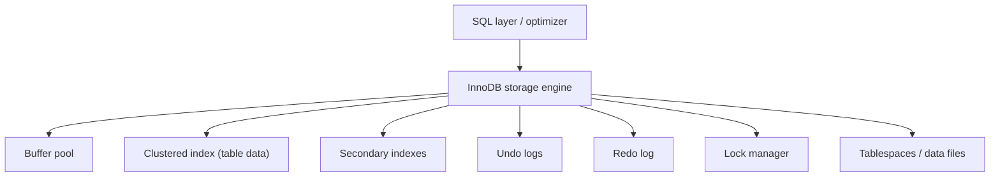

# MySQL / InnoDB Storage Engine

## 1. Problem Background

InnoDB is MySQL’s default transactional storage engine. It exists to support OLTP-style workloads where applications need:

- ACID transactions
- row-level concurrency
- crash recovery
- efficient primary-key lookups
- practical performance for mixed read/write workloads

Historically, MySQL needed a storage engine that went beyond older non-transactional designs such as MyISAM. InnoDB filled that gap by combining B-Tree indexes, a buffer pool, redo logging, undo logging, and MVCC-based consistent reads.

## 2. Architecture Overview

### Main system components

- Clustered primary-key storage
- Secondary indexes
- Buffer pool
- Undo logs
- Redo log
- Row-level and gap locking
- MVCC and read views

## 3. Internal Design

### 3.1 Clustered indexes

In InnoDB, the table is physically organized around the clustered index. In most cases, the primary key is the clustered index, and the full row is stored with that B-Tree.

This is different from PostgreSQL’s heap-based design.

Implications:

- primary-key lookups are very efficient
- rows with nearby primary keys tend to have good locality
- secondary indexes store the primary key value, so reaching the row often means “secondary index lookup + clustered index lookup”

### 3.2 Secondary indexes

Secondary indexes do not store the full row. Instead, they point logically to the clustered key. This keeps secondary indexes smaller, but can make non-covering lookups more expensive.

### 3.3 Buffer pool

The InnoDB buffer pool caches data and index pages in memory. This is the central in-memory performance structure of the engine. Good buffer-pool behavior reduces physical I/O and is a major reason repeated reads become fast.

### 3.4 Undo logs

Undo logs support:

- rollback
- consistent reads for MVCC
- reconstruction of older row versions

InnoDB updates clustered records in place, but keeps enough undo information to let readers see earlier committed versions.

### 3.5 Redo log

Redo logging provides crash recovery. If the server crashes after some page modifications but before all dirty pages reach disk, the redo log can replay committed changes.

So InnoDB needs both:

- undo logs for logical rollback / old-version reconstruction
- redo logs for physical durability / crash recovery

### 3.6 Row-level locking and gap locks

InnoDB supports row-level locking and uses next-key locking/gap locking under some isolation-level behaviors to prevent anomalies such as phantoms.

This makes InnoDB a stronger concurrent engine than simple table-locking designs, but it also introduces complexity in lock behavior.

### 3.7 Comparison with PostgreSQL

PostgreSQL and InnoDB solve MVCC differently:

| Topic | PostgreSQL | InnoDB |
| --- | --- | --- |
| Base storage | Heap | Clustered index |
| Update style | New tuple version | In-place clustered record update |
| Old version access | Tuple versions in heap | Undo log reconstruction |
| Cleanup pressure | VACUUM | Undo purge / history cleanup |

Neither design is universally better. PostgreSQL makes versioning more explicit in heap storage, while InnoDB keeps base-row locality strong through clustered storage.

## 4. Design Trade-Offs

### Advantages

- Fast primary-key lookups because rows live in the clustered index
- Transactional durability via redo logging
- MVCC and rollback support via undo logs
- Practical row-level concurrency

### Limitations

- Secondary-index lookups can require an extra hop through the clustered key
- Locking behavior can become subtle because of gap locks and next-key locks
- Clustered storage makes primary-key choice more important than in heap-based engines

### Engineering decisions

InnoDB is optimized for transactional server workloads where:

- primary key access is common
- durability matters
- multiple users need concurrent access

Its design clearly prefers operationally practical OLTP performance over a simpler storage model.

## 5. Experiments / Observations

I ran a local MySQL 8.4 / InnoDB workload in Ubuntu (WSL) using `customers`, `orders`, and `order_items` tables.

### 5.1 Execution-plan behavior

For a 3-table join with filtering, aggregation, and ordering, `EXPLAIN ANALYZE` produced:

- table scan on `customers`
- index lookup on `orders` using `idx_orders_customer`
- index lookup on `order_items` using `idx_order_items_order`
- temporary table for aggregation
- final sort with limit

Observed runtime:

- about `256 ms`

Interpretation:

- InnoDB benefited from indexed nested-loop joins
- the optimizer chose to enter `orders` through `customer_id`, then filter on `status` and `created_at`
- this fits a clustered-index world where PK/secondary access paths matter heavily

### 5.2 Index structure observations

From `information_schema.statistics` for `orders`:

- `PRIMARY(order_id)`
- `idx_orders_customer(customer_id)`
- `idx_orders_status_date(status, created_at)`

From `information_schema.innodb_indexes` for `orders`:

- `PRIMARY` had `TYPE = 3`
- secondary indexes had `TYPE = 0`

Interpretation:

- the primary index is treated specially because it is the clustered storage structure
- secondary indexes are separate access paths, not the main row store

### 5.3 Tablespace / row-format observations

From `information_schema.innodb_tables`:

- `customers`, `orders`, and `order_items` all reported `ROW_FORMAT = Dynamic`

Interpretation:

- modern InnoDB defaults are tuned for flexible row storage rather than older rigid layouts

### 5.4 Isolation and durability settings

Observed values:

- `transaction_isolation = REPEATABLE-READ`
- `innodb_flush_log_at_trx_commit = 1`
- `innodb_redo_log_capacity = 104857600`

Interpretation:

- the default isolation level is built for consistent snapshots with InnoDB locking semantics
- `innodb_flush_log_at_trx_commit = 1` shows durability-first behavior: committed transactions force redo-log flush discipline

### 5.5 InnoDB monitor observations

After loading data and updating 5,000 rows, `SHOW ENGINE INNODB STATUS` showed:

- `History list length 27`
- `Buffer pool size 8191`
- `Buffer pool hit rate 1000 / 1000`
- `Number of rows inserted 155000, updated 5000`
- redo log details including:
  - `Log capacity 104857600`
  - `Log sequence number 42499967`
  - `Log flushed up to 42499831`

Interpretation:

- history list length reflects MVCC/undo cleanup pressure
- the redo subsystem is clearly active during write-heavy work
- the buffer pool was effectively caching this workload

### 5.6 What these observations mean

- Clustered storage improves locality for PK-oriented access.
- Secondary indexes are efficient, but non-covering lookups still depend on clustered-row access.
- Undo and redo are not redundant; they solve different problems.
- InnoDB’s concurrency model is powerful, but more complicated than a simple overwrite-only engine.

## 6. Key Learnings

The most important idea in InnoDB is that the table is the clustered index.

That single decision influences:

- lookup performance
- storage locality
- how secondary indexes work
- how MVCC is implemented

The second big lesson is why InnoDB needs both undo and redo:

- undo is for reconstructing old versions and rolling back
- redo is for recovering committed changes after crashes

Compared with PostgreSQL:

- InnoDB gets strong row locality through clustered storage
- PostgreSQL gets cleaner separation between heap storage and indexes
- PostgreSQL pays for MVCC with VACUUM
- InnoDB pays for MVCC with undo maintenance and more complex lock/version interactions

So InnoDB’s design is best understood as a transactional B-Tree engine optimized for practical OLTP performance under MySQL.

## References

- [InnoDB storage engine overview](https://dev.mysql.com/doc/refman/8.4/en/innodb-storage-engine.html)
- [Clustered and secondary indexes](https://dev.mysql.com/doc/refman/8.4/en/innodb-index-types.html)
- [InnoDB multi-versioning](https://dev.mysql.com/doc/refman/8.4/en/innodb-multi-versioning.html)
- [InnoDB in-memory structures](https://dev.mysql.com/doc/refman/8.4/en/innodb-in-memory-structures.html)
- [InnoDB locks set by SQL statements](https://dev.mysql.com/doc/refman/8.4/en/innodb-locks-set.html)
- [InnoDB transaction isolation levels](https://dev.mysql.com/doc/refman/8.4/en/innodb-transaction-isolation-levels.html)
