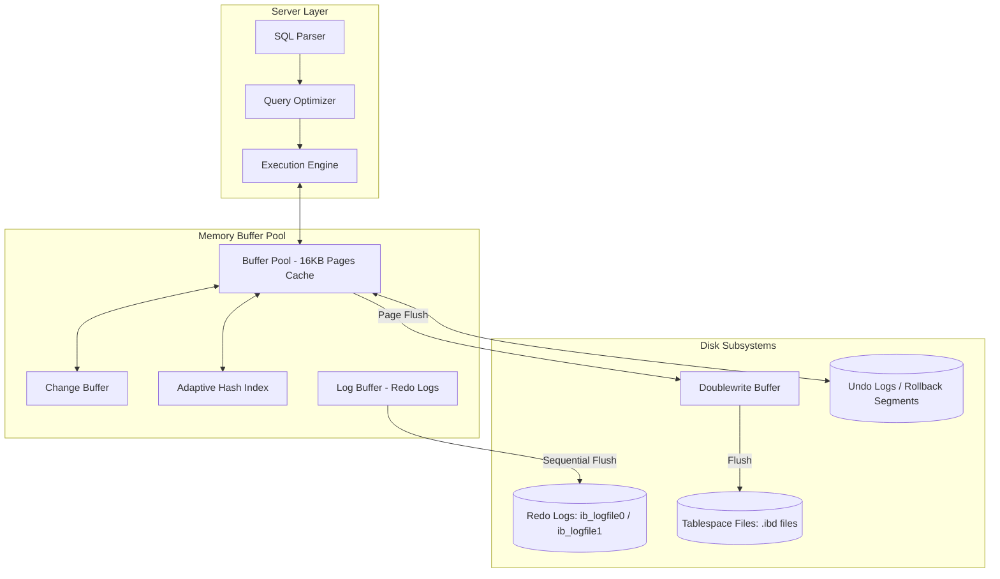

# Topic 3: MySQL / InnoDB Storage Engine

This document provides an in-depth system design analysis of the **MySQL InnoDB storage engine**. It covers the memory and disk architectures, transaction logging models, clustered indexing structures, locking mechanisms, and provides a comparison with PostgreSQL's storage engine.

---

## 1. Problem Background

### Why InnoDB Exists
In its early days, MySQL relied on the **MyISAM** storage engine. While MyISAM was simple and fast for read-heavy workloads, it had severe limitations:
1.  **Table-level Locking**: Any write operation blocked the entire table, making it unusable for high-write, multi-user web applications.
2.  **No ACID Compliance**: It lacked transactional support (`COMMIT` / `ROLLBACK`).
3.  **No Crash Recovery**: A power failure or crash could easily corrupt table files, requiring slow repair operations.

**InnoDB** was designed to solve these problems by introducing a modern, transaction-safe, ACID-compliant storage engine with row-level locking, MVCC, and robust crash recovery.

---

## 2. Architecture Overview

InnoDB uses a highly optimized memory buffer pool and a set of sequential log files on disk to balance transaction safety with high throughput.

### High-Level InnoDB Architecture Diagram



### Main System Components

1.  **Buffer Pool**: Caches data and index pages in memory.
2.  **Change Buffer**: A cache for secondary index inserts/updates when the index page is not in the buffer pool, delaying merge writes until the page is read.
3.  **Adaptive Hash Index (AHI)**: Automatically builds hash indexes in memory over frequently accessed B-Tree pages.
4.  **Log Buffer**: Caches redo log records before flushing them to disk.
5.  **Redo Log**: A circular ring buffer on disk that records page modifications for crash recovery.
6.  **Undo Log**: Stores the previous values of modified records to support rollbacks and MVCC reads.
7.  **Doublewrite Buffer**: A safe-writing area on disk where InnoDB writes dirty pages *before* writing them to the actual tablespace files, preventing corruption from partial page writes.

---

## 3. Internal Design

### Clustered Indexes (Primary Key Storage)

In InnoDB, table storage is organized around the primary key, acting as a **Clustered Index**:
*   The data rows are stored directly in the leaf pages of the primary key B+Tree.
*   **Leaf Node Layout**: The key is the primary key; the payload consists of the remaining columns of the row, plus internal system columns:
    *   `DB_TRX_ID` (6 bytes): The transaction ID of the last transaction that modified the row.
    *   `DB_ROLL_PTR` (7 bytes): A rollback pointer pointing to the undo log record containing the row's previous state.
    *   `DB_ROW_ID` (6 bytes): An autogenerated row ID if no primary key is specified.

```
       Clustered Index B+Tree (Primary Key)
               [Root / Internal Nodes]
                        |
                        v
               +-----------------------------+
               | Leaf Page 1:                |
               | [PK: 1] -> [Data Columns...] |
               | [PK: 2] -> [Data Columns...] |
               +-----------------------------+
```

### Secondary Indexes

Any index other than the primary key is a **Secondary Index**:
*   The leaf nodes of secondary indexes do not store physical offsets. Instead, they store the **Primary Key value** corresponding to the index key.
*   **The "Double Seek" Behavior**:
    1.  A query searches the secondary index B+Tree using the indexed column value.
    2.  It locates the secondary index leaf node and retrieves the primary key value.
    3.  It then performs a secondary lookup on the Clustered Index B+Tree to retrieve the full row data.
    *   *Exception*: If the query only requests columns that are part of the secondary index, it is satisfied immediately without the second lookup (a *Covering Index* query).

---

### Buffer Pool Memory Management

The Buffer Pool is divided into 16 KB pages. It uses a modified **LRU (Least Recently Used)** replacement algorithm to manage page evictions:
*   The LRU list is split into two sublists:
    *   **Young Sublist** (New Pages - Default 5/8 of the pool): Stores recently accessed pages.
    *   **Old Sublist** (Old Pages - Default 3/8 of the pool): Stores older pages that may be evicted.
*   **Preventing Scan Pollution**: When a table scan occurs (e.g. `SELECT *`), many pages are read. In a standard LRU cache, these pages would evict the entire cache.
    *   InnoDB reads new scan pages into the *head of the Old Sublist*.
    *   If a page in the old sublist is accessed again *after* a configurable time delay (`innodb_old_blocks_time`, default 1000ms), it is promoted to the Young Sublist. If not accessed again, it remains in the old sublist and is quickly evicted.

```
Buffer Pool LRU List:
 [Head] <------------------- Young Sublist (5/8) -------------------> [Split Point] <--- Old Sublist (3/8) ---> [Tail (Eviction)]
```

---

### Undo Logs and MVCC (In-Place Updates)

Unlike PostgreSQL (which appends new versions to the heap), InnoDB updates rows **in-place**:
1.  When an `UPDATE` command runs, InnoDB writes the old state of the modified fields to the **Undo Log**.
2.  The row on the clustered index page is updated directly (in-place).
3.  The row header's `DB_ROLL_PTR` is set to point to the location of the newly written undo log record.
4.  **Transaction Rolldown (MVCC)**:
    *   When another transaction reads the row, it checks the row's `DB_TRX_ID`.
    *   If that transaction is not visible to the current transaction's read snapshot, InnoDB follows the `DB_ROLL_PTR` to rebuild the visible row version from the Undo Log records.
5.  **Purging**: When the oldest active transaction completes and no snapshots require these old row versions, a background **Purge Thread** deletes the obsolete undo logs.

```
       Clustered Index Page Row                     Undo Log Records
   +---------------------------------+        +---------------------------------+
   | Row: ID=5, Name='New', RollPtr --------->| Undo Log 1: Name='Old', RollPtr ----+
   +---------------------------------+        +---------------------------------+   |
                                                                                    v
                                              +---------------------------------+
                                              | Undo Log 2: Name='Initial' ... |
                                              +---------------------------------+
```

---

### Redo Logs and Doublewrite Buffer

#### Write-Ahead Redo Logging
*   When a transaction modifies a page, the change is written to the Log Buffer.
*   Upon `COMMIT`, the Log Buffer is flushed sequentially to the Redo Log files (`ib_logfile0`, `ib_logfile1`) on disk.
*   Because the redo write is sequential, it is much faster than updating the random 16 KB data blocks on disk.
*   During crash recovery, InnoDB reads the redo log and reapplies modifications to pages that were not flushed to disk before the crash.

#### Doublewrite Buffer
*   **The Problem (Torn Pages)**: The OS page size is typically 4 KB, but InnoDB pages are 16 KB. If a crash occurs while InnoDB is writing a 16 KB page to disk, the page may be written partially (e.g. only 8 KB written), corrupting the block. Redo logs cannot recover a physically corrupted page because they assume the block layout is intact.
*   **The Solution**:
    1.  Before flushing dirty pages directly to their tablespace files, InnoDB writes them to a contiguous, sequential disk segment called the **Doublewrite Buffer** and issues an `fsync`.
    2.  Only after the doublewrite sync completes does InnoDB write the page to the final `.ibd` tablespace file.
    3.  If a crash occurs during the final write, InnoDB recovers the uncorrupted 16 KB page from the Doublewrite Buffer, restores it, and then applies the redo logs.

---

### Locking and Concurrency Control

InnoDB uses row-level locking. To prevent phantom reads under the `REPEATABLE READ` isolation level (the default), it combines different lock types:

1.  **Record Locks**: Locks a specific index record (e.g., locking row `id = 5`).
2.  **Gap Locks**: Locks the empty gap between index records (or before the first or after the last index record). It prevents other transactions from inserting values into the gap, eliminating **Phantom Reads** (where a query yields new rows if run twice).
3.  **Next-Key Locks**: A combination of a Record Lock on the index record and a Gap Lock on the gap preceding the record.

#### Isolation Levels Supported
*   **Read Uncommitted**: Reads values without locking or checking visibility (dirty reads).
*   **Read Committed**: Uses snapshots; every SELECT statement generates a new read view. No gap locking (allows phantom reads).
*   **Repeatable Read** (Default): Uses a single snapshot generated at the first read. Next-key locks are used to prevent phantom reads.
*   **Serializable**: Implicitly converts all plain `SELECT` queries to `SELECT ... FOR SHARE`, locking all read records.

---

## 4. Design Trade-Offs & Key Comparison

InnoDB's architectural choices represent a major contrast to PostgreSQL:

| Feature | MySQL / InnoDB | PostgreSQL |
| :--- | :--- | :--- |
| **MVCC Model** | **In-place updates + Undo Logs**: Older versions are rebuilt dynamically from logs. | **Append-only Heap**: Multiple row versions are written directly to table heap files. |
| **Index Organization** | **Clustered Index**: Data is stored in the primary key leaf nodes. | **Unclustered Heap**: Data is stored in unsorted heaps; indexes point to physical tuple pointers (TIDs). |
| **Secondary Index Cost** | **High**: Secondary index lookups require a second seek on the clustered B-Tree. | **Low**: Secondary index lookups are direct to physical TIDs (same cost as primary). |
| **Table Bloat Cleanup** | **Automatic Purge**: Purge threads clean up Undo Logs. Table files do not expand due to updates. | **Manual / AutoVACUUM**: AutoVacuum must sweep heap files to delete dead tuple versions. |
| **Durability Logging** | **Double Logs**: Writes both Redo Logs (for durability) and Undo Logs (for MVCC / rollback). | **Single Log**: Writes only to the Write-Ahead Log (WAL). |

### Architectural Insights

*   **Primary Key Importance**: In InnoDB, choosing a poor primary key (like a random UUID) is catastrophic. Because it is clustered, inserts of random keys cause leaf page splits and massive disk I/O as pages are reorganized. In PostgreSQL, UUID primary keys do not affect physical heap storage layout, as rows are just appended.
*   **Write Amplification**: InnoDB updates are highly efficient because only the modified fields are written to the undo log, and the data block is modified in-place. PostgreSQL updates write a complete new copy of the row, leading to high write amplification on tables with large rows.

---

## 5. Experiments / Observations

### Gap Lock and Next-Key Lock Behavior Simulation

To understand how InnoDB prevents Phantoms under `REPEATABLE READ`, let's run a concurrent transaction experiment.

#### Initial State
Table `orders` has an index on column `amount`. Rows exist with `amount` values `10` and `20`. The index contains a gap between 10 and 20.

| Step | Transaction A | Transaction B | Status / Observation |
| :--- | :--- | :--- | :--- |
| **1** | `BEGIN;` | `BEGIN;` | Both transactions start. |
| **2** | `SELECT * FROM orders WHERE amount = 15 FOR UPDATE;` | | Transaction A acquires a **Gap Lock** on the range `(10, 20)`. No rows match. |
| **3** | | `INSERT INTO orders (id, amount) VALUES (5, 15);` | **BLOCKED (Waiting)**: Transaction B attempts to insert `15` into the locked gap. The write is stalled. |
| **4** | `COMMIT;` | | Transaction A commits. The Gap Lock is released. |
| **5** | | (Insert completes) | Transaction B's insert immediately completes and is written to disk. |

*Observation*:
Under standard `READ COMMITTED`, Step 3 would complete instantly because no row with `amount = 15` exists to lock. However, under `REPEATABLE READ`, the Gap Lock prevents Transaction B from inserting a record that would appear as a "phantom" if Transaction A ran its query again, guaranteeing snapshot isolation.

---

## 6. Key Learnings

1.  **Design for the Primary Key**: Clustered index design means table lookup on primary keys is extremely fast, but it requires developers to choose sequential, monotonically increasing keys (like auto-increment IDs) to prevent random disk page splits.
2.  **Torn Page Protection is Expensive**: The Doublewrite Buffer adds a write overhead (writing pages twice), but it is a necessary mechanism when database page size differs from operating system block write boundaries.
3.  **Undo Purging vs Heap Vacuuming**: Rebuilding MVCC views dynamically from Undo logs avoids the page bloat and constant vacuum sweeps seen in append-only storage systems, but shifts the complexity to log management and purge thread tuning.
