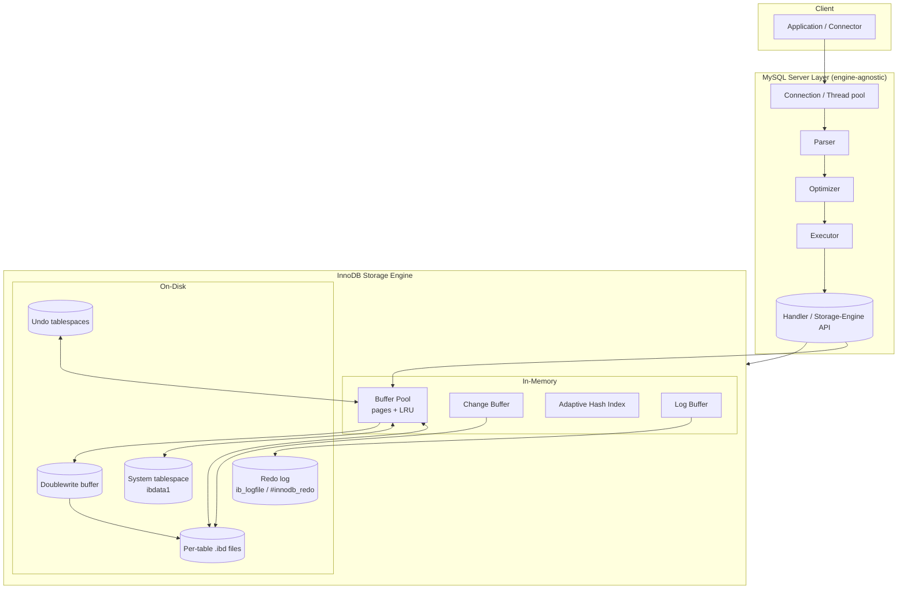

# MySQL / InnoDB Storage Engine — A System Design Discussion

> **Core idea in three sentences.** InnoDB stores every table *as* a clustered B+-tree keyed on the primary key, so the index and the data are the same structure. It overlays this with two orthogonal logs — an **undo log** that retains old row versions (for MVCC reads and rollback) and a **redo log** that records page-level changes (for crash durability) — plus a buffer pool and fine-grained row/gap locks. The combination of *clustered storage + undo/redo + row-level locking* is what makes InnoDB a high-concurrency OLTP engine rather than a bulk-analytics one.

This document is original analysis written for an Advanced DBMS discussion. All quantitative figures in the *Experiments* section are **illustrative/representative**, drawn from documented InnoDB behavior — MySQL is not installed here and nothing below was executed locally.

---

## 1. Problem Background

Early MySQL shipped with **MyISAM** as the default engine. MyISAM is fast for read-mostly workloads and compact on disk, but it has two structural weaknesses that disqualify it from serious transactional use:

1. **Table-level locking only.** A single writer blocks all readers and writers of the table. This collapses under concurrent OLTP write traffic.
2. **No transactions, no crash recovery.** MyISAM has no ACID guarantees and no write-ahead log; an unclean shutdown can leave tables corrupt, requiring `REPAIR TABLE`.

**InnoDB** was created (originally by Innobase Oy, founded by Heikki Tuuri; the technology and later Innobase itself were acquired by **Oracle**, which also acquired MySQL via Sun in 2010) to provide exactly what MyISAM lacked:

- **ACID transactions** with commit/rollback,
- **Crash recovery** via write-ahead logging,
- **Row-level locking** + **MVCC** so readers don't block writers and vice-versa,
- **Foreign-key constraints**.

The decisive moment was **MySQL 5.5 (2010)**, which made **InnoDB the default storage engine**. From that point the "default MySQL" became a transactional, recoverable, high-concurrency database. The motivation is therefore not performance-in-isolation but *correctness under concurrency and failure* — the properties a system-of-record needs.

This is only possible because of MySQL's **pluggable storage-engine architecture**: the SQL layer (parser, optimizer, executor) is decoupled from the physical storage engine through a well-defined handler API. InnoDB is one implementation behind that API; MyISAM, MEMORY, and others are alternatives.

---

## 2. Architecture Overview



**Read path.** Executor calls the handler API → InnoDB checks the **buffer pool**. Hit → serve from memory. Miss → read the 16KB page from the `.ibd` file into the buffer pool (possibly triggering **read-ahead** for sequential scans), then serve. The **adaptive hash index** can short-circuit repeated B+-tree descents to a frequently-hit page with a direct hash lookup.

**Write path (WAL discipline).** A modifying statement:
1. Pins the target page in the buffer pool and modifies it in place → the page becomes **dirty**.
2. Appends the *redo* of the change to the **log buffer**, flushed to the **redo log** on commit (durability). Old row image is written to the **undo log** (for MVCC/rollback).
3. The dirty page is **not** written to its final location immediately. Background flushing later writes it — first through the **doublewrite buffer**, then to the `.ibd` file. Secondary-index maintenance for non-unique indexes may be deferred via the **change buffer**.

The key invariant: **redo is durable before the data page is** (write-ahead logging). That decoupling is what lets writes be fast (sequential log append) while data pages are flushed lazily and in bulk.

---

## 3. Internal Design

### 3.1 Clustered index — the table *is* a B+-tree

InnoDB does not store rows in a heap. **Every InnoDB table is a clustered B+-tree** ordered by the primary key; the **leaf pages contain the entire row**, not just the key.

Primary-key selection rules:
1. The user-declared `PRIMARY KEY`, else
2. the first `UNIQUE NOT NULL` index, else
3. a hidden, monotonically increasing **6-byte `DB_ROW_ID`** synthesized by InnoDB.

Pages are **16KB** by default. Each clustered leaf row also carries hidden system columns: **`DB_TRX_ID`** (6 bytes, last transaction to modify the row) and **`DB_ROLL_PTR`** (7 bytes, pointer into the undo log to the prior version).

```
Clustered index (B+-tree, keyed on PK)
                ┌───────────────────────────┐
   internal     │  [k10|→] [k40|→] [k90|→]  │   (keys + child ptrs)
                └─────┬─────────┬─────────┬──┘
        ┌────────────┘         │         └────────────┐
   leaf │ pk=10 | full row | trx_id | roll_ptr |  ... │  ← rows live HERE
        │ pk=11 | full row | trx_id | roll_ptr |  ... │
        └──────────────────────────────────────────────┘ → (next leaf)
```

**Why store the full row in the leaf?** Locality. A PK lookup or PK range scan reads contiguous leaves and needs **no extra hop** to fetch row data — index access *is* data access. This is ideal for OLTP point-and-range queries on the PK.

### 3.2 Secondary indexes — logical pointers, not physical

A secondary index is a separate B+-tree whose leaf entries store **(secondary key → primary key value)** — *not* a physical row pointer (no page id / offset).

Consequence: a query filtered by a secondary key that needs columns not in the index does a **two-step "bookmark lookup"**:
1. Traverse the secondary index → obtain the PK value.
2. Traverse the **clustered index** by that PK → fetch the full row.

```
Secondary index            Clustered index
  [name='Bob' → pk=11] ──► descend PK tree to pk=11 ──► full row
```

**Why design it this way?** Because the PK value is *stable* while a row's physical location is not — page splits, row relocations, and reorganizations move rows around. If secondary indexes held physical pointers, every row move would require updating every secondary index. By keying on the (stable) PK, secondary indexes never need fix-ups when rows relocate. The cost is the extra clustered traversal — avoidable with a **covering index** (one that contains every column the query needs, so step 2 is skipped). This is also why a **wide PK is doubly expensive**: the PK value is copied into *every* secondary index.

### 3.3 Buffer pool — LRU with midpoint insertion

The buffer pool caches pages. A naive LRU would let a single large table scan evict the entire hot working set ("scan flooding"). InnoDB defends against this with a **midpoint-insertion LRU** split into two sublists:

```
  [ ===== young (hot) ===== | ===== old (cold) ===== ]
   ^head (MRU)              ^midpoint (~5/8)        ^tail (LRU, evicted)
```

- New pages are inserted at the **head of the old sublist** (the midpoint), not the global head.
- A page is promoted to the **young** sublist only if it is accessed *again* after a configurable delay (`innodb_old_blocks_time`).
- A one-shot scan touches each page once, so its pages stay in the old sublist and are evicted quickly — the hot young set survives.

Dirty pages are flushed by background threads (adaptive flushing paced by redo-log fill rate and dirty-page ratio). **Read-ahead** (linear and random) prefetches pages for sequential access.

### 3.4 Undo logs — old versions for MVCC and rollback

When a row is updated **in place**, InnoDB first writes the *prior* version into an **undo log record** (stored in **undo tablespaces**). The live row's `DB_ROLL_PTR` points at that undo record, which itself may chain to older versions — forming a **version chain**.

This single mechanism serves two purposes:
- **Rollback:** apply undo records to revert an aborted transaction.
- **MVCC consistent reads:** a reader holding an older snapshot follows `DB_ROLL_PTR` back through the undo chain to reconstruct the row *as it existed at snapshot time*, without blocking the writer.

A background **purge thread** permanently discards undo records (and delete-marked rows) once **no active transaction** could still need that version. If a long-running transaction holds an old snapshot open, purge stalls and undo accumulates — visible as a growing **History List Length**.

### 3.5 Redo logs — physiological WAL

The redo log is a **physiological** write-ahead log: it records *what changed on which page* (logical within a page, physical as to which page), as a circular set of fixed-size files (`ib_logfile*`, or `#innodb_redo/` in MySQL 8.0+).

- Every change is stamped with a monotonically increasing **LSN (Log Sequence Number)**.
- On `COMMIT`, the redo up to the commit LSN is flushed and `fsync`'d (governed by `innodb_flush_log_at_trx_commit=1` for full ACID durability).
- **Group commit** batches the `fsync`s of many concurrent committing transactions into one disk flush, amortizing the most expensive operation under high concurrency.

Because redo is sequential and small relative to data pages, the WAL lets commits be cheap while data pages flush lazily.

### 3.6 Doublewrite buffer — torn-page protection

A 16KB InnoDB page is larger than a typical 4KB OS/disk atomic write unit. A crash mid-write can leave a **torn (partial) page**, which redo *cannot* repair because redo assumes a consistent base page. InnoDB writes each flushed page **twice**: first sequentially to the **doublewrite buffer**, then to its real location. On recovery, if a page is found torn, InnoDB restores the intact copy from the doublewrite buffer, then applies redo. The cost is roughly double the write volume for flushes (mitigated by the sequential doublewrite area); the benefit is correctness under partial writes.

### 3.7 Locking — row, gap, and next-key locks

InnoDB locks **index records**, not rows directly (another reason every table has a clustered index). Lock types:

| Lock | Locks | Purpose |
|------|-------|---------|
| Record lock | a single index record | protect that row |
| Gap lock | the *open interval between* two index records | block inserts into the gap |
| Next-key lock | a record **+** the gap before it | the default under REPEATABLE READ |
| Insert-intention | a gap, signalling intent to insert | lets non-conflicting inserts coexist |
| Intention (IS/IX) | table-level | declare "I will take row S/X locks here" so table-level conflicts are detected cheaply |

**Why next-key locks?** They prevent **phantom rows**. Under REPEATABLE READ, a `SELECT ... FOR UPDATE` over a range next-key-locks both the matching records *and the gaps between them*, so a concurrent transaction cannot `INSERT` a new row into that range — the second run of the query sees no phantoms. **Intention locks** (IS/IX) make table-vs-row lock conflicts (e.g. a row X-lock vs a table `LOCK TABLES`) detectable without scanning every row lock.

### 3.8 Transactions & isolation levels

| Level | Dirty read | Non-repeatable read | Phantom | InnoDB mechanism |
|-------|-----------|---------------------|---------|------------------|
| READ UNCOMMITTED | possible | possible | possible | reads latest, ignores locks |
| READ COMMITTED | no | possible | possible | **fresh** read view per statement; mostly record locks, no gap locks |
| **REPEATABLE READ** *(default)* | no | no | **no** | **one snapshot per transaction** + **next-key locks** |
| SERIALIZABLE | no | no | no | RR + implicit `LOCK IN SHARE MODE` on plain reads |

Two read modes coexist:
- **Consistent nonlocking read** — a plain `SELECT` reads from the MVCC snapshot via undo; takes no locks, never blocks writers.
- **Locking read** — `SELECT ... FOR UPDATE` / `FOR SHARE` reads the *latest committed* row and takes record/next-key locks, participating in concurrency control.

InnoDB's default RR is notably stronger than the SQL-standard RR because next-key locking also blocks phantoms.

### 3.9 Recovery — redo roll-forward, undo roll-back

After a crash, InnoDB performs **ARIES-style** recovery:
1. **Redo (roll-forward):** starting from the last **checkpoint LSN**, replay redo records to bring all pages up to the most recent durable state — including changes from transactions that never committed.
2. **Undo (roll-back):** use undo logs to revert changes of transactions that were **in-flight** (uncommitted) at crash time.

**Fuzzy (sharp-less) checkpointing** lets InnoDB flush dirty pages continuously and advance the checkpoint LSN without quiescing the system; recovery only needs to replay redo *after* the checkpoint LSN, bounding recovery time. The doublewrite buffer guarantees the base pages redo is applied to are intact.

---

## 4. Design Trade-Offs

### 4.1 Advantages

- **Index = data on the PK:** PK point lookups and range scans are maximally efficient (no extra fetch hop, sequential leaf reads, good cache locality).
- **High write/read concurrency:** row-level MVCC means readers never block writers; consistent reads are lock-free.
- **Strong durability + bounded recovery:** WAL + fuzzy checkpoints + doublewrite.
- **Crash-safe by construction**, ACID, foreign keys.

### 4.2 Limitations

- **Secondary lookups cost a second traversal** unless covering — the structural price of clustered storage.
- **Wide PKs are expensive** — copied into every secondary index.
- **Random / non-monotonic PK inserts cause page splits**, fragmentation, and churn (write amplification). A monotonic PK appends to the rightmost leaf — far cheaper.
- **Changing a row's PK is effectively a delete + reinsert** (the row physically moves and every secondary index's PK reference is updated).
- **Long-running transactions stall purge** → undo bloat and degraded MVCC read performance.

### 4.3 InnoDB vs PostgreSQL MVCC — the central contrast

These are the two dominant — and **dual** — approaches to MVCC.

| Dimension | **InnoDB (Oracle-style)** | **PostgreSQL** |
|-----------|---------------------------|----------------|
| Update model | **In-place** update; old version pushed to **undo** | **Append-only**: a new tuple version is written into the **heap** |
| Where old versions live | Undo tablespaces (separate from data) | The heap itself (dead tuples sit alongside live ones) |
| Version visibility metadata | `DB_TRX_ID` + `DB_ROLL_PTR` chain | per-tuple **`xmin`/`xmax`** transaction ids |
| Table storage | **Clustered** B+-tree by PK | **Heap** (unordered); no clustered index by default |
| Index entries | point to **PK value** | point to **physical tuple (ctid)** — every index references every version |
| Reclaiming old versions | **purge thread** (background) | **VACUUM** (reclaims dead tuples + bloat) |
| Main cost | undo growth, purge lag, secondary double-lookup | **table/index bloat**, VACUUM overhead, write-amplified index updates |

**Why does InnoDB need *both* undo and redo?** Because they are **orthogonal** and solve unrelated problems:

- **Undo = MVCC + rollback** — it answers *"what did this row look like before / how do I revert it?"* It is about **logical old versions** and is consumed by readers and aborts.
- **Redo = durability + roll-forward** — it answers *"how do I reconstruct committed page changes after a crash?"* It is about **physical replay** and is consumed only by recovery.

You cannot collapse one into the other: redo can't reconstruct a *prior* version for a snapshot read, and undo can't recover committed changes lost from the buffer pool on crash. (Postgres needs no separate undo because old versions *are* the prior heap tuples — the trade is that those dead tuples become bloat that VACUUM must collect.)

**Clustered-index trade-off, stated plainly.** Clustering buys PK-range locality and a hop-free PK path; it charges for that with the secondary-index double lookup, costly PK changes, and page-split sensitivity. The engineering takeaway is the well-known rule: **use a narrow, monotonically increasing surrogate PK** (e.g. `AUTO_INCREMENT` / `BIGINT`) unless a natural clustering key is genuinely beneficial — avoid random PKs like raw UUIDv4 as the clustering key.

**Why PostgreSQL chose differently.** Postgres's append-only heap keeps the storage engine **simpler and more extensible** (pluggable index AMs, custom types, no global undo subsystem) and makes index maintenance uniform — but pays in **bloat + VACUUM**. InnoDB's in-place model keeps the live dataset compact and reads dense, but needs the **undo + purge** machinery. Neither is strictly superior; they optimize different costs.

### 4.4 Performance implications (summary)

- Bulk loads / sequential inserts: favor monotonic PK to avoid splits.
- Read-heavy reporting on secondary keys: add covering/composite indexes to dodge the bookmark lookup.
- Write durability vs throughput: `innodb_flush_log_at_trx_commit` (1 = safe, 2/0 = faster but weaker) — an explicit, tunable trade.
- Long analytical transactions on an OLTP instance: dangerous (purge stall, undo bloat) — isolate them.

---

## 5. Experiments / Observations  *(ILLUSTRATIVE — not run locally)*

> **Methodology & honesty note.** MySQL is not installed in this environment, so nothing below was executed. The figures are **representative**, reconstructed from documented InnoDB behavior to show *what you would observe and how to interpret it*. To reproduce: run on a real MySQL 8.0 instance, populate with `sysbench oltp_read_write`, then inspect `SHOW ENGINE INNODB STATUS`, `EXPLAIN`, and `performance_schema`.

### 5.1 Representative `SHOW ENGINE INNODB STATUS` excerpt

```
---TRANSACTIONS---
History list length 12840          <-- old versions awaiting purge; large + growing = a long txn is blocking purge
---BUFFER POOL AND MEMORY---
Buffer pool size        131072      (pages; 16KB each ≈ 2 GB)
Free buffers            512
Database pages          129800
Buffer pool hit rate    998 / 1000  <-- ~99.8% hits; <950 suggests pool too small / scan-heavy
Pages read ahead 2.1/s, evicted without access 0.0/s
---LOG---
Log sequence number          84 219 553 1024   <-- current write LSN
Log flushed up to            84 219 552 9881
Pages flushed up to          84 219 401 3380   <-- checkpoint frontier; gap to LSN ~ recovery work
Last checkpoint at           84 219 400 7765
Pending log flushes 0; pending chkp writes 0    <-- nonzero here ⇒ flush/IO bottleneck
```

How to read it: **hit rate** gauges buffer-pool adequacy; **history list length** exposes purge lag / long transactions; the **LSN minus last-checkpoint** gap estimates crash-recovery time; **pending flushes** flag IO saturation.

### 5.2 Representative `EXPLAIN` — clustered PK vs secondary lookup

```sql
-- (a) PK lookup: one clustered-index access, full row in the leaf
EXPLAIN SELECT * FROM orders WHERE order_id = 4711;
-- type: const | key: PRIMARY | rows: 1 | Extra: (none)   <-- no extra hop

-- (b) Secondary lookup of non-covered columns: bookmark lookup (2 accesses)
EXPLAIN SELECT * FROM orders WHERE customer_id = 88;
-- type: ref | key: idx_customer | rows: 37 | Extra: (none)
--   step 1: idx_customer leaf -> PK values;  step 2 (implicit): clustered tree -> full rows

-- (c) Covering: secondary index alone answers the query -> no second traversal
EXPLAIN SELECT customer_id, order_id FROM orders WHERE customer_id = 88;
-- type: ref | key: idx_customer | Extra: Using index   <-- "Using index" = covered, hop avoided
```

The implicit second access in (b) is the *clustered-index traversal per matched secondary row*. `Using index` in (c) is the optimizer telling you the bookmark lookup was eliminated.

### 5.3 Worked next-key-lock phantom-prevention example

Setup: `accounts(id PK, balance)` with rows at `id ∈ {10, 20, 30}`, REPEATABLE READ.

```
Time  Transaction T1                              Transaction T2
----  -----------------------------------------   ------------------------------------------
t1    BEGIN;
t2    SELECT * FROM accounts
      WHERE id BETWEEN 10 AND 30 FOR UPDATE;
      -- next-key locks records 10,20,30 AND the
      -- gaps (−∞,10],(10,20],(20,30],(30,+∞ up to next)
t3                                                BEGIN;
t4                                                INSERT INTO accounts VALUES (25, 0);
                                                  -- needs the (20,30] gap -> BLOCKS on T1's
                                                  -- insert-intention vs gap lock
t5    -- re-run same range SELECT: still {10,20,30}
      -- NO phantom row 25 appears
t6    COMMIT;                                      -- T2's INSERT now proceeds
```

The gap lock on `(20,30]` is what makes the *absence* of row 25 stable for T1 — phantom prevention without serializing unrelated rows.

### 5.4 Expected `sysbench` OLTP behavior (sketch)

- **Throughput vs threads:** rises, then plateaus as the bottleneck shifts to redo-log flushing / IO; **group commit** keeps the plateau high by batching `fsync`s.
- **`flush_log_at_trx_commit`:** `=1` (durable) yields lower TPS but survives power loss; `=2` raises TPS by skipping per-commit `fsync` (risking the last ~1s on OS crash).
- **Buffer-pool size sweep:** TPS climbs steeply until the working set fits in the pool (hit rate → ~99%), then flattens — the classic cache-residency knee.
- **Hot-row contention:** concentrating updates on few rows degrades scaling as row-lock waits dominate (visible in `data_locks` / lock-wait time).

---

## 6. Key Learnings

1. **A secondary index lookup is two B+-tree traversals.** Secondary indexes point to PK *values*, not physical rows; non-covered reads pay a clustered "bookmark lookup." Covering/composite indexes are the cure.
2. **Undo and redo are orthogonal, both required.** Undo = old versions for MVCC/rollback (logical, backward); redo = durable physical replay for recovery (forward). One cannot substitute for the other.
3. **Prefer narrow, monotonic primary keys.** Clustering rewards PK locality but punishes random/wide PKs with page splits, fragmentation, and per-secondary-index PK bloat.
4. **In-place-update + undo is the *dual* of PostgreSQL's append-only heap + VACUUM.** InnoDB keeps live data compact and pays with undo/purge; Postgres keeps the engine simple/extensible and pays with bloat/VACUUM. Recognizing this duality explains most engine-level performance differences.
5. **REPEATABLE READ in InnoDB blocks phantoms** via next-key (record + gap) locks — stronger than the SQL-standard RR.
6. **Durability is a tunable, not a constant** — `innodb_flush_log_at_trx_commit`, group commit, and the doublewrite buffer are explicit points on a safety/throughput curve.

---

## References

- *MySQL 8.0 Reference Manual* — Chapter 17 "The InnoDB Storage Engine" (architecture, buffer pool, clustered/secondary indexes, redo/undo logs, doublewrite buffer, locking, transaction isolation, recovery).
- *MySQL 8.0 Reference Manual* — "InnoDB Locking and Transaction Model" (record/gap/next-key/intention locks; consistent vs locking reads).
- Jeremy Cole, *"InnoDB internals"* blog series (e.g. "The physical structure of InnoDB index pages", "How InnoDB primary/secondary indexes work") — page and record layout internals.
- General background: ARIES recovery (Mohan et al.) for the redo-roll-forward / undo-roll-back model InnoDB follows.

> *All figures in §5 are illustrative/representative and were not produced by a local run.*
