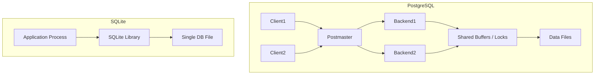

# PostgreSQL vs SQLite Architecture Comparison

## 1. Problem Background
PostgreSQL and SQLite are both relational database management systems (RDBMS), but they were designed to solve fundamentally different problems:
*   **PostgreSQL** was created as a powerful, enterprise-class, standard-compliant database system capable of handling highly concurrent, complex workloads in a multi-user environment.
*   **SQLite** was designed to provide a lightweight, embeddable, zero-configuration database engine that operates directly on disk files, serving as an ideal data storage solution for local applications and edge devices.

## 2. Architecture Overview
The fundamental difference lies in their process and network architecture:

*   **PostgreSQL (Client-Server Architecture):** Uses a multi-process architecture. A central daemon process (`postmaster`) listens for incoming connections. For every client connection, it forks a new backend process (`postgres`). These processes communicate with shared memory structures for buffering and locking.
*   **SQLite (Embedded Architecture):** Is not a separate process. It is a C library that is linked into the application program. The application directly executes SQL statements by calling SQLite's functions. There is no network layer or background daemon.

## 3. Internal Design
### Storage Engine & Database File Organization
*   **SQLite** stores the entire database (tables, indexes, schema) inside a single, ordinary disk file. The file is divided into pages (usually 4KB), managed as a B-Tree.
*   **PostgreSQL** uses a directory structure (`base/` for default tablespaces) where each database has a subdirectory, and each table or index consists of multiple files (e.g., the main heap file, a free space map `fsm`, a visibility map `vm`).

### Concurrency Control & Transaction Management
*   **PostgreSQL** utilizes Multi-Version Concurrency Control (MVCC). Readers do not block writers, and writers do not block readers. This makes it highly scalable for concurrent workloads.
*   **SQLite** traditionally used database-level locking (a writer locks the entire database file). The introduction of WAL (Write-Ahead Logging) mode allows one writer and multiple concurrent readers, significantly improving concurrency, though it still cannot handle concurrent writers.

## 4. Design Trade-Offs

| Feature | PostgreSQL | SQLite |
| :--- | :--- | :--- |
| **Concurrency** | High (MVCC, row-level locks) | Limited (One writer at a time) |
| **Setup & Config** | Complex (Requires daemon, users, networking) | Zero (Drop the library and go) |
| **Data Types** | Extensive (JSONB, PostGIS, Arrays, Custom) | Dynamic/Loose typing (Affinity-based) |
| **Latency** | Network latency for queries | Near zero (In-process memory access) |

**Why PostgreSQL for large multi-user systems?** It scales across multiple CPU cores via multiple processes, manages memory pools efficiently for huge datasets, and provides fine-grained user access controls.
**Why SQLite for mobile apps?** Zero administration, tiny footprint, and reliable persistence in a single file make it perfect for edge devices like iOS and Android apps, or local application state.

## 5. Experiments / Observations
If you write a simple Python script to launch 100 threads inserting data simultaneously:
*   **PostgreSQL:** Handles the workload smoothly, distributing transactions across backend processes and flushing via WAL.
*   **SQLite (Default Mode):** Immediately throws `database is locked` errors as the entire file is locked on write. Enabling WAL mode (`PRAGMA journal_mode=WAL;`) improves this, but writes are still strictly serialized.

## 6. Key Learnings
*   The deployment architecture (client-server vs embedded) fundamentally dictates the capabilities of the database.
*   SQLite's simplicity is its superpower, avoiding network serialization and administration overhead.
*   PostgreSQL's robust process model and MVCC trade operational simplicity for massive concurrency and reliability at scale.
