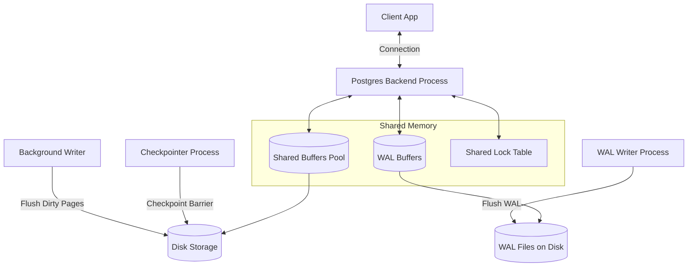

# PostgreSQL Internal Architecture

## 1. Problem Background

PostgreSQL is built to serve as an enterprise-grade, ACID-compliant relational database. In transactional systems, a database must handle large volumes of concurrent read/write queries without data corruption, even in the event of hardware or system failures. To achieve this, PostgreSQL relies on a complex, layered internal architecture that coordinates memory buffers, index lookups, transaction isolation (MVCC), and crash recovery mechanisms (WAL).

---

## 2. Architecture Overview

### PostgreSQL Process and Shared Memory Architecture



### Core Architecture Components
1. **Shared Buffers:** Dedicated shared memory block used to cache table and index pages read from disk.
2. **Postgres Backend Process:** Executable thread allocated to a specific client. Reads pages from the Shared Buffers, performs query operations, and writes modified pages back to the buffers.
3. **WAL Buffers & WAL Writer:** Memory space containing transactional log records, which are flushed to disk before actual data pages (Write-Ahead Logging).
4. **Background Processes:** Independent processes (Checkpointer, Background Writer, Autovacuum) that perform asynchronous I/O tuning and garbage collection.

---

## 3. Internal Design

### 3.1 Buffer Manager
The Buffer Manager resides in `src/backend/storage/buffer/`. It mediates all read and write requests between the query execution engine and the physical storage layer.

- **Shared Buffers Pool:** Rather than performing a disk read for every page request, PostgreSQL checks the Shared Buffers pool first. The default size is generally set to 25% of system RAM.
- **Clock-Sweep Replacement Algorithm:** PostgreSQL uses a clock-sweep algorithm (a variant of Second Chance) to determine which pages to evict when the buffer pool is full:
  - Each buffer header contains a usage counter (0 to 5) and a pin count.
  - The sweep hand moves sequentially through the buffers.
  - If a buffer's pin count is 0 and its usage count is > 0, the usage count is decremented by 1.
  - If the pin count is 0 and the usage count is 0, that buffer is selected for eviction.
  - When a page is accessed, its usage count is incremented (up to a max of 5).
- **Dirty Page Management:** When a page is modified, it is marked as "dirty" in the buffer. The **Background Writer** and **Checkpointer** processes flush these dirty pages to disk asynchronously.

### 3.2 B-Tree Implementation (`nbtree`)
The default index type in PostgreSQL is B-Tree, located in `src/backend/access/nbtree/`. It implements the Lehman & Yao algorithm.

- **Structure:** The tree consists of a root page, internal pages, and leaf pages. Unlike standard B-trees, leaf pages are linked in a doubly linked list, enabling rapid range scans.
- **Page Layout:** Every index page is divided into a page header, item pointers, and index tuples. Index tuples in leaf pages contain the index key and a physical pointer (TID - Tuple ID) to the heap page where the actual row resides.
- **Page Splits:** When an insert operation targets a page that is full, a page split occurs:
  - A new page is allocated.
  - Roughly half of the items are moved to the new page.
  - An entry is inserted into the parent internal page.
  - In Lehman & Yao's design, pages include a "right-link" pointer. This allows concurrent readers to traverse to the split page without acquiring a heavy read-lock on the parent, preventing concurrency bottlenecks.

### 3.3 Multi-Version Concurrency Control (MVCC)
PostgreSQL implements MVCC to allow multiple clients to read and write data simultaneously without blocking.

- **Heap Tuple Versioning:** When a row is modified or deleted, PostgreSQL does not overwrite the existing data. Instead, it creates a new version of the row (tuple).
- **xmin & xmax System Columns:** Every tuple header contains transaction metadata:
  - `xmin`: The transaction ID (TxID) of the transaction that inserted the tuple.
  - `xmax`: The TxID of the transaction that deleted or updated the tuple (0 if active/not deleted).
- **Visibility Rules:** For any given query, a snapshot is captured containing the current transaction's ID and the state of active transactions. A tuple is visible only if its `xmin` transaction has committed and its `xmax` transaction has either not committed, not started, or is greater than the snapshot transaction range.
- **Vacuuming:** Over time, updates and deletions leave old, invisible tuple versions ("dead tuples"). The **Vacuum** process scans the heap pages, identifies dead tuples, and marks the space as available for future inserts. The **Autovacuum** daemon automates this cleanup.

### 3.4 Write-Ahead Logging (WAL)
WAL is the mechanism that guarantees durability (the "D" in ACID) and supports crash recovery.

- **Write-Ahead Principle:** Any change to database tables or indexes must be written to the WAL (on non-volatile storage) before the actual data pages in the Shared Buffers are flushed to disk.
- **WAL Record:** Contains a binary description of the change (e.g. page ID, offset, old data, new data).
- **Crash Recovery:** If the database crashes, PostgreSQL reads the WAL starting from the last successful checkpoint and replays all committed transactions to restore the database to a consistent state.
- **Checkpoints:** A checkpoint is a periodic event where the Checkpointer process flushes all dirty data buffers to disk and writes a checkpoint record to the WAL. In the event of a crash, the recovery process only needs to scan the WAL from the checkpoint record forward.

---

## 4. Design Trade-Offs

### Out-of-place Updates (PostgreSQL Heap) vs In-place Updates
* **Advantage:** Out-of-place updates make rollbacks extremely fast. There is no need to reconstruct previous states from logs; the database simply ignores the uncommitted tuple versions based on `xmin`/`xmax`.
* **Disadvantage (Write Amplification & Bloat):** Updating a row requires writing a completely new tuple. This can lead to table bloat (if vacuuming cannot keep pace) and write amplification, as indexes pointing to the row must also be updated to point to the new tuple version (unless Single-Page HOT - Heap-Only Tuple optimization is triggered).

---

## 5. Experiments / Observations

Below is an analysis of an `EXPLAIN ANALYZE` command executed on a relational join query in PostgreSQL.

### Execution Plan Example

```sql
EXPLAIN ANALYZE 
SELECT u.name, o.order_date, o.amount 
FROM users u 
JOIN orders o ON u.id = o.user_id 
WHERE u.age > 30;
```

### Result Analysis

```text
Hash Join  (cost=308.00..845.50 rows=4500 width=45) (actual time=2.150..12.340 rows=4480 loops=1)
  Hash Cond: (o.user_id = u.id)
  ->  Seq Scan on orders o  (cost=0.00..450.00 rows=20000 width=16) (actual time=0.010..5.120 rows=20000 loops=1)
  ->  Hash  (cost=206.00..206.00 rows=4000 width=37) (actual time=2.080..2.080 rows=4012 loops=1)
        Buckets: 4096  Batches: 1  Memory Usage: 320kB
        ->  Seq Scan on users u  (cost=0.00..206.00 rows=4000 width=37) (actual time=0.008..1.420 rows=4012 loops=1)
              Filter: (age > 30)
              Rows Removed by Filter: 5988
Planning Time: 0.230 ms
Execution Time: 12.850 ms
```

### Observations and Metrics
1. **Planner Estimates vs Actuals:**
   - The planner estimated `rows=4000` for the `users` table filter (`age > 30`). The actual scan returned `4012` rows. This high accuracy indicates that PostgreSQL's statistical metadata (`pg_statistic` and `pg_stats` views) is well-tuned.
   - The overall hash join was estimated to output `4500` rows; the actual execution produced `4480` rows.
2. **Join Strategy Selection:**
   - The engine chose a **Hash Join**. It performed a sequential scan on the filtered `users` table, loaded those rows into an in-memory hash table (`Memory Usage: 320kB`), and then streamed the `orders` table (Sequential Scan) to match user IDs.
   - The planner opted for a Hash Join instead of a Nested Loop because the datasets are relatively small and the hash table fits entirely in memory.

---

## 6. Key Learnings

1. **Lehman & Yao Concurrency:** The B-Tree implementation's use of right-link pointers is a brilliant optimization that avoids holding lock resources up the tree during splits, illustrating how physical data structures are customized for concurrent workloads.
2. **Vacuuming Overhead:** MVCC is not a free lunch. The necessity of the autovacuum daemon to continuously scan and clean up dead tuples is a major operational trade-off that requires careful configuration in high-write databases.
3. **Write-Ahead Integrity:** By forcing WAL records to non-volatile storage before updating page blocks, PostgreSQL guarantees durability and consistency, showing that disk-level protocols are fundamental to system robustness.
