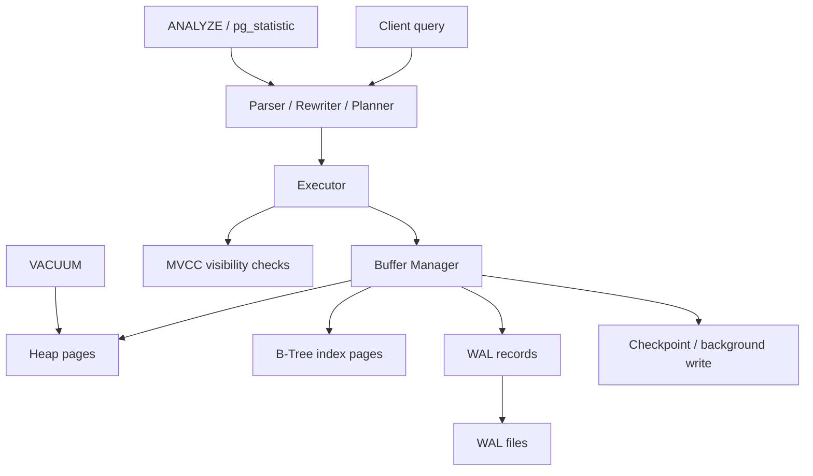

# PostgreSQL Internal Architecture

## 1. Problem Background

PostgreSQL exists to provide a durable, concurrent, feature-rich relational database for serious multi-user systems. Its internal design is shaped by four hard requirements:

- many clients should be able to read and write at the same time
- crashes must not corrupt committed data
- the optimizer must adapt to data distribution
- maintenance should happen continuously without stopping the system

That is why PostgreSQL is not just “a SQL parser plus files on disk.” It is a layered system with a planner, executor, buffer manager, heap storage, index access methods, MVCC visibility rules, WAL, checkpoints, and background cleanup.

## 2. Architecture Overview

### Main system components

- Planner and executor
- Buffer manager
- Heap storage
- B-Tree index access method (`nbtree`)
- MVCC tuple/version visibility rules
- WAL subsystem
- Checkpointing and VACUUM
- Planner statistics (`pg_statistic`, `pg_stats`)

## 3. Internal Design

### 3.1 Buffer Manager

Relevant source area:

- `src/backend/storage/buffer/`

The buffer manager is responsible for moving pages between disk and shared memory. PostgreSQL does not read heap or index pages directly from disk for every access. Instead, pages are loaded into shared buffers, reused when hot, and eventually written back later.

This gives PostgreSQL two important advantages:

- repeated access can hit memory instead of disk
- writes can be staged and coordinated with WAL and checkpoints

The trade-off is complexity: PostgreSQL must decide which pages stay in memory, how dirty pages are flushed, and how consistency is preserved across crashes.

### 3.2 B-Tree Implementation

Relevant source area:

- `src/backend/access/nbtree/`

PostgreSQL’s B-Tree is its default index implementation for ordered lookups, equality predicates, range scans, and sorting support. It stores index tuples in index pages, separate from heap storage.

Important implementation ideas:

- tree search follows page pointers down from the root
- inserts may cause page splits
- the index is separate from the heap, so the executor often does index lookup first and heap visibility checks second

That design keeps the heap flexible for MVCC, but means PostgreSQL does not get clustered-primary-key locality by default in the same way InnoDB does.

### 3.3 MVCC

PostgreSQL uses tuple-version-based MVCC. When a row is updated, PostgreSQL generally creates a new tuple version instead of overwriting the old version in place.

Key fields:

- `xmin`: transaction that created the tuple version
- `xmax`: transaction that deleted or superseded the tuple version

Why this matters:

- readers can continue to see an older valid snapshot
- writers avoid blocking readers in the common case
- dead tuple cleanup becomes a background maintenance problem

### 3.4 WAL (Write-Ahead Logging)

WAL ensures that changes are described in the log before modified data pages are considered durable on disk.

This gives PostgreSQL crash recovery:

- after a crash, WAL can be replayed
- checkpoints reduce how much WAL must be replayed
- durability depends on log-before-data discipline

The cost is extra write work, but the benefit is safe recovery and reliable commits.

### 3.5 Query planning and statistics

The planner estimates cardinalities and costs using statistics collected by `ANALYZE` and stored in `pg_statistic` (or surfaced through `pg_stats`).

If the statistics are stale or misleading, the planner can choose poor join orders or scan methods. So statistics are not just metadata; they directly influence runtime behavior.

### 3.6 Why VACUUM is necessary

Because PostgreSQL keeps old tuple versions for MVCC, updates and deletes create dead tuples. Those dead tuples are not immediately reusable until VACUUM marks the space as reclaimable and prevents long-term table/index bloat.

This is one of PostgreSQL’s central engineering trade-offs:

- MVCC gives excellent read/write concurrency
- VACUUM is the price paid for that concurrency model

## 4. Design Trade-Offs

### Advantages

- Strong concurrency through MVCC
- Durable crash-safe commit protocol using WAL
- Flexible heap + index separation
- Rich planner that can exploit statistics and multiple scan/join methods

### Limitations

- Dead tuples accumulate until VACUUM cleans them
- Heap/index separation can require extra page accesses
- Internal behavior is more complex than embedded or overwrite-in-place engines

### Engineering decisions

PostgreSQL favors concurrency and correctness over storage simplicity.

It accepts:

- extra tuple versions
- WAL overhead
- background maintenance

in exchange for:

- non-blocking reads
- strong recovery behavior
- high flexibility across workloads

## 5. Experiments / Observations

I ran practical observations on PostgreSQL 18.4 using a synthetic commerce-style schema with `customers`, `orders`, and `order_items`.

### 5.1 Buffer manager + planner behavior with `EXPLAIN ANALYZE`

I created indexes on:

- `orders(customer_id)`
- `orders(status, created_at)`
- `order_items(order_id)`
- `order_items(product_category)`

Then I ran a filtered 3-table join with aggregation and ordering.

Observed plan highlights:

- `Bitmap Index Scan` on `idx_orders_status_date`
- `Bitmap Heap Scan` on `orders`
- `Hash Join` between `orders` and `order_items`
- second `Hash Join` with `customers`
- `HashAggregate` followed by `Sort` and `Limit`

Observed runtime:

- execution time: about `93.185 ms`
- planning time: about `2.135 ms`
- buffers: `shared hit=1120`, `read=16`

Interpretation:

- the planner correctly preferred indexed filtering on `orders`
- most page accesses were served from shared buffers rather than fresh reads
- PostgreSQL’s runtime is visibly shaped by both the planner and the buffer manager

### 5.2 Planner statistics and `pg_statistic`

After `ANALYZE`, `pg_stats` showed statistics such as:

- `status` had `n_distinct = 4`
- `created_at` had `n_distinct = 366`
- `customer_id` showed many distinct values and low correlation

Interpretation:

- the planner had enough selectivity information to estimate the `status + created_at` filter
- this is why `ANALYZE` matters: execution quality depends on statistics quality

### 5.3 MVCC tuple versioning

I created a tiny table and observed hidden system columns before and after an update:

- first version: `ctid = (0,1)`, `xmin = 809`
- after update: `ctid = (0,2)`, `xmin = 810`

Interpretation:

- the updated row became a new tuple version
- PostgreSQL did not simply overwrite the row in place from the snapshot perspective
- this is the core of PostgreSQL MVCC

### 5.4 Why VACUUM is necessary

I updated 5,000 rows in `orders` and checked `pg_stat_user_tables`.

Observed values:

- before update: `n_dead_tup = 0`
- after update: `n_dead_tup = 5000`
- after `VACUUM orders`: `n_dead_tup = 0`, `vacuum_count = 1`

Interpretation:

- updates produced dead tuples
- VACUUM was required to reclaim them
- this directly demonstrates the operational cost of MVCC

### 5.5 WAL and durability-related settings

Observed settings/state:

- `shared_buffers = 128MB`
- `wal_level = replica`
- `checkpoint_timeout = 5min`
- current WAL insert location after the workload: `0/39A2890`

Interpretation:

- WAL is active and continuously advancing as changes occur
- checkpoints define recovery boundaries
- durability in PostgreSQL is tightly connected to WAL progression and checkpointing

## 6. Key Learnings

The main insight is that PostgreSQL internals are built around coordination between multiple subsystems, not around one single storage trick.

- The buffer manager controls page movement and reuse.
- MVCC controls visibility.
- WAL controls durability.
- VACUUM controls long-term storage health.
- The planner relies on statistics to choose the least expensive path.

The most important trade-off is also the clearest one:

- PostgreSQL gets excellent concurrency because it keeps multiple tuple versions.
- But then it must spend background work cleaning up those versions.

In practice, PostgreSQL’s architecture is a very deliberate compromise:

- more internal complexity
- in exchange for better concurrency, safety, and flexibility

That is why PostgreSQL remains so strong for production multi-user systems.

## References

- [PostgreSQL MVCC](https://www.postgresql.org/docs/current/mvcc.html)
- [PostgreSQL B-Tree indexes](https://www.postgresql.org/docs/current/btree.html)
- [PostgreSQL WAL introduction](https://www.postgresql.org/docs/current/wal-intro.html)
- [PostgreSQL WAL internals](https://www.postgresql.org/docs/current/wal-internals.html)
- [Using EXPLAIN](https://www.postgresql.org/docs/current/using-explain.html)
- [Planner statistics](https://www.postgresql.org/docs/current/planner-stats.html)
- [Resource consumption / shared buffers](https://www.postgresql.org/docs/current/runtime-config-resource.html)
