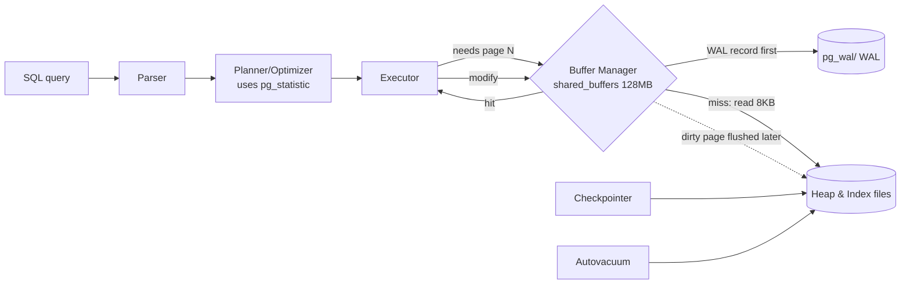

# PostgreSQL Internal Architecture

> A walkthrough of how PostgreSQL really stores, locates, versions, and protects a row — assembled by prodding a live **PostgreSQL 18.3** instance with `EXPLAIN (ANALYZE, BUFFERS)`, `pageinspect`, `pg_buffercache`, and the system catalogs. Every table, plan, and figure below is genuine output captured over the `setup.sql` dataset (20k students, 200k enrollments). The complete transcript lives in `results.txt`; reproduce it with `psql -d dbms_lab -f queries.sql`.

---

## 1. Problem Background

PostgreSQL is a shared, durable, multi-user database. That role imposes four hard internal problems, and this document is structured around the component that answers each:

| Problem | Component |
|---|---|
| Disk is slow; don't read the same page twice | **Buffer Manager** (shared buffers) |
| Find one row among millions without scanning | **B-tree indexes** (nbtree) |
| Let many transactions read/write concurrently without locking each other | **MVCC** (multi-version rows) |
| Survive a crash with no committed data lost | **WAL** (write-ahead log) |

A single theme runs through all of them: wherever it can, PostgreSQL would rather *append a new version* and *log its intent first* than overwrite or block. That preference is what makes it both concurrent and crash-safe — and it's equally the reason `VACUUM` has to exist at all.

---

## 2. Architecture Overview



The golden rule the diagram makes visible: **a change reaches WAL (and is fsync'd) before the modified data page is ever allowed to land on the heap on disk.** That single ordering is the whole foundation of crash recovery.

---

## 3. Internal Design

### 3.1 Buffer Manager — the 8 KB page cache

PostgreSQL reads and writes the heap in fixed **8 KB pages**. `shared_buffers` (here **128 MB** = 16,384 buffer slots) is a shared-memory array of those pages that every backend draws on. Each plan node reports `shared hit=` (page already cached) against `read=` (had to fetch from disk):

```
Bitmap Heap Scan on enrollments  (student_id = 12345)
  Buffers: shared hit=11 read=1        <- 11 pages from cache, 1 from disk
  Execution Time: 0.048 ms
```

Once the workload has run, `pg_buffercache` reports precisely what's resident:

```
 relname          | buffers | cached
------------------+---------+--------
 enrollments      |   1406  | 11 MB     <- the whole hot table is in RAM
 idx_enr_student  |    255  | 2040 kB
 students         |    141  | 1128 kB
```

Eviction runs on a **clock-sweep** algorithm (an LRU approximation): every buffer holds a usage counter that the sweep keeps decrementing; a buffer becomes evictable once its counter reaches zero and nothing has it pinned. The query that dirties a page doesn't write it back — the **bgwriter** and **checkpointer** flush dirty pages in the background, keeping foreground queries quick.

### 3.2 Heap tuple & page layout (via `pageinspect`)

A heap page is laid out as: header → an array of **line pointers** (`lp`) → free space → tuples filling in from the tail. Here's real page 0 of `students`:

```
 lp | lp_off | lp_len | t_xmin | t_xmax | t_ctid
----+--------+--------+--------+--------+--------
  1 |      0 |      0 |        |        |          <- dead line pointer (row moved away)
  2 |   8144 |     48 |    812 |    814 | (0,2)
  3 |   8096 |     48 |    812 |    814 | (0,3)
```
A row's physical address is its **`ctid` = (page, line-pointer)**. Because indexes reference the `ctid` rather than a raw byte offset, a tuple can shift within a page (or be vacuumed away) without rewriting every index entry — only the line pointer changes.

### 3.3 B-tree indexes (via `pageinspect`)

`bt_metap('students_pkey')` on the primary-key index:
```
 magic  | version | root | level | fastroot
 340322 |    4    |   3  |   1   |    3
```
A **Lehman-Yao B+-tree**: `level=1` means a root plus a single leaf level for the 20k keys. Each leaf entry pairs an indexed value with the heap `ctid`:
```
 itemoffset |   ctid   | data (key)
     2      | (0,1)    | 01 00 00 00 ...   (id=1, old version)
     3      | (137,32) | 01 00 00 00 ...   (id=1, new version after UPDATE)
```
Note that the index holds **two entries for id=1** — one for each row version (see MVCC below). A search descends root → leaf comparing keys, then uses the leaf's `ctid` to pull the heap tuple. When an insert overflows a leaf it triggers a **page split** (half the entries migrate to a new page and the parent gains a new separator key).

### 3.4 MVCC — versioning instead of locking

This is PostgreSQL's core. Every row carries the hidden columns **`xmin`** (the transaction that created it) and **`xmax`** (the transaction that deleted or superseded it). An `UPDATE` never overwrites — it flags the old version dead and writes a **fresh** version:

```
-- before UPDATE
 id | ctid  | xmin | xmax
  1 | (0,1) | 812  | 814

BEGIN; UPDATE students SET dept='CS' WHERE id=1; 

-- after: brand new tuple, new location, new xmin
 id |   ctid   | xmin | xmax
  1 | (137,32) | 863  |  0
```

The old tuple at `(0,1)` physically stays put; the new one is written at `(137,32)`. A transaction's **snapshot** decides which version it observes: a tuple is visible when its `xmin` committed before the snapshot and its `xmax` either hasn't committed or is null. This is the reason **readers never block writers and writers never block readers** — each is simply looking at a different version.

### 3.5 VACUUM — the price of MVCC

Dead tuples pile up. I manufactured ~20k of them with a bulk `UPDATE`, then invoked `VACUUM`:

```
INFO: vacuuming "dbms_lab.public.enrollments"
tuples: 19990 removed, 200000 remain
index scan needed: 138 pages had 19990 dead item identifiers removed
WAL usage: 1851 records, 359014 bytes
```
`VACUUM` frees dead tuples for reuse and refreshes the **visibility map** (the pages on which every tuple is visible to everyone — future vacuums can skip them and index-only scans can answer straight from them). Skip it and tables bloat while transaction-ID wraparound eventually threatens correctness — which is why **autovacuum** runs nonstop.

### 3.6 WAL — durability & recovery

```
 current_lsn | walfile
 0/4A2ABD0   | 000000010000000000000004
 wal_level = replica | fsync = on | synchronous_commit = on
```
Each modification is first emitted as a **WAL record** into `pg_wal/`, tagged with a monotonically increasing **LSN** (log sequence number). On `COMMIT` with `synchronous_commit=on`, WAL up through that LSN is `fsync`'d to disk *before* the commit returns. The data pages themselves get flushed lazily afterward. After a crash, recovery replays WAL forward from the **last checkpoint**, rebuilding any committed change that hadn't yet reached the heap. The `VACUUM` above emitted 1,851 WAL records — even cleanup is logged, so it too survives a crash.

---

## 4. Design Trade-Offs

**MVCC's bargain.** Append-on-update delivers lock-free concurrency, cheap snapshots, and instant rollback (just leave the new version invisible). What it costs is **dead tuples** plus the **VACUUM** machinery to remove them — table/index bloat when vacuum falls behind, and an extra read to follow `xmax` chains. PostgreSQL signs up for perpetual background cleanup in return for never blocking readers. (InnoDB takes the inverse deal — update-in-place + undo logs — covered in the MySQL doc.)

**Heap + separate indexes.** Since the table is an unordered heap and every index (the PK included) references rows by `ctid`, *all* indexes are effectively "secondary." Upside: adding many indexes is cheap and there's no clustered-index to rebuild. Downside: no clustered locality, and a non-HOT update has to touch **every** index (the id=1 example produced a second index entry). The **HOT** (heap-only-tuple) optimization sidesteps that *only* when no indexed column changed and the new version fits on the same page.

**WAL.** Sequential WAL writes collapse many random page writes into one sequential append plus a deferred flush — quicker commits *and* durability together. The bill is **write amplification** (data is written twice, once to WAL and once to the heap) plus checkpoint I/O spikes when the dirty pages finally get flushed.

**Cost-based planning hinges on statistics.** Good plans need accurate `pg_statistic`; stale stats → wrong row estimates → poor plans. That's exactly why `ANALYZE` (and autoanalyze) earns its place.

---

## 5. Experiments / Observations

**Recommended exercise — `EXPLAIN ANALYZE` over a 3-table join:**
```
EXPLAIN (ANALYZE, BUFFERS)
SELECT s.dept, count(*), avg(e.grade)
FROM students s JOIN enrollments e ON e.student_id=s.id
JOIN courses c ON c.id=e.course_id
WHERE s.dept='CS' AND c.credits=4 GROUP BY s.dept;
```
```
Finalize GroupAggregate (actual time=24.288..25.620 rows=1)
  Gather (Workers Launched: 1)
    Partial GroupAggregate
      Hash Join (e.course_id = c.id)              est 5882  / actual 5000
        Hash Join (e.student_id = s.id)           est 23529 / actual 20000
          Parallel Seq Scan on enrollments        100000 rows/worker
          Hash -> Bitmap Index Scan on idx_students_dept (dept='CS')
        Hash -> Seq Scan on courses (credits=4)   Rows Removed by Filter: 375
Planning Time: 1.771 ms   Execution Time: 25.783 ms
```
Walking the plan:
- **Two hash joins**, with the larger input scanned in **parallel** (one extra worker) — what the planner reaches for on big unsorted inputs.
- **`students` is reached through a bitmap index scan** on `dept` (selective: 4,000/20,000), whereas **`courses` goes through a seq scan** (the filter `credits=4` keeps 125/500 — an index wouldn't pay off).
- **Estimates track actuals closely** (5,882 vs 5,000; 23,529 vs 20,000) → the statistics are healthy.

**Where do those estimates originate? `pg_stats`:**
```
 attname    | n_distinct | most_common_vals
 student_id |   19923    | {12154}                      <- nearly unique
 grade      |     11     | {8,0,7,2,3,9,4,1,5,6,10}     <- only 11 values
```
That one row of statistics accounts for the planner's behavior elsewhere too:

**Index vs sequential scan, settled by selectivity:**
```
WHERE student_id = 12345  -> Bitmap Index Scan, Buffers: 12,   0.048 ms
WHERE grade = 7           -> Seq Scan,           Buffers: 1274, 9.361 ms
                             Rows Removed by Filter: 181818
```
With only 11 distinct values, `grade=7` hits ~18k rows (9% of the table). The planner rightly judges a full scan cheaper than 18k random index fetches — while still picking the index for the highly selective `student_id`. **This is the planner paying for itself out of `pg_statistic`.**

**Buffers confirm the caching story:** the index lookup touched 12 pages; the seq scan touched all 1,274 pages of the table — and afterward `pg_buffercache` showed every one of `enrollments`' 1,406 buffers resident.

---

## 6. Key Learnings

1. **`ctid` is the backbone.** Indexes reference it, MVCC relocates it, VACUUM reclaims it. Watching `(0,1)` turn into `(137,32)` after an `UPDATE` made the entire append-on-update model tangible.
2. **MVCC and VACUUM are a single mechanism, not two.** Lock-free reads inevitably leave dead tuples behind, and dead tuples inevitably need something to sweep them — that's the contract Postgres accepts.
3. **The planner is only as sharp as its statistics.** The very same table chose an index for one column and a seq scan for another, driven purely by `n_distinct`/MCV in `pg_statistic`. Estimates landing within ~15% of actuals yielded a sensible parallel hash-join plan.
4. **WAL means "log the intent, then do the work."** Commit fsyncs the log, not the data; recovery replays the log. That's why a crash mid-write never loses committed rows.
5. **The buffer manager is the gap between 0.05 ms and 9 ms.** Cache hits (`shared hit`) are essentially free, so much of the optimizer's job comes down to minimizing how many distinct 8 KB pages a query has to touch.
