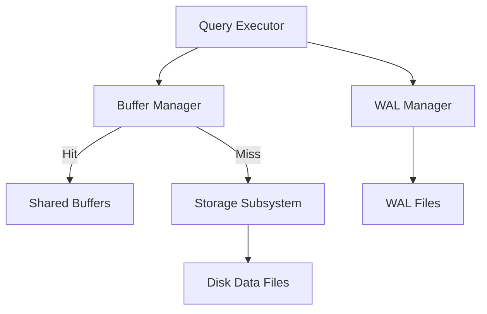

# PostgreSQL Internal Architecture

## 1. Problem Background
PostgreSQL was engineered to provide robust, concurrent, and crash-safe data access. Reading and writing directly from the disk for every SQL query is prohibitively slow due to the latency of secondary storage. Furthermore, ensuring that multiple transactions can operate simultaneously without stepping on each other's data (maintaining ACID properties) requires complex orchestration. Buffer managers, B-Trees, Write-Ahead Logs (WAL), and MVCC are the internal subsystems designed to solve these problems.

## 2. Architecture Overview
When a backend process executes a query, it requests data pages. Instead of fetching from disk immediately, the request routes through the Buffer Manager. 



## 3. Internal Design

### Buffer Manager
*   Located in `src/backend/storage/buffer/`.
*   **Shared Buffers:** A pre-allocated segment of shared memory caching heavily used disk pages.
*   **Buffer Replacement:** PostgreSQL uses a variation of the clock sweep algorithm. Pages are given a usage count, which decreases during clock sweeps. Pages with a zero count are evicted when new pages need memory.

### B-Tree Implementation
*   Found in `src/backend/access/nbtree`.
*   PostgreSQL implements Lehman and Yao's high-concurrency B-tree algorithm.
*   **Search Path:** Root node -> Internal nodes -> Leaf nodes. Leaf nodes contain tuple identifiers (TIDs) that point to actual rows in the heap.
*   **Page Splits:** When an insert occurs on a full page, PostgreSQL splits it, allocating a new page and linking it with a "right-link" to handle concurrent searches smoothly.

### MVCC (Multi-Version Concurrency Control)
*   Instead of acquiring locks on rows being read, PostgreSQL writes a *new version* of the row on an `UPDATE` operation, keeping the old one intact.
*   **xmin / xmax:** Every row header contains an `xmin` (Transaction ID that created the row) and `xmax` (Transaction ID that deleted/updated it).
*   **Visibility Rules:** A transaction only sees rows where `xmin` is committed before the current transaction's snapshot started, and `xmax` is either blank or not yet committed.

### WAL (Write-Ahead Logging)
*   All modifications are written to the WAL before being applied to the data pages in the buffer pool.
*   Provides **Durability Guarantees:** If the server crashes, data in memory is lost, but the WAL on disk can be replayed to restore the database to its exact pre-crash state.

## 4. Design Trade-Offs
*   **MVCC Bloat vs Fast Rollbacks:** Because PostgreSQL implements MVCC by keeping old row versions in the same heap file (unlike InnoDB's separate undo logs), update-heavy workloads cause tables to "bloat". This necessitates a background `VACUUM` process to mark old versions as free space. The advantage is that rolling back a transaction is practically instantaneous—it just requires marking the transaction as aborted in the Commit Log (CLOG), with no physical undo required.

## 5. Experiments / Observations
Running `EXPLAIN ANALYZE` on a multi-table join:
```sql
EXPLAIN ANALYZE SELECT * FROM orders o JOIN customers c ON o.customer_id = c.id;
```
**Observation:** 
The query planner heavily relies on statistics stored in `pg_statistic`. If the planner estimates a small result set, it might choose a `Nested Loop Join`. If the table is large, it switches to a `Hash Join`. Running `VACUUM ANALYZE` updates these statistics; observing the plan before and after analyzing a newly populated table demonstrates how critical accurate statistics are to preventing terrible execution plans.

## 6. Key Learnings
*   Pages flow through the Buffer Manager to mask disk latency.
*   `VACUUM` is not just housekeeping; it is a fundamental requirement of PostgreSQL's specific MVCC implementation.
*   WAL ensures durability by decoupling expensive random I/O (updating data pages) from fast sequential I/O (appending to the log).
