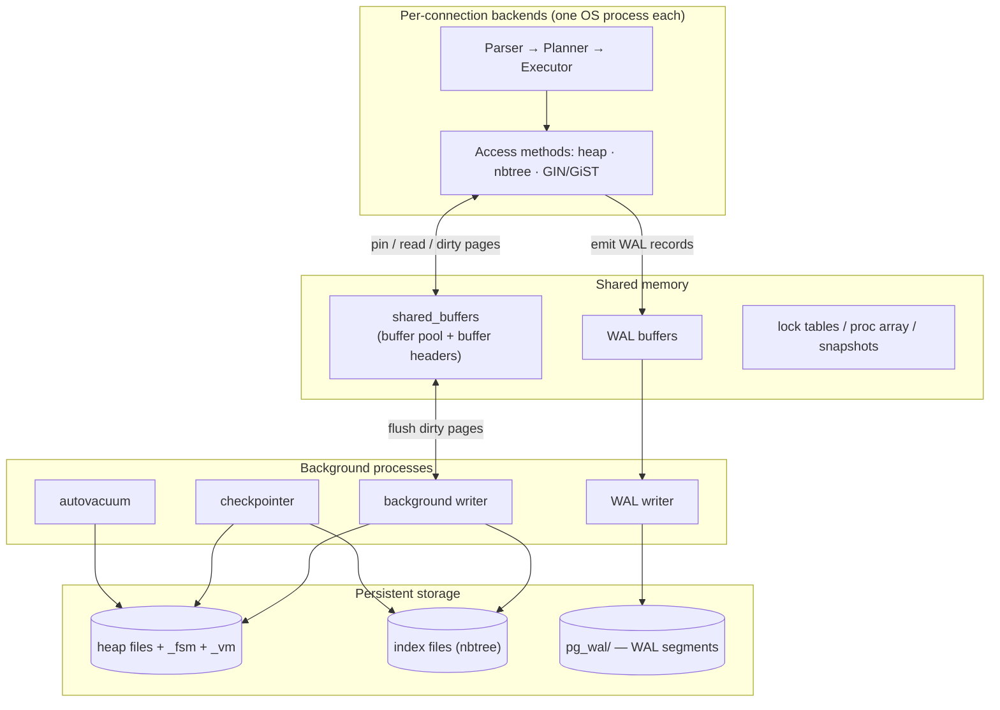

# PostgreSQL Internal Architecture

> Advanced DBMS · System Design Discussion · Topic 2
>
> This document opens up four of PostgreSQL's core subsystems — the **Buffer Manager**, the **B-Tree (`nbtree`)** access method, **MVCC**, and the **Write-Ahead Log** — and explains not just *what* they do but *why* they are built the way they are. Every major claim is backed by output captured from a live **PostgreSQL 16** server, inspected at the byte level with `pageinspect`, `pg_buffercache`, `pgstattuple`, and `pg_walinspect`. The recurring lesson: these four subsystems are not independent features but a single interlocking design for **durable, highly-concurrent, crash-safe storage**.

## Table of Contents

1. [Problem Background](#1-problem-background)
2. [Architecture Overview](#2-architecture-overview)
3. [Internal Design](#3-internal-design)
   - [3.1 Buffer Manager](#31-buffer-manager)
   - [3.2 B-Tree (nbtree)](#32-b-tree-nbtree)
   - [3.3 MVCC](#33-mvcc-multi-version-concurrency-control)
   - [3.4 WAL (Write-Ahead Logging)](#34-wal-write-ahead-logging)
4. [Design Trade-Offs](#4-design-trade-offs)
5. [Experiments & Observations](#5-experiments--observations)
6. [Key Learnings](#6-key-learnings)
7. [References](#7-references)

---

## 1. Problem Background

PostgreSQL is a client-server, multi-process relational database descended from the Berkeley **POSTGRES** project (Michael Stonebraker, 1986). Its job is to be a **system of record**: many transactions, running concurrently across many backend processes, must read and write shared data while the database guarantees the four hard properties — **atomicity, consistency, isolation, durability** — even across an abrupt crash or power loss.

Those guarantees cannot be met by any single mechanism. They emerge from cooperation between four subsystems:

| Property at risk | Subsystem that defends it |
|---|---|
| "Disk is slow; we can't read a page per row" | **Buffer Manager** — caches hot pages in shared memory |
| "Find a row among millions, fast" | **B-Tree index** — logarithmic search |
| "Many readers and writers must not block each other" | **MVCC** — versioned tuples + snapshots |
| "A crash must not lose committed data or corrupt pages" | **WAL** — log the intent before mutating data |

This document studies each in turn and then shows how they connect — for instance, that a single `INSERT` touches *all four*: it pins a buffer (Buffer Manager), inserts into both heap and index B-tree, stamps the new tuple with a transaction id (MVCC), and emits WAL records for heap *and* index before commit (WAL). We confirm exactly this in [§5.4](#54-wal-one-insert-touches-heap-and-index).

---

## 2. Architecture Overview

PostgreSQL is **multi-process**: a `postmaster` forks one **backend** per client connection, and a set of **background processes** maintain shared state. All of them coordinate through one region of **shared memory**, whose largest component is `shared_buffers` — the page cache that the Buffer Manager governs.



**Flow of a query:** the backend's executor asks an access method (heap or `nbtree`) for pages. The access method requests them from the **Buffer Manager**, which returns a cached copy if present or reads it from disk into a free buffer. Modifications happen *in the buffer* (marked dirty) and are described in **WAL records** appended to the WAL buffer. On `COMMIT`, the WAL up to the commit record is `fsync`'d — that is the durability point. The dirty data pages themselves are written back **lazily** by the background writer and checkpointer. This "log eagerly, write data lazily" split is the central performance idea of the whole engine.

---

## 3. Internal Design

### 3.1 Buffer Manager

**Location in source:** `src/backend/storage/buffer/` (notably `bufmgr.c`, `freelist.c`).

The Buffer Manager owns `shared_buffers`: a fixed array of 8 KB **buffer frames** plus a parallel array of **buffer headers** (tag = which page, pin count, dirty flag, `usagecount`). Every backend that wants a page goes through it.

**Reading a page (the lookup path):**

1. Compute the buffer tag `(relation, fork, block#)`.
2. Probe a shared hash table. **Hit** → pin the buffer, return it (no I/O).
3. **Miss** → find a victim frame, read the page from disk into it, register it in the hash table, return it.

**Page caching & sharing.** Because the pool is *shared*, when 50 backends read the same hot page they share **one** physical copy and coordinate with lightweight pins and `LWLock`s — this is what makes high read concurrency cheap. I confirmed which relations actually occupy the pool right now:

```text
    relname     | buffers | cached  | pct_of_pool
----------------+---------+---------+-------------
 orders         |    3189 | 25 MB   |        19.5     ← whole heap resident
 orders_pkey    |    1374 | 11 MB   |         8.4     ← its B-tree, also hot
 customers      |     322 | 2576 kB |         2.0
 customers_pkey |     139 | 1112 kB |         0.8
```

**Buffer replacement — the clock sweep.** PostgreSQL does *not* use strict LRU (too much lock contention to maintain a global list). It uses a **clock-sweep** approximation: every buffer has a `usagecount` (0–5). Each access bumps it (capped at 5). To find a victim, a "clock hand" sweeps the array; if a buffer's `usagecount > 0` it is decremented and skipped; the first buffer found at 0 (and unpinned) is evicted. Hot pages keep getting reprieved; cold pages drift to 0 and die. The live distribution shows exactly this pattern — a large hot cluster pinned at the maximum count of 5:

```text
 usagecount | buffers | dirty
------------+---------+-------
          1 |    1306 |     1
          2 |      99 |     1
          5 |    5575 |    74     ← hot working set, max usagecount
   (null)   |    9328 |     0     ← never-used (empty) frames
```

**Page writes.** A backend never blocks to write its own dirty page to disk on the critical path. The **background writer** trickles dirty buffers out ahead of demand, and the **checkpointer** flushes everything dirty at checkpoint time. Crucially, a dirty page may be written to disk **only after** the WAL records describing its changes are durable — the **WAL-before-data** rule ([§3.4](#34-wal-write-ahead-logging)).

### 3.2 B-Tree (`nbtree`)

**Location in source:** `src/backend/access/nbtree/`.

PostgreSQL's default index is a **Lehman & Yao high-concurrency B+-tree**: all data lives in the leaves, leaves are linked left-to-right, and each page stores a "high key" plus a right-link so a descending search can recover even while another backend is splitting a page (very few locks held).

**Index page layout.** Like every PostgreSQL page it is 8 KB with line pointers growing down and items growing up. Internal pages hold *(separator key → child block)* downlinks; leaf pages hold *(index key → heap TID)*.

**The tree's shape, inspected live** (`bt_metap` on the 500k-row `orders_pkey`):

```text
 magic  | version | root | level | fastroot | fastlevel
--------+---------+------+-------+----------+-----------
 340322 |       4 |  412 |     2 |      412 |         2
```

`level = 2` means the root sits two levels above the leaves — a **3-level tree** (root → internal → leaf). So any primary-key lookup over half a million rows is **at most 3 page accesses**. That is the whole point of a B-tree: height grows logarithmically, so row count can grow enormously while lookup cost barely moves.

**The search path,** reading the actual root page (`bt_page_items`):

```text
 itemoffset |   ctid   | itemlen |      key (hex)
------------+----------+---------+-------------------------
          1 | (3,0)    |       8 |                          ← "minus infinity" (leftmost)
          2 | (411,1)  |      16 | 77 97 01 00 00 00 00 00  ← keys ≥ 0x019777 go to block 411
          3 | (698,1)  |      16 | ed 2e 03 00 00 00 00 00
          4 | (984,1)  |      16 | 63 c6 04 00 00 00 00 00
```

Each entry is a **downlink**: a separator key plus the `ctid` of the child page. A search for key *K* scans this internal page for the right separator, follows that child block, and repeats until it reaches a leaf — whose entries point at heap tuples by TID.

**Insert & page splits.** An insert descends to the correct leaf and adds the entry in sorted position. If the leaf has no room, it **splits**: roughly half the entries move to a new right-hand page, the linked list and high keys are fixed up, and a new downlink is *propagated up* to the parent. If the root itself splits, the tree gains a level. Splits are why the tree stays balanced regardless of insertion order — but they are also extra work and WAL traffic, which is why a **monotonically increasing key** (append to the rightmost leaf) is the cheapest insert pattern.

### 3.3 MVCC (Multi-Version Concurrency Control)

PostgreSQL's headline concurrency property — **readers never block writers and writers never block readers** — comes from never overwriting a row in place. An `UPDATE` writes a **new version** of the tuple and marks the old one expired. Each heap tuple header carries two transaction-id stamps:

- **`xmin`** — the txid that *created* this version.
- **`xmax`** — the txid that *expired* this version (0 = still live).

Inspected at the byte level on a real heap page (`heap_page_items`):

```text
 lp | t_ctid | t_xmin | t_xmax | t_infomask | t_infomask2
----+--------+--------+--------+------------+-------------
  1 | (0,1)  |    797 |      0 |       2306 |           4
  2 | (0,2)  |    797 |      0 |       2306 |           4
```

`t_xmin = 797`, `t_xmax = 0` → "created by transaction 797, never deleted, currently live." The `t_infomask` bits cache commit status (e.g. `XMIN_COMMITTED`) so visibility checks are fast.

**Visibility rule (simplified).** A transaction holds a **snapshot** = the set of txids in progress at snapshot time. A tuple is visible iff its `xmin` is *committed and not in the snapshot's in-progress set*, **and** its `xmax` is *not* committed-visible. This single rule gives each transaction a consistent view without read locks.

**Snapshot isolation levels:**

| Level | Snapshot strategy |
|---|---|
| Read Committed (default) | A new snapshot at the start of **each statement** |
| Repeatable Read | One snapshot for the **whole transaction** |
| Serializable | Repeatable Read **+ SSI** (tracks read/write dependencies, aborts dangerous cycles) |

**Why VACUUM is necessary.** Old versions accumulate as **dead tuples**. They are invisible to everyone once no snapshot can see them, but they still occupy heap space and index entries until **VACUUM** reclaims them. VACUUM also **freezes** very old `xmin` values to a special always-visible marker, preventing **transaction-id wraparound** (txids are 32-bit and cycle). The live update from [§5.2](#52-mvcc-an-update-creates-a-new-version) left exactly one dead tuple, visible to `pgstattuple`:

```text
 tuple_count | live_data | dead_tuple_count | dead_data
-------------+-----------+------------------+-----------
      500000 | 21 MB     |                1 | 44 bytes     ← one dead version awaiting VACUUM
```

### 3.4 WAL (Write-Ahead Logging)

**The rule:** *a change must be recorded durably in the WAL before the corresponding data page is allowed to reach disk.* This single ordering constraint is what makes crash recovery possible — and it is why commit can be fast (one sequential WAL `fsync`) while data-page writes stay lazy and out of the hot path.

**WAL records.** Every modification (heap insert/update/delete, index insert, page split, etc.) produces a WAL record tagged with a **resource manager** (Heap, Btree, Transaction…) and a **LSN** (Log Sequence Number — a byte offset into the logical WAL stream). Each page stores the LSN of the last change applied to it; the rule "don't flush a data page until WAL ≥ that page's LSN is durable" is enforced via the LSN.

**Durability at commit.** On `COMMIT`, the backend flushes WAL up to its commit record and `fsync`s it. Only then does it acknowledge the commit. The WAL advancing in real time:

```text
 lsn_before | wal_segment
------------+--------------------------
 0/BB4DE00  | 00000001000000000000000B
-- INSERT 10000 rows --
 lsn_after
-----------
 0/BD5FA98          ← LSN advanced by ~2 MB of log for the batch
```

**Crash recovery.** After a crash, PostgreSQL starts from the last **checkpoint** (a known-good point where all prior dirty pages were flushed) and **replays (REDO)** every WAL record forward, reconstructing any changes that were logged but whose data pages never made it to disk. **`full_page_writes`** guards against **torn pages**: the first modification to a page after a checkpoint logs the *entire* page image, so a partially-written 8 KB page can be restored wholesale during replay.

**Checkpointing** bounds recovery time: the checkpointer periodically (every `checkpoint_timeout`, or when `max_wal_size` is hit) flushes all dirty buffers and records a checkpoint, after which older WAL can be recycled. The relevant durability config on this server:

```text
        name        | setting        ← all the durability knobs are ON
--------------------+---------
 fsync              | on
 full_page_writes   | on
 synchronous_commit | on
 wal_level          | replica   ← enough WAL detail to feed a replica
 checkpoint_timeout | 300 (s)
 max_wal_size       | 1024 (MB)
```

---

## 4. Design Trade-Offs

**Buffer Manager — clock-sweep vs. true LRU.** A globally-accurate LRU would require taking a lock and moving a list node on *every* page touch — a contention disaster with dozens of backends. The clock-sweep is an *approximate* LRU that needs only a cheap atomic `usagecount` bump on access, trading a little eviction accuracy for enormous concurrency. *Advantage:* scales to many cores. *Limitation:* a big sequential scan can still pollute the cache (mitigated by ring buffers for large scans).

**B-Tree — balanced reads vs. write amplification.** B-trees give guaranteed logarithmic lookups and ordered range scans, and stay balanced under any insert order. *Cost:* maintaining balance means **page splits**, which write extra pages and WAL, and random-key inserts scatter writes across the tree. This is precisely the weakness that **LSM-tree** engines (e.g. RocksDB) attack by turning random writes into sequential ones — a different point on the read/write trade-off curve.

**MVCC — concurrency bought with garbage.** Never overwriting means readers and writers almost never block, and rollback is trivial (the old version is still there). *The bill:* dead tuples cause **bloat**, and the system needs **VACUUM** plus **xid-freezing** forever. This is the key contrast with **InnoDB's MVCC**, which keeps old versions in separate **undo logs** and updates the row in place — InnoDB avoids heap bloat but pays with undo-log maintenance and a **purge** thread. PostgreSQL chose in-heap versioning for **simplicity and extensibility** (every access method works uniformly, no central undo to contend on); it accepts VACUUM as the price.

**WAL — durability with one sequential write.** Logging the *intent* lets commit cost a single sequential `fsync` instead of scattering random data-page writes synchronously. *Cost:* every change is essentially **written twice** (once to WAL, later to the data file = write amplification), and `full_page_writes` inflates WAL right after each checkpoint. The payoff is decisive: cheap commits, crash recovery, **and** the same WAL stream powers streaming replication and point-in-time recovery.

| Subsystem | What it optimizes | What it costs |
|---|---|---|
| Buffer Manager (clock-sweep) | Read concurrency, low lock contention | Approximate eviction; scans can pollute cache |
| B-Tree (`nbtree`) | Logarithmic lookups, ordered scans | Page splits, write amplification on random keys |
| MVCC (in-heap versions) | Lock-free reads/writes, easy rollback | Bloat → mandatory VACUUM + xid freezing |
| WAL | Fast durable commits, replication, recovery | Double-write (WAL + data), full-page-write inflation |

---

## 5. Experiments & Observations

All output is from **PostgreSQL 16**, schema `customers(50k)` + `orders(500k)`, index on `orders.customer_id`, inspected with `pageinspect` / `pg_buffercache` / `pgstattuple` / `pg_walinspect`.

### 5.1 The recommended exercise: `EXPLAIN ANALYZE` on a multi-table join

A per-country revenue aggregation over the join:

```text
Sort  (actual time=71.7..72.8 rows=5)
 -> Finalize GroupAggregate
   -> Gather Merge  (Workers Planned: 2, Launched: 2)        ← parallel execution
     -> Partial HashAggregate
       -> Hash Join  (rows=166667 loops=3)                   ← hash join chosen
         Hash Cond: (o.customer_id = c.id)
         -> Parallel Seq Scan on orders o  (rows=166667 loops=3)
         -> Hash (Buckets: 65536  Memory: 2466kB)
           -> Seq Scan on customers c (rows=50000)
 Planning Time: 1.921 ms   Execution Time: 72.935 ms
```

The planner chose a **parallel hash join** across 2 workers. `BUFFERS` reported `shared hit=4186` with **zero disk reads** — the Buffer Manager ([§3.1](#31-buffer-manager)) had the whole working set resident, which is consistent with the `pg_buffercache` snapshot showing `orders` + `orders_pkey` occupying ~28% of the pool.

**Planner estimates vs. actual + `pg_statistic`.** For a *selective* predicate (`WHERE c.id = 12345`) the planner flips to an index/bitmap plan, estimating ~11 matching orders and getting 8. Those estimates come from `pg_statistic` (via `pg_stats`), refreshed by `ANALYZE`:

```text
 attname     | n_distinct | correlation
-------------+------------+-------------
 id          |         -1 |   1.000     ← unique, physically ordered (the serial PK)
 customer_id |      46368 |  -0.004     ← ~46k distinct values, heap NOT ordered by it
```

`n_distinct ≈ 46368` over 500k rows yields the "≈11 rows per customer" estimate that justifies an index scan; `correlation ≈ 0` tells the planner the heap is unordered on `customer_id`, so a **bitmap** scan (which sorts page fetches) beats a plain index scan. This is the full **EXPLAIN ANALYZE → planner estimate → `pg_statistic`** chain the exercise asks for, observed end-to-end.

### 5.2 MVCC: an UPDATE creates a new version

Reading the hidden system columns before and after a single update:

```text
-- before                                    -- after  (UPDATE … WHERE id=100)
  ctid   | xmin | xmax                          ctid     | xmin | xmax
---------+------+------                       ------------+------+------
 (0,100) |  797 |    0                         (3184,113) |  842 |    0
```

The row **physically moved** (`ctid (0,100) → (3184,113)`) and got a **new `xmin`** (797 → 842). PostgreSQL did not overwrite the original — it wrote a new version and expired the old one, leaving the dead tuple that `pgstattuple` reported in [§3.3](#33-mvcc-multi-version-concurrency-control). **This is why VACUUM exists**, made concrete.

### 5.3 Buffer Manager: clock-sweep usagecounts

See [§3.1](#31-buffer-manager) — the live `usagecount` histogram (a hot cluster of 5575 buffers pinned at the max count of 5, 9328 frames never used) is the clock-sweep's "hot pages survive, cold pages drift to 0" behavior captured in a single snapshot.

### 5.4 WAL: one INSERT touches heap *and* index

Decoding the actual WAL records emitted by a bulk insert (`pg_walinspect`):

```text
 resource_manager | records | bytes
------------------+---------+--------
 Btree            |    1102 | 108 kB     ← index maintenance is logged too
 Heap             |     566 | 76 kB      ← the row inserts
 Heap2            |      14 | 6968 bytes
 Transaction      |       2 | 947 bytes  ← the commit records
```

This is the subsystem interlock made visible: a plain `INSERT` generated **Heap** records *and* **Btree** records, because durability must cover the index as much as the table — otherwise a crash could leave a recovered row that no index can find. WAL protects the *whole* logical change, not just the heap.

### 5.5 B-Tree height vs. row count

`bt_metap` reported `level = 2` (a 3-level tree) for an index over 500,000 rows ([§3.2](#32-b-tree-nbtree)). A useful sanity check on the logarithmic promise: each 8 KB internal page holds hundreds of downlinks, so three levels already address *hundreds of millions* of rows. Growing `orders` 100× would, at most, add a single level — the defining property that makes B-tree lookups scale.

---

## 6. Key Learnings

1. **The four subsystems are one design, not four features.** A single `INSERT` pins a buffer, mutates heap + index, stamps an MVCC xid, and emits heap *and* index WAL before commit ([§5.4](#54-wal-one-insert-touches-heap-and-index)). You cannot understand any one of them in isolation — durability (WAL) is meaningless without knowing what it protects (heap + B-tree pages held by the Buffer Manager), and MVCC's bloat is what VACUUM and the buffer pool must absorb.

2. **"Log eagerly, write data lazily" is the central performance idea.** Commit only needs one sequential WAL `fsync`; the expensive random data-page writes are deferred to the background writer/checkpointer. This is why PostgreSQL can commit thousands of transactions per second without thrashing the disk.

3. **Approximations beat exactness when concurrency is the goal.** The clock-sweep is a *deliberately* imperfect LRU because exact LRU's locking would not scale. Watching most hot buffers sit pinned at `usagecount = 5` ([§5.3](#53-buffer-manager-clock-sweep-usagecounts)) shows the approximation works fine in practice.

4. **MVCC's elegance and its tax are the same mechanism.** Never overwriting gives lock-free reads and trivial rollback — and *inevitably* produces dead tuples. Seeing a `ctid` jump on `UPDATE` ([§5.2](#52-mvcc-an-update-creates-a-new-version)) makes VACUUM feel less like a chore and more like the unavoidable other half of the design.

5. **Statistics actively choose plans.** The same join became a parallel hash join or a bitmap index scan depending entirely on `pg_statistic`'s `n_distinct`/`correlation` ([§5.1](#51-the-recommended-exercise-explain-analyze-on-a-multi-table-join)). Stale stats don't just slow things down — they make the planner choose the wrong algorithm.

6. **Surprising observation:** a B-tree over half a million rows is only **3 levels deep** ([§5.5](#55-b-tree-height-vs-row-count)), and a 100× larger table would add at most one level. The "logarithmic" claim is easy to recite and genuinely striking to measure.

---

## 7. References

- PostgreSQL 16 documentation — *Internals*, *Database Physical Storage*, *Concurrency Control (MVCC)*, *Reliability and the Write-Ahead Log*, *Routine Vacuuming*, *Using EXPLAIN*, *How the Planner Uses Statistics* — https://www.postgresql.org/docs/16/
- PostgreSQL source: `src/backend/storage/buffer/` (Buffer Manager), `src/backend/access/nbtree/` (B-Tree).
- P. Lehman & S. Yao, *Efficient Locking for Concurrent Operations on B-Trees*, ACM TODS 1981 (the `nbtree` algorithm).
- H. Suzuki, *The Internals of PostgreSQL* — https://www.interdb.jp/pg/
- Contrib modules used for inspection: `pageinspect`, `pg_buffercache`, `pgstattuple`, `pg_walinspect`.
- All experiment output in §5 was generated locally on PostgreSQL 16 for this submission.

---

*Submitted for the Advanced DBMS System Design Discussion. All prose, diagrams, and experiments are original work; sources consulted are credited above.*
