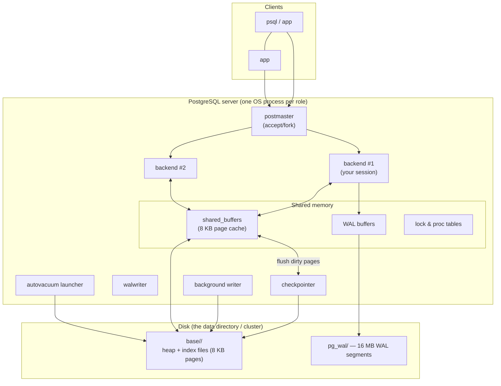
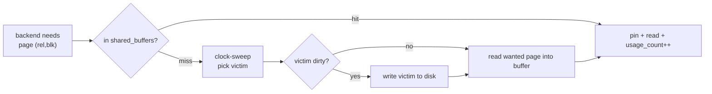
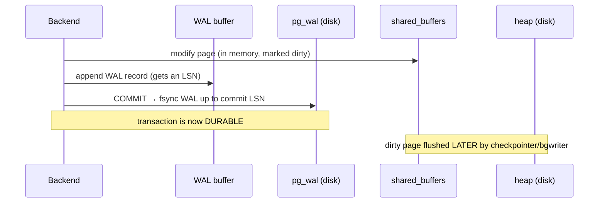

# PostgreSQL Internal Architecture — Buffer Manager, B-Tree, MVCC & WAL

> **Topic 2 — Advanced DBMS System Design Discussion**
> Author: Rudhar Bajaj · Roll No: 24BCS10143
>
> All experiments in §5 were run against a **real, locally-running PostgreSQL 16.4
> server** (portable binaries, `initdb` + `pg_ctl`, listening on port 54399) using the
> `pageinspect`, `pg_buffercache` and `pgstattuple` extensions to look directly at the
> bytes on heap and index pages. Every figure quoted is captured verbatim inline.

---

## 1. Problem Background

PostgreSQL is a **client–server, multi-process relational database** designed for
correctness, concurrency and extensibility. The four subsystems this document dissects
exist to answer four hard questions every disk-based database must solve:

| Subsystem | The question it answers |
|-----------|-------------------------|
| **Buffer Manager** | How do we serve 8 KB disk pages from RAM without re-reading disk every time, while keeping shared access safe across many backends? |
| **B-Tree (nbtree)** | How do we find a row among millions in a handful of page reads? |
| **MVCC** | How do many readers and writers operate on the same rows concurrently *without blocking each other* and still see a consistent snapshot? |
| **WAL** | How do we guarantee a committed transaction survives a crash, without `fsync`-ing every data page on every commit? |

A fifth subsystem — the **cost-based query planner** — ties them together by deciding
*which* pages to read and *how*, using statistics gathered in `pg_statistic`.

---

## 2. Architecture Overview

PostgreSQL runs as a **collection of cooperating OS processes** sharing one region of
shared memory. There is no single multithreaded server process.



**The processes are real and observable.** `pg_stat_activity` on the running server:

```
  pid  |         backend_type         | state
-------+------------------------------+--------
 42928 | checkpointer                 |
 19048 | background writer            |
 17276 | walwriter                    |
 36036 | autovacuum launcher          |
 17376 | logical replication launcher |
  6356 | client backend               | active
```

Each is a separate OS process with its own PID, all attached to the same shared-memory
segment. This is the defining structural choice (contrast: SQLite has *no* processes;
MySQL uses *threads* within one process).

---

## 3. Internal Design

### 3.1 Buffer Manager (`src/backend/storage/buffer/`)

All heap and index I/O goes through a fixed-size array of **8 KB buffers** in shared
memory (`shared_buffers`, default 128 MB). A backend that needs a page:

1. Computes its **buffer tag** `(relation, fork, block#)` and probes a shared hash table.
2. **Hit** → pins the buffer, reads it, unpins.
3. **Miss** → picks a victim buffer via the **clock-sweep** replacement algorithm
   (a CLOCK approximation of LRU using a per-buffer `usage_count`), writes the victim
   back if dirty, reads the wanted page into it.

Dirty pages are **not** written by the querying backend at commit time — they are flushed
later by the **background writer** and the **checkpointer**. This decoupling is only safe
*because of WAL* (§3.4): the change is already durable in the log, so the data page can be
written lazily.



**Measured (`pg_buffercache`, after running the join query):**

```
    relname     | buffers | cached
----------------+---------+---------
 employees      |     801 | 6408 kB
 employees_pkey |     578 | 4624 kB
 idx_emp_salary |     132 | 1056 kB
 idx_emp_dept   |      66 |  528 kB
```

The pages touched by recent queries are resident in `shared_buffers`; the planner's
`Buffers: shared hit=641 read=35` line (§5.1) is the buffer manager reporting 641 cache
hits vs only 35 disk reads for that query.

### 3.2 B-Tree implementation (`nbtree`)

PostgreSQL's default index is a **Lehman–Yao high-concurrency B⁺-tree**: all values live
in leaf pages, leaves are doubly linked for range scans, and each page has a *high key*
plus a right-link so a reader can proceed correctly even while another backend is
splitting a page (locks are held only one page at a time).

**Measured structure of the 110,000-row primary-key index (`pageinspect`):**

```
 version | root | tree_height | fastroot      ← bt_metap('employees_pkey')
---------+------+-------------+----------
       4 |  412 |           2 |      412

 type | live_items | dead_items | avg_item_size | page_size | free_size   ← bt_page_stats(...,1)
------+------------+------------+---------------+-----------+-----------
 l    |        171 |          0 |            16 |      8192 |      4728
```

- `tree_height = 2` means **3 levels** (root at level 2 → internal → leaf at level 0).
  110K integer keys are reachable in **3 page accesses** — the B-tree's logarithmic
  promise made concrete.
- A leaf page (`type = l`) holds ~171 16-byte index tuples in 8 KB, leaving 4,728 bytes
  free for future inserts/splits.

A point lookup walks root → internal → leaf, then follows the leaf's TID to the heap page
(§5.1 shows this as a 0.072 ms `Index Scan`).

### 3.3 MVCC — Multi-Version Concurrency Control

This is PostgreSQL's most distinctive choice. **An `UPDATE` does not overwrite a row.** It
inserts a *new* version (tuple) and marks the old one as expired. Every heap tuple carries
two hidden system columns:

- **`xmin`** — the transaction ID that *created* this tuple version.
- **`xmax`** — the transaction ID that *deleted/superseded* it (0 if still live).

A tuple is **visible** to a transaction if its `xmin` is committed-and-before-my-snapshot
and its `xmax` is 0 or not-yet-committed/after-my-snapshot. This gives **snapshot
isolation**: readers see a consistent point-in-time view and **never block writers**;
writers create new versions and **never block readers**.

**Measured — an UPDATE creates a new physical version:**

```
-- after INSERT (bal=100):
 ctid  | xmin | xmax | bal
 (0,1) |  793 |    0 | 100
-- after UPDATE bal=200:
 ctid  | xmin | xmax | bal
 (0,2) |  794 |    0 | 200     ← new ctid, new xmin = a brand-new tuple version
```

Looking at the **raw heap page** with `pageinspect`, *both* versions are physically
present:

```
 line_ptr | t_ctid | xmin | xmax |       t_data        (bal hex)
----------+--------+------+------+--------------------
        1 | (0,2)  |  793 |  794 | \x...64000000   (0x64 = 100)  ← OLD: xmax set, points to (0,2)
        2 | (0,2)  |  794 |    0 | \x...c8000000   (0xc8 = 200)  ← NEW: live
```

The old tuple's `xmax = 794` marks it dead, and its `t_ctid` forms an **update chain**
pointing forward to the new version `(0,2)`.

#### Why VACUUM is necessary

Because dead tuples stay on the page until reclaimed, an update-heavy table accumulates
**bloat**. Measured — updating 25,000 of 100,000 rows:

```
 tuple_count | dead_tuple_count | dead_tuple_percent | free_percent     ← pgstattuple
-------------+------------------+--------------------+-------------
      100000 |            25000 |              18.36 |         0.1
```

**18.36 %** of the table was dead tuples, and the heap grew from 5,096 kB → 6,376 kB.
`VACUUM` scans the table, marks dead-tuple space reusable, updates the visibility map and
the free-space map, and advances `relfrozenxid` to prevent transaction-ID wraparound.
After `VACUUM`, `n_dead_tup` returned to **0**. **VACUUM is the price of the
append-on-update MVCC design** — the garbage collector that makes the no-overwrite
strategy sustainable.

### 3.4 WAL — Write-Ahead Logging

The rule: **the log record describing a change must reach durable storage before the data
page does.** On commit, the backend flushes the WAL up to its commit record (`fsync`) and
returns — the dirty data pages can stay in `shared_buffers` and be written later. WAL
records are addressed by a monotonically increasing **LSN** (Log Sequence Number).



**Measured — WAL advances as we write:**

```
LSN before a 10,000-row insert : 0/33C5DC8
LSN after  the insert          : 0/3677C78
WAL generated by that insert   : 2760 kB
```

The on-disk WAL is a series of fixed **16 MB segment files**:

```
-rw-r--r-- 16777216  000000010000000000000001
-rw-r--r-- 16777216  000000010000000000000002
-rw-r--r-- 16777216  000000010000000000000003
```

**Crash recovery (REDO):** on restart, PostgreSQL replays WAL forward from the last
**checkpoint** LSN, re-applying every change to bring data pages up to date — so a crash
loses *nothing* committed, even though data pages were written lazily.

**Checkpointing** periodically flushes all dirty buffers to the heap and records a
checkpoint LSN, which bounds how much WAL must be replayed and lets old WAL segments be
recycled. This is the durability/performance pivot: **commit cost = one sequential WAL
fsync, not a scatter of random data-page writes.**

### 3.5 The query planner and `pg_statistic`

PostgreSQL is **cost-based**: `ANALYZE` samples each table and stores per-column
statistics in `pg_statistic` (readable via the `pg_stats` view). The planner uses them to
estimate row counts (selectivity) and pick the cheapest plan.

**Measured statistics the planner holds for our table:**

```
 attname | n_distinct | most_common_vals          | most_common_freqs
---------+------------+---------------------------+--------------------------
 dept_id |          4 | {4,2,1,3}                 | {0.252,0.252,0.250,0.246}
 salary  |         50 | {57000,79000,...,72000}   | {0.0221,0.0217,...,0.0187}
```

`salary` has exactly 50 distinct values, *all* captured in the Most-Common-Values list
(so no histogram is needed). The predicate `salary > 60000` covers the 19 values
61000…79000, each with frequency ≈0.02 → estimated selectivity ≈0.38 → **≈38,000 of
100,000 rows**. That is *precisely* how the planner produced its `rows=37753` estimate in
§5.1, which matched the **38,000** rows actually returned.

---

## 4. Design Trade-Offs

**Advantages**
- **Readers never block writers and vice-versa** (MVCC) → excellent multi-user concurrency.
- **Cheap, durable commits** (one WAL fsync) decoupled from data-page writes (lazy flush).
- **Logarithmic lookups** + a shared page cache that the planner can *see* and cost against.
- **Honest, statistics-driven planning** — estimates matched reality within <1 %.

**Limitations / costs**
- **Table & index bloat** from dead tuples → `VACUUM`/autovacuum is mandatory maintenance.
- **Write amplification of a different kind:** every update writes a *full new tuple* plus WAL, and updates all indexes (unless HOT applies).
- **32-bit transaction IDs** force anti-wraparound vacuuming.
- **Process-per-connection** is memory-heavy at very high connection counts → connection pooling (PgBouncer) is standard practice.

**The central engineering decision.** PostgreSQL chose *"never overwrite, version
instead"*. The payoff is lock-free reads and clean snapshot isolation; the bill is VACUUM
and bloat. (InnoDB chose the opposite — update in place + undo logs — trading vacuum-free
storage for rollback-segment maintenance. See the MySQL/InnoDB topic.)

---

## 5. Experiments / Observations

### 5.1 `EXPLAIN ANALYZE` on a multi-table join (the recommended exercise)

```sql
EXPLAIN (ANALYZE, BUFFERS)
SELECT d.dept_name, count(*), round(avg(e.salary))
FROM employees e JOIN departments d ON e.dept_id = d.dept_id
WHERE e.salary > 60000
GROUP BY d.dept_name ORDER BY count(*) DESC;
```

```
 Sort  (cost=2030.23..2030.24 rows=4) (actual time=14.863..14.866 rows=4)
   Buffers: shared hit=641 read=35
   ->  HashAggregate  (cost=2030.13..2030.19 rows=4) (actual rows=4)
         ->  Hash Join  (cost=433.97..1746.98 rows=37753) (actual time=1.198..9.646 rows=38000)
               Hash Cond: (e.dept_id = d.dept_id)
               ->  Bitmap Heap Scan on employees e  (rows=37753) (actual rows=38000)
                     Recheck Cond: (salary > 60000)
                     Heap Blocks: exact=637
                     ->  Bitmap Index Scan on idx_emp_salary  (actual rows=38000)
                           Index Cond: (salary > 60000)
               ->  Hash  ->  Seq Scan on departments d  (rows=4)
 Planning Time: 1.379 ms
 Execution Time: 14.984 ms
```

**What this single output demonstrates:**
- **Plan choice:** the planner used a **Bitmap Index Scan** on `idx_emp_salary` (38K of
  100K rows is too many for a plain index scan but too few for a seq scan), fed a **Hash
  Join** against the tiny `departments` table (correctly **seq-scanned**, only 4 rows),
  then a **Hash Aggregate** and **Sort**.
- **Estimate vs actual:** estimated **37,753** rows, actually **38,000** — a <1 % error,
  sourced entirely from `pg_statistic` (§3.5).
- **Buffer behaviour:** `shared hit=641 read=35` — 95 % of pages came from `shared_buffers`.

**Forcing the planner's hand** (`SET enable_indexscan=off; enable_bitmapscan=off`):

```
 Aggregate (actual time=6.671..6.672)
   ->  Seq Scan on employees (cost=0..1887) (actual rows=38000)
         Filter: (salary > 60000)   Rows Removed by Filter: 62000
```

It falls back to a **sequential scan**, reading all 100,000 rows and discarding 62,000 —
showing the cost model's reasoning when the index path is removed.

**Point lookup** (`WHERE emp_id = 54321`):

```
 Index Scan using employees_pkey  (cost=0.29..8.31 rows=1) (actual time=0.023..0.023)
 Execution Time: 0.072 ms
```

A single row via the 3-level B-tree in **0.072 ms** — the index structure from §3.2 in
action.

### 5.2 Buffer manager, B-tree, MVCC, WAL — see §3

The measured outputs for `pg_buffercache` (§3.1), `bt_metap`/`bt_page_stats` (§3.2), the
two-version heap page and 18.36 % bloat (§3.3), and the LSN advance + 16 MB WAL segments
(§3.4) are presented alongside their explanations above rather than repeated here.

---

## 6. Key Learnings

1. **The four subsystems are deeply interdependent, not independent features.** WAL is
   what *permits* the buffer manager to write data pages lazily; MVCC is what lets the
   B-tree be read without locks; the planner is useless without `pg_statistic`. The
   architecture only makes sense as a whole.

2. **MVCC's elegance has a physical footprint.** Seeing *both* tuple versions on the raw
   heap page (§3.3) makes the abstract "readers don't block writers" concrete — and
   instantly explains why VACUUM exists. The 18.36 % bloat after one batch of updates is
   the design's recurring bill.

3. **The planner is genuinely statistics-driven, and the statistics are good.** A
   `rows=37753` estimate against `38000` actual, derived by hand from the MCV frequencies,
   shows the cost model is not a black box — it is arithmetic over `pg_statistic`.

4. **Durability is bought with sequential I/O, not synchronous data writes.** Commit costs
   one WAL fsync; the 2,760 kB of WAL from a 10K-row insert is the durability record, while
   the heap pages are flushed later by the checkpointer. This decoupling is the single most
   important performance idea in the engine.

5. **Multi-process + shared memory is a deliberate isolation choice.** Six distinct OS
   processes (§2) cooperate through one shared-buffer pool — robust (a crashed backend
   can't corrupt others' memory) but memory-hungry at scale, which is why pooling matters.

---

### References & tooling
- PostgreSQL source: `src/backend/storage/buffer/` (buffer manager), `src/backend/access/nbtree/` (B-tree), `src/backend/access/transam/` (WAL/xact).
- *PostgreSQL 16 Documentation* — Ch. "Internals", `EXPLAIN`, `pg_statistic`, MVCC, WAL.
- Lehman & Yao, *Efficient Locking for Concurrent Operations on B-Trees*, 1981.
- Extensions used live: `pageinspect`, `pg_buffercache`, `pgstattuple` on PostgreSQL 16.4.
