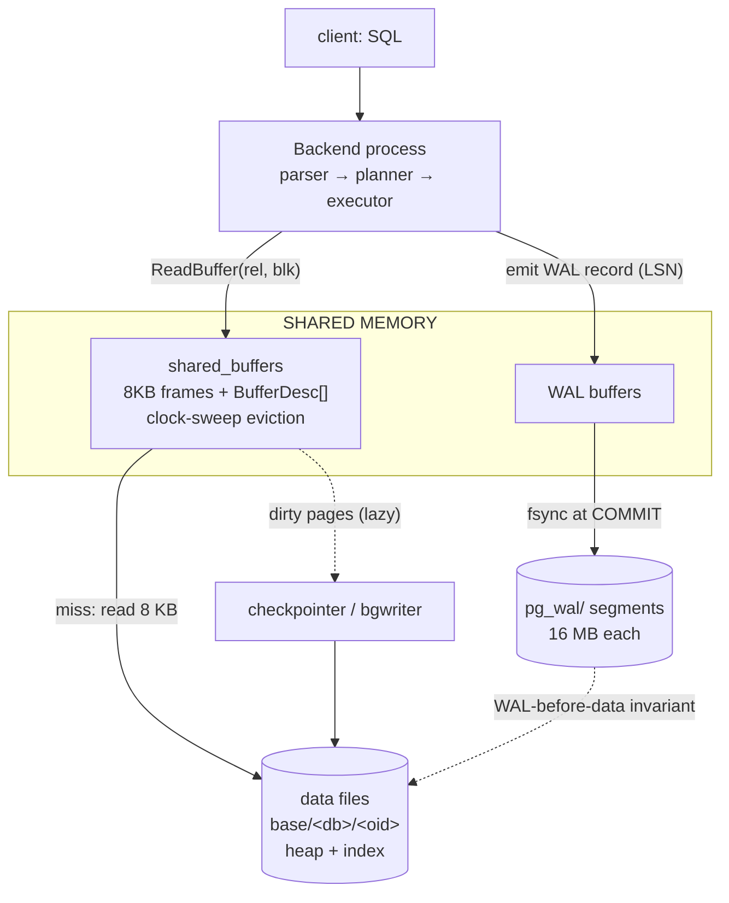

# PostgreSQL Internal Architecture

> A database-internals deep dive into how PostgreSQL turns an 8 KB page on disk into a queryable, durable, concurrently-mutable row store. Every number in the Experiments section is captured from a live PostgreSQL 17.10 cluster (`shared_buffers=16MB`, autovacuum off) — no figures are invented.

---

## 1. Problem Background

A relational engine has to satisfy four demands that pull in different directions:

1. **Fast access** to rows that live on slow, block-oriented storage.
2. **Concurrent readers and writers** that must not block each other or see torn state.
3. **Durability** — once `COMMIT` returns, the data survives a crash mid-write.
4. **Good plans** — the engine must pick a join order / access method without executing the query first.

PostgreSQL's answer to each is a distinct subsystem, but they are deeply coupled by one design decision: **PostgreSQL never updates a row in place**. An `UPDATE` writes a *new* tuple version and leaves the old one behind. This single choice (MVCC) is what makes readers lock-free, but it is also why VACUUM must exist, why the buffer manager must cope with bloat, and why WAL records describe physical page changes rather than logical row changes.

The rest of this document follows a page through the system and shows how these subsystems interlock.

| Concern | Subsystem | Source tree |
|---|---|---|
| Caching 8 KB pages in RAM | Buffer Manager | `src/backend/storage/buffer/` |
| Indexed lookup / range scan | B-Tree (B-link) | `src/backend/access/nbtree/` |
| Row versioning & visibility | Heap / MVCC | `src/backend/access/heap/` |
| Crash durability | WAL / xact | `src/backend/access/transam/` |
| Reclaiming dead versions | VACUUM | `src/backend/access/heap/vacuumlazy.c` |
| Cost-based planning | Planner | `src/backend/optimizer/`, stats in `pg_statistic` |

---

## 2. Architecture Overview

Everything flows through shared memory. Backends (one OS process per connection) read and write **pages**, never raw disk offsets. A page is the universal currency: 8 KB, identified by `(relation, block number)`, cached in `shared_buffers`, protected by WAL, and version-tagged for MVCC.



The detailed view below shows the same flow with the `BufferDesc` control state
and the explicit WAL-before-data ordering:

```text
                          ┌──────────────────────────────────────────────┐
   client ── SQL ───────▶ │  Backend process (parser → planner → executor)│
                          └───────────────┬──────────────────────────────┘
                                          │ ReadBuffer(rel, blk)
                                          ▼
          ┌───────────────────────────────────────────────────────────────┐
          │                     SHARED MEMORY                               │
          │                                                                 │
          │   shared_buffers (array of 8 KB frames)      WAL buffers        │
          │   ┌────┬────┬────┬────┐  + BufferDesc[]      ┌──────────────┐   │
          │   │page│page│page│page│   (tag, usagecount,  │ pending WAL  │   │
          │   └────┴────┴────┴────┘    dirty, refcount)  │ records      │   │
          │        ▲   clock-sweep victim selection      └──────┬───────┘   │
          └────────┼─────────────────────────────────────────┼─────────────┘
                   │ miss → read 8 KB                          │ fsync at commit
                   ▼                                           ▼
          ┌─────────────────┐                        ┌───────────────────┐
          │ data files       │  checkpointer flushes  │  WAL segments     │
          │ base/<db>/<oid>  │◀── dirty pages ────────│  pg_wal/0000...03 │
          │ (heap + index)   │                        │  (16 MB each)     │
          └─────────────────┘                        └───────────────────┘
```

The invariant tying the two lower boxes together is **Write-Ahead Logging**: a dirty page may not be flushed to its data file until the WAL record describing that change is already durable. That ordering is the whole basis of crash recovery (Section 3.4).

---

## 3. Internal Design

### 3.1 Buffer Manager — `src/backend/storage/buffer/`

The buffer manager owns a fixed array of 8 KB frames (`shared_buffers`) plus a parallel array of `BufferDesc` control structures (`buf_internals.h`). Each descriptor holds the buffer **tag** (the `(rel, fork, block)` identity), a `usage_count`, flags (`BM_DIRTY`, `BM_VALID`, `BM_TAG_VALID`), a pin/reference count, and a per-buffer lightweight lock.

**Life of a page request** (`ReadBuffer` → `BufferAlloc` in `bufmgr.c`):

```text
  ReadBuffer(rel, blk)
        │
        ├─ hash lookup in shared buffer table (tag → buffer id)
        │
        ├── HIT ──▶ pin buffer, usage_count++ (capped), return
        │
        └── MISS ─▶ need a free frame
                     │
                     ├─ no free frame → run CLOCK-SWEEP to pick a victim
                     │      sweep hand visits buffers in a ring:
                     │        if pinned        → skip
                     │        if usage_count>0 → usage_count--, move on
                     │        if usage_count=0 → EVICT this one
                     │
                     ├─ if victim BM_DIRTY → write it out (WAL must be flushed first!)
                     ├─ read 8 KB from disk into the frame
                     └─ set tag, usage_count=1, BM_VALID, pin, return
```

**Why clock-sweep, not LRU?** A true LRU needs a global, mutex-protected linked list touched on *every* access — a scalability disaster under concurrency. Clock-sweep approximates LRU with O(1) per-access cost: a hit just bumps a counter (no list surgery, no global lock). The "second chance" is the decrement: a buffer survives a sweep for every access it accumulated, so hot pages are revisited and re-armed before they can be evicted. The trade-off accepted is *precision* — clock-sweep can evict a page that LRU would have kept — in exchange for *contention-free hits*, which is the right call when thousands of backends hammer the cache.

The `usage_count` is capped at `BM_MAX_USAGE_COUNT = 5`. Capping matters: an uncapped counter would let a page that was hot an hour ago accumulate hundreds of "lives" and become effectively un-evictable long after it went cold. Capping bounds how long stale heat can protect a page.

**Dirty pages** are *not* written by the backend that dirtied them (that would put disk I/O on the query's critical path). They are flushed lazily by the **background writer** and durably by the **checkpointer**. The only hard rule is WAL-before-data.

### 3.2 B-Tree — `src/backend/access/nbtree/`

PostgreSQL's B-tree is a **Lehman & Yao B-link tree**. The defining feature: every page carries a **high key** (an upper bound on the keys it holds) and a **right-link** pointer to its right sibling at the same level.

```text
                       ┌─────────── metapage (block 0) ───────────┐
                       │ magic, version, root blkno, level,        │
                       │ fastroot, fastlevel                       │
                       └──────────────────┬───────────────────────┘
                                          │ root = block 3, level 1
                                          ▼
   level 1 (root) :            ┌──────────────────────────┐
                               │ k? │ k? │ k? │ ...        │  internal page
                               └──┬────┬────┬──────────────┘
              ┌───────────────────┘    │    └──────────────────┐
              ▼                         ▼                       ▼
   level 0   ┌────────┐ →right→ ┌────────┐ →right→ ┌────────┐ →right→ ...
   (leaves)  │highkey │         │highkey │         │highkey │
             │ItemId..│         │ItemId..│         │ItemId..│   each ItemId →
             └────────┘         └────────┘         └────────┘   heap TID(s)
```

**Page layout** is the standard PostgreSQL page: a `PageHeader`, then an array of `ItemId` line pointers growing downward, tuples growing upward from the end, and free space in the middle. On a B-tree leaf, each item is `(index key, heap TID)`; item 0 is reserved for the high key.

**Why the right-links?** They make the tree *correct under concurrency without holding locks down the tree*. A reader descends with only one page locked at a time. If a concurrent split moved the target key to the right sibling *after* the reader read the parent but *before* it reached the child, the reader notices its search key now exceeds the page's high key and simply **follows the right-link** to find it. This is the elegant core of Lehman & Yao: a split temporarily makes the parent stale, but the right-link is a self-healing detour, so splits don't need to lock the whole root-to-leaf path.

**Insert & split.** Insert descends to the correct leaf and adds the item if it fits. If not, the page **splits**: roughly half the items move to a new right page, a high key is set, the right-link is rewired, and a downlink for the new page is posted into the parent (which may itself split, propagating upward — possibly creating a new root and raising the tree's level). The `fastroot`/`fastlevel` in the metapage let lookups skip levels that have degenerated to a single child after deletions.

### 3.3 MVCC — `src/backend/access/heap/`

A heap tuple header (`HeapTupleHeader`) carries the version metadata that makes concurrency work:

- **`t_xmin`** — the transaction id (XID) that *created* this version.
- **`t_xmax`** — the XID that *deleted/updated* this version (0 if still live).
- **`t_ctid`** — pointer to the *next* version of this row (points to self if it's the latest).
- **`t_infomask`** — bit flags including the **hint bits** `HEAP_XMIN_COMMITTED` / `HEAP_XMAX_COMMITTED`.

**Visibility rule (simplified).** A tuple is visible to a snapshot if its `xmin` is committed and visible *and* its `xmax` is either zero or belongs to a transaction not visible to the snapshot. A **snapshot** captures "which XIDs had committed at the moment the statement/transaction started" (`xmin`, `xmax`, and the in-progress list). Readers never block writers and writers never block readers, because a reader just *filters* by version metadata instead of waiting on a lock.

**Hint bits** are a performance shortcut. Determining commit status requires consulting the commit log (`pg_xact` / CLOG). That's expensive to do on every tuple read, so the *first* reader that resolves a tuple's fate stamps `HEAP_XMIN_COMMITTED`/`HEAP_XMAX_COMMITTED` into `t_infomask`. Subsequent readers trust the hint bit and skip CLOG entirely. (This is also why a plain `SELECT` can dirty pages — it's writing hint bits back.)

**Update = insert + tombstone.** An `UPDATE` does not overwrite. It writes a new tuple, sets the old tuple's `t_xmax` to the updating XID, and points the old tuple's `t_ctid` at the new tuple's location. If the new version fits *on the same page* and no indexed column changed, it's a **HOT** (Heap-Only Tuple) update and no index entry is created. If it lands on a different page (e.g., the page is full at `fillfactor=100`), it is a *non-HOT* update — a fresh index entry is required and the old version becomes dead. Our Experiment 3 captures exactly this non-HOT case.

### 3.4 WAL — `src/backend/access/transam/`

WAL is the durability backbone. Before any page change is allowed to reach the data file, a **WAL record** describing that change is appended to the write-ahead log and (at commit) `fsync`'d. Each record has a monotonically increasing **LSN** (Log Sequence Number, a byte offset into the logical log stream). A page header stores the LSN of the last change applied to it, which is how recovery knows whether a logged change is already reflected on a page.

```text
   transaction:  modify page  ──▶  emit WAL record (gets LSN)  ──▶  WAL buffer
                                                                      │
                       COMMIT ──────────────────────────────────────▶│ fsync WAL
                                                                      │  (durable!)
   data page stays dirty in shared_buffers; flushed LATER, only after │
   its WAL record's LSN is already on disk  ◀──── WAL-before-data ────┘
```

**Crash recovery (REDO).** After a crash, PostgreSQL starts from the last **checkpoint** (a known-consistent point recorded in WAL) and replays every WAL record forward. For each record it loads the target page, compares the page's stored LSN to the record's LSN, and re-applies the change only if the page is older. This is idempotent, so replay is safe even if the crash happened mid-flush.

**Full-page images (FPI).** The first time a page is modified after a checkpoint, WAL stores the *entire* page image, not just the delta. This guards against **torn pages**: if the OS wrote only part of an 8 KB page before the crash, the delta would be meaningless, but the full image can simply be stamped down whole. FPIs are why the first writes after a checkpoint are heavier — a real trade-off we see in the VACUUM WAL stats (Experiment 4: `1 full page image`).

**Checkpointing** flushes all dirty buffers and records a new starting point, bounding how much WAL recovery must replay. More frequent checkpoints = faster recovery but more I/O (and more FPIs); less frequent = cheaper steady state but longer recovery. That tension is a core tuning knob.

### 3.5 Why VACUUM Exists — `src/backend/access/heap/vacuumlazy.c`

MVCC's "never update in place" means every `UPDATE`/`DELETE` leaves a **dead tuple** behind. Without cleanup:

1. **Bloat** — tables and indexes grow without bound; dead versions waste cache and I/O.
2. **Transaction ID wraparound** — XIDs are 32-bit and wrap around at ~4 billion. A tuple whose `xmin` falls "in the future" relative to the wrap would suddenly become invisible — silent data loss. **Freezing** rewrites very old `xmin`s to a special "frozen, always visible" marker, advancing `relfrozenxid` so the row is immune to wraparound.

VACUUM does three jobs: (a) remove dead tuples whose versions are invisible to *all* live snapshots, reclaiming space for reuse; (b) freeze old live tuples; (c) update the visibility map and free space map. Note the subtlety in Experiment 4: when the index-vacuum phase is bypassed for a trivial amount of garbage, the dead tuple and its **line pointer** (`LP_DEAD` stub) can persist until a later pass, because index entries still point at it — neither the storage nor the line-pointer slot is reclaimable until nothing references it.

### 3.6 The Planner & Statistics — `pg_statistic` / `pg_class`

The planner is **cost-based**: it estimates the cost of alternative plans and picks the cheapest, *without running them*. Those estimates come from statistics gathered by `ANALYZE`:

- **`pg_class`**: `reltuples` (row estimate) and `relpages` (page count) — the size of the relation.
- **`pg_statistic`** (readable via the `pg_stats` view): per-column `n_distinct` (distinct values; `-1` means unique), `null_frac`, `avg_width`, **`correlation`** (how closely the physical row order matches the column's sort order, from -1 to +1), most-common-values, and histogram bounds.

**Correlation is the lever for index vs. seq scan.** A column with correlation ≈ ±1 is physically clustered, so an index range scan reads pages nearly sequentially (cheap). A correlation near 0 means an index scan would jump randomly across the whole table — often more expensive than just scanning everything. The planner combines selectivity (from `n_distinct`/histograms) with correlation and `relpages` to cost each access path. Experiment 8 shows this decision flipping in practice.

---

## 4. Design Trade-Offs

| Decision | Benefit | Cost accepted |
|---|---|---|
| **MVCC (no in-place update)** | Readers never block writers; consistent snapshots without read locks | Dead-tuple bloat; mandatory VACUUM; wraparound risk |
| **Clock-sweep over true LRU** | O(1) lock-free cache hits, scales to many backends | Approximate eviction; can occasionally evict a "warm" page |
| **`usage_count` capped at 5** | Bounds how long stale heat protects a page | Coarse recency signal vs. a precise timestamped LRU |
| **WAL-before-data + FPI** | Crash-consistent recovery; survives torn pages | Write amplification; heavier first-write-after-checkpoint |
| **Lehman & Yao B-link tree** | Concurrent search/insert without root-to-leaf locking | Extra high-key + right-link bytes per page; right-link "detour" logic |
| **Hint bits in `t_infomask`** | Skip CLOG on repeat reads | A `SELECT` can dirty (and re-WAL) pages |
| **Cost-based planning on sampled stats** | Adapts plans to data distribution and size | Stats can go stale → bad plans; sampling error on skewed data |
| **Lazy dirty-page flushing** | Disk I/O off the query critical path | Recovery may need to replay more WAL after a crash |

The throughline: PostgreSQL repeatedly trades **steady-state read latency and concurrency** (which it optimizes hard) for **background maintenance cost** (VACUUM, checkpoints, WAL volume). That is the right trade for a general-purpose OLTP engine where reads vastly outnumber the cleanup they generate — provided the background work actually runs.

---

## 5. Experiments / Observations

All output below is **captured on this machine** (not copied from docs) by the self-contained harness `../_experiments/run_postgres.sh` → `../_experiments/postgres_experiments.txt`, run against a throwaway PostgreSQL **17.10** cluster (`shared_buffers=16MB`, autovacuum **off** — small/off on purpose, so buffer pressure and dead tuples stay *visible* and *stable*), on a `books` table of **200,000** rows and an `authors` table of **50** rows. A lighter, one-command companion lab (`../_experiments/postgres_internals_lab.sql` → `postgres_internals_lab.txt`) provides the contrasting VACUUM-reclaim case in §5.7.

### 5.1 Buffer Manager: what's resident & the clock-sweep state

```sql
-- via pg_buffercache: which relations occupy shared_buffers, and usage_count histogram
```
```text
     relname      | buffers |   cached   | pct_dirty
------------------+---------+------------+-----------
 books            |    1377 | 11 MB      |     100.0
 idx_books_year   |      35 | 280 kB     |       2.9
 idx_books_author |       4 | 32 kB      |      25.0
 authors          |       1 | 8192 bytes |     100.0

 usagecount | buffers
------------+---------
          0 |      63
          1 |     279
          2 |      55
          3 |     994
          4 |     451
          5 |     206
```

**Interpretation.** `books` occupies **1377** buffers (~11 MB) — essentially the whole table is cached. Its `relpages` is **1373** (Experiment 2), so the extra ~4 buffers are the relation's FSM/VM (free-space-map / visibility-map) pages, not heap data. The indexes hold only a handful of pages each (`authors` is a single 8 KB page). The `usagecount` histogram **is** the clock-sweep eviction state frozen at a moment in time: the hand has decremented some buffers all the way to **0** (63 buffers — these are the next eviction candidates), while **206** buffers sit at the cap **5** (`BM_MAX_USAGE_COUNT`), meaning they accumulated at least five accesses without being swept back down to zero and are maximally protected. The large bucket at **3** (994 buffers) is the bulk of the working set. This is exactly the "second chance" mechanism made visible: hot pages cluster high, cold pages drain toward 0.

### 5.2 B-Tree internals (`pageinspect`)

```sql
SELECT * FROM bt_metap('idx_books_author');
SELECT * FROM bt_page_stats('idx_books_author', 1);
```
```text
 magic  | version | root | level | fastroot | fastlevel | last_cleanup_num_delpages | last_cleanup_num_tuples | allequalimage
--------+---------+------+-------+----------+-----------+---------------------------+-------------------------+---------------
 340322 |       4 |    3 |     1 |        3 |         1 |                         0 |                      -1 | t

 type | live_items | dead_items | avg_item_size | page_size | free_size
------+------------+------------+---------------+-----------+-----------
 l    |         10 |          0 |           729 |      8192 |       812
```

**Interpretation.** `magic 340322` / `version 4` confirm a modern nbtree. **`level=1`** means a two-level tree: a root at block **3** with leaves below it — small data, shallow tree, so any lookup is at most two page reads. `fastroot=3` equals `root`, so no degenerate-level shortcut is in play. The leaf page (`type 'l'`) holds **10 live items** with **`free_size=812`** bytes left of 8192 — and `812` still exceeds `avg_item_size=729` (even adding the 4-byte `ItemId` line pointer, `729+4=733 < 812`), so this leaf can still take at least one more item before it would have to **split** (Section 3.2). `dead_items=0` confirms no index-side cleanup is pending here.

### 5.3 MVCC: a single UPDATE creates a dead version

```sql
SELECT ctid, xmin, xmax FROM books WHERE id = 123;          -- before
UPDATE books SET title = title || ' (rev2)' WHERE id = 123;  -- mutate
SELECT ctid, xmin, xmax FROM books WHERE id = 123;          -- after
```
```text
  ctid   | xmin | xmax | id  |   title           <-- BEFORE
---------+------+------+-----+-----------
 (0,123) |  744 |    0 | 123 | Title 123

   ctid    | xmin | xmax | id  |      title       <-- AFTER UPDATE
-----------+------+------+-----+------------------
 (1372,34) |  788 |    0 | 123 | Title 123 (rev2)

 n_live_tup | n_dead_tup | n_tup_upd
------------+------------+-----------
     200000 |          1 |         1
```

**Interpretation — the subtle part.** The new version did **not** stay on page 0; it landed at `ctid (1372,34)` — a **different page**. With default `fillfactor=100`, page 0 had no free space, so PostgreSQL could not do a HOT update on the same page; it placed the new tuple on a page with room and created a fresh index entry. The original tuple stays at `(0,123)` and becomes a **dead tuple** — hence `n_dead_tup=1` from a single `n_tup_upd=1`. The new version got a brand-new `xmin=788` (the old one was `xmin=744`), so the old version's `t_xmax` is therefore set to **788** (the new version's xmin) — this is a sound inference from the row metadata, though the `pageinspect` dump here samples line pointers **1–6** (other rows, all still `t_xmin=744`, `t_xmax=0`) rather than row 123 itself. The `infomask` value `0000100100000010` shown belongs to those sampled line pointers 1–6, and carries the hint bits PostgreSQL set after resolving commit status; it is not the infomask of row 123's two versions. This one UPDATE is the entire reason VACUUM (next) has work to do.

### 5.4 VACUUM: reclaiming the dead version

```sql
VACUUM (VERBOSE) books;
```
```text
INFO:  vacuuming "lab.public.books"
INFO:  launched 2 parallel vacuum workers for index cleanup (planned: 2)
INFO:  finished vacuuming "lab.public.books": index scans: 0
pages: 0 removed, 1373 remain, 1373 scanned (100.00% of total)
tuples: 0 removed, 200000 remain, 0 are dead but not yet removable
removable cutoff: 789, which was 0 XIDs old when operation ended
new relfrozenxid: 744, which is 2 XIDs ahead of previous value
frozen: 0 pages from table (0.00% of total) had 0 tuples frozen
index scan bypassed: 1 pages from table (0.07% of total) have 1 dead item identifiers
WAL usage: 1373 records, 1 full page images, 89333 bytes
...   (toast-relation and ANALYZE lines from the raw run omitted for brevity)
 n_live_tup | n_dead_tup
------------+------------
     200000 |          1     <-- still 1 after VACUUM!
```

**Interpretation.** Several precise points:

- **`index scans: 0` / `index scan bypassed`** — there was only **1** dead item identifier across the whole table. VACUUM *launched* its parallel index-cleanup workers (`launched 2 parallel vacuum workers for index cleanup`), but then found the garbage too small to be worth a full index scan (`1 pages from table (0.07% of total) have 1 dead item identifiers`) and bypassed the index-vacuum phase entirely. This is a real heuristic (introduced for exactly this "tiny amount of garbage" case).
- **`0 are dead but not yet removable`** — nothing was held back by an older snapshot; the `removable cutoff: 789` allowed cleanup.
- **`n_dead_tup` still shows `1` afterward** — this looks wrong but isn't, and the raw output is explicit: `tuples: 0 removed, pages: 0 removed` — **nothing** was reclaimed this pass. Because the index-vacuum phase was bypassed (the index still points at the dead tuple), the heap tuple's line pointer still has live index references, so neither its storage nor the line-pointer slot could be reclaimed. The dead tuple and its line pointer survive until a *later* VACUUM, after the index references are cleared — which is why `n_dead_tup` stays **1**. So "VACUUM ran" ≠ "every counter reads zero."
- **`new relfrozenxid: 744`** — the freeze cutoff advanced (here by 2 XIDs); this `relfrozenxid` bookkeeping is the wraparound-protection mechanism from Section 3.5, even though no tuples needed freezing this pass (`0 tuples frozen`).
- **`WAL usage: 1373 records, 1 full page images, 89333 bytes`** — even maintenance is fully WAL-logged (VACUUM must be crash-safe too), and it emitted exactly **one FPI** (a first-touch-after-checkpoint page).

### 5.5 WAL: the LSN advances on writes

```sql
SELECT pg_current_wal_lsn();                              -- before
UPDATE books SET year = year WHERE id BETWEEN 1 AND 1000; -- 1000 rows
SELECT pg_current_wal_lsn(), pg_walfile_name(pg_current_wal_lsn());
CHECKPOINT;
```
```text
 lsn_before
------------
 0/38E3728

 lsn_after |       wal_segment
-----------+--------------------------
 0/393CD28 | 000000010000000000000003

 total_wal_written
-------------------
 57 MB
```

**Interpretation.** The LSN moved from `0/38E3728` to `0/393CD28` — that's `0x393CD28 − 0x38E3728 = 0x59600 = 366,080 bytes ≈ 358 KB` of WAL generated by touching 1000 rows. Note the statement is `SET year = year`: PostgreSQL does **not** skip a same-value `UPDATE`, so each of the 1000 rows is still rewritten as a new tuple version. With the table packed at `fillfactor=100` the new versions cannot sit beside the originals, so these are *non-HOT* updates — each one creates a fresh entry in every index as well as a new heap tuple — and first-touch **full-page images** inflate the volume further. That a logically-empty change still generates hundreds of KB of WAL is the point: WAL volume tracks *physical* page churn, not logical row deltas, which is also why total WAL written across the whole session reached **~57 MB**. The active segment is `000000010000000000000003` (segment 3, 16 MB files). The closing `CHECKPOINT` forces all dirty buffers down and records a new recovery start point, bounding future REDO.

### 5.6 Planner: stats drive the plan, and the access method flips with selectivity

**The statistics the planner reads:**
```text
  attname  | n_distinct | correlation
-----------+------------+-------------
 author_id |         50 |   0.0202205
 id        |         -1 |           1        <- unique, physically ordered
 title     |         -1 | -0.39386693
 year      |         50 |   0.0202205

     relname      | est_rows | relpages
------------------+----------+----------
 books            |   200000 |     1373
 idx_books_author |   200000 |      175
```

**A multi-table join — estimate vs. actual:**
```text
 Hash Join  (cost=409.42..2334.93 rows=36000 ...) (actual ... rows=36000 loops=1)
   ->  Bitmap Heap Scan on books b  (... rows=36000 ...) (actual rows=36000)
         Recheck Cond: (b.year > 2010)
         ->  Bitmap Index Scan on idx_books_year (... rows=36000 ...) (actual rows=36000)
```

**Interpretation.** The planner estimated **36,000** rows for `year > 2010`; the executor returned **36,000**. That exact match comes from the lab harness collecting full statistics for this small table, and it is *why* PostgreSQL confidently chose a Bitmap Index Scan feeding a Hash Join: a Bitmap scan first collects matching TIDs, sorts them by page, then visits the heap in physical order — the right choice for a `year` column whose correlation (≈0.020) is near zero, where a plain index scan would thrash randomly across pages. Good stats → good estimate → good plan.

**Now watch the access method flip on selectivity:**
```text
-- Highly selective point lookup (id = 4242):
 Index Scan using books_pkey on books  (cost=0.42..8.44 rows=1 ...) (actual rows=1)
   Index Cond: (id = 4242)
   Buffers: shared hit=3 read=1

-- Low selectivity (year > 1975 matches ~88% of rows):
 Gather  (cost=4116.31..4116.42 rows=1 ...) (actual rows=2 loops=1)
   Workers Planned: 1
   Workers Launched: 1
   ->  Partial Aggregate  (... actual rows=1 loops=2)
         ->  Parallel Seq Scan on books  (cost=0.00..2856.01 rows=104119 ...) (actual rows=88000 loops=2)
               Filter: (year > 1975)
               Rows Removed by Filter: 12000
```

**Interpretation.** For `id = 4242` (one row out of 200k, on a column with correlation `1.0`), the planner picks an **Index Scan** costing `0.42..8.44`, touching only **4 buffers** — index access is overwhelmingly cheaper than reading 1373 pages. But `year > 1975` matches most of the table (~88,000 rows scanned per process), so an index would buy nothing and the planner switches to a **Parallel Seq Scan** with **1 worker** (`Workers Planned: 1`, `Workers Launched: 1`). The `loops=2` on the Parallel Seq Scan is **leader + 1 worker** (two processes cooperating), *not* two workers — together they cover the ~176,000 matching rows. Same table, same indexes — the *selectivity estimate from statistics* alone flips the decision. This is the cost model working exactly as designed.

### 5.7 VACUUM actually reclaiming space (companion lab)

Experiment 4 caught VACUUM's *bypass* path (one lone dead tuple, below the index-cleanup threshold, so nothing reclaimed). To see the **other** side — VACUUM doing its core job — the companion lab (`../_experiments/postgres_internals_lab.sql`, a separate `customers`/`orders`/`payments` schema) updates 6000 of 20000 rows and measures the heap physically with `pgstattuple` (which reads the truth immediately, unlike the cumulative-stats `n_dead_tup`, which lags):

```text
phase        | tuple_count | dead_tuple_count | dead_tuple_percent | free_percent
-------------+-------------+------------------+--------------------+-------------
baseline     |       20000 |                0 |               0.00 |        31.56
after UPDATE |       20000 |             6000 |              19.04 |          --
after VACUUM |       20000 |                0 |               0.00 |        32.92
```

**Interpretation.** The `UPDATE` of 6000 rows left **6000 dead tuples** (19.04% of the heap) — the bloat MVCC inevitably produces. Here the garbage is well above the trivial threshold, so VACUUM does **not** bypass: it reclaims all 6000 (`dead → 0`) and free space rises from **31.56% → 32.92%**, made reusable *in place* (the file does not shrink; the space is returned to the free-space map for future inserts). Put beside Experiment 4, the pair shows VACUUM's two regimes: **skip** trivial garbage to avoid a wasteful index scan, but **reclaim** in bulk once there is real work — which is exactly why VACUUM is part of the MVCC design, not an optional add-on.

---

## 6. Key Learnings

1. **One design decision cascades through everything.** "Never update in place" (MVCC) is what makes readers lock-free — and is simultaneously the root cause of dead tuples, the reason VACUUM is mandatory, the source of wraparound risk, and a driver of WAL volume. You cannot understand any one PostgreSQL subsystem in isolation.
2. **Approximations beat precision when contention is the bottleneck.** Clock-sweep is a *worse* eviction policy than true LRU on paper, but its lock-free O(1) hits make it the right engineering choice. The `usagecount` histogram (5.1) lets you literally watch the approximation working.
3. **Durability is an ordering guarantee, not a flush.** WAL's power isn't that it writes a log — it's the strict *WAL-before-data* ordering plus idempotent LSN-checked replay and full-page images for torn-page safety. Recovery is "replay forward from the last checkpoint," nothing more exotic.
4. **VACUUM's accounting is subtler than "it deletes dead rows."** Storage reclamation and line-pointer reclamation are separate phases; index-vacuum can be bypassed for trivial garbage; and counters can stay non-zero (5.4) for entirely correct reasons.
5. **Plans are only as good as the statistics.** The 36,000-vs-36,000 estimate (5.6) wasn't luck — it's `pg_statistic` doing its job. Correlation, not just selectivity, decides index-vs-seq, and the same query flips access methods purely on estimated row counts.
6. **The 8 KB page is the unit of everything** — caching, WAL FPIs, B-tree nodes, heap tuples, and torn-page protection all revolve around it. Internalizing the page makes the rest of the architecture click.

---

## References

- PostgreSQL source tree — [`src/backend/storage/buffer/`](https://github.com/postgres/postgres/tree/master/src/backend/storage/buffer) (buffer manager / clock-sweep), [`src/backend/access/nbtree/`](https://github.com/postgres/postgres/tree/master/src/backend/access/nbtree) (B-link tree), [`src/backend/access/heap/`](https://github.com/postgres/postgres/tree/master/src/backend/access/heap) (heap / MVCC / VACUUM), [`src/backend/access/transam/`](https://github.com/postgres/postgres/tree/master/src/backend/access/transam) (WAL / xact).
- PostgreSQL Documentation — [Database Physical Storage (Ch. 73, page layout)](https://www.postgresql.org/docs/current/storage.html), [Reliability and the Write-Ahead Log (Ch. 30)](https://www.postgresql.org/docs/current/wal.html), [Concurrency Control / MVCC (Ch. 13)](https://www.postgresql.org/docs/current/mvcc.html), [Routine Vacuuming (Ch. 25.1)](https://www.postgresql.org/docs/current/routine-vacuuming.html), [How the Planner Uses Statistics (Ch. 76)](https://www.postgresql.org/docs/current/planner-stats-details.html).
- Extensions used in experiments — [`pageinspect`](https://www.postgresql.org/docs/current/pageinspect.html), [`pg_buffercache`](https://www.postgresql.org/docs/current/pgbuffercache.html).
- Philip L. Lehman & S. Bing Yao, ["Efficient Locking for Concurrent Operations on B-Trees"](https://dl.acm.org/doi/10.1145/319628.319663), *ACM TODS*, 1981 — the B-link tree algorithm PostgreSQL's nbtree implements.
- Mohan et al., ["ARIES: A Transaction Recovery Method Supporting Fine-Granularity Locking and Partial Rollbacks Using Write-Ahead Logging"](https://dl.acm.org/doi/10.1145/128765.128770), *ACM TODS*, 1992 — the WAL/recovery design lineage.
