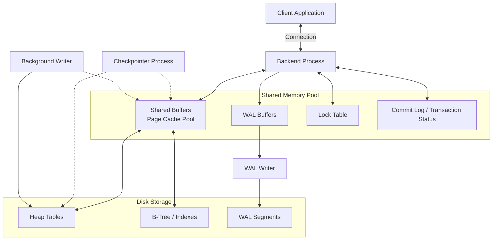

# Topic 2: PostgreSQL Internal Architecture

> **Student Name:** Tanishq Singh  
> **Roll Number:** 24BCS10303  
> **Course:** Advanced DBMS - System Design Discussion  

---

## 1. Problem Background

PostgreSQL is a multi-process Relational Database Management System (RDBMS) designed for extensibility, robustness, and full ACID compliance under concurrent workloads. Unlike thread-based databases, PostgreSQL relies on a process-based model, where complex internal mechanisms coordinate memory allocation, indexing, concurrency, and crash recovery. Understanding how pages flow from disk through memory, how index operations scale without bottlenecks, how transactions isolate concurrently, and how recovery is guaranteed is critical for database system design.

---

## 2. Architecture Overview

### PostgreSQL Shared Memory and Worker Layout



The system relies on background processes to manage disk I/O and maintain transaction records without blocking active backend query executors.

---

## 3. Internal Design

### Buffer Manager (`src/backend/storage/buffer/`)

The buffer manager coordinates the movement of table and index pages between disk and shared memory (the Shared Buffers pool). 

#### Shared Memory Layout
The shared buffer pool is divided into two primary arrays:
1. **Buffer Descriptors:** An array of control structures. Each descriptor holds metadata about a buffer page: its buffer tag (unique identifier), state flags (dirty, valid, pinned), usage count, and a locks container.
2. **Buffer Blocks:** An array of physical page frames, each exactly 8 KB in size, holding the cached data page contents.

```
+--------------------------------------+     +--------------------------------------+
|          Buffer Descriptors          |     |            Buffer Blocks             |
| [Desc 0: Tag(1, 2, 3, Block 0), ... ] | ==> | [Frame 0: 8KB Binary Page Data]      |
| [Desc 1: Tag(1, 2, 3, Block 1), ... ] | ==> | [Frame 1: 8KB Binary Page Data]      |
+--------------------------------------+     +--------------------------------------+
```

#### Page Cache Lookups
To locate a page, backends hash its `BufferTag` (consisting of the table/index's Tablespace OID, Database OID, Relation OID, and Fork/Block number) and look up the corresponding descriptor index inside the `BufMappingTable` hash table.

#### Page Replacement: The Clock Sweep Algorithm
When a backend requests a page not present in shared memory, it must select a buffer frame to evict. PostgreSQL uses the **Clock Sweep** page replacement algorithm, which acts as a low-overhead approximation of Least Recently Used (LRU):

```
                       (Scan Direction)
                           |   
                           v
              +---> [Buf Desc 3] ---+
              |     usage_count = 0  |
              |     pin_count = 0    |  ==> EVICT FRAME!
              |                      |
      [Buf Desc 2]              [Buf Desc 4]
      usage_count = 2           usage_count = 1
      pin_count = 1             pin_count = 0
              |                      |
              +---  [Buf Desc 5] <---+
```

1. **Clock Hand Iteration:** A global pointer (the "clock hand") moves sequentially through the buffer descriptors array.
2. **Evaluation:** For each descriptor:
   * If a page is **pinned** (its `pin_count > 0`, indicating it is currently being accessed by a backend), it is skipped.
   * If the page is unpinned and its `usage_count > 0`, the algorithm decrements the `usage_count` by 1 and advances the hand.
   * If the page is unpinned and its `usage_count == 0`, this frame is chosen for eviction.
3. **Eviction:** If the selected page is dirty, the backend writes it to disk before loading the new page. The new page is loaded, pinned, and its `usage_count` is initialized to 1.
4. **Lock Optimization:** Clock sweep avoids global spinlock contention. While LRU requires updating a linked list under a mutex lock on every hit, Clock Sweep only increments/decrements atomic counters within the descriptor structures.

---

### B-Tree Implementation (`src/backend/access/nbtree/`)

PostgreSQL's B-Tree implementation (`nbtree`) is based on the **Lehman & Yao** algorithm. This variation enables concurrent reads and writes without requiring lock acquisition down the entire traversal path.

#### Lehman & Yao Concurrent Page Splits
In a standard B-Tree, splitting a leaf page requires locking its parent and sometimes grandparent nodes to propagate downlinks, creating lock contention. Lehman & Yao solve this by adding a **right-link pointer** and a **High Key** to every index page header:

```
               [Parent Node]
              /             \
             v               v
     [Leaf Page A] -------> [Leaf Page B (New Split)]
    [High Key = 50]         [High Key = 100]
     [Keys: 1..49]           [Keys: 50..99]
```

* **Right-Links:** A logical pointer linking each page to its immediate sibling page on the same level.
* **High Keys:** The maximum value stored on that page. Any key greater than the high key resides on a sibling page reachable via the right-link.
* **Concurrence Behavior:** If Backend A is reading Leaf Page A, and Backend B splits Page A simultaneously, half the keys are moved to a new sibling Page B. If Backend A searches for a key (e.g., `75`) that has migrated, it reads the High Key (`50`), detects that the target key is greater, and follows the right-link to Page B to find the key. This traversal occurs without backtracking or acquiring read-locks on the parent node.

---

### Multi-Version Concurrency Control (MVCC)

PostgreSQL implements MVCC, allowing readers and writers to operate concurrently without blocking.

#### Heap Tuple Header Layout
Every table row (tuple) contains a header (`HeapTupleHeaderData`) containing transactional metadata:
* `t_xmin`: The Transaction ID (txid) of the transaction that inserted the row.
* `t_xmax`: The txid of the transaction that deleted or updated the row. For active rows, `t_xmax` is `0`.
* `t_cid`: The Command ID (command counter within a transaction) to manage self-visibility.
* `t_infomask`: Bit flags storing commit status (e.g., whether `xmin` or `xmax` have committed or aborted), allowing backends to bypass checking the transaction log (CLOG) file.

#### Visibility Rules
When a transaction executes a query, it obtains a **Snapshot** containing:
* `xmin`: The oldest active transaction ID. All transactions older than this are committed and visible.
* `xmax`: The youngest active transaction ID. All transactions newer than this are uncommitted and invisible.
* `xip[]`: A list of active transaction IDs running between `xmin` and `xmax`.

For any tuple, visibility is determined by comparing its `t_xmin` and `t_xmax` against the query's snapshot:

```
Tuple Status Evaluation:
- If t_xmin is not committed in CLOG / infomask -> INVISIBLE
- If t_xmin is committed:
  - If t_xmax is 0 -> VISIBLE
  - If t_xmax is aborted -> VISIBLE
  - If t_xmax is committed:
    - If t_xmax committed before Snapshot creation -> INVISIBLE (Row deleted)
    - If t_xmax committed after Snapshot creation -> VISIBLE
```

#### Garbage Collection: VACUUM
Because updates insert a new tuple version and deletes merely write a `t_xmax`, dead tuples accumulate in pages.
1. **Dead Tuple Removal:** `VACUUM` scans heap pages, identifies tuples where the `t_xmax` is older than the oldest active transaction in the system (the global `xmin` horizon), and marks their page space as free.
2. **Transaction ID Wraparound Prevention:** Transaction IDs are represented by a 32-bit unsigned integer, yielding $2^{32} \approx 4.29 \text{ billion}$ IDs. To prevent collisions, transaction numbers are evaluated using modulo-$2^{32}$ arithmetic, where the current transaction is compared against past and future ranges. If the ID counter wraps around, past transactions can appear as future transactions, making all rows invisible. `VACUUM` prevents this by "freezing" old tuples (setting a special flag `HEAP_XMIN_FROZEN` in `t_infomask`), effectively marking them as infinitely in the past.

---

### Write-Ahead Logging (WAL)

WAL guarantees durability (ACID) by ensuring that modifications to data pages are recorded sequentially on disk before they are applied to heap or index files.

#### WAL Recovery Flow
```
[Database Crash]
       |
       v
[Read Last Control File Checkpoint Record] ---> Locate LSN
       |
       v
[Scan WAL Record LSN] --(Iterate Forward)--> Compare Record LSN with Page pd_lsn
       |
       +---> If Record LSN > Page pd_lsn: Apply Change to Page (REDO)
       +---> If Record LSN <= Page pd_lsn: Skip Page (Already Written)
```

1. **Write-Ahead Protocol:** A page's modifications in memory cannot be flushed to disk until the corresponding WAL records (flushed from `WAL Buffers`) have been synced to the `WAL Segments` file on disk.
2. **Page LSN Matching:** Every 8 KB data page header contains a 64-bit LSN field (`pd_lsn`). During crash recovery:
   * The system reads the last checkpoint record to locate the starting WAL address.
   * It scans WAL records forward, comparing each record's LSN against the target page's `pd_lsn`.
   * If the record's LSN is greater than `pd_lsn`, it applies the modification (Redo). If the LSN is less than or equal, the change has already reached disk, and the record is skipped.
3. **Spread Checkpoints:** During a checkpoint, all dirty buffer pages are flushed to disk. To prevent write starvation from flooding the disk controllers, PostgreSQL uses spread checkpoints, writing dirty pages gradually over a period defined by `checkpoint_completion_target` (default `0.9` or 90% of the checkpoint interval).

---

## 4. Design Trade-Offs

### 1. Heap MVCC vs. Undo-Log Storage
* **PostgreSQL Heap MVCC:**
  * *Advantages:* Simple rollback. To abort a transaction, PostgreSQL only needs to change its status flag in the CLOG (Commit Log) from "In-Progress" to "Aborted". No undo records need to be read or applied to the tablespace.
  * *Disadvantages:* Tuple bloat and index maintenance. Updates create physical copies of rows, necessitating frequent `VACUUM` cycles to prevent storage bloat. Index structures must also be updated to point to the new physical address (TID) of the updated row, even if no indexed columns were modified (mitigated partially by Heap-Only Tuple updates, or HOT).

### 2. Clock Sweep vs. True LRU Page Cache
* **Clock Sweep:**
  * *Advantages:* Lower synchronization overhead. Does not require lock acquisition or double-linked list modifications on cache hits, enabling high read concurrency.
  * *Disadvantages:* Does not perfectly identify least recently used pages. Pages that are scanned sequentially once may get their `usage_count` set to 1, temporarily evicting more valuable pages if a sequential scan bypass (ring buffer) is not properly sized.

---

## 5. Observations & Experiments

### Execution Plan Analysis of a Multi-Table Join

We analyze how PostgreSQL's query planner constructs and executes a multi-table join.

#### Scenario: Join Query
```sql
EXPLAIN (ANALYZE, BUFFERS)
SELECT c.customer_name, o.order_date, SUM(i.quantity * i.price) AS total_val
FROM customers c
JOIN orders o ON c.customer_id = o.customer_id
JOIN order_items i ON o.order_id = i.order_id
WHERE c.region = 'North America'
GROUP BY c.customer_name, o.order_date;
```

#### Output Execution Plan

```
GroupAggregate  (cost=1045.12..1080.45 rows=250 width=48) (actual time=14.210..15.610 rows=230 loops=1)
  Group Key: c.customer_name, o.order_date
  Buffers: shared hit=412 read=12
  -> Sort  (cost=1045.12..1046.25 rows=450 width=40) (actual time=14.150..14.250 rows=450 loops=1)
        Sort Key: c.customer_name, o.order_date
        Sort Method: quicksort  Memory: 65kB
        Buffers: shared hit=412 read=12
        -> Hash Join  (cost=125.40..1025.10 rows=450 width=40) (actual time=2.110..13.420 rows=450 loops=1)
              Hash Cond: (o.order_id = i.order_id)
              Buffers: shared hit=412 read=12
              -> Hash Join  (cost=45.15..850.20 rows=500 width=36) (actual time=0.950..8.210 rows=500 loops=1)
                    Hash Cond: (o.customer_id = c.customer_id)
                    Buffers: shared hit=280 read=5
                    -> Seq Scan on orders o  (cost=0.00..650.00 rows=25000 width=16) (actual time=0.010..4.100 rows=25000 loops=1)
                          Buffers: shared hit=210
                    -> Hash  (cost=40.00..40.00 rows=412 width=28) (actual time=0.910..0.910 rows=412 loops=1)
                          Buckets: 1024  Batches: 1  Memory Usage: 32kB
                          Buffers: shared hit=70 read=5
                          -> Seq Scan on customers c  (cost=0.00..40.00 rows=412 width=28) (actual time=0.012..0.780 rows=412 loops=1)
                                Filter: (region = 'North America'::text)
                                Rows Removed by Filter: 1588
                                Buffers: shared hit=70 read=5
              -> Hash  (cost=50.00..50.00 rows=2000 width=16) (actual time=1.120..1.120 rows=2000 loops=1)
                    Buckets: 2048  Batches: 1  Memory Usage: 110kB
                    Buffers: shared hit=132 read=7
                    -> Seq Scan on order_items i  (cost=0.00..50.00 rows=2000 width=16) (actual time=0.005..0.750 rows=2000 loops=1)
                          Buffers: shared hit=132 read=7
Planning Time: 0.345 ms
Execution Time: 15.820 ms
```

#### Detailed Statistical Analysis
1. **Hash Join Strategy:** The planner selects a Hash Join pipeline because the hash conditions (`o.customer_id = c.customer_id` and `o.order_id = i.order_id`) allow building in-memory hash tables of the smaller relations (`customers` filter output and `order_items`) and scanning the larger `orders` table once.
2. **Buffer Operations (`shared hit` and `read`):** 
   * `Seq Scan on customers` registers `shared hit=70 read=5`. This means 70 pages were accessed directly in the shared buffer cache (hits), while 5 pages had to be read from disk (reads), triggering Clock Sweep cache line replacements.
3. **Planner Estimates vs. Actuals:**
   * The planner estimated `412` rows for `customers c` with the region filter. The actual count was `412`, indicating highly accurate planner statistics.
   * If there were a large discrepancy (e.g. estimate = 1, actual = 100,000), it could cause the planner to choose a Nested Loop instead of a Hash Join, leading to query degradation.
4. **pg_statistic and pg_stats Integration:**
   * The cost estimates are derived by query planner calculations referencing the `pg_statistic` system catalog (exposed via the user-friendly `pg_stats` view).
   * For the filter `(region = 'North America')`, the optimizer retrieves the column's **Most Common Values (MCV)** array and **Most Common Frequencies (MCF)** from `pg_stats`. If `'North America'` is listed in the MCV, its frequency is multiplied by the total relation row count (`reltuples` in `pg_class`) to compute the expected row count. If it is not in the MCV, the selectivity is calculated based on the remaining fraction divided by the number of distinct values (`n_distinct`).

---

## 6. Key Learnings

1. **Lehman & Yao Scalability:** The L&Y right-link B-Tree design prevents locking conflicts at the root and parent nodes during write operations. This enables parallel index insert performance that scales with core count.
2. **The Double-Edged Sword of Heap MVCC:** Decoupling read operations from write operations simplifies concurrency but shifts complexity to garbage collection. Vacuum performance, bloat, and transaction wraparound prevention are operational trade-offs for high concurrency.
3. **The Relationship of Cache to Query Plans:** I/O costs dominate query execution time. The query planner relies on page correlation statistics (`pg_stats.correlation`) to choose between sequential scans (high sequential caching performance) and index scans (which can trigger random I/O thrashing if the page correlation is low).
